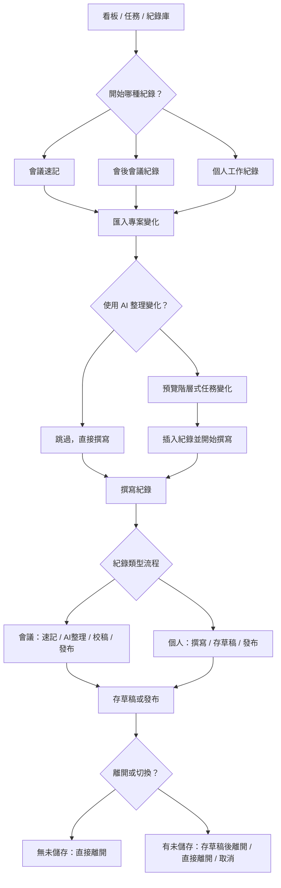
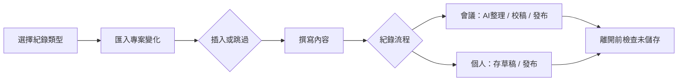

# SPEC-020：紀錄功能重構與專案變化匯入流程

對應 DEV：DEV-020  
父交付點：DEV-002 / DEV-005 / DEV-007 / DEV-011 / DEV-012 / DEV-018 / DEV-019  
狀態：Implemented  
節點類型：交付點  
是否計入產品交付完成：是

## 背景

目前紀錄功能已具備會議紀錄、個人工作紀錄、任務關聯、AI整理與會議模式，但經實際 UX 操作健檢後，仍存在核心流程問題：

- 使用者在看板主畫面找不到清楚的 `新增個人工作紀錄` 入口。
- `會議紀錄 / 個人工作紀錄` 有時像流程按鈕，有時像狀態選項，語意不穩定。
- 使用者可在撰寫後才改紀錄類型，造成「先寫再裁決」的錯誤心智模型。
- 一般紀錄仍有 `狀態` select 與 `存草稿 / 發布` action 並存，造成狀態來源衝突。
- 切換、新增或關閉紀錄時，未儲存內容可能被覆蓋或遺失。
- 會議開始前，專案任務可能已經被即時修改，但目前會議紀錄只容易捕捉「會議模式開始後」的變更。

本 DEV 不是補 tooltip，而是把「紀錄」重新設計成一個可防呆的工作流：先決定紀錄情境，再匯入必要脈絡，再撰寫、儲存或發布。

## 設計目標

- 使用者在開始撰寫前就決定紀錄類型與工作情境。
- 使用者能在看板主畫面直接開始會議速記或個人工作紀錄。
- 任何會覆蓋目前草稿的操作都必須有未儲存保護。
- `存草稿`、`發布`、`離開` 的後果必須直接寫在 UI 文案與 action state 中。
- AI 是整理與匯入輔助，不自動修改任務、不自動發布。
- 會議或紀錄開始時，可先把指定時間範圍內的專案變化整理進紀錄內容。
- 功能說明必須內建在流程中，並提供含流程圖的使用說明。
- 會議速記、會後會議紀錄與個人工作紀錄必須使用同一套 header、摘要、表單、關聯任務與動作區 UI grammar。

## 核心心智模型

紀錄功能分成三層：

1. 入口層：使用者現在要開始哪一種紀錄。
2. 脈絡層：是否先匯入最近的專案變化。
3. 撰寫層：編輯、AI整理、存草稿、發布、離開。



## 紀錄類型定義

### 會議速記

使用情境：會議正在進行，記錄者需要一邊看板、一邊速記與引用任務。

入口：

- 看板 topbar：`開始會議速記`。

流程：

- 進入會議模式。
- 預設先進入 `匯入專案變化` step。
- 可跳過匯入，直接進入速記。
- 顯示會議流程：`速記 → AI整理 → 校稿 → 發布`。
- `AI整理` 是選用，不是發布前必經門檻。

### 會後會議紀錄

使用情境：會議已結束，使用者要補寫或整理正式會議紀錄。

入口：

- 紀錄面板或紀錄庫：`新增會後會議紀錄`。

流程：

- 不進入全域會議模式。
- 仍可匯入指定時間範圍的專案變化。
- 可使用 AI整理協助形成會議紀要。
- 發布只保存目前 editor 內容，不自動修改任務。

### 個人工作紀錄

使用情境：使用者記錄自己一段時間的工作、決策、處理過程或專案脈絡。

入口：

- 看板 topbar 或工作區入口：`新增個人工作紀錄`。
- 任務詳情：`新增個人工作紀錄`，可預設關聯目前任務。

流程：

- 不顯示 `速記 / AI整理 / 校稿 / 發布` 會議流程。
- 顯示簡化狀態：`撰寫中 / 已存草稿 / 已發布`。
- action 只保留 `存草稿` 與 `發布工作紀錄`。
- 可在開始時匯入專案變化，協助形成工作紀錄背景。

## 入口與資訊架構

### 看板 topbar

保留主要紀錄入口：

- `開始會議速記`
- `新增個人工作紀錄`

若已在會議模式：

- `開始會議速記` 改為 `離開會議`
- `新增個人工作紀錄` 不應覆蓋目前會議草稿；若允許建立，必須先通過未儲存保護。

### 紀錄面板 header

負責目前紀錄的工作區，不再承擔全域入口混淆：

- 顯示目前紀錄類型與保存狀態。
- 固定顯示 `功能說明` button。
- 固定顯示 `收合面板` icon button。
- 固定顯示 `關閉 / 離開` icon button；會議模式下此按鈕代表離開會議模式，且必須走未儲存防呆。
- 會議模式離開後不得停在一般 `專案紀錄` 編輯頁；使用者選擇離開後，系統應一次完成離開並關閉紀錄面板。
- 新增紀錄 action 若會覆蓋目前草稿，必須先觸發未儲存保護。

### UI 一致性規則

紀錄側欄必須以同一個 composer shell 呈現，不得讓不同紀錄類型像不同產品：

- Header 工具順序固定為 `功能說明 / 收合 / 關閉或離開`。
- 狀態摘要固定顯示在表單最前方，並使用同一個 summary 元件。
- 會議速記額外顯示流程列，但流程列必須放在共用 workflow slot，不可取代 summary。
- `關聯任務` 區塊名稱固定，主要 action 固定為 `選取任務`。
- 會議模式不得用整塊特殊綠色大卡取代一般紀錄的摘要與表單結構；綠色只用於狀態成功或目前建議動作。

### 紀錄庫

紀錄庫定位為查閱、搜尋、重開草稿與管理，不作為會議進行中的主入口。

文案：

- `紀錄庫`
- 不再標示 `(開發中)`。

## 專案變化匯入

### 功能目標

在會議或紀錄開始時，讓使用者把指定時間範圍內的任務變化整理進紀錄內容，避免會議前已發生的任務更新被漏記。

### 觸發時機

以下流程預設先顯示 `匯入專案變化` step：

- `開始會議速記`
- `新增會後會議紀錄`
- `新增個人工作紀錄`

使用者可選擇：

- `整理專案變化`
- `跳過，直接撰寫`

系統不得在未經確認時自動插入 AI 內容。

### 時間區間

只提供指定時間範圍。

預設值：

- 起：一週前
- 迄：今日

不提供快捷選項如 `最近 24 小時`、`最近 7 天`、`上次會議後`。

### 範圍

只提供兩種範圍：

- `整個看板`
- `整個工作區`

### 來源事件

來源以既有 activity event 為主，不新增資料表。

納入：

- 新增任務
- 任務狀態變更
- 日期變更
- 指派 / 協作者變更
- 任務移動
- 標籤變更
- 封存 / 還原

可延後：

- dependency 變更是否納入正文，需在 RD 時依資訊噪音量評估。

### 預覽呈現

預覽方式與 `AI整理` 一致，依任務階層排版：

```text
2. 任務討論與結論
2.1 @[父任務](task:id)
新增任務、狀態變更與日期調整摘要。

2.1.1 @[子任務](task:id)
協作者變更與移動摘要。
```

預覽後提供：

- `插入紀錄並開始撰寫`
- `重新整理`
- `取消匯入`

## 功能說明按鈕

### 位置

在紀錄面板 header 放置 `功能說明` button：

- desktop：`CircleHelp` icon + `功能說明`
- 窄版：只顯示 icon，保留 aria-label 與 title

### 行為

點擊後開啟說明 drawer 或 modal，不改變草稿內容、不觸發儲存、不觸發 AI。

### 說明內容

必須包含：

- 紀錄功能流程圖。
- 三種紀錄類型差異：會議速記、會後會議紀錄、個人工作紀錄。
- 專案變化匯入如何使用。
- `存草稿`、`發布`、`離開` 的差異與風險。
- 常見情境：開會前已有任務變更、只想寫個人紀錄、選錯紀錄類型、未儲存離開。

說明內流程圖：



## 未儲存保護

以下操作若目前 draft 有未儲存變更，必須出現三選一 action dialog：

- 關閉紀錄面板。
- 切換到另一筆紀錄。
- 新增另一筆紀錄。
- 離開會議模式。
- 從會議速記切到個人工作紀錄。

選項：

- `存草稿後繼續`
- `不儲存，繼續`
- `取消`

規則：

- `存草稿後繼續` 保存目前內容，再執行原本動作。
- `不儲存，繼續` 不保存新變更，但不得刪除既有已保存草稿。
- `取消` 保持目前畫面與內容。

## 狀態與 action 原則

- 紀錄類型一旦建立草稿，不在同一筆草稿上切換。
- 不再提供一般紀錄 `狀態` select。
- 狀態只能由 action 推進：`存草稿`、`發布`、`封存`。
- disabled action 必須提供原因：title、aria-label、inline hint 至少其一。
- 空白內容不可發布。
- 空白會議速記可存草稿。
- 個人工作紀錄若只有標題但無內容，應提示缺少內容，而不是誤報缺少標題。

## RD 執行計畫

### 1. Workflow state helper

新增或重構紀錄 workflow helper，集中輸出：

- `recordContext`
- `recordType`
- `entrySource`
- `stage`
- `statusMessage`
- `nextActionMessage`
- `riskMessage`
- `isDirty`
- `canSaveDraft`
- `canPublish`
- `canRunAi`
- `canImportProjectChanges`
- 各 action disabled reason

### 2. Project change import service

擴充既有 activity event 讀取能力：

- 依 workspace / board scope 查詢 activity events。
- 依指定 start / end date 過濾。
- 對事件做 task hierarchy grouping。
- 輸出給 AI synthesis 的結構化 payload。

不得新增資料表或 migration。

### 3. AI synthesis

擴充 AI input：

- `rawContent`
- `meetingActivities`
- `projectChangeActivities`
- `taskHierarchy`

AI output 仍只回寫 draft content，不修改任務。

### 4. RecordSidebar / RecordComposer

重構紀錄面板：

- 建立 `RecordStartPanel`：選擇紀錄情境。
- 建立 `ProjectChangeImportPanel`：時間區間、範圍、整理與預覽。
- 建立 `RecordComposerHeader`：類型、狀態、功能說明、收合。
- 建立 `RecordHelpDialog`：含流程圖與說明。
- 會議流程與個人流程分開渲染。

### 5. MainLayout

看板 topbar 更新：

- 非會議模式：顯示 `開始會議速記`、`新增個人工作紀錄`。
- 會議模式：顯示 `離開會議`，並說明離開不等於發布。

### 6. useRecordStore

補強：

- draft baseline / signature。
- 所有會替換 draft 的操作先走 guard。
- save 成功後更新 baseline 與 feedback。
- publish 不自動觸發 AI。
- closePanel 不得直接丟棄 dirty draft。

### 7. Verifier

新增：

- `verify:dev-020-record-workflow-redesign`
- `verify:dev-020-project-change-import-browser`

補強既有：

- DEV-010 verifier 不期待舊 BoardView 會議操作列。
- DEV-019 verifier 檢查紀錄類型在開始前決定。

## 明確不做

- 不新增資料表或 migration。
- 不改 `KnowledgeRecordType`、`record_task_links`、RAG token 格式。
- 不讓 AI 自動建立、修改、移動、刪除任務。
- 不把 AI整理變成發布前必經門檻。
- 不恢復 BoardView 上方舊會議操作列。
- 不把紀錄庫當成會議進行主畫面。
- 不把手機版紀錄工作流列入本次 release gate。

## 驗收標準

- 看板主畫面可直接開始會議速記與新增個人工作紀錄。
- 使用者在開始撰寫前決定紀錄類型，撰寫後不可在同一筆草稿上切換類型。
- 會議速記、會後會議紀錄、個人工作紀錄的流程差異清楚。
- 會議或紀錄開始時預設提供專案變化匯入 step。
- 專案變化匯入只提供指定時間範圍，預設一週前到今日。
- 匯入範圍只提供整個看板與整個工作區。
- 專案變化預覽依任務階層排版，且插入前需要使用者確認。
- 個人工作紀錄不顯示會議流程，不出現 AI校稿誤導。
- 關閉、切換、新增、離開時若有未儲存內容，必須出現三選一防呆。
- `功能說明` button 可開啟含流程圖的使用說明，且不改變草稿狀態。
- 1024x768 與 1440x950 無重疊、裁切、水平 overflow。

## QC 驗證命令

```powershell
npm.cmd run verify:dev-002-records
npm.cmd run verify:dev-003-record-tags
npm.cmd run verify:dev-007-meeting-activity
npm.cmd run verify:dev-010-action-feedback
npm.cmd run verify:dev-011-ai-meeting-synthesis
npm.cmd run verify:dev-012-meeting-record-quality
npm.cmd run verify:dev-019-record-type-layering-browser
npm.cmd run verify:dev-020-record-workflow-redesign
npm.cmd run verify:dev-020-project-change-import-browser
npm.cmd run build
```

## 需同步更新

- `ai-doc/dev_task.md`
- `ai-doc/backlog.md`
- `ai-doc/documentation_map.md`
- `ai-doc/qa/QA-DEV-020-record-workflow-redesign.md`
- `package.json`
- DEV-020 verifier scripts

## 變更紀錄

- 2026-06-11：建立 DEV-020，整合紀錄功能重構、專案變化匯入與功能說明按鈕。
- 2026-06-11：完成 RD 實作與 QC 驗證，包含入口、防呆、專案變化匯入、功能說明與 verifier。
