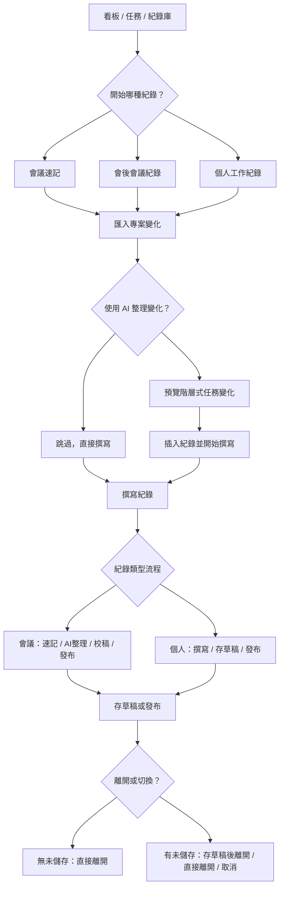
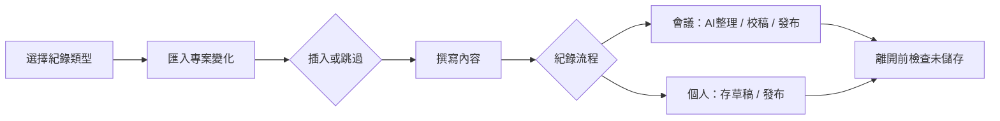

# SPEC-020：紀錄功能重構與專案變化匯入流程

對應 DEV：DEV-020  
父交付點：DEV-002 / DEV-005 / DEV-007 / DEV-011 / DEV-012 / DEV-018 / DEV-019  
狀態：Implemented  
節點類型：交付點  
是否計入產品交付完成：是

## 背景

目前紀錄功能已具備會議紀錄、個人工作紀錄、任務關聯、AI整理與會議模式，但經實際 UX 操作健檢後，仍存在核心流程問題：

- 使用者在看板主畫面找不到清楚的 `新增個人工作紀錄` 入口。
- `會議紀錄 / 個人工作紀錄` 有時像流程按鈕，有時像狀態選項，語意不穩定。
- 使用者可在撰寫後才改紀錄類型，造成「先寫再裁決」的錯誤心智模型。
- 一般紀錄仍有 `狀態` select 與 `存草稿 / 發布` action 並存，造成狀態來源衝突。
- 切換、新增或關閉紀錄時，未儲存內容可能被覆蓋或遺失。
- 會議開始前，專案任務可能已經被即時修改，但目前會議紀錄只容易捕捉「會議模式開始後」的變更。

本 DEV 不是補 tooltip，而是把「紀錄」重新設計成一個可防呆的工作流：先決定紀錄情境，再匯入必要脈絡，再撰寫、儲存或發布。

## 設計目標

- 使用者在開始撰寫前就決定紀錄類型與工作情境。
- 使用者能在看板主畫面直接開始會議速記或個人工作紀錄。
- 任何會覆蓋目前草稿的操作都必須有未儲存保護。
- `存草稿`、`發布`、`離開` 的後果必須直接寫在 UI 文案與 action state 中。
- AI 是整理與匯入輔助，不自動修改任務、不自動發布。
- 會議或紀錄開始時，可先把指定時間範圍內的專案變化整理進紀錄內容。
- （原始契約）功能說明必須內建在流程中，並提供含流程圖的使用說明；現行視覺契約由 2026-08-27 UI 精簡 addendum 取代。
- 會議速記、會後會議紀錄與個人工作紀錄必須使用同一套 header、摘要、表單、關聯任務與動作區 UI grammar。

## 核心心智模型

紀錄功能分成三層：

1. 入口層：使用者現在要開始哪一種紀錄。
2. 脈絡層：是否先匯入最近的專案變化。
3. 撰寫層：編輯、AI整理、存草稿、發布、離開。


```mermaid
flowchart TD
  A["看板 / 任務 / 紀錄庫"] --> B{"開始哪種紀錄？"}
  B --> C["會議速記"]
  B --> D["會後會議紀錄"]
  B --> E["個人工作紀錄"]
  C --> F["匯入專案變化"]
  D --> F
  E --> F
  F --> G{"使用 AI 整理變化？"}
  G --> H["預覽階層式任務變化"]
  G --> I["跳過，直接撰寫"]
  H --> J["插入紀錄並開始撰寫"]
  I --> K["撰寫紀錄"]
  J --> K
  K --> L{"紀錄類型流程"}
  L --> M["會議：速記 / AI整理 / 校稿 / 發布"]
  L --> N["個人：撰寫 / 存草稿 / 發布"]
  M --> O["存草稿或發布"]
  N --> O
  O --> P{"離開或切換？"}
  P --> Q["無未儲存：直接離開"]
  P --> R["有未儲存：存草稿後離開 / 直接離開 / 取消"]
```

## 紀錄類型定義

### 會議速記

使用情境：會議正在進行，記錄者需要一邊看板、一邊速記與引用任務。

入口：

- 看板 topbar：`開始會議速記`。

流程：

- 進入會議模式。
- 預設先進入 `匯入專案變化` step。
- 可跳過匯入，直接進入速記。
- 顯示會議流程：`速記 → AI整理 → 校稿 → 發布`。
- `AI整理` 是選用，不是發布前必經門檻。

### 會後會議紀錄

使用情境：會議已結束，使用者要補寫或整理正式會議紀錄。

入口：

- 紀錄面板或紀錄庫：`新增會後會議紀錄`。

流程：

- 不進入全域會議模式。
- 仍可匯入指定時間範圍的專案變化。
- 可使用 AI整理協助形成會議紀要。
- 發布只保存目前 editor 內容，不自動修改任務。

### 個人工作紀錄

使用情境：使用者記錄自己一段時間的工作、決策、處理過程或專案脈絡。

入口：

- 看板 topbar 或工作區入口：`新增個人工作紀錄`。
- 任務詳情：`新增個人工作紀錄`，可預設關聯目前任務。

流程：

- 不顯示 `速記 / AI整理 / 校稿 / 發布` 會議流程。
- 顯示簡化狀態：`撰寫中 / 已存草稿 / 已發布`。
- action 只保留 `存草稿` 與 `發布工作紀錄`。
- 可在開始時匯入專案變化，協助形成工作紀錄背景。

## 入口與資訊架構

### 看板 topbar

保留主要紀錄入口：

- `開始會議速記`
- `新增個人工作紀錄`

若已在會議模式：

- `開始會議速記` 改為 `離開會議`
- `新增個人工作紀錄` 不應覆蓋目前會議草稿；若允許建立，必須先通過未儲存保護。

### 紀錄面板 header

負責目前紀錄的工作區，不再承擔全域入口混淆：

- 顯示目前紀錄類型與保存狀態。
- （原始契約）固定顯示 `功能說明` button；現行契約由 2026-08-27 UI 精簡 addendum 取代。
- 固定顯示 `收合面板` icon button；右側面板收合時箭頭向右，展開時箭頭向左。
- 固定顯示 `關閉 / 離開` icon button；會議模式下此按鈕代表離開會議模式，且必須走未儲存防呆。
- 會議模式離開後不得停在一般 `專案紀錄` 編輯頁；使用者選擇離開後，系統應一次完成離開並關閉紀錄面板。
- 新增紀錄 action 若會覆蓋目前草稿，必須先觸發未儲存保護。

### UI 一致性規則

紀錄側欄必須以同一個 composer shell 呈現，不得讓不同紀錄類型像不同產品：

- （原始契約）Header 工具順序固定為 `功能說明 / 收合 / 關閉或離開`；現行只保留靠標題內側的 `收合` 與 `關閉或離開`。
- 狀態摘要固定顯示在表單最前方，並使用同一個 summary 元件。
- 會議速記額外顯示流程列，但流程列必須放在共用 workflow slot，不可取代 summary。
- 有關聯任務時保留 `關聯任務` 管理區塊；會議空白狀態不顯示 `0 / 未選取` 摘要或 `選取任務` action，個人工作紀錄仍保留任務選取入口。
- 會議模式不得用整塊特殊綠色大卡取代一般紀錄的摘要與表單結構；綠色只用於狀態成功或目前建議動作。

### 紀錄庫

紀錄庫定位為查閱、搜尋、重開草稿與管理，不作為會議進行中的主入口。

文案：

- `紀錄庫`
- 不再標示 `(開發中)`。

## 專案變化匯入

### 功能目標

在會議或紀錄開始時，讓使用者把指定時間範圍內的任務變化整理進紀錄內容，避免會議前已發生的任務更新被漏記。

### 觸發時機

以下流程預設先顯示 `匯入專案變化` step：

- `開始會議速記`
- `新增會後會議紀錄`
- `新增個人工作紀錄`

使用者可選擇：

- `整理專案變化`
- `跳過，直接撰寫`

系統不得在未經確認時自動插入 AI 內容。

### 時間區間

只提供指定時間範圍。

預設值：

- 起：一週前
- 迄：今日

不提供快捷選項如 `最近 24 小時`、`最近 7 天`、`上次會議後`。

### 範圍

只提供兩種範圍：

- `整個看板`
- `整個工作區`

### 來源事件

來源以既有 activity event 為主，不新增資料表。

納入：

- 新增任務
- 任務狀態變更
- 日期變更
- 指派 / 協作者變更
- 任務移動
- 標籤變更
- 封存 / 還原

可延後：

- dependency 變更是否納入正文，需在 RD 時依資訊噪音量評估。

### 預覽呈現

預覽方式與 `AI整理` 一致，依任務階層排版：

```text
2. 任務討論與結論
2.1 @[父任務](task:id)
新增任務、狀態變更與日期調整摘要。

2.1.1 @[子任務](task:id)
協作者變更與移動摘要。
```

預覽後提供：

- `插入紀錄並開始撰寫`
- `重新整理`
- `取消匯入`

## 功能說明按鈕（歷史契約，已由 UI 精簡 addendum 取代）

以下內容僅保留歷史實作背景，不作為現行驗收條件。

### 位置

在紀錄面板 header 放置 `功能說明` button：

- desktop：`CircleHelp` icon + `功能說明`
- 窄版：只顯示 icon，保留 aria-label 與 title

### 行為

點擊後開啟說明 drawer 或 modal，不改變草稿內容、不觸發儲存、不觸發 AI。

### 說明內容

必須包含：

- 紀錄功能流程圖。
- 三種紀錄類型差異：會議速記、會後會議紀錄、個人工作紀錄。
- 專案變化匯入如何使用。
- `存草稿`、`發布`、`離開` 的差異與風險。
- 常見情境：開會前已有任務變更、只想寫個人紀錄、選錯紀錄類型、未儲存離開。

說明內流程圖：


```mermaid
flowchart LR
  A["選擇紀錄類型"] --> B["匯入專案變化"]
  B --> C{"插入或跳過"}
  C --> D["撰寫內容"]
  D --> E{"紀錄流程"}
  E --> F["會議：AI整理 / 校稿 / 發布"]
  E --> G["個人：存草稿 / 發布"]
  F --> H["離開前檢查未儲存"]
  G --> H
```

## 2026-08-27 UI 精簡 addendum

本 addendum 依使用者瀏覽器留言（Comments 1–7）取代上方同名的歷史視覺契約；不改紀錄資料、保存、AI整理或未儲存防呆行為：

- header 只保留目前紀錄標題文字，移除裝飾性紀錄 icon。
- 移除 `功能說明` button 與說明 modal；流程本身仍由現行 workflow step 與必要狀態回饋呈現。
- 收合控制使用與全域工作台一致的 `ChevronRight`，放在右側抽屜 header 最左側、位於標題前；收合後使用 `ChevronLeft` 展開。
- 移除 `AI選用` badge。
- 會議流程卡片不顯示 `會議流程` 標題或「速記、AI整理、校稿與發布在同一條流程上操作。」輔助說明；實際流程 step 與必要狀態回饋保留。
- 新會議標題預設只帶日期，不自動附加時間；`紀錄時間` 以 `YYYY/MM/DD HH:mm` 24 小時制文字格式呈現，不顯示上午／下午。
- 會議模式的 `標題` 與 `紀錄時間` 放在同一個橫向欄位列；個人工作紀錄欄位排列維持原契約。
- 會議流程各階段只顯示主要階段標籤，不顯示階段 icon 或副標題；階段按鈕的操作與可存取名稱保留。
- 會議流程階段按鈕採緊湊高度（`h-9`）以節省版面；可操作階段使用 `cursor-pointer` 與既有 hover 回饋（含目前階段），停用階段使用不可操作游標。
- 移除會議底部 `AI整理來源：任務變更` 摘要／展開列；任務變更仍可供 AI整理流程使用，不改資料與整理行為。
- 會議模式的狀態／分享範圍控制列改為單列緊湊版（約 50% 高度），使用短標籤與控制項同列；個人工作紀錄控制列維持原排列。
- 編輯器版面採縱向 flex：流程、摘要、欄位、狀態與 action 先維持各自固定／自然高度，`內容` 編輯器填滿抽屜剩餘高度；會議內容區保留至少 `220px`、個人工作紀錄至少 `150px`，窄版不足時由抽屜內捲動承接，不得與下方控制列重疊。
- 雲端 checkpoint 成功且本機同步時不顯示常駐成功訊息；衝突、失敗、暫停與保存中等需要使用者注意的狀態仍顯示。
- 會議無關聯任務時不顯示 `關聯任務 0 未選取` 摘要或空白狀態 `選取任務` action；個人工作紀錄的任務選取入口與已有關聯任務的管理、角色調整維持。

## 2026-08-28 免匯入直接速記 addendum（DEV-094）

- 文件成熟度：`RD Implementation In Progress / Human Confirmed / static＋pure＋browser smoke PASS / QA・QC NOT RUN / 未 Release`
- 決策來源：使用者附圖與 response annotation 1，確認採用「不先操作匯入也能直接速記」的最小修正方案。
- Spec Impact：`Compatible corrective addendum + intentional meeting-import interaction replacement`。SPEC-023 原已規定 `匯入` 是 optional step，使用者可直接速記；本 addendum 將 UI 互動與視覺狀態補到該契約，並以周會連續截止點取代會議模式的固定六天／必經設定流程；不改 project change event 語意、AI整理、保存、權限、發布或未儲存防呆的既有責任。
- Superseded boundary：本 addendum 只取代本文件前段 `開始會議速記`／`新增會後會議紀錄` 的必經 `整理專案變化`／`跳過` 選擇、固定日期設定與「不提供上次會議後快捷」限制；`新增個人工作紀錄` 仍沿用原設定式匯入契約。
- Implementation note：2026-08-28 已依 WP-094-A～E 落地第一版產品 wiring、exclusive activity boundary、focus token、meeting one-click／custom control、atomic metadata append、publish-only cutoff與 static／pure／1440×900／390×844 smoke；完整 QA/QC、Firebase negative與 release 仍待執行。

### 問題與使用者價值

目前新會議開啟後雖已存在草稿與內容編輯器，但 pending 的 `匯入` step 使用最醒目的目前步驟樣式，而 `速記` step 點擊實際執行 `saveDraft`，沒有將焦點移到內容編輯器。使用者因此合理判斷「必須先匯入，後續速記才會作用」，且在空白草稿點擊 `速記` 時看不到與按鈕名稱相符的結果。

本次成功結果是：使用者建立新會議紀錄後，不需要點擊 `匯入` 或 `跳過`，即可直接在內容編輯器速記，並能依需要獨立存草稿、執行 AI整理或發布。

### Human Confirmed 決策

1. 只有從正常入口新建 meeting draft 且沒有復原、衝突或 dialog 接管焦點時，才自動把鍵盤焦點放到內容編輯器；開啟既有紀錄、恢復草稿或處理衝突時不得搶焦點。匯入不是取得編輯權或啟用後續流程的 gate。
2. `速記` step 代表目前編輯階段；點擊時只將焦點移到內容編輯器，不再暗中執行 `saveDraft`。
3. `匯入` 保留為會議 workflow 第一格，但改成次要／選用樣式的一鍵動作，不得使用會被理解為必經目前步驟的綠色主狀態。預設點擊後直接以目前看板查詢「同看板上一筆已發布且成功匯入的截止時間（不含）→本次點擊時間（含）」並加入會議內容，不先展開日期、範圍、預覽、確認或跳過面板；首次找不到前次截止點時，以本次會議記錄時間往前七天作為起點。固定「過去六天」方案淘汰。
4. `存草稿` 改為面板底部獨立操作列中的次要文字按鈕，與主要 `發布` 按鈕並列，不藏在 `速記` step、workflow 或狀態／分享範圍控制列；空白會議草稿仍可保存，既有 baseline、checkpoint 與離開防呆維持。
5. 必須新增「完全不操作匯入」的回歸路徑，證明輸入、存草稿、AI整理與發布皆可完成。
6. 一鍵匯入必須防止相同來源資料重複加入；成功後只顯示最小 `已完成` 狀態，不顯示實際區間、事件筆數或匯入專用撤銷入口。查無資料或發生錯誤時不得改動既有草稿內容；既有編輯器通用 undo 能力不因本規格主動移除。
7. 匯入內容附加在目前手寫內容最後方，維持既有 protected project-change block，完成後把游標放到匯入區塊後方，讓使用者可繼續速記。
8. 同一會議草稿再次點擊匯入時，只加入尚未匯入的新事件；不得覆蓋既有匯入區塊、人工修改或重複事件。
9. 會後十二小時是整理工作的 soft window，不是系統期限；期間可反覆一鍵匯入 delta，超過十二小時仍可操作，不自動發布、不強制關閉，也不因逾時漏掉事件。
10. 只有含至少一筆成功匯入事件的會議紀錄完成發布，該紀錄最後一次成功匯入的截止時間才成為同看板下次預設起點。開啟會議、存草稿、未操作匯入、查無資料、匯入失敗或僅撤銷匯入，都不得推進跨會議截止點。
11. 預設一鍵動作文案使用 `帶入上次會議後變更`。這是面向使用者的簡化名稱，不改變第 3 點的實際查詢起點：系統仍從同看板上一筆已發布且成功匯入的截止時間開始，而不是單純採用最近建立或最近發布會議的時間。
12. `自訂日期` 是按需揭露的次要入口，不得在預設一鍵路徑先行展開。自訂開始／結束時間通過基本有效性檢查、至少一筆事件成功加入且會議紀錄發布後，所選結束時間一律取代同看板下次預設截止點，不要求自訂範圍與原截止點連續，也允許截止點往前調整；此為使用者明確選擇 14B 的 intentional override。
13. 自訂日期即使使開始時間晚於原截止點而留下缺口，或使結束時間早於原截止點而讓後續預設匯入重疊，也不顯示警告或確認，直接依第 12 點執行；此為使用者明確選擇 15C 的 accepted risk。
14. 預設與自訂匯入成功後都只顯示 `已完成`，不顯示實際起訖時間、加入筆數或專用撤銷；此為使用者明確選擇 16C，並取代先前 6A 的可見成功回饋部分，不取代相同來源去重與失敗不改內容。

### Accepted Risk

- 自訂範圍可在沒有警告或確認的情況下產生跨會議事件缺口或後續重疊。
- 成功狀態不揭露實際查詢範圍與事件筆數，使用者只能從插入內容判斷結果；產品以最低操作干擾優先，RD／QA／QC 不得自行補回提示、確認、筆數或匯入專用撤銷。

### UX Intent

- 任務／結果：熟悉使用者開啟新會議後立即輸入速記，不需先處理選用資料來源。
- 主物件／主焦點：目前會議草稿的內容編輯器；初始焦點與 `速記` 階段一致。
- 預設降級：idle `匯入` 不使用主色目前狀態，不新增「請先匯入／跳過」說明、設定面板、預覽或額外模式選擇。
- 保留舉證：獨立 `存草稿` 必須保留，否則使用者無法明確建立可在紀錄庫續寫的 durable draft；最小形式是既有 action 區中的文字按鈕，不新增說明卡。
- 非語言修復：以初始焦點、step 點擊後的焦點移動、主次樣式與就地儲存回饋表達狀態，不用常駐教學文字補救。
- 風險與驗證：不得因 autofocus 搶走既有紀錄、復原衝突或 dialog 的焦點；自訂日期缺口／倒退不得出現警告或確認，成功只顯示 `已完成`；鍵盤、窄版、保存錯誤與可見錯誤掃描需納入後續 QA/QC。

### Current Scope

- 正常新建 meeting draft 的初始內容焦點，以及 existing／recovery／conflict／dialog 不搶焦點邊界。
- 會議 `速記` step 的 command／enabled／aria／tooltip 語意。
- idle、loading、inserted、empty、error 與 undo 匯入狀態的主次層級。
- 目前看板的一鍵匯入、周會連續截止區間、首次回溯七天、十二小時 soft window、發布後推進截止點、相同來源防重複與失敗不改內容邊界。
- 低頻 `自訂日期` 入口、有效日期檢查，以及成功匯入並發布後由自訂結束時間直接覆寫下次截止點。
- 自訂範圍缺口／倒退不警告、不確認，以及預設／自訂成功只顯示 `已完成` 的最小回饋。
- 匯入附加在內容末端、完成後游標位於區塊後方，以及再次匯入只加入新事件的 delta-only 契約。
- 會議模式底部獨立 `存草稿`＋`發布` 操作列及其保存中、成功、失敗回饋。
- 不經匯入的輸入、空白／有內容存草稿、AI整理與發布回歸。

### Out of Scope

- 不移除 `匯入` step，不重做整條五階段外觀，也不新增「純速記模式」或強制 `跳過`。
- 會議預設一鍵路徑移除必經設定、預覽、確認與跳過面板；低頻自訂日期可按需揭露，但不得在預設點擊時出現。project change event allowlist、整理內容語意、`wrapProjectChangeImportContent` 或 preserve guard 不變，個人工作紀錄的匯入流程不在本次確認範圍。
- 不改 AI synthesis input/output、權限、既有 protected block 可見格式或 RAG。跨會議截止點固定使用既有 `KnowledgeRecord.metadata`，不新增資料表／欄位／migration；draft recovery 只沿用既有 metadata round-trip，不新增 checkpoint request。
- 不解除 SPEC-069 既有手機會議紀錄範圍限制，不進行 deploy 或 release。

### RD Implementation Ready 契約

#### 1. 現況基線與實作判定

- `RecordSidebar.tsx` 已將 meeting `project_import` step 降為次要 optional tone，點擊直接走 one-click import；日期／scope／preview panel 僅保留給 work-log。
- `meetingRecordWorkflow.ts` 已將 `capture / 速記` 映射為 `focusContent`；`RecordContentEditor.tsx` 提供外部 focus request token與穩定 editor root marker。
- `useRecordStore.ts` 已在既有 `saveDraft`、draft baseline、meeting recovery、metadata round-trip 與 global record undo 上加入 atomic import batch、publish-only projection與 request token；`getRecordDraftSignature` 已納入 parser 正規化的 import metadata。
- `KnowledgeRecord.metadata` 已由 Supabase `knowledge_records.metadata jsonb`、Firestore record document 與 local-test record storage 原樣保存，因此本 DEV 不需要 schema migration 或 generated database type 變更。
- activity query 目前在 local-test 與 Supabase 都是 start/end inclusive；DEV-094 需要明確支援 start exclusive、end inclusive，既有呼叫預設仍維持 inclusive，避免連帶改寫個人工作紀錄匯入。
- readiness gap audit：P0 產品決策 0、P1 實作契約 0。ADR 不建立；既有 record metadata 與 provider boundary 未改變，屬可回復的相容擴充。

#### 2. Typed data contract

在 `src/utils/meetingProjectChangeImport.ts` 集中定義並驗證下列 JSON envelope；禁止由 component 直接以未驗證的 `Record<string, unknown>` 取值：

```ts
type MeetingProjectChangeImportMode = 'default' | 'custom';

type MeetingProjectChangeImportBatchV1 = {
  batchId: string;
  mode: MeetingProjectChangeImportMode;
  scope: 'board';
  rangeStartedAt: number;
  rangeEndedAt: number;
  startBoundary: 'exclusive';
  endBoundary: 'inclusive';
  sourceEventIds: string[];
  evidenceFingerprint: string;
  beforeContentSignature: string;
  importedAt: number;
  representation: 'protected_block' | 'ai_integrated';
};

type MeetingProjectChangeImportV1 = {
  schemaVersion: 1;
  boardId: string;
  batches: MeetingProjectChangeImportBatchV1[];
  effectiveCutoffAt?: number;
};
```

- metadata key 固定為 `meetingProjectChangeImport`；未知 schema、非有限 timestamp、board 不符、空／重複 event ID 或非法 boundary 的 envelope 一律 fail closed 忽略，不阻止使用者直接速記。
- draft／checkpoint 可保存 `batches`，但不得寫入 `effectiveCutoffAt`。只有建立 `published` payload 時，才由仍有效且至少含一筆 event 的最後一個 batch 寫入 `effectiveCutoffAt = rangeEndedAt`。
- `sourceEventIds` 必須是 provider 回傳的穩定 `ActivityEvent.id`，批次內去重並依字典序保存；一鍵路徑若收到缺少穩定 ID 的 candidate event，整次匯入回傳 typed error，內容、metadata、游標與 cutoff 均不改動，不得用陣列 index 或隨機值假造 identity。
- `ActivityEventListQuery` 新增 optional `startBoundary?: 'inclusive' | 'exclusive'`；省略時維持現行 inclusive。local-test 以 `>`／`>=` 切換，Supabase 以 `.gt()`／`.gte()` 切換；end 固定沿用 `<=`／`.lte()`。
- `getRecordDraftSignature` 只額外納入經 parser 正規化的 `meetingProjectChangeImport`，不得把不穩定的整包 metadata 任意序列化進 baseline。

#### 3. Cutoff resolution 與時間邊界

每次預設點擊先固定 `clickedAt = now()`，再重新讀取目前 board records，避免使用過期 store snapshot。查詢 window 的唯一演算法如下：

1. 從最新讀回的 records 篩選 `type='meeting'`、`status='published'`、有效 `meetingProjectChangeImport`、相同 `boardId`、有限 `effectiveCutoffAt` 且至少有一個有效成功 batch。
2. 依 `updatedAt DESC`、再依 `id DESC` 穩定排序；第一筆的 `effectiveCutoffAt` 是預設 `rangeStartedAt`。不得改用最近建立時間、會議 `occurredAt` 或最大 cutoff 值。
3. 若不存在合格 record，`rangeStartedAt = dayjs(draft.occurredAt ?? clickedAt).subtract(7, 'day').valueOf()`。
4. 預設 `rangeEndedAt = clickedAt`，查詢語意固定為 `(rangeStartedAt, rangeEndedAt]`。
5. 同一 draft 重複點擊仍從上述已發布 baseline 查詢到本次 click；再以目前 draft 所有有效 batch 的 `sourceEventIds` 過濾，只送尚未加入的 delta 給 synthesis。不得以擴大重複內容換取簡化實作。

`自訂日期` 使用使用者本機日曆日：開始日轉該日 `startOf('day')`；結束日若早於今天轉 `endOf('day')`，若等於今天則 clamp 為本次 `clickedAt`。未填、無效、未來日期或換算後 start > end 顯示最短 inline error；有效範圍仍以 `(start, end]` 查詢。不得比較原 cutoff、不得顯示 gap／rollback 警告，也不得要求確認。

自訂成功 batch 與預設 batch 使用同一 envelope；發布時陣列中最後一個仍有效 batch 決定 `effectiveCutoffAt`。因此自訂 batch 最後完成時可使 cutoff 不連續或往前；若其後又成功執行預設匯入，則最後的預設 batch 成為發布 cutoff。

#### 4. One-click atomic delivery path

```text
點擊預設匯入／自訂帶入
  -> capture clickedAt + draftId + boardId + request token
  -> refresh board records and resolve window
  -> listActivity(start exclusive, end inclusive, existing allowlist)
  -> validate stable IDs + remove current-draft duplicates
  -> zero delta: show empty feedback, mutate nothing
  -> synthesize only delta events
  -> wrapProjectChangeImportContent
  -> re-check same draft/board/request and not published
  -> append block to latest content + append metadata batch
  -> cursor/focus after block + visible `已完成`
```

- query 與 synthesis 完成前不得先改 content 或 metadata。timeout、provider error、AI error、empty、stale response、draft/board 切換均為 no-commit；使用者在 loading 期間輸入的最新內容必須保留。
- 同一控制 loading 時 disabled，另以 request token 防止過期 promise 晚到覆寫；不可靠 CSS disabled 作為唯一 single-flight control。
- commit 時以最新 draft content 作為 `beforeContentSignature`，把 protected block 附加於末端；`updateDraft`、task-link sync 與 metadata batch 必須在同一 store update 完成。成功才把 cursor 設為新內容尾端並 request editor focus。
- UI success 只能是 `已完成`；不得顯示 range、event count、gap、rollback 或匯入專用 undo。empty／error 可顯示可恢復的最短訊息，但不得讓 `速記`、`存草稿`、`AI整理` 或 `發布` 以匯入狀態為 gate。

#### 5. Undo、AI、保存與 recovery invariant

- 每次 content 變更前後由 pure reconciliation 以 protected block evidence、`evidenceFingerprint` 與 `beforeContentSignature` 核對 batch。標準 editor undo 回到 batch 的 `beforeContentSignature` 時，該 batch 必須從 active batches 移除；發布不得用已撤銷 batch 推進 cutoff。
- AI整理成功前先取得仍存在的 protected batches；只有 `mergeHumanDraftWithAiSynthesis` 與 project-change preserve guard 成功後，才把這些 batch 標為 `ai_integrated`。AI 失敗保留原 content 與 batch representation。
- draft save、cloud checkpoint、F5 snapshot 與 restore 可 round-trip batches，但 status 仍為 `draft`，所以不具跨會議 cutoff 效力。existing／recovery 開啟時先 parser normalize；不合法 metadata 忽略，不刪除可見內容。
- 發布前再次 reconciliation；零 active event 的 published payload 移除 `effectiveCutoffAt`。至少一筆 active event 時才寫最後 active batch end。只有 `recordService.upsert` 成功回傳的 published record 進入 `records` 後，下一次 refresh 才能選為 baseline。
- 發布失敗不改 draft status／baseline／cutoff；global record undo 回復 prior draft 或刪除新 record 後，該 record 不再符合 published baseline；redo 成功後才恢復資格。archive record 因 provider `listByProject` 排除，不再作為下一次 baseline。
- 不新增 recovery timer、request 或 server write；十二小時 soft window 不落實為 timer／TTL／disabled condition，只由任意時間再次點擊與 delta query 自然成立。

#### 6. UI Entry Contract 與 focus contract

- 入口：MainLayout `新增會議記錄`、RecordsView／RecordSidebar `補一筆會後紀錄`。只有 guard 完成後「實際建立新的 meeting draft」才發出一次 ephemeral `contentFocusRequestId`；若 `startMeetingRecord` 只是重用既有 draft，不視為自動聚焦的新建事件。
- `openExistingRecord`、`restoreMeetingDraftSnapshot`、recovery conflict dialog、一般 dialog 顯示期間不得發出自動 focus request。dialog 決策完成後若選 cloud existing，也不得因 `startMeetingRecord` 重用而搶焦點。
- `MeetingWorkflowStepCommand` 將 capture command 固定改為 `focusContent`；點擊 `速記` 只遞增 focus request，不呼叫 `saveDraft`、不送 network、不改 status、baseline、content 或 import state。`ariaDescription`／tooltip 必須明說「移至內容編輯」。
- `RecordContentEditor` 接收 `focusRequestId`，只在 token 改變時呼叫 Lexical editor focus 並把 selection 放在目前內容尾端；value sync、rerender、existing／recovery mount 不得反覆搶焦點。editor root 提供穩定 `data-record-content-editor` 供 browser 驗證。
- meeting workflow 第一格仍是 `project_import`，可見預設 action 文案完整顯示 `帶入上次會議後變更`，允許兩行但不得以只剩 `匯入` 的截斷文字取代；idle 使用 optional secondary tone，不套 pending 綠色 override。點擊直接走 one-click path。
- `自訂日期` 是同一 workflow card 內的次要文字入口；只有點擊後才顯示兩個日期欄位與一個 `帶入` action。meeting 不顯示 scope、預覽、確認、插入或跳過控制；work-log 的既有 `ProjectChangeImportPanel` 與 scope／preview 流程維持。
- meeting mode 底部新增 `data-record-meeting-actions`：次要 `存草稿` 與主要 `發布`，兩者共用既有 `saveDraft({nodes,status})` 與 single-flight／disabled reason，不建立第二套 persistence。workflow 既有 `發布` shortcut 可保留，但必須呼叫同一 handler；`速記` 不再承擔儲存。
- 1440×900 與 390×844 都必須讓 editor、custom dates 與 bottom actions 可見／可捲到，不得水平 overflow、重疊或裁切；390 仍遵守 SPEC-069，若產品邊界不 render meeting UI，驗證應是負向不存在，不得為本 DEV 解禁手機會議功能。

#### 7. 逐檔影響與 work packages

| Work package | 必改檔案 | 固定責任 | Gate |
|---|---|---|---|
| WP-094-A Pure contract | `src/types/index.ts`、新增 `src/utils/meetingProjectChangeImport.ts`、`src/utils/projectChangeImport.ts` | metadata parser／normalizer、cutoff selection、window、event ID dedupe、batch reconciliation、publish projection、exclusive start query type | pure fixture涵蓋 default／first／custom／gap／rollback／undo／invalid metadata |
| WP-094-B Store／focus | `src/store/useRecordStore.ts`、`src/utils/meetingRecordWorkflow.ts`、`src/components/Records/RecordContentEditor.tsx` | `focusContent` command、ephemeral focus token、atomic content+metadata apply、signature、AI representation、publish-only cutoff、recovery round-trip | 無匯入 save/publish、undo、AI failure、F5、publish failure |
| WP-094-C UI | `src/components/Records/RecordSidebar.tsx`、新增 `src/components/Records/MeetingProjectChangeImportControl.tsx` | meeting one-click／custom disclosure／secondary tone／minimal feedback／bottom actions；work-log panel隔離 | rendered desktop、keyboard、390 negative boundary |
| WP-094-D Provider boundary | `src/services/localTestService.ts`、`src/services/supabase/projedService.ts`；`src/services/dataBackend.ts` 僅維持 adapter dispatch | start exclusive；record metadata沿既有 adapter round-trip | boundary fixture + Supabase query spy；不建 migration |
| WP-094-E Verification | 新增 `scripts/verify-dev-094-meeting-direct-note.mjs`、`scripts/verify-dev-094-meeting-direct-note-browser.pw.js`、更新受影響 DEV-020／023 browser/static verifier、`package.json`、`ai-doc/qa/QA-DEV-094-meeting-direct-note-and-delta-import.md` | static/pure/browser/evidence；移除 meeting 舊「點匯入展開設定」假設，但保留 work-log regression | targeted gates、TypeScript、ESLint、build:test、visible-error sweep |

RD sequencing 固定 A → B → C → D → E；A 的 parser／boundary／publish projection 未通過前，不得把新一鍵 action 接到 UI。WP-094-B 完成後才可做 C；D 可與 C 同一 implementation turn，但 provider gate 未通過不得宣稱功能完成。

#### 8. Provider、migration 與 rollback

| Provider | DEV-094 contract |
|---|---|
| Supabase | metadata 使用既有 `jsonb`；activity exclusive start 使用 `.gt('created_at', ISO)`；需 adapter spy／測試環境 readback，無 SQL migration、RLS 或 grant 變更。 |
| local-test | metadata 使用既有 local record JSON；exclusive start 使用 `createdAt > startedAt`；作 deterministic browser fixture 主層。 |
| Firebase | direct note、focus、save/publish 與 metadata round-trip相容；既有 `eventLogService.listActivity` 為 empty adapter，DEV-094 不擴張 Firebase activity source。匯入不得假成功，只能呈現 empty 並保持草稿。 |

- Backfill：無。舊 record 沒有 envelope 時視為首次使用，從目前 draft `occurredAt - 7 days` 開始。
- Rollback：回退 UI/store/util/provider query 變更即可；metadata 是 namespaced JSON，舊版忽略，不需 down migration。已插入 protected text 保留為一般紀錄內容，不自動刪除。
- 若 future 需要 Firebase project-change import，必須另立 provider scope，不能在 DEV-094 用 client 假資料或把 unsupported 誤報 `已完成`。

#### 9. Error／recovery matrix

| 情境 | 可見結果 | Content／metadata／cutoff |
|---|---|---|
| records refresh／activity／AI timeout 或 error | 最短可恢復錯誤，可重試 | 全部不變 |
| zero events 或全被 event ID dedupe | `沒有可帶入的變更` | 全部不變，不顯示 `已完成` |
| invalid custom date | inline date error | 不送 activity／AI request，全部不變 |
| response 回來前切 draft／board／發布 | 靜默丟棄或最短狀態復位 | 新 target 不得被寫入 |
| successful commit | `已完成` | 末端新增 protected block + active batch；cutoff 尚未生效 |
| draft save／checkpoint／F5 restore | 既有保存／恢復回饋 | batch round-trip；cutoff 不生效 |
| editor undo 回到 before signature | 不新增專用訊息 | 對應 batch 失效；發布不推進 |
| publish success with active batch | 既有發布成功 | published metadata 寫最後 active end，下一次 refresh 生效 |
| publish failure／record undo／archive | 既有錯誤／undo／archive 行為 | 失敗不生效；非 published active record 不作 baseline |

#### 10. QA／QC handoff

- Authoritative executable plan：`ai-doc/qa/QA-DEV-094-meeting-direct-note-and-delta-import.md`。
- UI Entry Contract：正常新建 meeting draft；normal delivery path：activity fixture → one-click → protected block／metadata → draft save／publish → reload → next meeting baseline。
- fixture／evidence layer：pure JSON fixture、local-test provider、Supabase adapter spy，及真實 rendered browser；不得只靠 source regex 宣稱 focus、no-network、boundary 或 cutoff 正確。
- fail-seeking 必含：start timestamp 同值事件、重複點擊、loading 期間輸入、stale response、undo 後發布、publish failure、custom gap／rollback、12 小時外、existing／recovery／dialog focus 與 Firebase empty adapter。
- 未執行前狀態只能是 `QA Plan Ready / NOT RUN`；不得預填 PASS、建立 QC 結論或 release artifact。

### 驗收方向

- 從正常 `新增會議記錄` 入口開啟新草稿後，未點擊任何 workflow step，內容編輯器即取得可見鍵盤焦點並可輸入。
- 完全不點 `匯入` 或 `跳過`，可輸入內容、存草稿、重新開啟後保留內容、執行 AI整理並發布。
- 點擊 `速記` 只聚焦內容編輯器，不產生保存請求、不改 draft status，也不清除現有內容或匯入狀態。
- idle `匯入` 可辨識為選用且不使用主色目前步驟；預設點擊後不開啟任何設定／預覽／確認／跳過面板，直接匯入「同看板上次已發布成功截止點（不含）→本次點擊時間（含）」；首次使用從本次會議記錄時間往前七天開始。
- 預設一鍵控制顯示 `帶入上次會議後變更`；`自訂日期` 以次要入口按需展開，不得先於預設一鍵動作出現必填日期表單。
- loading 期間不可重複觸發；成功只顯示 `已完成`，不得顯示實際區間、事件數或匯入專用撤銷；相同來源不得重複加入，查無資料或錯誤時內容 byte-for-byte 不變。
- 成功內容附加在現有內容末端並保留 protected block；游標移到區塊後方，再次匯入只附加新事件，不覆蓋既有區塊或人工文字。
- 會議後十二小時內外都可再次點擊並只加入新事件；不得因超過十二小時而 disable、封鎖、自動發布或截斷查詢。
- 存草稿與未匯入發布不推進下次起點；只有至少一筆事件成功匯入且該會議紀錄發布後，才以該紀錄最後成功匯入時間作為下次預設起點。查無資料、錯誤與撤銷後發布均不得推進。
- 自訂日期必須滿足開始不晚於結束、結束不晚於操作當下；成功加入至少一筆事件並發布後，不論與原截止點是否連續，均以自訂結束時間取代下次預設截止點。自訂查無資料、失敗或撤銷不得覆寫。
- 自訂開始晚於原截止點或自訂結束早於原截止點時，不顯示風險提示、不要求確認，也不阻擋匯入；成功後只顯示 `已完成`。
- `存草稿` 是獨立可發現的文字動作；空白草稿可存、有內容草稿可存，保存中不得重複觸發，失敗不得清除使用者輸入。
- 有手寫內容時 `AI整理` 可用；有內容時 `發布` 可用，兩者都不得以匯入 step 狀態作為前置條件。
- 既有 project change wrapping／AI preserve、發布與離開防呆回歸不得失效；個人工作紀錄既有設定式匯入流程不得被會議一鍵匯入連帶改寫。
- 實際 UI QC 至少涵蓋 1440×900 與 390×844、鍵盤焦點順序、無水平溢出／重疊／裁切，以及 visible alert、HTTP 4xx/5xx、console error、page error sweep。

### 執行邊界與下一成熟度

- 本輪把同一 addendum 升級為 `RD Implementation Ready`；產品程式、測試、package scripts、migration、Git index、遠端與 release 狀態皆未修改。
- 下一步可直接依 WP-094-A → E 執行 RD；完成產品與 future verifier 後仍必須經 QA／QC evidence gate，文件成熟度不代表已實作、已驗證或可 release。

## 未儲存保護

以下操作若目前 draft 有未儲存變更，必須出現三選一 action dialog：

- 關閉紀錄面板。
- 切換到另一筆紀錄。
- 新增另一筆紀錄。
- 離開會議模式。
- 從會議速記切到個人工作紀錄。

選項：

- `存草稿後繼續`
- `不儲存，繼續`
- `取消`

規則：

- `存草稿後繼續` 保存目前內容，再執行原本動作。
- `不儲存，繼續` 不保存新變更，但不得刪除既有已保存草稿。
- `取消` 保持目前畫面與內容。

## 狀態與 action 原則

- 紀錄類型一旦建立草稿，不在同一筆草稿上切換。
- 不再提供一般紀錄 `狀態` select。
- 狀態只能由 action 推進：`存草稿`、`發布`、`封存`。
- disabled action 必須提供原因：title、aria-label、inline hint 至少其一。
- 空白內容不可發布。
- 空白會議速記可存草稿。
- 個人工作紀錄若只有標題但無內容，應提示缺少內容，而不是誤報缺少標題。

## RD 執行計畫

### 1. Workflow state helper

新增或重構紀錄 workflow helper，集中輸出：

- `recordContext`
- `recordType`
- `entrySource`
- `stage`
- `statusMessage`
- `nextActionMessage`
- `riskMessage`
- `isDirty`
- `canSaveDraft`
- `canPublish`
- `canRunAi`
- `canImportProjectChanges`
- 各 action disabled reason

### 2. Project change import service

擴充既有 activity event 讀取能力：

- 依 workspace / board scope 查詢 activity events。
- 依指定 start / end date 過濾。
- 對事件做 task hierarchy grouping。
- 輸出給 AI synthesis 的結構化 payload。

不得新增資料表或 migration。

### 3. AI synthesis

擴充 AI input：

- `rawContent`
- `meetingActivities`
- `projectChangeActivities`
- `taskHierarchy`

AI output 仍只回寫 draft content，不修改任務。

### 4. RecordSidebar / RecordComposer

重構紀錄面板：

- 建立 `RecordStartPanel`：選擇紀錄情境。
- 建立 `ProjectChangeImportPanel`：時間區間、範圍、整理與預覽。
- 建立 `RecordComposerHeader`：類型、狀態與收合（功能說明入口為歷史契約，已由 UI 精簡 addendum 移除）。
- `RecordHelpDialog` 僅為歷史實作元件，現行不再渲染。
- 會議流程與個人流程分開渲染。

### 5. MainLayout

看板 topbar 更新：

- 非會議模式：顯示 `開始會議速記`、`新增個人工作紀錄`。
- 會議模式：顯示 `離開會議`，並說明離開不等於發布。

### 6. useRecordStore

補強：

- draft baseline / signature。
- 所有會替換 draft 的操作先走 guard。
- save 成功後更新 baseline 與 feedback。
- publish 不自動觸發 AI。
- closePanel 不得直接丟棄 dirty draft。

### 7. Verifier

新增：

- `verify:dev-020-record-workflow-redesign`
- `verify:dev-020-project-change-import-browser`

補強既有：

- DEV-010 verifier 不期待舊 BoardView 會議操作列。
- DEV-019 verifier 檢查紀錄類型在開始前決定。

## 明確不做

- 不新增資料表或 migration。
- 不改 `KnowledgeRecordType`、`record_task_links`、RAG token 格式。
- 不讓 AI 自動建立、修改、移動、刪除任務。
- 不把 AI整理變成發布前必經門檻。
- 不恢復 BoardView 上方舊會議操作列。
- 不把紀錄庫當成會議進行主畫面。
- 不把手機版紀錄工作流列入本次 release gate。

## 驗收標準

- 看板主畫面可直接開始會議速記與新增個人工作紀錄。
- 使用者在開始撰寫前決定紀錄類型，撰寫後不可在同一筆草稿上切換類型。
- 會議速記、會後會議紀錄、個人工作紀錄的流程差異清楚。
- 會議或紀錄開始時提供 optional 專案變化匯入 step；meeting 的一鍵互動以 DEV-094 addendum 為準。
- 指定時間範圍、預設一週前到今日、看板／工作區 scope 與插入前預覽確認是 work-log／歷史 DEV-020 契約；meeting 已由 DEV-094 的 one-click／custom date 契約取代。
- 個人工作紀錄不顯示會議流程，不出現 AI校稿誤導。
- 關閉、切換、新增、離開時若有未儲存內容，必須出現三選一防呆。
- （歷史驗收，已由 UI 精簡 addendum 取代）`功能說明` button 可開啟含流程圖的使用說明，且不改變草稿狀態。
- 1024x768 與 1440x950 無重疊、裁切、水平 overflow。

## QC 驗證命令

```powershell
npm.cmd run verify:dev-002-records
npm.cmd run verify:dev-003-record-tags
npm.cmd run verify:dev-007-meeting-activity
npm.cmd run verify:dev-010-action-feedback
npm.cmd run verify:dev-011-ai-meeting-synthesis
npm.cmd run verify:dev-012-meeting-record-quality
npm.cmd run verify:dev-019-record-type-layering-browser
npm.cmd run verify:dev-020-record-workflow-redesign
npm.cmd run verify:dev-020-project-change-import-browser
npm.cmd run build
```

## 需同步更新

- `ai-doc/dev_task.md`
- `ai-doc/backlog.md`
- `ai-doc/documentation_map.md`
- `ai-doc/qa/QA-DEV-020-record-workflow-redesign.md`
- `ai-doc/qa/QA-DEV-094-meeting-direct-note-and-delta-import.md`
- `package.json`
- DEV-020 verifier scripts

## 變更紀錄

- 2026-06-11：建立 DEV-020，整合紀錄功能重構、專案變化匯入與功能說明按鈕。
- 2026-06-11：完成 RD 實作與 QC 驗證，包含入口、防呆、專案變化匯入、功能說明與 verifier。
- 2026-08-27：依新增瀏覽器留言移除新會議標題時間片段，並將紀錄時間改為無上午／下午的 24 小時制輸入。
- 2026-08-27：依新增瀏覽器留言移除會議流程各階段的 icon 與副標題，保留主要階段標籤及操作。
- 2026-08-27：依新增瀏覽器留言移除會議流程卡片標題與輔助說明；實際 workflow step 與必要狀態回饋保留。
- 2026-08-27：依新增瀏覽器留言修正右側面板收合／展開箭頭方向，並將會議標題與紀錄時間排在同一橫列，移除空白狀態 `選取任務` action。
- 2026-08-27：依新增瀏覽器留言將收合控制移到右側抽屜 header 最左側、位於紀錄標題前。
- 2026-08-28：依使用者附圖與 response annotation 1，建立 DEV-094 `Brief Ready / Human Confirmed` addendum；固定免匯入直接速記、速記只聚焦、pending 匯入降為選用樣式、獨立存草稿與免匯入回歸方向，尚未實作或驗證。
- 2026-08-28：依使用者要求升級 DEV-094 為 `RD Implementation Ready`；固定 metadata v1、publish-only cutoff、exclusive/inclusive query、stable event ID、undo／AI／F5 recovery、focus token、WP-094-A～E與 `QA-DEV-094`，產品與驗證仍未執行。
