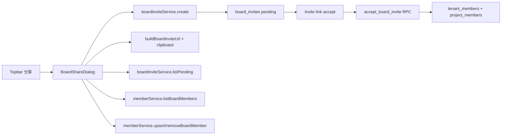

# SPEC-026：Trello-like 看板分享體驗

狀態：Implemented / Browser Smoke Passed
對應 DEV：DEV-026
節點類型：交付點
是否計入產品交付完成：是
建立日期：2026-06-18

## 任務目標

將目前「邀請別人加入看板」的 UI/UX 重構為接近 Trello 的分享看板流程，讓 Trello 使用者轉換到 ProJED 時，可以沿用既有的操作邏輯與肌肉記憶。

成功狀態：

- 使用者在看板右上角可以直接找到 `分享` 入口。
- 點擊後出現 `分享看板` modal，而不是進入設定頁或權限矩陣。
- 使用者可以在同一個 modal 內完成 email 邀請、角色選擇、複製邀請連結、查看看板成員與待處理邀請。
- 角色權限矩陣仍保留在設定頁，不干擾分享主流程。

## HCS 思考習慣

- `#受眾`：主要受眾是熟悉 Trello 的使用者，UI 需降低轉換成本。
- `#類比`：以 Trello 分享看板 modal 作為互動模型，但映射到 ProJED 既有 Supabase invite / role / RLS 資料層。
- `#差距分析`：現況已有邀請資料層，但入口與資訊層級偏設定導向，缺少看板主畫面的分享任務入口。
- `#系統描繪`：梳理 invite create / copy / revoke / accept、board members、role permissions 的前後台責任。
- `#可驗證性`：用 browser smoke、viewport QC 與 visible error sweep 驗證 Trello-like 任務是否可完成。

## UX Intent

- 使用者：看板管理者、專案管理者、被授權可管理成員者，以及只能查看成員的普通成員。
- 使用情境：使用者正在看板工作，需要立即邀請同事加入同一張看板。
- 使用者心智模型：Trello 右上角 `Share` -> modal -> 輸入 email -> 選角色 -> 分享或複製連結。
- 主要任務：邀請新成員加入看板。
- 成功狀態：邀請建立、連結可複製、pending invite 可撤回、成員角色可檢視或管理。
- 主要下一步 CTA：`分享`。
- 最可能誤解點：使用者把「分享看板」誤解成「完整權限設定」或找不到入口。
- 高風險操作：撤回邀請、移除成員、變更角色。
- 安全預設：邀請預設角色為 `member`，權限不足時管理動作 disabled 並顯示原因。
- 必須留在主畫面的資訊：invite input、role dropdown、分享 CTA、邀請連結區、成員/加入要求 tabs。
- 可降層資訊：完整 role permission matrix、audit details、進階權限設定。

## 現況差距

- 現有 `BoardMembersPanel` 同時承載 email invite、board members、role permissions，資訊層級混雜。
- 分享入口沒有穩定出現在看板主畫面右上角，Trello 使用者不會直覺到設定頁找邀請功能。
- Pending invite 只在建立當次保留明文 invite URL，重新載入後 copy 狀態不直覺。
- 使用者可見文案有多處編碼異常，影響分享流程理解。

## 目標互動

1. 看板頁 topbar 顯示 `分享` 按鈕，含 `UserPlus` icon 與目前成員數 badge。
2. 點擊後開啟 centered modal，標題為 `分享看板`，可用 `Esc`、右上角 `X` 或 overlay click 關閉。
3. Modal 第一列：
   - input placeholder：`電子郵件地址或名稱`
   - role dropdown 預設 `成員`
   - primary CTA：`分享`
4. 連結邀請區：
   - 說明：`任何擁有連結的人都可以加入成為成員。`
   - 操作：`複製連結`、`刪除連結`
   - 可選預設角色，初版預設 `member`
5. Tabs：
   - `看板成員 N`
   - `加入要求`
6. 成員列顯示 avatar、名稱、email / user id、角色 dropdown；非 owner 可被移除。
7. 加入要求列顯示 pending invite email、角色、建立時間、複製連結或重新建立連結狀態、撤回操作。

## 開發範圍

- 新增或重構 `BoardShareDialog`，專責 Trello-like 分享流程。
- 將 `BoardMembersPanel` 拆分或降級為設定頁用的 `BoardPermissionSettings` / embedded advanced settings。
- 在 `MainLayout` topbar active board 區加入 `分享` 入口，避免塞入看板 canvas。
- 保留既有 `boardInviteService.create/listPending/revoke/accept`、`buildBoardInviteUrl`、`generateBoardInviteToken`、`hashBoardInviteToken`。
- 清理分享流程中使用者可見文案，統一久方適用的繁體中文角色標籤：`擁有者`、`系統管理員`、`專案負責人`、`成員`、`檢視者`。底層 role key 仍保留 `owner/admin/project_manager/member/viewer`，避免影響資料層與權限判斷。
- 補一支 DEV-026 static verifier，覆蓋 topbar 分享入口、modal 任務面、邀請 token contract、設定頁權限矩陣與穩定 selector；browser smoke 補驗 desktop / mobile 可見性與 hit target。

## 不在範圍

- 不新增資料表、migration 或 RLS policy。
- 不做真正的「名稱搜尋既有使用者 autocomplete」；初版 input 可保留 Trello-like placeholder，但實際送出以 email 驗證為準。
- 不重做工作區層級成員管理。
- 不改邀請接受流程與 OAuth redirect token preserve 機制。
- 不把 role permission matrix 放進分享 modal 主流程。

## 資料流

## 驗收標準

- [x] 使用者在 active board 的 topbar 5 秒內能看到分享入口。
- [x] 點擊 `分享` 後看到 `分享看板` modal，第一個 focus 落在 email/name input。
- [x] 管理者輸入合法 email 後 `分享` CTA 由 disabled 轉為 enabled；pending invite create path 保留既有 service contract。
- [x] 建立邀請後可複製本次 invite URL，local-test URL 需保留現有本機警示語意。
- [x] Pending invite 可撤回，撤回後列表刷新。
- [x] 成員 tab 可檢視成員數、成員名稱/email 與角色。
- [x] owner 角色不可被移除或降級；無管理權限者看得到原因且管理動作 disabled。
- [x] 設定頁仍可管理 role permission matrix。
- [x] Desktop 與 390x844 mobile viewport 下 modal 不重疊、不裁切、不產生非預期水平捲動；mobile 分享按鈕 hit target 已修正。
- [x] Visible Error Sweep 通過 browser smoke；service-role DB smoke 仍需在 release gate 需要時另啟用。

## RD 執行計畫

- [x] 讀取 `BoardMembersPanel`、`MainLayout`、`SettingsView`、`useMemberStore`、`useBoardPermissions`、`boardInviteToken`。
- [x] 抽出共用 role label / role options / invite helpers。
- [x] 實作 `BoardShareDialog`，以 modal 為主，不使用設定頁 embedded layout。
- [x] 將 advanced role permission matrix 保留在設定頁。
- [x] 在 topbar 掛載 `分享` 按鈕與 dialog open state。
- [x] 補 DEV-026 static verifier 與 package script。

## 實作證據 - 2026-06-18

- `src/components/MainLayout.tsx`：active board topbar 新增 `分享` 按鈕、member count badge、dialog open state，並修正 mobile topbar 左側 filter control 覆蓋右側分享按鈕的 hit target。
- `src/components/BoardMembersPanel.tsx`：新增 `BoardShareDialog`，保留 settings 用 `BoardMembersPanel` 權限矩陣；補 `data-board-share-dialog`、`data-board-share-submit`、`data-board-share-members`、`data-board-share-requests` selector；角色顯示名稱採久方語境 `系統管理員`、`專案負責人`。
- `src/components/Sidebar.tsx`：補 board permission hook，避免 sidebar context menu / board rename 入口繞過權限能力判斷。
- `scripts/verify-dev-026-trello-like-board-share-ui.mjs`：新增 DEV-026 static verifier。
- Verified：`lint --quiet`、`tsc --noEmit`、`build:test`、`verify:ontology-collaboration`、`verify:dev-026-trello-like-board-share-ui`。

## 相關文件

- QA：`ai-doc/qa/QA-DEV-026-trello-like-board-share-ui.md`
- 既有資料層：`supabase/migrations/20260528092834_board_invites.sql`
- 既有驗證：`scripts/ontology-collaboration-qc.mjs`
