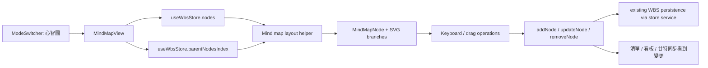

# SPEC-027：Xmind-like 心智圖模式

狀態：Implemented / Browser QC Passed
對應 DEV：DEV-027
節點類型：交付點
是否計入產品交付完成：是
建立日期：2026-06-18

## 任務目標

在 ProJED 新增 `心智圖` 模式，讓使用者可以用接近 Xmind 的心智圖操作方式規劃 WBS 任務。此模式不建立獨立資料模型，而是直接讀寫既有 `TaskNode` 樹狀資料：一個任務就是一個分支，畫面只顯示任務名稱。

成功狀態：

- 使用者可以在現有模式切換列中切到 `心智圖`。
- Active board title 作為中心主題，WBS 頂層任務作為主要分支。
- 任務新增、改名、刪除、拖曳調整階層會直接更新既有 WBS 任務資料。
- 使用者可沿用 Xmind 類心智模型：`Enter` 新增同層任務、`Tab` 新增子任務、雙擊或鍵盤進入改名、`Delete` 刪除選取任務。
- 第一版視覺布局與互動高度接近 Xmind 類心智圖，但避免一比一複製品牌細節與素材。

## HCS 引導決策

| 題號 | 使用者決策 | 寫入規格的交付邊界 |
|---|---|---|
| 1 | A：核心心智圖 MVP | 第一版只做模式切換、任務分支顯示、展開/收合、拖曳階層、改名、Enter/Tab/Delete。 |
| 2 | B：視覺布局與互動高度接近，但避免一比一複製品牌細節 | 追求 Xmind-like 操作與畫布感，不複製 Xmind 品牌視覺、圖示、專有樣式或素材。 |
| 3 | A：完全共用現有 WBS 任務資料 | 心智圖模式是新視圖，不是草稿區；任何編輯立即寫入 `useWbsStore`。 |

## HCS 思考習慣

- `#效用理論`：此功能降低從 Xmind 規劃到 ProJED WBS 建任務的轉換成本，預期使用頻率高，且可共用現有任務資料，效用高於開發成本。
- `#差距分析`：現有 ProJED 已有 WBS 樹狀資料、清單、看板、甘特，但缺少「構思階段」最自然的心智圖輸入媒介。
- `#目的`：目的不是增加一個漂亮視圖，而是讓使用者用熟悉的心智圖方式完成工作計畫拆解，並立即變成可執行任務。
- `#設計思考`：主要受眾是已習慣 Xmind 規劃工作的使用者；互動優先於欄位完整度，第一版只顯示任務名稱。
- `#可驗證性`：用鍵盤流程、拖曳階層、資料同步、viewport 與 visible error sweep 驗證功能是否真的可用。

## 外部 UX 參考

- Xmind 官方說明將 topic 視為心智圖基本元素，並區分 central topic、main topic、subtopic 等類型。ProJED 對應方式：active board title 是 central topic，WBS root tasks 是 main topics，children 是 subtopics。
- Xmind 官方快捷鍵說明包含 `Enter` 新增同層 topic、`Tab` 新增 subtopic、`Delete` 刪除、`F2` 編輯、`Ctrl+Z` 復原、`Ctrl+Y` 重做、縮放等。ProJED 第一版只納入核心 MVP 快捷鍵。
- Xmind topic 編輯說明包含雙擊 topic、直接按快捷鍵新增 topic/subtopic、拖曳調整階層。ProJED 第一版採用相同心智模型，但用 ProJED 自有視覺語言實作。

參考連結：

- https://xmind.com/user-guide/topic-editing-new
- https://xmind-help.github.io/en/shortcuts.html
- https://xmind-help.github.io/en/topic.html

## UX Intent

- 使用者：常用 Xmind 規劃工作計畫、但希望任務最後直接落在 ProJED 的專案管理者與任務拆解者。
- 使用情境：使用者剛開始規劃一個專案或會議後整理 WBS，希望先快速發散與分層，再切到清單、看板或甘特補日期、負責人、狀態。
- 使用者心智模型：中心主題 -> 主要分支 -> 子分支；選到節點後用鍵盤快速新增、改名、刪除與移動。
- 主要任務：快速建立與調整 WBS 階層。
- 成功狀態：不用離開 ProJED，就能完成過去在 Xmind 內做的任務拆解。
- 主要下一步 CTA：`心智圖` 模式切換。
- 最可能誤解點：使用者以為心智圖只是瀏覽圖，實際上此模式會直接編輯任務資料。
- 高風險操作：刪除含子任務的任務、拖曳造成階層錯置、快捷鍵在輸入中誤觸。
- 安全預設：刪除走既有 soft archive；拖曳需防止循環階層；輸入框 focus 中不攔截全域快捷鍵。

## 現況差距

- `TaskNode` 已經是 adjacency-list 樹狀資料，`parentId` 與 `parentNodesIndex` 可直接支撐心智圖階層。
- 目前 `list` 模式是樹狀表格，適合編輯欄位，不適合發散式規劃。
- `board` 模式適合流程狀態，`gantt` 模式適合排程，但兩者都不是快速拆解任務階層的最佳媒介。
- 使用者若先用 Xmind 規劃，再手動搬到 ProJED，會產生重複輸入與階層轉換成本。

## 目標互動

1. 使用者在 topbar 模式切換列看到 `心智圖`，位置與 `清單 / 看板 / 甘特` 同層。
2. 進入後顯示 canvas-like 心智圖：
   - 中心節點：active board title。
   - 第一層分支：`parentId === null` 或 `parentId === boardId` 的任務。
   - 子分支：依 `parentNodesIndex[node.id]` 遞迴顯示。
3. 每個任務節點只顯示任務名稱，不顯示日期、狀態、負責人、標籤、進度。
4. 節點支援選取狀態；選取節點後可使用鍵盤操作。
5. `Enter`：在目前節點後新增同層任務，標題預設 `新任務`，新增後只選取新任務，不立即進入命名。
6. `Tab`：在目前節點下新增子任務，標題預設 `新任務`，新增後只選取新任務，不立即進入命名。
7. 方向鍵：在可見任務間移動選取；選取任務後直接打字才進入命名。
8. 雙擊、`F2` 或直接開始輸入：進入節點標題編輯。
9. `Delete` / `Backspace`：刪除選取任務；若該任務有子任務，需使用既有確認 dialog 或等價保護文案。
9. 點擊節點旁的展開/收合控制，可收合或展開子分支。
10. 拖曳節點可調整同層排序或移到另一個節點底下；必須防止把節點拖到自己的子孫底下。

## 開發範圍

- `ViewMode` 新增 `mindmap`。
- `MainLayout` 模式切換列新增 `心智圖` 選項與 icon。
- `App.renderContent` 新增 `MindMapView`。
- 新增 `src/components/MindMap/MindMapView.tsx`。
- 新增 `src/components/MindMap/MindMapNode.tsx`。
- 新增心智圖 layout helper，將 `TaskNode` 樹轉為可繪製的節點座標與 SVG branch path。
- 共用 `useWbsStore` 的 `nodes`、`parentNodesIndex`、`addNode`、`updateNode`、`removeNode`。
- 共用 `useBoardPermissions`，讓 viewer 或無權限使用者不能新增、改名、刪除或移動任務。
- 共用 `useUndoStore` 既有 undo/redo 能力；新增任務、刪除、改名、拖曳調整需保留復原路徑。
- 補 `verify:dev-027-xmind-like-mind-map-mode` static verifier，檢查 view mode wiring、核心快捷鍵、資料直寫、循環階層防呆與文件 gate。
- 補 browser smoke，至少驗證 desktop 與 mobile viewport 下心智圖可見、節點不重疊到不可讀、基本鍵盤操作可完成。

## 不在範圍

- 不新增資料表、migration 或後端 API。
- 不新增獨立心智圖草稿資料。
- 不做 Xmind 匯入/匯出。
- 不做 Xmind 完整功能 parity：關聯線、摘要框、邊界框、貼紙、標記、style panel、主題模板、floating topic、presentation mode。
- 不在第一版顯示日期、狀態、負責人、標籤、依賴關係與進度。
- 不做自由縮放定位、畫布記憶視角或 minimap；第一版可用 scroll container 保障可瀏覽性。
- 不複製 Xmind 品牌圖示、專有配色或專有素材。

## 資料流

## 資料對應規則

| 心智圖概念 | ProJED 資料 |
|---|---|
| 中心主題 | `activeBoard.title`，不是任務，不可在心智圖中當作 TaskNode 刪除 |
| 主要分支 | root-level `TaskNode` |
| 子分支 | `TaskNode.parentId === parent.id` |
| 分支文字 | `TaskNode.title` |
| 分支順序 | sibling `TaskNode.order` |
| 新增分支 | `addNode` 建立 task 或 group；第一版統一 `nodeType: task` 或沿用 root group 規則需 RD 實作前確認 |
| 改名 | `updateNode(id, { title })` |
| 移動階層 | `updateNode(id, { parentId, order })` |
| 刪除 | `removeNode(id)` soft archive |

## 權限規則

- `read_board`：可進入心智圖並瀏覽。
- `create_task`：可用 `Enter` / `Tab` 新增任務。
- `edit_task`：可改名與刪除任務。
- `move_task`：可拖曳調整階層與排序。
- 權限不足時，節點仍可選取與瀏覽，但編輯入口 disabled 並提供 tooltip 或狀態提示。

## 驗收標準

- [x] topbar 模式切換列包含 `心智圖`，且切換後不破壞 `清單 / 看板 / 甘特 / 日曆 / 紀錄庫`。
- [x] 進入心智圖後，active board title 顯示為中心主題。
- [x] 每個現有 WBS 任務都以分支節點顯示，且只顯示任務名稱。
- [x] `Enter` 可新增同層任務，新增後清單模式可立即看到同一任務。
- [x] `Tab` 可新增子任務，新增後清單模式可看到正確 parent-child 階層。
- [x] 雙擊、`F2` 或直接輸入可改名，改名後清單、看板、甘特同步更新。
- [x] `Delete` 可刪除選取任務；含子任務時有明確防呆，不會靜默刪除整棵子樹。
- [x] 節點展開/收合不改資料，只改本視圖狀態。
- [x] 拖曳節點可改變同層順序或父子階層，且不可造成循環 parent chain。
- [x] Viewer 或無權限使用者無法新增、改名、刪除或拖曳任務。
- [x] Desktop、laptop 與 390x844 mobile viewport 下沒有不可讀重疊、不可操作節點或非預期水平破版。
- [x] `npm run lint -- --quiet`、`tsc --noEmit`、`build:test`、DEV-027 verifier 通過。

## RD 執行計畫

- [x] 讀取 `src/types/index.ts`、`src/App.tsx`、`src/components/MainLayout.tsx`、`src/store/useWbsStore.ts`、`src/components/Wbs/WbsListView.tsx`、`src/components/Wbs/WbsNodeItem.tsx`。
- [x] 新增 `mindmap` view mode 與 topbar 模式選項。
- [x] 建立 `MindMapView`，從 active board 與 WBS store 取得樹狀資料。
- [x] 建立 layout helper，輸出節點座標、層級、展開狀態與 branch path。
- [x] 建立 `MindMapNode`，支援選取、雙擊改名、F2/direct typing 改名、展開/收合。
- [x] 實作 `Enter` / `Tab` / `Delete` keyboard operations，並避免輸入框 focus 中誤觸。
- [x] 實作拖曳排序與改父層，沿用既有 cycle guard 思路。
- [x] 補權限 disabled state 與 delete subtree confirm。
- [x] 補 static verifier 與 package script。
- [x] 補 browser smoke，確認 desktop/mobile 可見性與互動。

## 實作與驗證紀錄

- 實作檔案：`src/components/MindMap/MindMapView.tsx`、`src/components/MindMap/MindMapNode.tsx`。
- Wiring：`src/types/index.ts`、`src/App.tsx`、`src/components/MainLayout.tsx`、`package.json`。
- Static gates：`npm.cmd run verify:dev-027-xmind-like-mind-map-mode`、`npm.cmd exec tsc -- --noEmit`、`npm.cmd run lint -- --quiet`、`npm.cmd run build:test`、`npm.cmd run verify:core-regression-static`。
- Browser smoke：`http://127.0.0.1:4173/`，desktop 1440x900 與 mobile 390x844。
- Owner interaction evidence：新增 root、`Tab` 建子任務、`F2` 改名、含子任務 `Delete` 確認、清單跨視圖同步、測試資料 cleanup。

## DEV-027A UI Reopen Addendum：connector line and drag interactions

觸發日期：2026-06-18
狀態：Ready for RD fix

本 addendum 擴充 DEV-027 的 Xmind-like UI 要求，修復重點不只包含 branch connector line 斷裂，也包含本輪新增的拖曳互動行為。

新增要求：

- Connector line 必須形成可追蹤拓撲：中心主題到 root branch、parent 到 child、siblings trunk 或等效曲線都必須連續可讀。
- 拖動任務時，畫面必須顯示任務位置、階層、排序或分支側向變化的即時預覽動畫。
- 拖曳中不可只顯示瀏覽器原生 ghost、靜態 drop target 或拖放結束後才突然更新畫面。
- Drag preview 必須在 mouse / pointer move 過程中即時揭露預期 parent、sibling insertion position 與 side placement。
- 任務可拖動到同一側；多個 root branches 可以同時位於左側或同時位於右側。
- Root branch 的左/右 side 是使用者布局意圖，不得由 root index parity 強制平均拆分。
- RD 若不新增 schema，仍必須有穩定 deterministic layout state 或 local view state，確保使用者拖放後看到的同側布局不會在 reload、模式切換或資料重算後立即被打回左右平均。
- 拖曳 preview、drop 完成、collapse / expand、resize / scroll 後，connector geometry 都必須重新計算並保持連續。

新增驗收標準：

- [ ] 拖曳任務時可看到 Xmind-like 即時預覽動畫，包含節點位置與 connector preview 的連續變化。
- [ ] 拖曳到 parent、sibling before/after、left side、right side 時，drop 前即可辨識預期結果。
- [ ] 使用者可將兩個以上 root branches 放在同一側，完成 drop 後不被演算法強制分回左右兩側。
- [ ] 同側 root branches 的中心連線、root trunk、children connectors 都保持可追蹤。
- [ ] 模式切換、hard reload 或 layout recompute 後，同側布局意圖仍可保留，或 RD 需明確提出等效且可驗證的 side persistence 設計。
- [ ] 新增 `verify:dev-027-xmind-drag-preview-browser` 或等效 browser verifier，覆蓋 drag preview animation、same-side drop、side persistence 與 connector recompute。

不接受的修法：

- 只把短線補長，但拖曳仍無即時預覽。
- 只允許 root branches 依序左右交錯，不能由使用者放到同側。
- 只在 drop 後更新 DOM，拖曳過程沒有任何可判讀 preview。
- 只用 screenshot 肉眼宣告通過，缺少 DOM geometry、side metadata 或 pointer drag evidence。

## QA 驗證計畫

- QA 文件：`ai-doc/qa/QA-DEV-027-xmind-like-mind-map-mode.md`

## 相關文件

- PM 主控：`ai-doc/dev_task.md`
- Backlog：`ai-doc/backlog.md`
- Documentation map：`ai-doc/documentation_map.md`
- WBS store：`src/store/useWbsStore.ts`
- WBS list view：`src/components/Wbs/WbsListView.tsx`
- WBS node item：`src/components/Wbs/WbsNodeItem.tsx`
