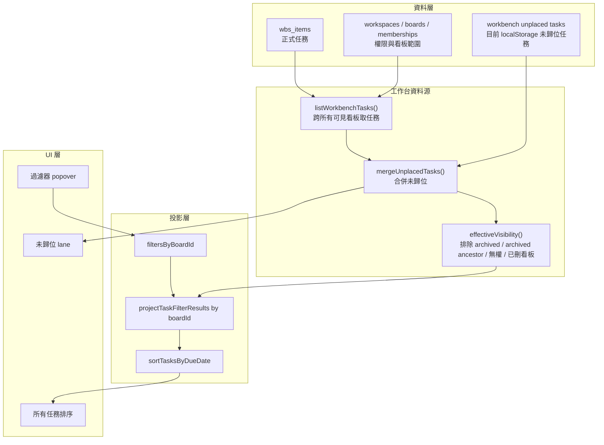

# SPEC-039: 任務過濾器核心與全域任務平台兩欄篩選重構

關聯 DEV：DEV-039
關聯開發點：DEV-027D 心智圖日期顯示與既有過濾器串接、DEV-028 四模式任務操作契約、DEV-036 Trello-like Workspace Governance
狀態：Phase 1/1A Implemented + Local Automated QC Passed / Phase 1B Implemented + Local Automated QC Passed / Phase 1C Implemented + Local Automated QC Passed / Phase 2 Cross-Board Source Slice Implemented + Local Automated QC Passed / Production Release Not Deployed + Requires Explicit Authorization / All-Phase Coverage Complete
建立日期：2026-07-02
最新修正：
- 2026-07-03，使用者要求全域任務平台主畫面中「跟過濾器有關的功能只剩一個按鈕」：看板選擇欄位移入 `過濾器` popover 內，popover 內先選看板再調同看板過濾條件；主畫面不常駐顯示看板 select、資料來源摘要、設定路徑、全部看板/計數摘要或卡片 metadata badges。後續 UI 修正：原下方 `已歸位任務` 顯示區改名為 `所有任務排序`，內容包含已歸位任務與未歸位任務，預設依到期日由上到下排序，未設到期日者排在最下面。
- 2026-07-04，使用者確認目標架構：`所有任務排序` 必須跨所有可見看板顯示任務，不得只顯示目前看板；看板刪除任務後，該任務與其不可見後代不得殘留在 `所有任務排序`。Phase 2 RD contract 補入 `listWorkbenchTasks()`、`mergeUnplacedTasks()`、`effectiveVisibility()` 與 deletion/effective-visibility gate。
- 2026-07-04，使用者授權執行 DEV-039 Phase 2 開發；本輪完成 cross-board source / deletion effective visibility slice，未包含 visible partial/error summary UI、Supabase RPC/RLS/migration、production deploy 或正式資料修復。
- 2026-07-04 follow-up，使用者截圖回報已刪除項目仍殘留；補強 `所有任務排序` candidate gate，預設排除 `nodeType: group` 列表/容器，並將 missing-parent orphan task 視為不可見，避免刪除父層或資料正規化後的扁平投影殘留。
- 2026-07-04 HCS `#引導模式` 決策：使用者選擇 `1C`，因此列表/群組容器改為顯示設定，預設不顯示但可在工作台過濾器 popover 內切換；orphan visibility 採 `2A`，static/browser 驗證採 `3A`。
- 2026-07-04 UI follow-up，使用者要求任務台排版更密集、去除不必要元素並只保留文字資訊；任務列改為 dense text rows，移除獨立拖曳把手、大卡片與陰影，拖曳由整列承接。
- 2026-07-04 sticky title follow-up，`未歸位` 與 `所有任務排序` 是 section title，不是任務列；需用 sticky header UI 呈現，區塊捲動後仍停留在各自區塊頂端。
- 2026-07-04 chevron collapse follow-up，工作台收合狀態需與主側欄使用同類精簡 chevron affordance，rail 寬度縮小 50%，不再使用 Notebook 類大圖示按鈕；展開狀態的收合按鈕也需使用 `ChevronLeft`。
- 2026-07-04 hierarchy follow-up，使用者要求 `所有任務排序` 可看出不同 level；維持到期日排序，但每列需以縮排、字重與灰階提示階層深度。

## 背景

使用者指出 ProJED 有多處「過濾器 / 篩選器」，並追問全域任務平台截圖中的 `篩選器 / 調整篩選` 是否與既有看板上方 `過濾器` 共用。

第一性原理結論：

- 共用的是任務條件語意：狀態、到期日、負責人、標籤、關鍵字。
- 不共用單一 active state：看板內任務視圖與全域任務平台的使用情境不同。
- 顯示設定不是過濾條件：開始日期、標籤顯示、依賴線不得污染 active filter count。
- 全域任務平台的核心定位是 BoardView 左側跨看板拖拉中繼站，不是獨立整頁。

## 最新產品決策

全域任務平台篩選改成最小直覺模型：

1. 主畫面只保留一顆 `過濾器` 按鈕，不常駐顯示看板 select。
2. 點開 `過濾器` popover 後，第一段選擇正在設定哪一個看板。
3. Popover 內接同看板任務過濾條件，內容與看板裡的任務過濾器使用同一套條件語意；使用者一個看板一個看板設定。
4. 不提供設定檔、儲存、另存、複製到其他看板、全域 profile、看板專屬 profile。
5. 不提供 `目前工作區`、`目前看板` 作為來源範圍選項。
6. 不提供 `待歸位 / 已歸位` 作為任務狀態 filter、來源範圍 filter 或預設排除條件。
7. 必須補回 `未歸位` 與 `已歸位看板` 兩個位置區；它們是拖拉定位 lane，不是過濾器。
8. `未歸類任務 / 未歸位任務` 必須與 `已歸位任務` 使用同一套任務卡功能契約，僅位置不同；不得降級成只能新增/顯示的簡化收件匣。
9. 任務必須可藉由拖移在 `未歸位` 與 `已歸位看板` 間移動。
10. 原先正式環境發布相關開發文件與 gate 必須排在 Phase 1C 驗證通過之後。
11. 同一個看板、同一組任務篩選條件下，看板與全域任務平台的「符合條件任務 identity」必須一致；看板可額外顯示祖先欄位 / 卡片作為路徑容器，但不得因此把不符合條件的容器算成符合結果。
12. 全域任務平台 popover 內的看板 selector 只代表「正在設定哪個看板的過濾器」；第二欄任務清單是跨看板全部已載入任務彙總，依每筆任務所屬看板套用該看板自己的 filter state。
13. 全域任務平台的過濾器控制必須像看板上方過濾器一樣是單一按鈕 + overlay；看板 selector 不得與過濾器按鈕並列常駐在主畫面。
14. 下方顯示區名稱為 `所有任務排序`，不是 `已歸位任務`；清單必須合併未歸位任務與符合各看板 filter 的已歸位任務。
15. `所有任務排序` 預設依到期日由早到晚排序；沒有到期日或日期無效的任務排在最下面。
16. `所有任務排序` 預設只列出 task-like 節點；列表/群組容器必須由 `列表 / 群組` 顯示設定切換後才可出現。
17. 若任務的 `parentId` 指向不存在且不是合法 root / board root parent，該 orphan 不得出現在看板投影或 `所有任務排序`，且不得被容器顯示設定放行。
18. 任務台清單必須採密集文字列；不得回復成大卡片、獨立拖曳圖示、日期 chip 或陰影式卡片堆疊。
19. `所有任務排序` 是扁平排序清單，但必須保留 hierarchy cue：L1 無縮排，子層依 parent chain 增加縮排並降低視覺權重。

設計原因：

- `看板 -> 過濾器` 是使用者最容易理解的因果順序。
- 避免「設定檔歸屬」和「資料來源範圍」混淆。
- 全域任務平台是跨看板移動入口；使用者在第一欄選看板時，是在選「我要調哪個看板的過濾器」，不是把第二欄清單限縮成單一看板。
- 取消儲存與複製，降低操作成本與維護風險。
- 未歸位 / 已歸位是任務定位狀態的操作結果，不是查詢條件；把它們放進過濾器會讓使用者誤以為只是顯示/隱藏，而不是移動任務位置。
- 未歸位任務與已歸位任務功能等價，使用者才會把工作台理解為跨看板整理工具，而不是另一個不完整 inbox。

## Human Decision Brief - 2026-07-02 Placement Lanes

使用者最新決策：

- `未歸位` 與 `已歸位看板` 必須存在於全域任務平台，但語意是 placement lanes。
- 兩個 lane 不得回流成篩選器、來源範圍或任務狀態 filter。
- 任務可拖移在 `未歸位` 與 `已歸位看板` 間移動。
- 未歸類任務的功能與已歸位任務一模一樣，僅位置不同。
- 正式環境發布順序必須排在此功能補回與 QC 之後。

已取消或不可採用：

- 把未歸類任務只做成 `InboxItem` 新增與顯示。
- 把 `待歸位 / 已歸位` 作為 filter panel 內的狀態條件。
- 以「簡化 scope」名義讓未歸位卡片缺少詳情、拖拉、狀態、負責人、標籤或與已歸位任務不同的操作能力。

## Human Decision Brief - 2026-07-02 Filter Result Parity

決策來源：使用者指出全域任務平台篩選器與看板裡的篩選器，在相同條件下篩出不同結果，要求先分析差別，再制定開發文件，且本輪不改代碼。

確認事實：

- 兩邊目前都使用 `matchesTaskFilters` 或同一套 `TaskFilterState` 語意，差異不是主要 predicate 本身。
- 看板畫布是階層式投影：Level 1 是欄位、Level 2 是卡片、Level 3+ 是卡片內待辦；目前每層各自套 filter，若父層不符合，符合條件的子任務可能被整段藏掉。
- 全域任務平台是跨看板扁平式投影：清單取目前已載入的全部已歸位 `TaskNode`，依每筆 task 的 `boardId` 套用該看板 filter state，因此會列出各看板符合條件的任務 identity。
- 負責人選項來源目前也不同：看板上方 filter 主要來自 board members；全域任務平台混合 workspace members、board members 與實際任務 assignee。

產品決策：

- canonical truth 是「符合條件的任務 identity 集合」，不是某一個 UI 目前渲染出來的容器集合。
- 看板視圖可顯示不符合 filter 的父層欄位 / 卡片，但只能作為 context container，不能算入符合結果。
- 全域任務平台的已歸位看板 lane 應列出 canonical matched task identities，並可顯示任務所在路徑；它不需要顯示 context-only ancestor。
- 同一個看板、同一組 status / due / assignee / tag / keyword 條件，在看板與全域任務平台中得到的 matched task IDs 必須一致。
- Filter option source 也需對齊到同一個 selected board context；不得因工作台混入 unrelated workspace members 而讓使用者以為兩邊條件相同但實際 assignee id 不同。

AI assumptions：

- Phase 1C 不新增儲存、profile、同步、schema、RLS 或 production deploy。
- Phase 1C 不改變任務階層資料模型；只補 result projection / hierarchy visibility contract。
- 若實作中發現現有資料缺少穩定 parent path 或 board membership metadata，RD 應停止並回報需擴 scope，不得自行做 migration。

## Human Decision Brief - 2026-07-04 Cross-Board Source + Effective Visibility

決策來源：使用者以截圖指出 `所有任務排序` 目前不應只顯示現在看板，且任務在看板刪除後仍殘留在 `所有任務排序`；使用者確認目標系統架構以資料層、工作台資料源、投影層與 UI 層分層。

已確認產品決策：

- `所有任務排序` 的目標語意是跨所有可見看板顯示任務，而不是目前 active board 或 filter popover 選中的看板。
- `過濾器` popover 裡的看板 selector 仍只代表「正在設定哪個看板的 filter state」，不得被解讀成任務來源範圍。
- 看板刪除任務後，該任務不得留在 `所有任務排序`；若刪除的是父層/list/card，其在看板上已不可見的 descendant 也不得因扁平投影而殘留。
- `未歸位 lane` 仍顯示未歸位任務；`所有任務排序` 可合併未歸位與已歸位任務，但必須清楚套用相同 effective-visibility 規則。
- Phase 2 目標架構包含 `listWorkbenchTasks()`、`mergeUnplacedTasks()`、`projectTaskFilterResults by boardId`、`sortTasksByDueDate`，並新增 `effectiveVisibility()` 作為投影前 gate。

已拒絕或不可採用：

- 只把 active board 的 `nodes` 改名為「所有任務」。
- 只靠 UI filter 隱藏已刪任務，而不修正 source / visibility contract。
- 只處理被刪除節點本身，不處理 archived ancestor、已刪看板、無權看板或 orphan descendant。

AI assumptions：

- 使用者最新 `執行開發` 指令授權本輪前端 / local-test / Firestore / 既有 Supabase service adapter slice；remote migration、RPC/RLS、production deploy、正式資料修復仍未授權。
- 若現有 Supabase / Firestore API 沒有可安全取得全部可見任務的查詢，RD 應建立 service adapter；若需要 DB migration / RLS 變更，必須先停下取得授權。本輪使用既有 `supabaseNodeService.listByProject()`，未新增 SQL/RPC/RLS。
- `unplaced tasks` 目前仍是本機 localStorage 來源；跨裝置同步不屬 Phase 2 本輪 scope，除非另行授權。

## End-State Architecture

- `src/features/taskFilters` 是任務條件的 canonical core。
- 看板上方過濾器與全域任務平台共用 filter 型別、預設值、predicate、summary。
- 看板上方過濾器維持既有 board task view storage adapter。
- 全域任務平台不使用 profile storage；每個看板的篩選條件存在元件 state，使用者在當次工作流程中逐看板調整；清單本身跨看板彙總顯示。
- 全域任務平台使用 `TaskWorkbenchItem` 或等效 view model 表達兩種位置：`unplaced` 與 `placed-board`。
- 未歸位任務可沿用既有 `InboxItem` / `useQuickCaptureStore` 作為輸入來源，但呈現到工作台前必須正規化成與已歸位任務等價的 task card contract；若資料不足以支援等價功能，RD 必須停止並補資料模型或轉換契約，不得交付簡化卡片。
- 全域任務平台桌面嵌在 BoardView 左側；手機預設收合成 rail，點開後以 overlay 顯示。
- 全域任務平台卡片在 `未歸位` 與 `已歸位看板` 兩區都保留拖拉定位、點擊開詳情、可辨識狀態/負責人/日期/標籤與既有任務操作契約。
- `matchesTaskFilters` 只判斷單一 task 是否符合條件；跨層級 UI 必須再透過 hierarchy projection 產生 `matchedTaskIds` 與 `visibleContainerIds`。
- 看板視圖的 hierarchy projection 必須保留 matched task 的祖先欄位 / 卡片作為 context，避免符合條件的子任務被父層 filter 擋掉。
- 全域任務平台的已歸位任務 lane 必須跨看板列出各看板 canonical `matchedTaskIds`，不得把 context-only ancestors 當成 filter result；若需要路徑，顯示 workspace / board / ancestor path metadata。
- Phase 1 資料來源為目前已載入任務集合；Phase 2 cross-board source slice 已升級為依 visible board list 逐 board 載入任務。
- Phase 2 後，全域任務平台資料來源由 `src/features/taskWorkbench/source.ts` 的 `listWorkbenchTasks()` 或等效 service 提供，不得再依賴 active board sync side effect。
- Phase 2 的 source pipeline 為：`listWorkbenchTasks()` 依目前可見 board list 逐 board 取已歸位任務；`mergeUnplacedTasks()` 合併未歸位任務；`isTaskEffectivelyVisible()` 排除 archived task 與 archived ancestor；`projectTaskFilterResults()` 依每筆任務所屬 board 套用對應 filter；`sortTasksByDueDate()` 產生 `所有任務排序`。無權 board / 已刪看板透過 `boardOptions` 範圍排除；RPC/RLS/DB role matrix 屬未授權 follow-up。
- `effectiveVisibility()` 是 source truth gate，不是 UI 裝飾；任何任務若在看板上因刪除或權限不可見，就不得只因扁平排序清單而重新出現。



## Module Contract

`src/features/taskFilters`：

- `TaskFilterState`
- `TaskDisplaySettings`
- `createDefaultTaskFilters`
- `createDefaultTaskDisplaySettings`
- `matchesTaskFilters`
- `describeTaskFilters`
- `countActiveTaskFilters`
- board task filter storage adapter

全域任務平台不得匯入或重新新增：

- `TaskWorkbenchFilterProfile`
- `createDefaultTaskWorkbenchProfile`
- `TASK_WORKBENCH_FILTER_PROFILES_STORAGE_KEY`
- `readTaskWorkbenchProfiles`
- `writeTaskWorkbenchProfiles`
- `writeTaskWorkbenchActiveProfileId`

## Task Workbench UI Contract

桌面主要結構：

```text
全域任務平台
未歸位（sticky section header）
[新增未歸位任務 input] [+]
未歸位任務列表（精簡一行；與已歸位任務卡片同核心操作）

[過濾器 button]
  popover:
    [看板 select：設定哪個看板的過濾器]
    [同看板過濾條件]

所有任務排序（sticky section header）
任務列表（跨看板彙總；每筆任務依所屬看板 filter state 顯示，可拖拉；Phase 1/1C 以目前已載入任務集合為來源，Phase 2 需升級為全部可見看板任務來源；卡片不顯示路徑/狀態/負責人/標籤 badges）
```

必備 selectors：

- `data-task-workbench-panel="true"`
- `data-task-workbench-filter-toggle="true"`
- `data-task-workbench-filter-popover="true"`
- `data-task-workbench-filter-panel="true"`
- `data-task-workbench-board-select="true"`（只在 filter popover 內出現）
- `data-task-workbench-task-card="true"`
- `data-task-workbench-unclassified-section="true"`
- `data-task-workbench-unclassified-input="true"`
- `data-task-workbench-unclassified-add="true"`
- `data-task-workbench-unclassified-list="true"`
- `data-task-workbench-unclassified-item="true"`
- `data-task-workbench-section-header="unplaced|all-tasks"`
- `data-task-workbench-collapsed-toggle="true"`
- `data-task-workbench-collapsed-count="true"`
- `data-task-workbench-collapse-toggle="true"`
- `data-task-workbench-unplaced-lane="true"`
- `data-task-workbench-placed-board-lane="true"`
- `data-task-workbench-unplaced-task-card="true"`
- `data-task-workbench-placed-task-card="true"`
- `data-task-workbench-lane-drop-target="unplaced|placed-board"`

禁止 selectors / 文案：

- `data-task-workbench-profile-*`
- `設定檔`
- `儲存`
- `另存`
- `複製到`
- `全域`
- `看板專屬`
- `data-task-workbench-source-summary="true"`
- `data-task-workbench-filter-summary="true"`
- `data-task-workbench-selected-board="true"`
- `資料來源：目前已載入任務集合`
- `清單跨看板顯示`
- `設定：`
- `全部看板`
- `拖到所選看板`

## Phase Roadmap

| Phase | 狀態 | 目的 | 主要輸出 |
|---|---|---|---|
| Phase 0 | Done | PM / Architecture Alignment | 盤點現有 filter、確認共用核心與不共用 active state |
| Phase 1 | Implemented / Local Automated QC Passed | Shared Filter Core + Two-Column Workbench Filter | `taskFilters` core、五視圖一致性、BoardView 左側工作台、兩欄看板/過濾器、無 profile/storage |
| Phase 1A | Implemented / Historical QC Passed | Workbench Unclassified Add/Display Restore | 先前補回未歸類新增/顯示；已被 Phase 1B 新需求覆蓋為等價任務卡契約 |
| Phase 1B | Implemented / Local Automated QC Passed | Workbench Placement Lanes Restore | 補回未歸位 / 已歸位看板 lane、雙向拖移、未歸位任務與已歸位任務功能等價 |
| Phase 1C | Implemented / Local Automated QC Passed | Filter Result Parity | 對齊看板階層式篩選與全域任務平台扁平篩選；同條件 matched task IDs 一致，父層容器只作 context |
| Phase 2 | Cross-Board Source Slice Implemented / Local Automated QC Passed | Workbench Data Source Truth | cross-board task source、scoped store merge、deletion effective visibility；visible partial/error summary / DB-RLS-RPC follow-up 仍未授權 |
| Phase 3 | Deferred / Not Authorized | Filter Section Componentization | 將重複的狀態、到期日、負責人、標籤、關鍵字 UI section 元件化；不新增儲存功能 |
| Phase 4 | Deferred / Not Authorized | Legacy Cleanup Guardrails | 移除 profile 遺留文件/測試/keys、補防回流 gate；不做 profile sync/governance |

## Phase 1 / 1A RD Contract（已完成歷史範圍）

Scope：

- 建立 `src/features/taskFilters` 共用核心。
- 讓 list、board、gantt、calendar、mindmap 透過同一個 predicate 套用任務條件。
- 將顯示設定與過濾條件拆開。
- 將全域任務平台恢復為 BoardView 左側 panel，移除獨立 route。
- 全域任務平台篩選 UI 只保留兩欄：看板、過濾器。
- 全域任務平台每個看板可有不同當次篩選 state，但不得提供保存、複製或 profile 管理。
- 全域任務平台先前加回未歸類任務新增與顯示區塊，資料來源為 existing local-first `InboxItem` store；Phase 1B 已升級為與已歸位任務等價的 lane/task contract。

Acceptance：

- active filter count 只計算真正過濾條件。
- 五個任務視圖對狀態、到期日、負責人、標籤、關鍵字的結果一致。
- 全域任務平台不出現 `目前工作區`、`目前看板` 來源範圍。
- 全域任務平台不出現 `待歸位 / 已歸位` 作為 filter、來源範圍或預設排除條件；Phase 1B 已以 placement lane 形式補回。
- 全域任務平台不出現任何 profile/save/copy UI。
- 選擇看板 A 或看板 B 時，只切換正在編輯的看板 filter state；已歸位任務清單仍跨看板顯示目前已載入任務。
- 過濾器只改變目前選擇看板的 filter state；清單中其他看板任務依各自看板 state 保持顯示或隱藏。
- 未歸類任務區塊不受看板 selector 或過濾器影響。
- 新增未歸類任務後立即出現在工作台，重新整理後仍可見。
- 全域任務平台仍可拖拉卡片到目前看板定位。
- 390px mobile viewport 下，工作台不擠出看板卡片，不出現水平 overflow。

Evidence：

```powershell
npm.cmd run verify:dev-039-task-filter-core
npm.cmd run verify:dev-039-task-filter-core-browser
npm.cmd run verify:dev-027d-mindmap-date-display-filter
npm.cmd run verify:dev-027d-mindmap-date-display-filter-browser
npm.cmd run verify:dev-028-cross-mode-task-interactions
npm.cmd run verify:dev-028-cross-mode-task-interactions-browser
npm.cmd exec tsc -- --noEmit
npm.cmd run build
```

## Phase 1B RD Contract

Purpose：補回全域任務平台原本的跨看板拖拉整理能力，讓使用者能在左側工作台內把任務從未歸位移到已歸位看板，也能從已歸位看板移回未歸位。

Scope：

- 在全域任務平台中明確呈現兩個位置區：`未歸位` 與 `已歸位看板`。
- `未歸位` 不是過濾器；它是尚未放入某看板位置的任務 lane。
- `已歸位任務` 是跨看板任務 lane；第一欄目前選擇看板只決定正在編輯哪個看板的過濾器，以及拖入 lane 時要歸位到哪個看板。
- 未歸位任務與已歸位任務共用同一套 task card interaction contract：點擊開詳情、拖拉、狀態/日期/負責人/標籤顯示、既有任務操作入口與可辨識 task identity。
- 新增未歸位任務後，該任務必須立即以同功能任務卡出現在未歸位 lane。
- 拖移 `未歸位 -> 已歸位看板` 時，系統需將任務放入目前選擇看板並保留任務內容；成功後不得同時留在未歸位 lane 形成重複。
- 拖移 `已歸位看板 -> 未歸位` 時，系統需移除該看板定位但保留任務 identity 與內容；成功後不得仍顯示在已歸位看板 lane。
- 若現有 `InboxItem` 無法支援與 `TaskNode` 等價功能，RD 應建立正規化 / promote contract 或停止回報需要資料模型授權，不得交付簡化版未歸位卡片。

Out of scope：

- 不新增設定檔、儲存、另存、複製、全域/看板專屬 profile。
- 不把 `未歸位 / 已歸位` 放進 filter panel。
- 不新增 production deploy、remote migration、資料修復或資料刪除。
- 不把全域任務平台改成獨立整頁。

Acceptance：

- 第一眼可看出左側工作台有 `未歸位` 與 `已歸位看板` 兩個位置區。
- 工作台仍只有兩欄篩選控制：看板、過濾器。
- 未歸位任務卡與已歸位任務卡可執行同樣核心任務操作；兩者差別只在 lane 位置。
- 未歸位任務可拖到已歸位看板，並出現在目前選擇看板的已歸位 lane。
- 已歸位看板任務可拖回未歸位 lane，並從該看板 lane 移除。
- 拖移後任務 title、status、date、assignee、tags、notes 或可用詳情資訊不遺失。
- 看板 selector / 過濾器不會隱藏或誤改未歸位 lane；過濾器只作用於該看板任務在跨看板已歸位 lane 的顯示。
- 390px mobile viewport 下，兩個 lane 可理解、可操作，不擠出看板卡片，不出現水平 overflow。

Evidence：

```powershell
npm.cmd run verify:dev-039-task-workbench-placement-lanes
npm.cmd run verify:dev-039-task-workbench-placement-lanes-browser
npm.cmd run verify:dev-039-task-filter-core
npm.cmd run verify:dev-039-task-filter-core-browser
npm.cmd run verify:dev-028-cross-mode-task-interactions
npm.cmd run verify:dev-028-cross-mode-task-interactions-browser
npm.cmd exec tsc -- --noEmit
npm.cmd run build
```

Stop conditions：

- 若未歸位任務卡缺少已歸位任務卡具備的核心操作能力，停止。
- 若拖移只改前端顯示、不更新任務定位資料來源，停止。
- 若拖移後形成同一任務在兩個 lane 重複存在，停止。
- 若 `未歸位 / 已歸位` 被實作成 filter 條件或預設排除條件，停止。
- 若要做 production release，必須先完成 Phase 1B QC，再另走 deployment-release-gate。

## Phase 1C RD Contract

Purpose：修正看板階層式篩選與全域任務平台扁平篩選在同條件下結果不一致，讓兩邊以相同的 matched task identity 作為產品真相。

Scope：

- 建立 filter result projection helper，例如 `src/features/taskFilters/resultProjection.ts` 或等效模組；不得改成每個視圖自行判斷。
- 對 selected board / current loaded nodes 計算：
  - `matchedTaskIds`：未封存且 `matchesTaskFilters(task, filters)` 為 true 的任務 identity。
  - `visibleContainerIds`：看板階層 UI 為了顯示 matched task 必須保留的祖先欄位 / 卡片。
  - `contextOnlyContainerIds`：只因子孫符合條件而顯示、但本身不算符合結果的容器。
- 看板視圖、`KanbanColumn`、`KanbanChecklist` 或等效層級 renderer 必須使用同一個 projection，讓子任務符合條件時祖先 context 可見。
- 全域任務平台 `已歸位任務` lane 必須依任務所屬看板使用該看板同一組 `matchedTaskIds`，只列真正符合條件的任務；如需理解位置，顯示 workspace / board / ancestor path metadata。
- 對齊 selected board 的負責人 filter option source：看板上方 filter 與全域任務平台 filter 都應使用同一 selected board context，可包含 board members 與該看板任務實際 assignee；不得混入 unrelated workspace-only member 造成條件表面相同但 id 不同。
- 顯示設定仍不得進入 active filter count，也不得影響 `matchedTaskIds`。

Out of scope：

- 不新增設定檔、儲存、另存、複製、全域/看板專屬 profile。
- 不新增 DB schema、RLS、migration、Supabase RPC、production deploy 或遠端資料修復。
- 不把看板階層 UI 改成扁平清單；只補階層顯示投影契約。
- 不做 Phase 2 的全部可見任務資料來源；Phase 1C 仍以目前已載入 task nodes 為資料集合。
- 不改任務主資料 identity、parent/child 資料模型或 WBS 層級規則。

Acceptance：

- 同一 selected board、同一組 status / due / assignee / tag / keyword filter 下，看板與全域任務平台得到的 `matchedTaskIds` 完全一致。
- 若子任務符合 filter、父層欄位 / 卡片不符合 filter，看板仍顯示父層作為 context，並顯示符合條件的子任務。
- 不符合 filter 且沒有符合子孫的 sibling task / card 不顯示。
- 全域任務平台 `已歸位任務` lane 不列出 context-only ancestor，只跨看板列出各看板 `matchedTaskIds`；必要時以 path metadata 補充位置。
- 看板與全域任務平台的負責人選項來源對齊，同一 label/id 條件不會產生不同查詢結果。
- Phase 1 / 1B 已通過的 two-column、placement lanes、no profile/save/copy、mobile viewport、drag parity gates 不得回歸。

Evidence：

```powershell
npm.cmd run verify:dev-039-filter-result-parity
npm.cmd run verify:dev-039-filter-result-parity-browser
npm.cmd run verify:dev-039-task-filter-core
npm.cmd run verify:dev-039-task-filter-core-browser
npm.cmd run verify:dev-039-task-workbench-placement-lanes
npm.cmd run verify:dev-039-task-workbench-placement-lanes-browser
npm.cmd run verify:dev-028-cross-mode-task-interactions
npm.cmd run verify:dev-028-cross-mode-task-interactions-browser
npm.cmd exec tsc -- --noEmit
npm.cmd run build
```

Phase 1C QC evidence（2026-07-02）：

- `npm.cmd run verify:dev-039-filter-result-parity`，25/25 passed。
- `npm.cmd run verify:dev-039-filter-result-parity-browser` passed。
- `npm.cmd run verify:dev-039-task-filter-core`，60/60 passed。
- `npm.cmd run verify:dev-039-task-filter-core-browser` passed。
- `npm.cmd run verify:dev-039-task-workbench-placement-lanes`，19/19 passed。
- `npm.cmd run verify:dev-039-task-workbench-placement-lanes-browser` passed。
- `npm.cmd run verify:dev-028-cross-mode-task-interactions`，35/35 passed。
- `npm.cmd run verify:dev-028-cross-mode-task-interactions-browser` passed。
- `npm.cmd exec tsc -- --noEmit` passed。
- `npm.cmd run build` passed。

Stop conditions：

- 若現有 task store 無法穩定區分 matched task、context-only ancestor 與 hidden sibling，停止並回報需要資料契約修正。
- 若需要新增 schema、migration、RLS 或遠端 query 才能達成結果一致，停止；該範圍改排 Phase 2 或另行授權。
- 若實作使看板階層關係、拖拉定位或未歸位 / 已歸位 placement lane 行為改變，停止。
- 若只修全域任務平台或只修看板，導致另一側仍使用不同結果來源，停止。
- 若同條件下 `matchedTaskIds` 不一致，Phase 1C 不得通過 QC。

## Phase 2 RD Contract

Document status：Cross-Board Source Slice Implemented / Local Automated QC Passed / Partial-Error UI + DB Changes Not Authorized

Purpose：讓全域任務平台的資料來源從「目前已載入任務集合」升級為真實可驗證的「全部可見任務」，並修正刪除後在 `所有任務排序` 殘留的有效可見性缺口。

Implemented scope（2026-07-04 slice）：

- 建立 `src/features/taskWorkbench/source.ts`，提供 `listWorkbenchTasks()` 與 `mergeUnplacedTasks()`。
- 建立 backend-neutral `nodeService.listByProject()`，接到 local-test、Firestore 與既有 `supabaseNodeService.listByProject()`。
- `TaskWorkbenchPanel` 以所有可見 `boardOptions` 載入 task source；`過濾器` popover selected board 不改 source scope。
- `useWbsStore.setNodes()` 支援 `scopeBoardIds` / `preserveOutOfScope`，active board sync 不再覆蓋 cross-board source。
- `projectTaskFilterResults()` 新增 `isTaskEffectivelyVisible()`，在 matching 前排除 archived task 與 archived ancestor descendant。
- local-test browser verifier 覆蓋 active board A/B 切換、A/B 任務同時出現在 `所有任務排序`、跨看板到期日排序、archived task / archived ancestor descendant 排除、刪除後 reload 不復活。

Full Phase 2 contract scope（items not listed above remain follow-up / not authorized in this slice）：

- 建立 `TaskWorkbenchTaskSource` 或等效 service contract，不得讓 `TaskWorkbenchPanel` 直接依賴 active board sync side effect。
- 建立 `listWorkbenchTasks()` 或等效 API/service：以 membership/RLS 或等效權限模型列出使用者可見 workspace/board 內的未封存任務。
- 建立 `mergeUnplacedTasks()` 或等效 adapter：將目前 localStorage 未歸位任務併入工作台 view model，但不宣稱已跨裝置同步。
- 建立 `effectiveVisibility()` 或等效 helper，在投影前排除：
  - `task.isArchived === true`。
  - 任一 ancestor `isArchived === true`。
  - 所屬 board / workspace 已刪除、不可見或使用者無權。
  - parent chain 斷裂且無法判斷是否應可見的 orphan task；此情況需進入 partial/error summary，不得靜默列入。
- 產生 `TaskWorkbenchTaskView` 或等效 view model，至少包含 `taskId`、`workspaceId`、`boardId`、workspace title、board title、ancestor path、placement、status、dates、assignee、tags、updatedAt、source status。
- `filtersByBoardId` 繼續表示「每個看板自己的 filter state」；`projectTaskFilterResults` 必須以每筆任務所屬 board 套用對應 filter。
- `所有任務排序` 必須由 `effectiveVisibility()` 後的任務集合產生，依到期日由早到晚排序，無效或未設定到期日排最後。
- 支援 loading、partial result、retry、error summary；當部分 board 查詢失敗時，UI 必須能標示結果不完整，不得假裝全部已載入。本輪只在 source 層保留 failed board cache 並 console warn，尚未實作可見 partial/error summary UI。
- UI 的 completeness/error summary 必須與資料層能力一致；不得回流成 Phase 1 已取消的常駐資料來源摘要或設定路徑。只有 visible summary follow-up 通過 QA/QC 後，才能宣稱完整 partial-state UX 已完成。

Implementation contract：

- Supabase backend：
  - 本輪優先使用現有 `supabaseNodeService` / `projedService` 建立 cross-board list adapter；若 RLS 無法以 client-side multi-project reads 安全證明，改設計 RPC，但需另行授權 migration/RLS。
  - RPC 若被採用，必須由 authenticated user context 與 membership/RLS 限制 tenant/project，不得接受任意 user id 作為信任來源。
  - Query result 必須只回傳未封存且使用者可見 board 的任務；若 DB 只能取 project-by-project，service 必須逐 board 聚合並回傳 partial status。
- Firebase backend：
  - 以 workspace/board membership 能力列舉可見 board，再逐 board 讀取 nodes；不得只讀 active board path。
  - Firestore partial failure 必須回傳 failed board list 或 error summary。
- Local-test backend：
  - 必須支援 2+ boards fixture，驗證 active board 切換不會改變 `所有任務排序` 的完整集合。
- Store / state：
  - 不得用 `setNodes(activeBoardNodes)` 覆蓋 cross-board workbench source；若仍共用 `useWbsStore.nodes`，必須有明確 merge / ownership boundary，避免 active board snapshot 把其他 board 任務清掉。
  - 建議將工作台 source 與 active board renderer source 分離，或在 store 內標示 source scope，避免看板切換造成工作台資料收縮。
- Deletion / archive：
  - 看板右鍵刪除、心智圖刪除、回收桶復原/永久刪除與工作台排序清單必須共用相同 effective-visibility 語意。
  - 若產品語意是刪除父層時 descendants 一併不可見，RD 必須在 archive helper 或 visibility projection 中落實；不得只修單一 UI。
  - Undo/redo 復原父層後，符合權限與 filter 的 descendants 可重新出現在工作台。

Out of scope：

- 不新增 profile 儲存。
- 不把未歸位 localStorage 任務升級成跨裝置同步或正式 `wbs_items`，除非另行授權。
- 不納入私人 InboxItem、外部 calendar-only task、已封存任務或無權 board 任務。
- 不執行 production deploy、remote migration、資料修復、資料刪除或 RLS 變更，除非使用者明確授權。
- 不新增 profile/save/copy/sync UI。
- 不改變 `過濾器` popover 的產品語意；看板 selector 仍只代表正在設定哪個看板的 filter。

Acceptance：

- 在同一 workspace 內建立至少 2 個可見 boards，active board 停留在 A 時，`所有任務排序` 同時顯示 A 與 B 中符合各自 filter 的任務。
- 切換 active board 後，`所有任務排序` 的 cross-board 集合不得收縮成新 active board。
- Filter popover 切換 selected board 只改該 board 的 filter state，不改任務來源範圍。
- 在看板刪除任務後，該 task id 立即從 `所有任務排序` 消失；reload / resubscribe 後不得復活。
- 刪除父層/list/card 後，其在看板上已不可見的 descendant 不得因工作台扁平投影而留在 `所有任務排序`。
- 復原任務或父層後，符合權限與 filter 的任務可重新出現在工作台。
- 使用者無權的 board/task 不得出現在 service result、store、UI、console debug dump 或 test fixture expected output。
- 若某 board 查詢失敗，UI 顯示 partial/error summary，且不得宣稱目前清單完整。此項是 follow-up gate，本輪尚未交付 visible summary。
- 未歸位任務仍出現在未歸位 lane；若也出現在 `所有任務排序`，必須只有一筆同 identity，不得與已歸位版本重複。
- Phase 1 / 1B / 1C 已通過的 no profile/save/copy、placement lanes、matchedTaskIds parity、mobile viewport、drag parity 不得回歸。

QA / QC gate：

```powershell
npm.cmd run verify:dev-039-task-workbench-cross-board-source
npm.cmd run verify:dev-039-task-workbench-cross-board-source-browser
npm.cmd run verify:dev-039-filter-result-parity
npm.cmd run verify:dev-039-task-workbench-placement-lanes
npm.cmd run verify:dev-039-task-filter-core
npm.cmd run verify:dev-028-cross-mode-task-interactions
npm.cmd exec tsc -- --noEmit
npm.cmd run build
```

If Supabase RPC / RLS / migration is introduced, required additional gate：

```powershell
npm.cmd run verify:supabase:static
```

並補 owner/admin/member/viewer/anon DB role matrix evidence。

Stop conditions：

- Query 只能列 active board、assigned-to-me、local cached tasks 或部分看板，卻宣稱全部可見任務。
- 無法證明 membership/RLS 不外洩無權 board/task。
- 需要新增或修改 Supabase migration/RLS/RPC、production deploy、正式資料修復或資料刪除，但尚未取得明確授權。
- `setNodes(activeBoardNodes)` 或等效流程仍會覆蓋 cross-board workbench source，導致切換看板後工作台資料縮水。
- 刪除父層後 descendants 仍可在 `所有任務排序` 出現，或 undo/redo 造成重複。
- partial failure 被靜默吞掉，UI 仍宣稱清單完整。現況：source 層會保留未成功 board 的既有快取並 warn；可見 summary 尚未交付，不得宣稱該 UX 完成。
- 修正 Phase 2 時回流 profile/save/copy/sync UI。

Phase 2 remote / DB / visible partial-error UX follow-up 仍需使用者或 PM 明確授權。

## Deferred Scope Audit

| Deferred / Out-of-scope item | Classification | Tracking target | Required resume condition |
|---|---|---|---|
| 真正全部可見任務資料來源 | Same Spec Phase | Phase 2 | Cross-board frontend/service adapter slice 已完成；若需 RPC/RLS/migration 另取授權 |
| `所有任務排序` 刪除後殘留 / archived ancestor visibility | Same Spec Phase | Phase 2 | Cross-board/deletion slice 已完成；若需資料修復另走 Blocked Human Re-entry |
| 未歸位 / 已歸位看板 placement lanes | Same Spec Phase | Phase 1B | 已補回並通過本機自動化 QC；後續改動仍須維持 production release 前 QC 規則 |
| 看板階層式篩選與全域任務平台扁平篩選結果一致性 | Same Spec Phase | Phase 1C | 已實作並通過本機自動化 QC；production release gate 仍需使用者明確部署授權 |
| Supabase RPC / RLS / DB role matrix | Same Spec Phase | Phase 2 | Phase 2 授權且需要遠端資料層 |
| Filter UI section 元件化 | Same Spec Phase | Phase 3 | 兩欄工作台穩定後，RD 判定重複 UI 已造成維護成本 |
| Profile / 設定檔 / 儲存 / 複製 / 同步 | Cancelled for DEV-039 | No active target | 使用者已明確取消；若未來重啟需新增 DEV 並重新決策 |
| Calendar subscription filters | New DEV | DEV-037 | 依 DEV-037 source-scope contract 處理 |
| Production deploy / remote migration / data repair | Blocked Human Re-entry | deployment-release-gate / Supabase gate | Phase 1C QC passed 後，使用者明確授權 production 或 DB operation |

## All-Phase Coverage Matrix

| Phase | Authorization | Document status | Scope | Out of scope | Entry condition | Acceptance | Evidence |
|---|---|---|---|---|---|---|---|
| Phase 0 | Done | Done | 盤點 filter、第一性原理拆解、HCS 決策 | 不實作產品程式 | 使用者要求釐清全域任務平台與既有過濾器關係 | 共用核心、不共用 active state 的邊界清楚 | SPEC / QA / PM 文件 |
| Phase 1 | Authorized | Implemented / Local Automated QC Passed | shared core、五視圖一致性、兩欄工作台、BoardView 左側拖拉 | profile/storage/copy/sync、獨立 route、source scope filter | Phase 0 決策完成且使用者授權 RD | Phase 1 acceptance 全通 | DEV-039 static/browser、DEV-027D/DEV-028 regression、TS、build |
| Phase 1A | Authorized | Implemented / Historical QC Passed | 未歸類新增/顯示初版 | 功能等價拖移、雙 lane 定位 | 使用者要求加回未歸類任務新增/顯示 | 初版新增/顯示可用 | DEV-039 static/browser historical evidence |
| Phase 1B | Authorized | Implemented / Local Automated QC Passed | 未歸位 / 已歸位看板 placement lanes、雙向拖移、任務卡功能等價 | profile/storage/copy/sync、production release、DB migration unless separately authorized | 使用者修正未歸位 / 已歸位為 placement lanes 並授權補回 | 未歸位與已歸位任務同功能且可雙向拖移 | placement lane static/browser、DEV-028 regression、TS、build |
| Phase 1C | Authorized | Implemented / Local Automated QC Passed | filter result projection、matchedTaskIds 一致、context-only ancestors、負責人選項來源對齊 | profile/storage/sync、schema/RLS/migration、Phase 2 全部可見任務資料來源、production deploy | 使用者指出看板與工作台同 filter 結果不一致並授權 Phase 1C RD | 同看板同條件下看板與工作台 `matchedTaskIds` 一致 | parity static/browser、Phase 1/1B regression、TS、build |
| Production Release Gate | Blocked Pending Human Authorization | Must Follow Phase 1C QC | 正式環境發布、production smoke | 未授權部署或跳過 deployment-release-gate | Phase 1C QC passed + 使用者明確 deployment authorization | 正式站 smoke 通過且保留 rollback readiness | deployment-release-gate |
| Phase 2 | Frontend/local slice Authorized | Cross-Board Source Slice Implemented / Local Automated QC Passed | `listWorkbenchTasks()`、`mergeUnplacedTasks()`、`isTaskEffectivelyVisible()`、cross-board task source、scoped store merge、刪除後不殘留 | profile storage、未歸位跨裝置同步、visible partial/error summary UI、production migration/deploy/data repair、RPC/RLS | 使用者授權 Phase 2 RD；若需 RPC/RLS/migration 則另取授權 | active board A/B 時仍顯示所有可見 board 任務；刪除 task/archived ancestor 後不在 `所有任務排序` 殘留；selected board 不改 source scope | cross-board static/browser verifier、parity/placement regression、TS、build:test；DB role matrix if RPC/RLS changed |
| Phase 3 | Not Authorized | RD Contract Ready / Not Authorized | filter section componentization | 儲存功能、profile governance | Phase 2 或工作台 UI 穩定後，RD 判定重複 UI 已造成維護成本 | UI 重複減少且行為不變 | static/browser regression |
| Phase 4 | Not Authorized | RD Contract Ready / Not Authorized | profile 遺留清理與防回流 gate | profile sync/governance | 發現舊 profile 概念、keys、文件或測試造成回流風險 | 舊 profile 概念不再回流 DEV-039 | static guard、docs audit |

## Stop Conditions

- 若全域任務平台被改回獨立整頁 route，停止。
- 若全域任務平台新增 profile/save/copy UI，停止。
- 若全域任務平台篩選條件寫入 workbench profile localStorage，停止。
- 若 Phase 1 UI 宣稱 `全部可見任務`，但資料層只能提供目前已載入任務，停止。
- 若 Phase 2 source 仍只依賴 active board sync 或 `useWbsStore.nodes` 的目前載入集合，停止。
- 若刪除父層後 descendant 仍出現在 `所有任務排序`，停止。
- 若五視圖沒有共用 predicate，停止。
- 若未歸位任務被實作成比已歸位任務功能更少的簡化收件匣，停止。
- 若同看板同條件下看板與全域任務平台的 `matchedTaskIds` 不一致，停止。
- 若正式環境發布被排在 Phase 1C QC 之前，停止。
