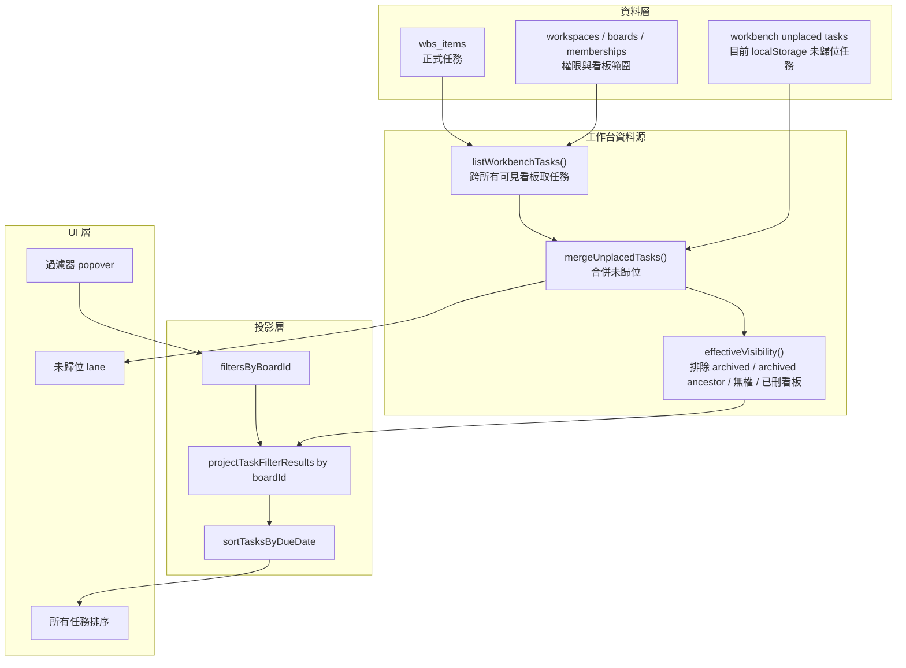

# SPEC-039: 任務過濾器核心與全域任務平台兩欄篩選重構

關聯 DEV：DEV-039、DEV-090
關聯開發點：DEV-027D 心智圖日期顯示與既有過濾器串接、DEV-028 四模式任務操作契約、DEV-036 Trello-like Workspace Governance
狀態：Phase 1/1A Implemented + Local Automated QC Passed / Phase 1B Implemented + Local Automated QC Passed / Phase 1C Implemented + Local Automated QC Passed / Phase 2 Cross-Board Source Slice Implemented + Local Automated QC Passed / Phase 2A Drag Trigger Parity Implemented + Local Automated QC Passed / Phase 2B Production Migration and Deploy Complete / Authenticated Smoke Pending / DEV-090 Implemented + Local Automated QA-QC Passed / Release Gate Required

2026-08-26 DEV-090 default-show-all and account-board preference addendum：使用者確認「系統預設全部顯示，不得預設過濾任何任務；過濾喜好記錄在個人帳號上」。本 addendum 刻意取代既有 `completed: false` 預設、僅以 uid 區隔的瀏覽器本機看板篩選，以及清單／心智圖逐層直接套 predicate 的行為。目標狀態是：新帳號與未設定過的看板 active filter count 為 0；所有狀態、負責人、標籤與日期條件皆不限制；使用者主動調整後才以「帳號 × 看板」保存；同一看板的看板、清單、心智圖、甘特與行事曆共用 canonical matched identities，階層模式可額外顯示 context-only ancestors。2026-08-26 已完成 RD 實作與本地自動化 QA-QC：專用 preference table migration、v4 cache／migration、獨立 filter store、version-safe repository、五模式 canonical projection、互斥可見狀態與 failure recovery 均有 source/model、實體 PostgreSQL RLS、正常 UI browser、viewport 與 regression 證據。狀態為 `Implemented / Local Automated QA-QC Passed / Release Gate Required`；未套用遠端 migration、未修改正式資料、未 deploy 或 release。
2026-08-07 account-scoped filter memory addendum：使用者要求過濾器狀態改為每個登入帳號各自記憶。本 addendum 覆寫本文中「工作台篩選只存在當次元件 state、不得保存」的舊決策，但不引入 profile、儲存按鈕、另存、複製或團隊共用設定。看板與工作台的狀態篩選、到期／逾期、負責人/協作、標籤、關鍵字、顯示設定及工作台選定看板，均以登入帳號 uid 作為 localStorage scope；既有未分帳號 key 只在首次登入時遷移給當前帳號，遷移後刪除共用 key。行事曆訂閱篩選仍由 Supabase `owner_user_id` 與 RLS 隔離，不改其資料模型。
2026-08-10 cross-device unplaced-task addendum：使用者指出同一帳號手機與電腦的「未歸位」任務不一致，並確認「請執行」。本 addendum 覆寫本文中「未歸位跨裝置同步不在 scope」的舊決策：Supabase backend 的未歸位任務改存 `task_workbench_unplaced_items`，以登入帳號 `owner_id` + 任務 `id` 隔離；首次載入時將既有本機 localStorage 任務以 updatedAt 合併到雲端，成功後清除本機 staging cache。Firebase / local-test backend 保留原有本機 fallback 語意；正式 migration / deploy 已完成，authenticated two-device smoke 待補。
2026-08-04 DEV-062 addendum：狀態 filter 依 `SPEC-062` 只暴露待辦、進行中、暫緩、完成；legacy delayed／unsure 在前端收斂為待辦。「逾期」是到期日衍生條件，位於到期日區，不是第五種人工狀態。
2026-08-04 status-filter refresh addendum：使用者變更任務狀態時，任務資料與持久化仍立即更新；只有變更前後在目前篩選條件下跨越「命中／未命中」邊界時，才保留變更前的任務篩選投影並顯示待更新控制。兩個狀態都命中或都不命中時，篩選結果沒有改變，不得顯示 `更新`。影響判斷需涵蓋直接任務與此次狀態變更造成的祖先 roll-up，但 badge 只計唯一直接操作任務。工具列在確有待套用結果時，將過濾器與 `更新` 呈現為同一個複合式控制：共用外框、零間距、中間分隔線，並位於復原／重做左側；點擊 `更新` 後才以最新狀態重算所有共用任務篩選結果。若後續狀態使篩選 membership 回到既有投影，即使狀態值不完全相同，該筆也不再計數。手機只顯示更新圖示與數量，並保留完整 `aria-label`。
建立日期：2026-07-02
最新修正：
- 2026-07-03，使用者要求全域任務平台主畫面中「跟過濾器有關的功能只剩一個按鈕」：看板選擇欄位移入 `過濾器` popover 內，popover 內先選看板再調同看板過濾條件；主畫面不常駐顯示看板 select、資料來源摘要、設定路徑、全部看板/計數摘要或卡片 metadata badges。後續 UI 修正：原下方 `已歸位任務` 顯示區改名為 `所有任務排序`，內容包含已歸位任務與未歸位任務，預設依到期日由上到下排序，未設到期日者排在最下面。
- 2026-07-04，使用者確認目標架構：`所有任務排序` 必須跨所有可見看板顯示任務，不得只顯示目前看板；看板刪除任務後，該任務與其不可見後代不得殘留在 `所有任務排序`。Phase 2 RD contract 補入 `listWorkbenchTasks()`、`mergeUnplacedTasks()`、`effectiveVisibility()` 與 deletion/effective-visibility gate。
- 2026-07-04，使用者授權執行 DEV-039 Phase 2 開發；本輪完成 cross-board source / deletion effective visibility slice，未包含 visible partial/error summary UI、Supabase RPC/RLS/migration、production deploy 或正式資料修復。
- 2026-07-04 follow-up，使用者截圖回報已刪除項目仍殘留；補強 `所有任務排序` candidate gate，預設排除 `nodeType: group` 列表/容器，並將 missing-parent orphan task 視為不可見，避免刪除父層或資料正規化後的扁平投影殘留。
- 2026-07-04 HCS `#引導模式` 決策：使用者選擇 `1C`，因此列表/群組容器改為顯示設定，預設不顯示但可在工作台過濾器 popover 內切換；orphan visibility 採 `2A`，static/browser 驗證採 `3A`。
- 2026-07-04 UI follow-up，使用者要求任務台排版更密集、去除不必要元素並只保留文字資訊；任務列改為 dense text rows，移除獨立拖曳把手、大卡片與陰影，拖曳由整列承接。
- 2026-07-04 sticky title follow-up，`未歸位` 與 `所有任務排序` 是 section title，不是任務列；需用 sticky header UI 呈現，區塊捲動後仍停留在各自區塊頂端。
- 2026-07-04 chevron collapse follow-up，工作台收合狀態需與主側欄使用同類精簡 chevron affordance，rail 寬度縮小 50%，不再使用 Notebook 類大圖示按鈕；展開狀態的收合按鈕也需使用 `ChevronLeft`。
- 2026-07-04 hierarchy follow-up，使用者要求 `所有任務排序` 可看出不同 level；維持到期日排序，但每列需以縮排、字重與灰階提示階層深度。
- 2026-07-05 DEV-042 compatibility follow-up：手機版工作台收合契約由「精簡 rail」升級為 no in-flow rail / off-canvas；桌機仍保留約 24px compact rail。手機開啟工作台需透過 Sidebar / top-nav 入口進入 overlay，不得再用 in-flow collapsed rail 佔用 BoardView 寬度。
- 2026-07-07 drag trigger parity addendum：使用者指出 `已歸位任務` 與 `未歸位任務` 的拖曳觸發窗口感受不同，PM 評估後採用「未歸位任務」方式為標準；兩者都應由同一層任務列 root 承接拖曳、點擊、右鍵與手機長按，已歸位列保留 hierarchy cue 與日期資訊，但不得因內層結構造成拖曳 hit area 不一致。
- 2026-07-07 Phase 2A completed：`WorkbenchDragCard` 已收斂共用 row-root surface，補上工作台任務右鍵 `GlobalContextMenu`、未歸位 / 所有任務排序列 root hit area parity gate、DEV-028/DEV-029 回歸、TypeScript 與 `build:test`；未執行 DB/RLS/migration、production deploy 或手機新手勢。
- 2026-07-17 DEV-053 覆寫註記：使用者確認 Workbench `placed row` 不能拖。本文中 Phase 1B / Phase 2A 關於 `已歸位任務` 可拖回 `未歸位`、或已歸位 row 應共用 draggable root 的描述，已由 `SPEC-053` 覆寫；目前 placed row 是 read-only placement list entry，可保留點擊 / 右鍵 / 非 placement 操作，但不得作為 placement drag source。

> Current Supersession Note - 2026-07-17：`SPEC-053` 是 placed-row drag scope 的最新權威來源。
> `placed row 不能拖` 為 Human Confirmed 決策；DEV-039 既有 Phase 1B / Phase 2A
> 雙向拖移與 draggable parity 文字只作歷史脈絡，不得作為新 RD 驗收條件。

## Human Decision Brief - 2026-08-26 Default Show All and Account-owned Filter Preferences

文件成熟度：`Implemented / Local Automated QA-QC Passed / Human Confirmed`

決策來源：使用者回報同一「鉦富研發部」看板在看板模式只見部分任務、清單與心智圖空白；production 資料查核確認任務存在，Jed 帳號啟用的負責人條件排除朱宇鴻，而不同模式對不符合條件的父節點採用不同投影。使用者進一步確認預設全部顯示、不得預設隱藏任何任務，並要求個人帳號記憶其主動選擇的篩選喜好。

### 問題與使用者價值

- 現行預設將完成狀態關閉，未操作過篩選器也不是「全部任務」。
- 看板篩選偏好目前是瀏覽器本機 uid scope，未按看板分區，也不等於跨裝置的個人帳號偏好。
- 負責人與標籤是看板相依資料；跨看板共用同一 selected-id 集合可能把另一張看板過濾成空白。
- 看板已使用 ancestor-aware projection，但清單與心智圖直接過濾根／子節點；父節點未命中時，命中的後代無法被呈現。
- 空白狀態目前無法區分「看板真的沒有任務」與「篩選結果為 0」，造成使用者誤判資料遺失或協作未同步。

完成後，未設定條件的使用者應可靠地看到全部任務；主動篩選後，偏好只影響本人及該看板；所有任務模式對同一條件得到相同 matched task identities，階層模式仍保留理解路徑所需的最小祖先脈絡。

### 已確認產品契約

1. `createDefaultTaskFilters()` 是唯一「無篩選」定義：待辦、進行中、暫緩、完成全部開啟；到期日不限、僅逾期關閉、負責人／協作與標籤為空集合、關鍵字為空，active filter count 必須為 0。
2. `清除／重設篩選` 必須回到同一個無篩選定義，不得維護第二套 reset default。
3. 使用者未主動設定過的帳號／看板一律顯示全部任務；只有使用者主動選取條件後才縮小結果。
4. 看板內任務篩選偏好歸屬登入帳號，並按 `boardId` 分區；A 帳號、B 帳號與同帳號的不同看板不得互相污染。
5. Supabase backend 的 canonical source 是 ADR-045 定義的 `account_board_task_filter_preferences` 專用資料列；不得放入 `profiles.ui_preferences` whole-json。localStorage v4 只作精確帳號 × 看板 cache、離線 fallback 與 pending journal。
6. 同一看板的板內模式共用同一個 canonical projection：`matchedTaskIds` 代表真正符合條件、`visibleTaskIds` 代表命中任務加必要祖先、`contextOnlyContainerIds` 只供階層脈絡、`totalTaskCount` 代表看板真實任務數。
7. 階層模式使用 `visibleTaskIds`；扁平結果與統計只使用 `matchedTaskIds`。context-only ancestor 不得被計入符合結果。
8. 空白狀態分成真無資料、篩選為 0 與載入失敗；只有篩選為 0 時提供最小 `清除篩選` 恢復動作，不新增常駐教學或額外摘要面板。
9. 既有 v1～v3 偏好沒有「使用者主動設定／舊預設」來源標記；DEV-090 一次性重設舊板內與工作台 filter 條件為全部顯示，保留純顯示／panel／selected-board 設定，且不得把 legacy filter 上傳到遠端。

### 初步 Scope

- 統一無篩選 default、active count、reset 與舊偏好 migration 語意。
- 將板內任務篩選狀態收斂為帳號 × 看板 ownership，並明確區分遠端來源與本機 fallback。
- 建立單一 canonical task-filter projection consumer contract，接回看板、清單、心智圖、甘特與行事曆等實際任務模式。
- 依 `totalTaskCount` 與 `matchedTaskIds` 修正空白／無結果／錯誤的可見狀態。
- 補 migration、帳號隔離、看板隔離、跨模式 identity parity、ancestor context、RWD 與 visible-error 驗證方向。

### Out of Scope

- 不新增團隊共用篩選設定、篩選 profile、另存、複製或管理介面。
- 不改任務資料、任務 RLS、看板成員權限、Realtime 或任務指派模型。
- 不把 `created_by`／`updated_by` 稽核追溯缺口綁入 DEV-090；該議題需另案評估。
- 不在本 brief 執行 Supabase migration、production data reset、deploy 或 release。

### 主要流程與驗收方向

| 情境 | 預期結果 |
|---|---|
| 新帳號第一次進入既有看板 | 所有狀態與負責人任務皆可見，active filter count = 0。 |
| 使用者在看板 A 主動選取朱宇鴻 | 重新整理／重新登入後，看板 A 恢復該帳號偏好。 |
| 同帳號切換未設定的看板 B | 看板 B 預設全部顯示，不繼承看板 A 的負責人或標籤 ID。 |
| B 帳號登入同看板 | 不繼承 A 帳號的條件；未設定時全部顯示。 |
| 父任務不命中、後代命中 | 階層模式顯示 context-only 父層與命中後代；扁平計數只計後代。 |
| 同條件切換任務模式 | canonical `matchedTaskIds` 一致，不得出現看板有資料而清單／心智圖為空。 |
| 看板有任務但無符合結果 | 顯示「沒有符合目前篩選的任務」與單一清除動作，不得顯示「尚無任務」。 |
| 偏好讀取失敗 | 保留可用的本機 fallback 或全部顯示，顯示最小錯誤／恢復訊號，不得靜默套用其他帳號或看板的條件。 |

### 風險、停止條件與下一步

- 風險等級：Medium；涉及使用者可見空白狀態、跨模式投影、帳號偏好與 UI／cache／Supabase 跨層資料路徑。
- Spec Impact：`Intentional replacement + corrective follow-up`；本 brief 取代 `completed: false` 預設、uid-only board filter memory 與 mode-local hierarchy filtering，但不改 DEV-039 已交付的工作台 placement、Realtime 或任務權限契約。
- ADR：`ADR-045` 已 Accepted；專用帳號 × 看板資料列取代 `profiles.ui_preferences` whole-json 方案，避免 layout/filter namespace lost update。
- Implementation stop condition：若 migration/RLS 未通過 DB role matrix、scope hydration 會套用 stale response、任一模式未接 canonical projection，或 fallback 可讀到其他 scope，RD 必須停止送驗並回修。
- 下一步：RD 依下方 WP1～WP6 執行本地產品、migration file 與測試修改；QA/QC 通過後才可進入 deployment-release gate。

## DEV-090 Current Phase RD Handoff Contract

文件狀態：`Implemented / Local Automated QA-QC Passed / Release Gate Required`

風險 lane：本地實作 `Medium`；含 schema/RLS 的 release `High / Release Gate Required`。

權威決策：本節、Human Decision Brief 與 `ADR-045`。若歷史 DEV-039 文字仍寫 `completed: false`、uid-only localStorage、board filter 不跨裝置或逐模式直接 predicate，以本節為準。

Readiness conclusion：目前產品與工程決策均已收斂，無剩餘 P0/P1 文件缺口；尚未完成的是 RD 實作、QA/QC evidence 與後續 release gate，不是 readiness blocker。

### Purpose and Execution Boundary

- 目前可執行：本 repo 的 task-filter core、store、consumer、local cache、Supabase adapter/types、forward-only migration file、自動化測試與 QA/QC evidence。
- 目前不可執行：套用任何 remote migration、修改 production 資料、deploy、release、production smoke、刪除既有 preference/profile 資料。
- 完成定義：RD 實作後，必須由 QA/QC 在同一 source state 證明 default、migration、RLS、failure recovery、五模式 identity parity 與實際 UI delivery path；只有程式碼、build、API 或 DB 成功不足以完成 DEV-090。

### Current Architecture Impact

本變更影響跨模組 filter ownership、Supabase schema/RLS、local cache migration、Zustand state、五模式 hierarchy projection 與可見空白／錯誤狀態。`ADR-045` 是 Architecture Memory Source；任務資料、任務 RLS、Realtime、行事曆訂閱 snapshot、工作台 placement transaction 與 task lifecycle 不受影響。

### Repository / Module Impact

| Path | RD contract |
|---|---|
| `src/features/taskFilters/defaults.ts`、`describe.ts` | 將所有人工狀態 default 設為 true；`createDefaultTaskFilters()` 同時作 row-absence、reset、migration fallback；active count 為 0。 |
| `src/features/taskFilters/storage.ts`、`types.ts`、`index.ts` | 升級 v4；拆出純顯示設定；新增精確 account × board cache、pending upsert/delete journal、legacy reset 與 normalization。 |
| `src/utils/accountScopedStorage.ts` | 新增可驗證寫入結果與 account-board scoped key helper；migration 必須先確認新值可讀回才移除 legacy key。 |
| `src/features/taskFilters/preferenceRepository.ts`（new） | 實作 remote/local/default arbitration、scope-keyed write queue、retry、unknown-version guard 與 adapter boundary。不得依賴 React。 |
| `src/services/supabase/taskFilterPreferenceService.ts`（new） | 對專用表執行 select/upsert/delete；payload 永遠顯式帶 account/project/version/full filters；不得讀寫 `profiles.ui_preferences`。 |
| `src/store/useTaskFilterStore.ts`（new） | 擁有 active account/board、完整 `TaskFilterState`、hydrate/sync/error state 與 filter actions；以 request generation 防止快速切板 stale apply。 |
| `src/store/useBoardStore.ts`、`src/types/index.ts` | 移除板內 filter condition ownership；保留 navigation、純顯示設定與既有 display undo。 |
| `src/store/useTagStore.ts`、`src/store/useWbsStore.ts` | Tag store 只管理標籤資料；selected tag filter 移至 task-filter store。WBS deferred refresh 改讀同一 active filter。 |
| `src/App.tsx`、`src/components/MainLayout.tsx` | 帳號／active board 改變時 hydrate/clear scope；pending status refresh 改使 task-filter projection 重算，不再 patch `useBoardStore.statusFilters`。 |
| `src/components/ui/StatusFilterBar.tsx` | 所有條件與 reset 只走 task-filter store；顯示同步失敗最小 warning/toast，不新增 save/profile UI。 |
| `src/features/taskFilters/resultProjection.ts` | 保留 pure canonical projector；補 stable ordered identity helper／cycle-orphan tests。matched 與 visible 語意不得被 consumer 改寫。 |
| `src/components/BoardView.tsx`、`Wbs/WbsListView.tsx`、`Wbs/WbsNodeItem.tsx` | 一次計算 projection；root/children 以 `visibleTaskIds` 呈現，不再各自 `matchesTaskFilters()`。 |
| `src/components/MindMap/MindMapView.tsx`、`MindMap/mindMapTree.ts` | root/children 接收 projection/visible IDs；父不命中但後代命中時保留祖先脈絡。 |
| `src/utils/taskHierarchy.ts`、`src/components/GanttView.tsx`、`src/components/CalendarView.tsx` | hierarchy builder 改以 canonical `visibleTaskIds` traversal；matched IDs 不由 Gantt/Calendar 自行重算。 |
| `src/components/ui/TaskFilterResultState.tsx`（new） | 共用 task loading/error、真無資料與 filtered-zero 判斷；filtered-zero 只有單一 reset CTA。 |
| `src/services/supabase/database.types.ts` | 增加 preference row/table type；不得手寫成與 migration 不同的 nullable/default contract。 |
| `supabase/migrations/<timestamp>_dev_090_account_board_task_filter_preferences.sql`（new） | 建表、constraint/index、trigger、explicit grants、四個 RLS policies；不 backfill、不改 production。 |
| `scripts/verify-dev-090-*`、`package.json` | 新增 model/static、browser、DB/RLS gates，並修訂既有 DEV-039 verifier 的 `completed:false`／active-count=1 歷史預期。 |

### Canonical Filter and Projection Contract

`TaskFilterState` v4 正規化後必須包含：

| Field | Default / validation | Match rule |
|---|---|---|
| `statusFilters` | todo/in_progress/onhold/completed 與 legacy delayed/unsure 全為 true；缺 key 以 default 補齊 | 先用既有 manual-status normalization，再查 normalized status key |
| `dueWithinDays` | `null`；非 null clamp 為整數 0～365 | 沿用既有 due-date predicate |
| `overdueOnly` | `false` | 沿用既有 overdue predicate |
| `selectedAssigneeIds` | 去重字串陣列，預設 `[]` | assignee/collaborator 任一命中；保留 `__unassigned__` |
| `selectedTagIds` | 去重字串陣列，預設 `[]` | 任一 selected tag 命中 |
| `keyword` | trim 後字串，預設空字串 | case-insensitive title match |

- `projectTaskFilterResults(nodes, filters, { boardId })` 是唯一 identity truth。
- `boardTaskIds`／`totalTaskCount`：該看板有效可見、非 archived、無 archived/missing/cyclic ancestor 的全部 WBS identities；包含作為任務結構的 container。
- `matchedTaskIds`：`boardTaskIds` 中真正符合 predicate 的 identities；flat count、filtered-zero 判斷與 parity assertion 只用它。
- `visibleTaskIds`：matched identities 加上連回合法 root 所需的 ancestors；階層 renderer 只用它。
- `contextOnlyContainerIds`：visible 但未 matched 的 ancestors；可作視覺脈絡，不得計入 match badge/statistic。
- default filters 下 `matchedTaskIds` 必須等於 `boardTaskIds`，active count 為 0。五模式可有不同 layout，但不得有不同 matched identity。

### Persistence Schema and API Contract

`public.account_board_task_filter_preferences` migration 必須符合：

| Column / object | Contract |
|---|---|
| `account_id uuid` | not null，FK `profiles(id) on delete cascade` |
| `project_id uuid` | not null，FK `projects(id) on delete cascade` |
| `preference_version smallint` | not null，current = 4，check `> 0` |
| `filters jsonb` | not null，check `jsonb_typeof(filters) = 'object'`；client 寫完整 normalized state |
| `created_at / updated_at timestamptz` | not null default `now()`；update 使用既有 `public.touch_updated_at()` trigger |
| Primary/index | PK `(account_id, project_id)`；另建 `project_id` index 支援 FK cascade / cleanup |

Migration 必須 `enable row level security`，先明確 revoke anon/authenticated，再只 grant authenticated `select, insert, update, delete`；service_role 不得出現在 client contract。每個 operation 使用獨立 policy：

```text
own_row := account_id = (select auth.uid())
readable_project := exists projects p where p.id = project_id
                    and private.current_user_can_read_project(p.tenant_id, p.id)
SELECT/DELETE USING      own_row and readable_project
INSERT       WITH CHECK own_row and readable_project
UPDATE       USING      own_row and readable_project
             WITH CHECK own_row and readable_project
```

DB role matrix：

| Actor | Own readable project row | Other account row | Own inaccessible project row | anon |
|---|---|---|---|---|
| owner/admin/project_manager/member/viewer | CRUD allowed | denied | denied | n/a |
| unauthenticated | n/a | n/a | n/a | all denied |

No RPC、no audit event、no Realtime publication。Viewer 保存自己的 view preference 不等於取得任務寫入權限。

### Preference Repository State Machine and I/O

Store scope 為 `{ accountId, boardId, generation }`；state 至少區分 `idle | hydrating | ready | fallback` 與 `synced | pending-upsert | pending-delete | sync-error`。

1. `activateScope(accountId, boardId)`：先清除前一 scope 的 in-memory conditions；只可套用 exact-scope v4 cache，否則立即用 default-all。之後啟動 remote hydrate。
2. Remote 有 v4 row：若本機沒有 pending mutation，normalize 後套用並更新 cache；若 scope/generation 已改變，丟棄 response。
3. Remote 無 row：若本機沒有 pending mutation，清除該 scope cache 並套用 default-all；不得把舊 v3 或其他 board cache 當 preference。
4. Remote read 失敗／table 未部署：使用 exact-scope cache；無 cache 時 default-all。顯示一次非阻斷 warning「篩選偏好無法同步，已使用此裝置設定」；不得顯示別的 scope 或假裝已同步。
5. 使用者 change：先 normalize、立即更新 UI 與 v4 cache，再以 `(accountId, boardId)` queue/coalesce 完整 upsert。快速連點最終只要求最後 normalized state 落盤。
6. 使用者 reset：立即套用 default、寫 `pending-delete` journal，再刪除 remote row；成功後移除 cache/journal。不得 upsert 一列冗餘 default。
7. Remote write/delete 失敗：保留 pending journal 與本機結果，採 bounded retry（當次短退避，之後於 focus／reload／re-enter board 重試）；顯示「篩選偏好未同步，已保留在此裝置」。不得 rollback 使用者目前可見篩選。
8. Account logout/switch：立即清除 active in-memory state與 generation；舊帳號尚未送出的 remote job 不得在新 auth session 執行，pending journal 留給舊帳號下次登入重試。
9. 同帳號同看板跨裝置同時修改：不做欄位 merge；最後成功 commit 的完整 object 是下次 hydrate 結果。同時開啟 session 不要求即時變更。
10. 遠端 `preference_version > 4`：不得由舊 client 覆寫；以 default/cache fallback 與 upgrade warning fail safe。`< 4` 不應存在於新表；若出現同樣不自動上傳。
11. Assignee/tag options 成功載入後才清理不存在的 selected IDs；loading/error 期間不得因暫時空 option list 清掉偏好。清理後走正常 persist path。
12. Filter undo/redo 必須捕捉 exact account/board scope並走同一 repository；切換帳號或看板時先清空既有 undo/redo stack，再 activate 新 scope，禁止舊 scope command 寫入目前看板。

### Legacy Local Migration v1 → v4

- Board legacy candidates：`projed-filters`、`projed-task-filters:v1`、`projed-task-filters:v2:account:<uid>`；因 payload 沒有可靠 board ownership，filter conditions 全部丟棄且不得上傳。
- `displaySettings` 先搬到新的 account-scoped display key；新值寫入並 readback 成功後才移除 legacy payload。失敗時不寫 migration marker，下一次可安全重試。
- Workbench `projed-task-workbench-filters:v1/v2`：保留合法 `selectedBoardId`，將 `filtersByBoardId` 重設為 `{}`，寫 version 4；panel open/width/show-container 類偏好不變。
- migration marker 必須 account-scoped、idempotent；private mode/localStorage quota failure 時可重跑，不得造成非 default filter 回流。
- DB migration 只建空表，無 server backfill、無 production data reset；現有 `profiles.ui_preferences` 原封不動。

### Cross-mode Consumer Matrix

| Mode | Source | Renderer gate | Prohibited implementation |
|---|---|---|---|
| 看板 | active v4 filter + canonical projection | root/card/checklist 使用 `visibleTaskIds` | parent 自行 predicate 後整支截斷 |
| 清單 | 同上 | root 與 recursive child 使用同一 projection | `WbsListView`／`WbsNodeItem` 各自 `matchesTaskFilters()` |
| 心智圖 | 同上 | root/child tree builder 使用 `visibleTaskIds` | `mindMapTree` 逐層直接 predicate |
| 甘特 | 同上 | hierarchy builder traversal 使用 `visibleTaskIds` | `buildHierarchicalTaskItems` 遇到 parent 不 match 就 return |
| 行事曆 | 同上 | 與甘特共用 hierarchy result | Calendar 再做另一套 filter |

Mode-specific layout eligibility 不得反向改寫 filter truth：Calendar grid只為有有效日期的 matched task 建 segment，Gantt只為有日期的 matched task 建 bar，但兩者的 SharedTaskSidebar／canonical source仍保留全部 matched identities。`有 matched task、但目前時間視覺化沒有可排程項目` 不是 true empty或filtered zero，必須沿用/提供模式內的日期提示，不得宣稱任務不存在。

行事曆「訂閱建立器／ICS snapshot」不是板內行事曆模式，仍依 DEV-045 的 per-board snapshot，不受本表 active preference 即時覆寫。

### UI Entry Contract and Observable States

- Target actor：任何已登入且可讀 active board 的角色；viewer 也可操作自己的 filter。
- 正常入口：登入 → Workspace/Board → 看板／清單／心智圖／甘特／行事曆任一板內模式 → 上方既有 `過濾器` control。不得以 direct URL 或 dev-only control 作唯一入口。
- 主要流程：進入看板時 hydrate 該帳號 × 看板；點 filter 條件立即更新目前模式；切模式保留同一 active state；reload/relogin/re-enter board 從 canonical row 恢復；`清除／重設` 回到全部顯示。
- 不新增 profile/save/copy/manage UI。偏好自動保存；remote failure 只用既有 toast/最小 warning，不增加常駐設定面板。
- Desktop 五模式均需驗證；mobile 依既有產品政策只驗證可達的 Board filter，390×844 不得 overflow、遮住 CTA 或讓 warning 佔滿主畫面。

共用可見狀態的優先序：

| State | Condition | Observable result |
|---|---|---|
| Task loading | WBS load in progress | 沿用模式 loading；不得先宣稱空資料 |
| Task load failed | WBS `error` | 顯示可見錯誤與既有 retry/reload path；不得用 preference fallback 掩蓋 |
| True empty | `totalTaskCount = 0` | 顯示「此看板尚無任務」；有 create 權限時可保留既有新增 CTA |
| Filtered zero | `totalTaskCount > 0 && matchedTaskIds.size = 0` | 顯示「沒有符合目前篩選的任務」＋單一「清除篩選」；不得顯示尚無任務 |
| Results | `matchedTaskIds.size > 0` | 依 mode 呈現 matched + 必要 context ancestors |
| Preference sync failed | task data 正常、preference remote 失敗 | 照 cache/default 顯示資料並出現非阻斷 warning；不得變成空白或假成功 |

Fail condition：入口不存在、active count 在 default 不是 0、切 mode 改變 matched IDs、父不命中使後代消失、A/B 帳號或 board A/B 互相污染、remote failure 靜默套用別的 scope、畫面有 alert/4xx/5xx/不合理空白，均視為未通過。

### RD Work Packages

1. WP1 Default/migration：更新 default、normalizer、v4 storage 與 legacy reset；先補會失敗的 model/static tests。
2. WP2 Persistence：建立 ADR-045 migration file、database types、Supabase adapter與 pure preference repository；完成 local DB role matrix。
3. WP3 State ownership：新增 task-filter store，搬移 Board/Tag filter condition/actions，接 App scope hydration、undo/deferred refresh與 failure toast。
4. WP4 Canonical consumers：依 consumer matrix改 Board/List/MindMap/Gantt/Calendar；刪除 mode-local predicate wiring。
5. WP5 Visible states：接 shared loading/error/true-empty/filtered-zero component，保持最小 UI 與既有 mode layout。
6. WP6 Verification：新增 DEV-090 scripts、修訂 DEV-039 歷史預期，執行 source/model/DB/browser/regression/viewport gates並移交 QC。

### Final Acceptance Criteria

- [ ] 新帳號、新看板、legacy migrated 帳號在沒有 v4 row 時，全部任務可見且 active count = 0。
- [ ] 使用者主動設定後，只恢復本人同看板偏好；同帳號另一看板與另一帳號同看板維持獨立。
- [ ] Reload、relogin 或重新進入看板可從 Supabase row 恢復；Firebase/local-test 只宣稱 exact-scope local fallback。
- [ ] Reset 刪除 remote row；下次 hydrate 仍為 default-all。
- [ ] v1～v3 filter 不上傳且全部 reset；display／panel／selectedBoardId 按契約保留。
- [ ] 五模式對同 fixture 的 `matchedTaskIds` 完全一致；階層模式只額外呈現 context ancestors。
- [ ] parent 不 match、grandchild match；missing parent、archived ancestor、cycle、status deferred refresh 均符合 canonical projection。
- [ ] 真無資料、filtered zero、task load failed、preference sync failed 四種 observable state 不混淆。
- [ ] 快速切板／切帳號／連續切 filter 不會套用 stale response 或把舊帳號 job 用新 session 寫出。
- [ ] RLS role matrix、explicit grants、FK cascade、version/JSON constraints 通過；other-account 與 inaccessible-project paths 均 denied。
- [ ] 1440×900 五模式與 390×844 可達 Board UI 無 visible error、水平 overflow、重疊或 CTA 裁切。

### Verification Integrity Matrix

| Acceptance / risk | Normal delivery path | Fixture boundary | Forbidden shortcut | Fail condition | Required evidence |
|---|---|---|---|---|---|
| Default truly shows all | 正常登入並從 sidebar 進入有 todo/in-progress/onhold/completed 的看板 | 可 seed 四狀態與階層任務；不得先寫 filter row | 只 assert `completed:true` source | UI 少任一狀態、count 非 0 | UI 截圖＋task IDs＋active count＋model result |
| Account/board persistence | UI 在 A/board-1 選 assignee，reload/relogin，再切 board-2 與 B account | 可預建帳號、membership、tasks；偏好必須由 UI 操作產生 | 直接 DB insert 預期 preference 後宣稱 UI save 成功 | 任一 scope 污染或 reload 不恢復 | 操作錄、DB readback、A/B與board1/2畫面 |
| Five-mode parity | 從同看板 mode switcher 逐一切五模式 | 可 seed parent-miss/child-match fixture | 只呼叫 projector 或 direct URL 單模式 | 任一 mode matched ID 不同或 descendant 消失 | 每模式 route/viewport/DOM task IDs＋projection snapshot |
| Filtered-zero recovery | UI 選擇不命中條件後按「清除篩選」 | 可 seed有資料但不命中的 assignee | 直接清 localStorage 或 store set default | 文案誤為無任務、CTA 不可達、reset 後仍空 | 操作前後截圖＋row delete/readback |
| RLS isolation | authenticated client 以 owner/viewer/other account 執行 CRUD | 可 seed project membership與 preference parent data | service-role 或 postgres 成功取代 authenticated proof | other account可讀寫、無權 project可寫、anon有 grant | local/TEST DB role matrix與 row counts |
| Failure recovery | 正常 UI 觸發 remote read/write failure injection | 可攔 preference request；不得攔 task data後當同案例 | 只證明 success API 或 console warning | 跨 scope fallback、假 synced、使用者資料畫面空白 | visible warning、local journal、retry後 DB readback |
| Visible error/RWD | 正常 entry 在 1440×900、390×844 操作 filter/mode | 代表性長名稱、階層與多任務資料 | build/lint 取代畫面 | alert、4xx/5xx、zero critical data、overflow/overlap | screenshot、console/pageerror/network sweep |

### QA/QC Gates and Evidence

RD 必須新增並由 `package.json` 註冊等價 gate：

```powershell
npm.cmd run verify:dev-090-task-filter-contract
npm.cmd run verify:dev-090-task-filter-projection
npm.cmd run verify:dev-090-task-filter-db
npm.cmd run verify:dev-090-task-filter-browser
npm.cmd run verify:dev-039-task-filter-core
npm.cmd run verify:dev-039-filter-result-parity
npm.cmd run verify:dev-027d-mindmap-date-display-filter
npm.cmd exec tsc -- --noEmit
npm.cmd run build:test
```

- `QA-DEV-090` 在 QC 前凍結；若實作改變 schema、scope、fallback 或 mode consumer，先記錄 drift 並更新本節／ADR／QA，再重跑受影響案例。
- QC evidence 必須記錄 source revision 或 dirty boundary、build artifact、base URL、role/account、workspace/board、fixture source、route/mode、viewport、時間、實際命令與結果。
- Browser gate 必須從正常入口逐 mode 操作，並做 visible error sweep；direct URL、static source、projector unit test、DB row 或 RD 自述都不能單獨取代 UI evidence。
- DB gate 至少涵蓋 owner/viewer own-row CRUD、same-project other-account deny、inaccessible-project deny、anon deny、reset delete、project/profile cascade；service-role 只可建立 fixture，不可作 acceptance actor。
- 任一必要案例失敗為 QC `未通過`；缺 Supabase authenticated/RLS 或 UI evidence為 `未充分驗證`，DEV 保持驗證中。

### Stop Conditions and Release Feasibility Note

- RD stop：發現 active board ID 在 Supabase 不是可安全映射的 project UUID、migration 與 generated type 不一致、RLS 需要放寬到跨帳號、v4 migration 無法保留 display settings、或任何 consumer 無法使用 canonical projection，停止並更新 contract，不以 localStorage/global filter workaround 繞過。
- QA/QC stop：正常入口不可達、資料 fixture 非預期空白、visible error、DB role matrix失敗、scope stale apply、或證據 provenance 不完整，不得標完成。
- Release feasibility：新增 forward-only table、trigger、grants與 policies，無 backfill；client具 table-missing fallback，但不構成可跳過 migration 的 release 理由。正式環境必須由 deployment-release gate 決定 target、backup、migration ordering、deploy、smoke 與 release evidence；本文件不產生其可執行指令。

### Deferred Scope Audit

- Team-shared filter presets／save-copy-manage UI：`Future Phase Captured / Not Requested`；若使用者要求共用或治理才重進產品決策與新 DEV。
- 同 session 即時跨裝置同步：`Future Phase Captured / Not Requested`；若要求即時收斂，再評估 Broadcast/Realtime、衝突 UX與負載，不得在 DEV-090 偷加。
- 工作台 filter cloud persistence：`Future Phase Captured / Not Requested`；目前只重設 legacy default並保留獨立 active state，若要求跨裝置再擴充 ADR/schema。
- Production migration/deploy/data repair：`Release Gate Required`；不阻塞本地 RD 開始，但未完成正式 gate 前不得宣稱 Released。

## 背景

使用者指出 ProJED 有多處「過濾器 / 篩選器」，並追問全域任務平台截圖中的 `篩選器 / 調整篩選` 是否與既有看板上方 `過濾器` 共用。

第一性原理結論：

- 共用的是任務條件語意：狀態、到期日、負責人、標籤、關鍵字。
- 不共用單一 active state：看板內任務視圖與全域任務平台的使用情境不同。
- 顯示設定不是過濾條件：開始日期、標籤顯示、依賴線不得污染 active filter count。
- 全域任務平台的核心定位是 BoardView 左側跨看板拖拉中繼站，不是獨立整頁。

## 最新產品決策

全域任務平台篩選改成最小直覺模型：

1. 主畫面只保留一顆 `過濾器` 按鈕，不常駐顯示看板 select。
2. 點開 `過濾器` popover 後，第一段選擇正在設定哪一個看板。
3. Popover 內接同看板任務過濾條件，內容與看板裡的任務過濾器使用同一套條件語意；使用者一個看板一個看板設定。
4. 不提供設定檔、儲存、另存、複製到其他看板、全域 profile、看板專屬 profile。
5. 不提供 `目前工作區`、`目前看板` 作為來源範圍選項。
6. 不提供 `待歸位 / 已歸位` 作為任務狀態 filter、來源範圍 filter 或預設排除條件。
7. 必須補回 `未歸位` 與 `已歸位看板` 兩個位置區；它們是拖拉定位 lane，不是過濾器。
8. `未歸類任務 / 未歸位任務` 必須與 `已歸位任務` 使用同一套任務卡功能契約，僅位置不同；不得降級成只能新增/顯示的簡化收件匣。
9. 任務必須可藉由拖移在 `未歸位` 與 `已歸位看板` 間移動。
10. 原先正式環境發布相關開發文件與 gate 必須排在 Phase 1C 驗證通過之後。
11. 同一個看板、同一組任務篩選條件下，看板與全域任務平台的「符合條件任務 identity」必須一致；看板可額外顯示祖先欄位 / 卡片作為路徑容器，但不得因此把不符合條件的容器算成符合結果。
12. 全域任務平台 popover 內的看板 selector 只代表「正在設定哪個看板的過濾器」；第二欄任務清單是跨看板全部已載入任務彙總，依每筆任務所屬看板套用該看板自己的 filter state。
13. 全域任務平台的過濾器控制必須像看板上方過濾器一樣是單一按鈕 + overlay；看板 selector 不得與過濾器按鈕並列常駐在主畫面。
14. 下方顯示區名稱為 `所有任務排序`，不是 `已歸位任務`；清單必須合併未歸位任務與符合各看板 filter 的已歸位任務。
15. `所有任務排序` 預設依到期日由早到晚排序；沒有到期日或日期無效的任務排在最下面。
16. `所有任務排序` 預設只列出 task-like 節點；列表/群組容器必須由 `列表 / 群組` 顯示設定切換後才可出現。
17. 若任務的 `parentId` 指向不存在且不是合法 root / board root parent，該 orphan 不得出現在看板投影或 `所有任務排序`，且不得被容器顯示設定放行。
18. 任務台清單必須採密集文字列；不得回復成大卡片、獨立拖曳圖示、日期 chip 或陰影式卡片堆疊。
19. `所有任務排序` 是扁平排序清單，但必須保留 hierarchy cue：L1 無縮排，子層依 parent chain 增加縮排並降低視覺權重。
20. DEV-042 生效後，手機版全域任務平台 closed state 不再保留 in-flow collapsed rail；桌機版才保留 compact rail。手機 workbench open state 是 overlay，不推擠 BoardView。
21. 工作台任務列的拖曳觸發窗口需一致化：未歸位任務與所有任務排序中的已歸位任務都以任務列 root 作為整列拖曳 surface；實作以未歸位任務的簡潔 row shell 為標準，並保留已歸位任務的縮排、字重/灰階與日期徽章。
22. 任務狀態變更只有在直接任務或此次 roll-up 祖先的目前 filter membership 確實改變時，才建立待更新投影；資料照常即時儲存，filter projection 暫以變更前狀態計算，直到工具列 `更新` 被點擊。若變更前後皆命中或皆不命中目前篩選，篩選結果不變，更新區必須保持隱藏；後續變更使 membership 回到既有投影時也要取消待更新。有待更新項目時，過濾器與更新區必須共用外框並以內部分隔線形成複合控制，不能看成兩顆不相關按鈕。badge 計算唯一直接變更任務，不重複計算祖先 roll-up。

設計原因：

- `看板 -> 過濾器` 是使用者最容易理解的因果順序。
- 避免「設定檔歸屬」和「資料來源範圍」混淆。
- 全域任務平台是跨看板移動入口；使用者在第一欄選看板時，是在選「我要調哪個看板的過濾器」，不是把第二欄清單限縮成單一看板。
- 取消儲存與複製，降低操作成本與維護風險。
- 未歸位 / 已歸位是任務定位狀態的操作結果，不是查詢條件；把它們放進過濾器會讓使用者誤以為只是顯示/隱藏，而不是移動任務位置。
- 未歸位任務與已歸位任務功能等價，使用者才會把工作台理解為跨看板整理工具，而不是另一個不完整 inbox。

## Human Decision Brief - 2026-07-02 Placement Lanes

使用者最新決策：

- `未歸位` 與 `已歸位看板` 必須存在於全域任務平台，但語意是 placement lanes。
- 兩個 lane 不得回流成篩選器、來源範圍或任務狀態 filter。
- 任務可拖移在 `未歸位` 與 `已歸位看板` 間移動。
- 未歸類任務的功能與已歸位任務一模一樣，僅位置不同。
- 正式環境發布順序必須排在此功能補回與 QC 之後。

已取消或不可採用：

- 把未歸類任務只做成 `InboxItem` 新增與顯示。
- 把 `待歸位 / 已歸位` 作為 filter panel 內的狀態條件。
- 以「簡化 scope」名義讓未歸位卡片缺少詳情、拖拉、狀態、負責人、標籤或與已歸位任務不同的操作能力。

## Human Decision Brief - 2026-07-02 Filter Result Parity

決策來源：使用者指出全域任務平台篩選器與看板裡的篩選器，在相同條件下篩出不同結果，要求先分析差別，再制定開發文件，且本輪不改代碼。

確認事實：

- 兩邊目前都使用 `matchesTaskFilters` 或同一套 `TaskFilterState` 語意，差異不是主要 predicate 本身。
- 看板畫布是階層式投影：Level 1 是欄位、Level 2 是卡片、Level 3+ 是卡片內待辦；目前每層各自套 filter，若父層不符合，符合條件的子任務可能被整段藏掉。
- 全域任務平台是跨看板扁平式投影：清單取目前已載入的全部已歸位 `TaskNode`，依每筆 task 的 `boardId` 套用該看板 filter state，因此會列出各看板符合條件的任務 identity。
- 負責人選項來源目前也不同：看板上方 filter 主要來自 board members；全域任務平台混合 workspace members、board members 與實際任務 assignee。

產品決策：

- canonical truth 是「符合條件的任務 identity 集合」，不是某一個 UI 目前渲染出來的容器集合。
- 看板視圖可顯示不符合 filter 的父層欄位 / 卡片，但只能作為 context container，不能算入符合結果。
- 全域任務平台的已歸位看板 lane 應列出 canonical matched task identities，並可顯示任務所在路徑；它不需要顯示 context-only ancestor。
- 同一個看板、同一組 status / due / assignee / tag / keyword 條件，在看板與全域任務平台中得到的 matched task IDs 必須一致。
- Filter option source 也需對齊到同一個 selected board context；不得因工作台混入 unrelated workspace members 而讓使用者以為兩邊條件相同但實際 assignee id 不同。

AI assumptions：

- Phase 1C 不新增儲存、profile、同步、schema、RLS 或 production deploy。
- Phase 1C 不改變任務階層資料模型；只補 result projection / hierarchy visibility contract。
- 若實作中發現現有資料缺少穩定 parent path 或 board membership metadata，RD 應停止並回報需擴 scope，不得自行做 migration。

## Human Decision Brief - 2026-07-04 Cross-Board Source + Effective Visibility

決策來源：使用者以截圖指出 `所有任務排序` 目前不應只顯示現在看板，且任務在看板刪除後仍殘留在 `所有任務排序`；使用者確認目標系統架構以資料層、工作台資料源、投影層與 UI 層分層。

已確認產品決策：

- `所有任務排序` 的目標語意是跨所有可見看板顯示任務，而不是目前 active board 或 filter popover 選中的看板。
- `過濾器` popover 裡的看板 selector 仍只代表「正在設定哪個看板的 filter state」，不得被解讀成任務來源範圍。
- 看板刪除任務後，該任務不得留在 `所有任務排序`；若刪除的是父層/list/card，其在看板上已不可見的 descendant 也不得因扁平投影而殘留。
- `未歸位 lane` 仍顯示未歸位任務；`所有任務排序` 可合併未歸位與已歸位任務，但必須清楚套用相同 effective-visibility 規則。
- Phase 2 目標架構包含 `listWorkbenchTasks()`、`mergeUnplacedTasks()`、`projectTaskFilterResults by boardId`、`sortTasksByDueDate`，並新增 `effectiveVisibility()` 作為投影前 gate。

已拒絕或不可採用：

- 只把 active board 的 `nodes` 改名為「所有任務」。
- 只靠 UI filter 隱藏已刪任務，而不修正 source / visibility contract。
- 只處理被刪除節點本身，不處理 archived ancestor、已刪看板、無權看板或 orphan descendant。

AI assumptions：

- 使用者 2026-08-10 明確授權本輪補上 Supabase 未歸位任務帳號同步；正式環境 migration 與 production deploy 已由 release gate 完成，既有帳號正式資料修復未執行，authenticated two-device smoke 待補。
- 若現有 Supabase / Firestore API 沒有可安全取得全部可見任務的查詢，RD 應建立 service adapter；若需要 DB migration / RLS 變更，必須先停下取得授權。本輪使用既有 `supabaseNodeService.listByProject()`，未新增 SQL/RPC/RLS。
- `unplaced tasks` 的 legacy fallback 仍使用本機 localStorage；Supabase backend 由 Phase 2B 提供帳號歸屬與跨裝置同步，Firebase / local-test backend 暫保留本機語意。

## Human Decision Brief - 2026-07-07 Workbench Drag Trigger Surface Parity

決策來源：使用者指出 `已歸位任務` 與 `未歸位任務` 的拖曳觸發窗口不同，希望改成一致，並以 `未歸位任務` 的方式為主；PM 先做可行性評估後判定適合。

已確認產品決策：

- 工作台中所有任務列都應符合「整列可拖」的心智模型；使用者不需要分辨未歸位列與所有任務排序列哪一段可以拖。
- `未歸位任務` 的簡潔 row shell 是本 addendum 的基準：同一層 root 承接 `useDraggable` bindings、touch handlers、left click details 與 context menu。
- `所有任務排序` 仍保留 hierarchy indentation、title visual weight 與 workbench date badge；一致化的是 drag start surface，不是把所有任務排序視覺降級成完全相同的一行純文字。
- 手機長按仍走既有 `MobileTaskActionContext` / compact action rail，不把桌機 drag parity 改成手機新手勢。
- 右鍵選單仍使用既有 `GlobalContextMenu` 的 `task` variant，不新增工作台專用 menu UI。

已拒絕或不可採用：

- 不新增獨立拖曳把手；先前已取消大卡片與獨立拖曳圖示。
- 不修改全域 `useDragSensors()` 的 `distance: 8` / touch delay 設定；目前差異來自 row DOM / hit area，不是 sensor。
- 不移除 `所有任務排序` 的 hierarchy cue 或日期資訊來達成一致。
- 不改 `GlobalContextMenu`、任務資料模型、DB schema、RLS、migration、production deploy 或未歸位跨裝置同步。

AI assumptions：

- 若未來 `TaskDateBadge` 在工作台變成可點擊控制項，RD 必須把它標為 primary action target 或等效互動控制，避免點擊日期被拖曳搶走；本 addendum 不把日期徽章改成互動控制。
- 目前可接受整個 row 包含縮排空白區皆為拖曳觸發範圍，因為這符合「整列可拖」的工作台模式。

## End-State Architecture

- `src/features/taskFilters` 是任務條件的 canonical core。
- 看板上方過濾器與全域任務平台共用 filter 型別、預設值、predicate、summary。
- 看板上方過濾器維持既有 board task view storage adapter。
- 全域任務平台不使用 profile storage；每個看板的篩選條件存在元件 state，使用者在當次工作流程中逐看板調整；清單本身跨看板彙總顯示。
- 全域任務平台使用 `TaskWorkbenchItem` 或等效 view model 表達兩種位置：`unplaced` 與 `placed-board`。
- 未歸位任務可沿用既有 `InboxItem` / `useQuickCaptureStore` 作為輸入來源，但呈現到工作台前必須正規化成與已歸位任務等價的 task card contract；若資料不足以支援等價功能，RD 必須停止並補資料模型或轉換契約，不得交付簡化卡片。
- 全域任務平台桌面嵌在 BoardView 左側；手機預設收合成 rail，點開後以 overlay 顯示。
- 全域任務平台卡片在 `未歸位` 與 `已歸位看板` 兩區都保留拖拉定位、點擊開詳情、可辨識狀態/負責人/日期/標籤與既有任務操作契約。
- `matchesTaskFilters` 只判斷單一 task 是否符合條件；跨層級 UI 必須再透過 hierarchy projection 產生 `matchedTaskIds` 與 `visibleContainerIds`。
- 看板視圖的 hierarchy projection 必須保留 matched task 的祖先欄位 / 卡片作為 context，避免符合條件的子任務被父層 filter 擋掉。
- 全域任務平台的已歸位任務 lane 必須跨看板列出各看板 canonical `matchedTaskIds`，不得把 context-only ancestors 當成 filter result；若需要路徑，顯示 workspace / board / ancestor path metadata。
- Phase 1 資料來源為目前已載入任務集合；Phase 2 cross-board source slice 已升級為依 visible board list 逐 board 載入任務。
- Phase 2 後，全域任務平台資料來源由 `src/features/taskWorkbench/source.ts` 的 `listWorkbenchTasks()` 或等效 service 提供，不得再依賴 active board sync side effect。
- Phase 2 的 source pipeline 為：`listWorkbenchTasks()` 依目前可見 board list 逐 board 取已歸位任務；`mergeUnplacedTasks()` 合併未歸位任務；`isTaskEffectivelyVisible()` 排除 archived task 與 archived ancestor；`projectTaskFilterResults()` 依每筆任務所屬 board 套用對應 filter；`sortTasksByDueDate()` 產生 `所有任務排序`。無權 board / 已刪看板透過 `boardOptions` 範圍排除；RPC/RLS/DB role matrix 屬未授權 follow-up。
- `effectiveVisibility()` 是 source truth gate，不是 UI 裝飾；任何任務若在看板上因刪除或權限不可見，就不得只因扁平排序清單而重新出現。


```mermaid
flowchart TD
  subgraph Data["資料層"]
    A["wbs_items<br/>正式任務"]
    B["workspaces / boards / memberships<br/>權限與看板範圍"]
    C["workbench unplaced tasks<br/>目前 localStorage 未歸位任務"]
  end

  subgraph Source["工作台資料源"]
    D["listWorkbenchTasks()<br/>跨所有可見看板取任務"]
    E["mergeUnplacedTasks()<br/>合併未歸位"]
    X["effectiveVisibility()<br/>排除 archived / archived ancestor / 無權 / 已刪看板"]
  end

  subgraph Projection["投影層"]
    F["filtersByBoardId"]
    G["projectTaskFilterResults by boardId"]
    H["sortTasksByDueDate"]
  end

  subgraph UI["UI 層"]
    I["未歸位 lane"]
    J["所有任務排序"]
    K["過濾器 popover"]
  end

  A --> D
  B --> D
  C --> E
  D --> E
  E --> X
  X --> G
  F --> G
  G --> H
  H --> J
  E --> I
  K --> F
```

## Module Contract

`src/features/taskFilters`：

- `TaskFilterState`
- `TaskDisplaySettings`
- `createDefaultTaskFilters`
- `createDefaultTaskDisplaySettings`
- `matchesTaskFilters`
- `describeTaskFilters`
- `countActiveTaskFilters`
- board task filter storage adapter

全域任務平台不得匯入或重新新增：

- `TaskWorkbenchFilterProfile`
- `createDefaultTaskWorkbenchProfile`
- `TASK_WORKBENCH_FILTER_PROFILES_STORAGE_KEY`
- `readTaskWorkbenchProfiles`
- `writeTaskWorkbenchProfiles`
- `writeTaskWorkbenchActiveProfileId`

## Task Workbench UI Contract

桌面主要結構：

```text
全域任務平台
未歸位（sticky section header）
[新增未歸位任務 input] [+]
未歸位任務列表（精簡一行；與已歸位任務卡片同核心操作）

[過濾器 button]
  popover:
    [看板 select：設定哪個看板的過濾器]
    [同看板過濾條件]

所有任務排序（sticky section header）
任務列表（跨看板彙總；每筆任務依所屬看板 filter state 顯示，可拖拉；Phase 1/1C 以目前已載入任務集合為來源，Phase 2 需升級為全部可見看板任務來源；卡片不顯示路徑/狀態/負責人/標籤 badges）
```

拖曳觸發 surface 契約：

- `data-task-workbench-unplaced-task-card="true"` 與 `data-task-workbench-all-task-card="true"` 都必須是承接 `ref={setNodeRef}`、`draggableBindings`、touch handlers、left click details 與 `onContextMenu` 的任務列 root。
- 兩者必須使用同一個 row shell 或等效 helper，讓可拖曳觸發窗口以整列 root 為準；不得只在 title text、日期 badge 或內層 flex child 上啟動拖曳。
- 未歸位列與所有任務排序列可有不同內容密度、縮排或日期徽章，但 root hit area 的互動語意必須一致。

必備 selectors：

- `data-task-workbench-panel="true"`
- `data-task-workbench-filter-toggle="true"`
- `data-task-workbench-filter-popover="true"`
- `data-task-workbench-filter-panel="true"`
- `data-task-workbench-board-select="true"`（只在 filter popover 內出現）
- `data-task-workbench-task-card="true"`
- `data-task-workbench-unclassified-section="true"`
- `data-task-workbench-unclassified-input="true"`
- `data-task-workbench-unclassified-add="true"`
- `data-task-workbench-unclassified-list="true"`
- `data-task-workbench-unclassified-item="true"`
- `data-task-workbench-section-header="unplaced|all-tasks"`
- `data-task-workbench-collapsed-toggle="true"`
- `data-task-workbench-collapsed-count="true"`
- `data-task-workbench-collapse-toggle="true"`
- `data-task-workbench-unplaced-lane="true"`
- `data-task-workbench-placed-board-lane="true"`
- `data-task-workbench-unplaced-task-card="true"`
- `data-task-workbench-placed-task-card="true"`
- `data-task-workbench-lane-drop-target="unplaced|placed-board"`

禁止 selectors / 文案：

- `data-task-workbench-profile-*`
- `設定檔`
- `儲存`
- `另存`
- `複製到`
- `全域`
- `看板專屬`
- `data-task-workbench-source-summary="true"`
- `data-task-workbench-filter-summary="true"`
- `data-task-workbench-selected-board="true"`
- `資料來源：目前已載入任務集合`
- `清單跨看板顯示`
- `設定：`
- `全部看板`
- `拖到所選看板`

## Phase Roadmap

| Phase | 狀態 | 目的 | 主要輸出 |
|---|---|---|---|
| Phase 0 | Done | PM / Architecture Alignment | 盤點現有 filter、確認共用核心與不共用 active state |
| Phase 1 | Implemented / Local Automated QC Passed | Shared Filter Core + Two-Column Workbench Filter | `taskFilters` core、五視圖一致性、BoardView 左側工作台、兩欄看板/過濾器、無 profile/storage |
| Phase 1A | Implemented / Historical QC Passed | Workbench Unclassified Add/Display Restore | 先前補回未歸類新增/顯示；已被 Phase 1B 新需求覆蓋為等價任務卡契約 |
| Phase 1B | Implemented / Local Automated QC Passed | Workbench Placement Lanes Restore | 補回未歸位 / 已歸位看板 lane、雙向拖移、未歸位任務與已歸位任務功能等價 |
| Phase 1C | Implemented / Local Automated QC Passed | Filter Result Parity | 對齊看板階層式篩選與全域任務平台扁平篩選；同條件 matched task IDs 一致，父層容器只作 context |
| Phase 2 | Cross-Board Source Slice Implemented / Local Automated QC Passed | Workbench Data Source Truth | cross-board task source、scoped store merge、deletion effective visibility；visible partial/error summary / DB-RLS-RPC follow-up 仍未授權 |
| Phase 2A | Implemented / Local Automated QC Passed | Workbench Drag Trigger Surface Parity | 未歸位任務與所有任務排序列使用一致 row root drag surface，保留 left click details、right click menu、mobile long press、hierarchy cue 與日期資訊 |
| Phase 3 | Deferred / Not Authorized | Filter Section Componentization | 將重複的狀態、到期日、負責人、標籤、關鍵字 UI section 元件化；不新增儲存功能 |
| Phase 4 | Deferred / Not Authorized | Legacy Cleanup Guardrails | 移除 profile 遺留文件/測試/keys、補防回流 gate；不做 profile sync/governance |

## Phase 1 / 1A RD Contract（已完成歷史範圍）

Scope：

- 建立 `src/features/taskFilters` 共用核心。
- 讓 list、board、gantt、calendar、mindmap 透過同一個 predicate 套用任務條件。
- 將顯示設定與過濾條件拆開。
- 將全域任務平台恢復為 BoardView 左側 panel，移除獨立 route。
- 全域任務平台篩選 UI 只保留兩欄：看板、過濾器。
- 全域任務平台每個看板可有不同當次篩選 state，但不得提供保存、複製或 profile 管理。
- 全域任務平台先前加回未歸類任務新增與顯示區塊，資料來源為 existing local-first `InboxItem` store；Phase 1B 已升級為與已歸位任務等價的 lane/task contract。

Acceptance：

- active filter count 只計算真正過濾條件。
- 五個任務視圖對狀態、到期日、負責人、標籤、關鍵字的結果一致。
- 全域任務平台不出現 `目前工作區`、`目前看板` 來源範圍。
- 全域任務平台不出現 `待歸位 / 已歸位` 作為 filter、來源範圍或預設排除條件；Phase 1B 已以 placement lane 形式補回。
- 全域任務平台不出現任何 profile/save/copy UI。
- 選擇看板 A 或看板 B 時，只切換正在編輯的看板 filter state；已歸位任務清單仍跨看板顯示目前已載入任務。
- 過濾器只改變目前選擇看板的 filter state；清單中其他看板任務依各自看板 state 保持顯示或隱藏。
- 未歸類任務區塊不受看板 selector 或過濾器影響。
- 新增未歸類任務後立即出現在工作台，重新整理後仍可見。
- 全域任務平台仍可拖拉卡片到目前看板定位。
- 390px mobile viewport 下，工作台不擠出看板卡片，不出現水平 overflow。

Evidence：

```powershell
npm.cmd run verify:dev-039-task-filter-core
npm.cmd run verify:dev-039-task-filter-core-browser
npm.cmd run verify:dev-027d-mindmap-date-display-filter
npm.cmd run verify:dev-027d-mindmap-date-display-filter-browser
npm.cmd run verify:dev-028-cross-mode-task-interactions
npm.cmd run verify:dev-028-cross-mode-task-interactions-browser
npm.cmd exec tsc -- --noEmit
npm.cmd run build
```

## Phase 1B RD Contract

Purpose：補回全域任務平台原本的跨看板拖拉整理能力，讓使用者能在左側工作台內把任務從未歸位移到已歸位看板，也能從已歸位看板移回未歸位。

Scope：

- 在全域任務平台中明確呈現兩個位置區：`未歸位` 與 `已歸位看板`。
- `未歸位` 不是過濾器；它是尚未放入某看板位置的任務 lane。
- `已歸位任務` 是跨看板任務 lane；第一欄目前選擇看板只決定正在編輯哪個看板的過濾器，以及拖入 lane 時要歸位到哪個看板。
- 未歸位任務與已歸位任務共用同一套 task card interaction contract：點擊開詳情、拖拉、狀態/日期/負責人/標籤顯示、既有任務操作入口與可辨識 task identity。
- 新增未歸位任務後，該任務必須立即以同功能任務卡出現在未歸位 lane。
- 拖移 `未歸位 -> 已歸位看板` 時，系統需將任務放入目前選擇看板並保留任務內容；成功後不得同時留在未歸位 lane 形成重複。
- 拖移 `已歸位看板 -> 未歸位` 時，系統需移除該看板定位但保留任務 identity 與內容；成功後不得仍顯示在已歸位看板 lane。
- 若現有 `InboxItem` 無法支援與 `TaskNode` 等價功能，RD 應建立正規化 / promote contract 或停止回報需要資料模型授權，不得交付簡化版未歸位卡片。

Out of scope：

- 不新增設定檔、儲存、另存、複製、全域/看板專屬 profile。
- 不把 `未歸位 / 已歸位` 放進 filter panel。
- 不新增 production deploy、remote migration、資料修復或資料刪除。
- 不把全域任務平台改成獨立整頁。

Acceptance：

- 第一眼可看出左側工作台有 `未歸位` 與 `已歸位看板` 兩個位置區。
- 工作台仍只有兩欄篩選控制：看板、過濾器。
- 未歸位任務卡與已歸位任務卡可執行同樣核心任務操作；兩者差別只在 lane 位置。
- 未歸位任務可拖到已歸位看板，並出現在目前選擇看板的已歸位 lane。
- 已歸位看板任務可拖回未歸位 lane，並從該看板 lane 移除。
- 拖移後任務 title、status、date、assignee、tags、notes 或可用詳情資訊不遺失。
- 看板 selector / 過濾器不會隱藏或誤改未歸位 lane；過濾器只作用於該看板任務在跨看板已歸位 lane 的顯示。
- 390px mobile viewport 下，兩個 lane 可理解、可操作，不擠出看板卡片，不出現水平 overflow。

Evidence：

```powershell
npm.cmd run verify:dev-039-task-workbench-placement-lanes
npm.cmd run verify:dev-039-task-workbench-placement-lanes-browser
npm.cmd run verify:dev-039-task-filter-core
npm.cmd run verify:dev-039-task-filter-core-browser
npm.cmd run verify:dev-028-cross-mode-task-interactions
npm.cmd run verify:dev-028-cross-mode-task-interactions-browser
npm.cmd exec tsc -- --noEmit
npm.cmd run build
```

Stop conditions：

- 若未歸位任務卡缺少已歸位任務卡具備的核心操作能力，停止。
- 若拖移只改前端顯示、不更新任務定位資料來源，停止。
- 若拖移後形成同一任務在兩個 lane 重複存在，停止。
- 若 `未歸位 / 已歸位` 被實作成 filter 條件或預設排除條件，停止。
- 若要做 production release，必須先完成 Phase 1B QC，再另走 deployment-release-gate。

## Phase 1C RD Contract

Purpose：修正看板階層式篩選與全域任務平台扁平篩選在同條件下結果不一致，讓兩邊以相同的 matched task identity 作為產品真相。

Scope：

- 建立 filter result projection helper，例如 `src/features/taskFilters/resultProjection.ts` 或等效模組；不得改成每個視圖自行判斷。
- 對 selected board / current loaded nodes 計算：
  - `matchedTaskIds`：未封存且 `matchesTaskFilters(task, filters)` 為 true 的任務 identity。
  - `visibleContainerIds`：看板階層 UI 為了顯示 matched task 必須保留的祖先欄位 / 卡片。
  - `contextOnlyContainerIds`：只因子孫符合條件而顯示、但本身不算符合結果的容器。
- 看板視圖、`KanbanColumn`、`KanbanChecklist` 或等效層級 renderer 必須使用同一個 projection，讓子任務符合條件時祖先 context 可見。
- 全域任務平台 `已歸位任務` lane 必須依任務所屬看板使用該看板同一組 `matchedTaskIds`，只列真正符合條件的任務；如需理解位置，顯示 workspace / board / ancestor path metadata。
- 對齊 selected board 的負責人 filter option source：看板上方 filter 與全域任務平台 filter 都應使用同一 selected board context，可包含 board members 與該看板任務實際 assignee；不得混入 unrelated workspace-only member 造成條件表面相同但 id 不同。
- 顯示設定仍不得進入 active filter count，也不得影響 `matchedTaskIds`。

Out of scope：

- 不新增設定檔、儲存、另存、複製、全域/看板專屬 profile。
- 不新增 DB schema、RLS、migration、Supabase RPC、production deploy 或遠端資料修復。
- 不把看板階層 UI 改成扁平清單；只補階層顯示投影契約。
- 不做 Phase 2 的全部可見任務資料來源；Phase 1C 仍以目前已載入 task nodes 為資料集合。
- 不改任務主資料 identity、parent/child 資料模型或 WBS 層級規則。

Acceptance：

- 同一 selected board、同一組 status / due / assignee / tag / keyword filter 下，看板與全域任務平台得到的 `matchedTaskIds` 完全一致。
- 若子任務符合 filter、父層欄位 / 卡片不符合 filter，看板仍顯示父層作為 context，並顯示符合條件的子任務。
- 不符合 filter 且沒有符合子孫的 sibling task / card 不顯示。
- 全域任務平台 `已歸位任務` lane 不列出 context-only ancestor，只跨看板列出各看板 `matchedTaskIds`；必要時以 path metadata 補充位置。
- 看板與全域任務平台的負責人選項來源對齊，同一 label/id 條件不會產生不同查詢結果。
- Phase 1 / 1B 已通過的 two-column、placement lanes、no profile/save/copy、mobile viewport、drag parity gates 不得回歸。

Evidence：

```powershell
npm.cmd run verify:dev-039-filter-result-parity
npm.cmd run verify:dev-039-filter-result-parity-browser
npm.cmd run verify:dev-039-task-filter-core
npm.cmd run verify:dev-039-task-filter-core-browser
npm.cmd run verify:dev-039-task-workbench-placement-lanes
npm.cmd run verify:dev-039-task-workbench-placement-lanes-browser
npm.cmd run verify:dev-028-cross-mode-task-interactions
npm.cmd run verify:dev-028-cross-mode-task-interactions-browser
npm.cmd exec tsc -- --noEmit
npm.cmd run build
```

Phase 1C QC evidence（2026-07-02）：

- `npm.cmd run verify:dev-039-filter-result-parity`，25/25 passed。
- `npm.cmd run verify:dev-039-filter-result-parity-browser` passed。
- `npm.cmd run verify:dev-039-task-filter-core`，60/60 passed。
- `npm.cmd run verify:dev-039-task-filter-core-browser` passed。
- `npm.cmd run verify:dev-039-task-workbench-placement-lanes`，19/19 passed。
- `npm.cmd run verify:dev-039-task-workbench-placement-lanes-browser` passed。
- `npm.cmd run verify:dev-028-cross-mode-task-interactions`，35/35 passed。
- `npm.cmd run verify:dev-028-cross-mode-task-interactions-browser` passed。
- `npm.cmd exec tsc -- --noEmit` passed。
- `npm.cmd run build` passed。

Stop conditions：

- 若現有 task store 無法穩定區分 matched task、context-only ancestor 與 hidden sibling，停止並回報需要資料契約修正。
- 若需要新增 schema、migration、RLS 或遠端 query 才能達成結果一致，停止；該範圍改排 Phase 2 或另行授權。
- 若實作使看板階層關係、拖拉定位或未歸位 / 已歸位 placement lane 行為改變，停止。
- 若只修全域任務平台或只修看板，導致另一側仍使用不同結果來源，停止。
- 若同條件下 `matchedTaskIds` 不一致，Phase 1C 不得通過 QC。

## Phase 2 RD Contract

Document status：Cross-Board Source Slice Implemented / Local Automated QC Passed / Partial-Error UI + DB Changes Not Authorized

Purpose：讓全域任務平台的資料來源從「目前已載入任務集合」升級為真實可驗證的「全部可見任務」，並修正刪除後在 `所有任務排序` 殘留的有效可見性缺口。

Implemented scope（2026-07-04 slice）：

- 建立 `src/features/taskWorkbench/source.ts`，提供 `listWorkbenchTasks()` 與 `mergeUnplacedTasks()`。
- 建立 backend-neutral `nodeService.listByProject()`，接到 local-test、Firestore 與既有 `supabaseNodeService.listByProject()`。
- `TaskWorkbenchPanel` 以所有可見 `boardOptions` 載入 task source；`過濾器` popover selected board 不改 source scope。
- `useWbsStore.setNodes()` 支援 `scopeBoardIds` / `preserveOutOfScope`，active board sync 不再覆蓋 cross-board source。
- `projectTaskFilterResults()` 新增 `isTaskEffectivelyVisible()`，在 matching 前排除 archived task 與 archived ancestor descendant。
- local-test browser verifier 覆蓋 active board A/B 切換、A/B 任務同時出現在 `所有任務排序`、跨看板到期日排序、archived task / archived ancestor descendant 排除、刪除後 reload 不復活。

Full Phase 2 contract scope（items not listed above remain follow-up / not authorized in this slice）：

- 建立 `TaskWorkbenchTaskSource` 或等效 service contract，不得讓 `TaskWorkbenchPanel` 直接依賴 active board sync side effect。
- 建立 `listWorkbenchTasks()` 或等效 API/service：以 membership/RLS 或等效權限模型列出使用者可見 workspace/board 內的未封存任務。
- 建立 `mergeUnplacedTasks()` 或等效 adapter：將目前 localStorage 未歸位任務併入工作台 view model，但不宣稱已跨裝置同步。
- 建立 `effectiveVisibility()` 或等效 helper，在投影前排除：
  - `task.isArchived === true`。
  - 任一 ancestor `isArchived === true`。
  - 所屬 board / workspace 已刪除、不可見或使用者無權。
  - parent chain 斷裂且無法判斷是否應可見的 orphan task；此情況需進入 partial/error summary，不得靜默列入。
- 產生 `TaskWorkbenchTaskView` 或等效 view model，至少包含 `taskId`、`workspaceId`、`boardId`、workspace title、board title、ancestor path、placement、status、dates、assignee、tags、updatedAt、source status。
- `filtersByBoardId` 繼續表示「每個看板自己的 filter state」；`projectTaskFilterResults` 必須以每筆任務所屬 board 套用對應 filter。
- `所有任務排序` 必須由 `effectiveVisibility()` 後的任務集合產生，依到期日由早到晚排序，無效或未設定到期日排最後。
- 支援 loading、partial result、retry、error summary；當部分 board 查詢失敗時，UI 必須能標示結果不完整，不得假裝全部已載入。本輪只在 source 層保留 failed board cache 並 console warn，尚未實作可見 partial/error summary UI。
- UI 的 completeness/error summary 必須與資料層能力一致；不得回流成 Phase 1 已取消的常駐資料來源摘要或設定路徑。只有 visible summary follow-up 通過 QA/QC 後，才能宣稱完整 partial-state UX 已完成。

Implementation contract：

- Supabase backend：
  - 本輪優先使用現有 `supabaseNodeService` / `projedService` 建立 cross-board list adapter；若 RLS 無法以 client-side multi-project reads 安全證明，改設計 RPC，但需另行授權 migration/RLS。
  - RPC 若被採用，必須由 authenticated user context 與 membership/RLS 限制 tenant/project，不得接受任意 user id 作為信任來源。
  - Query result 必須只回傳未封存且使用者可見 board 的任務；若 DB 只能取 project-by-project，service 必須逐 board 聚合並回傳 partial status。
- Firebase backend：
  - 以 workspace/board membership 能力列舉可見 board，再逐 board 讀取 nodes；不得只讀 active board path。
  - Firestore partial failure 必須回傳 failed board list 或 error summary。
- Local-test backend：
  - 必須支援 2+ boards fixture，驗證 active board 切換不會改變 `所有任務排序` 的完整集合。
- Store / state：
  - 不得用 `setNodes(activeBoardNodes)` 覆蓋 cross-board workbench source；若仍共用 `useWbsStore.nodes`，必須有明確 merge / ownership boundary，避免 active board snapshot 把其他 board 任務清掉。
  - 建議將工作台 source 與 active board renderer source 分離，或在 store 內標示 source scope，避免看板切換造成工作台資料收縮。
- Deletion / archive：
  - 看板右鍵刪除、心智圖刪除、回收桶復原/永久刪除與工作台排序清單必須共用相同 effective-visibility 語意。
  - 若產品語意是刪除父層時 descendants 一併不可見，RD 必須在 archive helper 或 visibility projection 中落實；不得只修單一 UI。
  - Undo/redo 復原父層後，符合權限與 filter 的 descendants 可重新出現在工作台。

Out of scope：

- 不新增 profile 儲存。
- 未歸位任務不升級成正式 `wbs_items`；跨裝置同步由 Phase 2B 處理。
- 不納入私人 InboxItem、外部 calendar-only task、已封存任務或無權 board 任務。
- 不執行 production deploy、remote migration、資料修復、資料刪除或 RLS 變更，除非使用者明確授權。
- 不新增 profile/save/copy/sync UI。
- 不改變 `過濾器` popover 的產品語意；看板 selector 仍只代表正在設定哪個看板的 filter。

Acceptance：

- 在同一 workspace 內建立至少 2 個可見 boards，active board 停留在 A 時，`所有任務排序` 同時顯示 A 與 B 中符合各自 filter 的任務。
- 切換 active board 後，`所有任務排序` 的 cross-board 集合不得收縮成新 active board。
- Filter popover 切換 selected board 只改該 board 的 filter state，不改任務來源範圍。
- 在看板刪除任務後，該 task id 立即從 `所有任務排序` 消失；reload / resubscribe 後不得復活。
- 刪除父層/list/card 後，其在看板上已不可見的 descendant 不得因工作台扁平投影而留在 `所有任務排序`。
- 復原任務或父層後，符合權限與 filter 的任務可重新出現在工作台。
- 使用者無權的 board/task 不得出現在 service result、store、UI、console debug dump 或 test fixture expected output。
- 若某 board 查詢失敗，UI 顯示 partial/error summary，且不得宣稱目前清單完整。此項是 follow-up gate，本輪尚未交付 visible summary。
- 未歸位任務仍出現在未歸位 lane；若也出現在 `所有任務排序`，必須只有一筆同 identity，不得與已歸位版本重複。
- Phase 1 / 1B / 1C 已通過的 no profile/save/copy、placement lanes、matchedTaskIds parity、mobile viewport、drag parity 不得回歸。

QA / QC gate：

```powershell
npm.cmd run verify:dev-039-task-workbench-cross-board-source
npm.cmd run verify:dev-039-task-workbench-cross-board-source-browser
npm.cmd run verify:dev-039-filter-result-parity
npm.cmd run verify:dev-039-task-workbench-placement-lanes
npm.cmd run verify:dev-039-task-filter-core
npm.cmd run verify:dev-028-cross-mode-task-interactions
npm.cmd exec tsc -- --noEmit
npm.cmd run build
```

If Supabase RPC / RLS / migration is introduced, required additional gate：

```powershell
npm.cmd run verify:supabase:static
```

並補 owner/admin/member/viewer/anon DB role matrix evidence。

Stop conditions：

- Query 只能列 active board、assigned-to-me、local cached tasks 或部分看板，卻宣稱全部可見任務。
- 無法證明 membership/RLS 不外洩無權 board/task。
- 需要新增或修改 Supabase migration/RLS/RPC、production deploy、正式資料修復或資料刪除，但尚未取得明確授權。
- `setNodes(activeBoardNodes)` 或等效流程仍會覆蓋 cross-board workbench source，導致切換看板後工作台資料縮水。
- 刪除父層後 descendants 仍可在 `所有任務排序` 出現，或 undo/redo 造成重複。
- partial failure 被靜默吞掉，UI 仍宣稱清單完整。現況：source 層會保留未成功 board 的既有快取並 warn；可見 summary 尚未交付，不得宣稱該 UX 完成。
- 修正 Phase 2 時回流 profile/save/copy/sync UI。

Phase 2 remote / DB / visible partial-error UX follow-up 仍需使用者或 PM 明確授權。

## Phase 2A RD Contract - Workbench Drag Trigger Surface Parity

Document status：Implemented / Local Automated QC Passed / Release Not Authorized

Purpose：統一工作台中 `未歸位任務` 與 `所有任務排序` 任務列的拖曳觸發窗口，讓使用者在同一個全域任務平台內只需要記住「整列可拖」這一種互動方式。

Scope：

- 修改 `src/components/TaskWorkbenchPanel.tsx` 的 `WorkbenchDragCard`。
- 以未歸位任務列的 root row 模式為基準，讓未歸位列與所有任務排序列共用同一套 row shell 或等效 helper。
- `ref={setNodeRef}`、`draggableBindings`、`workbenchTouchHandlers`、left click details、`onContextMenu` 都掛在任務列 root。
- `data-task-workbench-unplaced-task-card="true"` 與 `data-task-workbench-all-task-card="true"` 都代表同一層可量測、可拖曳的 root surface。
- 已歸位列保留 `hierarchyDepth` padding / text weight / gray scale 與 `TaskDateBadge`；只收斂拖曳 root surface，不移除既有資訊。
- 繼續沿用 `useBoardStore.setContextMenuState` 的 `task` variant；右鍵與左鍵拖曳不互相破壞。
- 手機 coarse pointer 仍由 `mobileActionMode` 停用 dnd-kit draggable bindings，並交給既有 long-press action rail；本 phase 不新增手機手勢。

Out of scope：

- 不修改 `src/hooks/useDragSensors.ts` 的 sensor activation constraint。
- 不新增拖曳把手、工作台專用 context menu、第二套 action rail 或新 icon。
- 不改 `GlobalContextMenu`、`MobileTaskActionLayer`、`TaskDateBadge` 的功能語意。
- 不改資料模型、`TaskNode` schema、localStorage unplaced storage、Supabase / Firestore service、RLS、migration、RPC 或 production deploy。
- 不處理 visible partial/error summary UI、未歸位跨裝置同步或正式資料修復。

Implementation contract：

- 優先抽出共享 className / props builder 或小型 `renderWorkbenchTaskRow` helper，避免兩個分支 drift；若不抽 helper，也必須讓兩個 root 的 draggable/touch/click/context-menu binding 明確一致。
- 保持 `isTaskPrimaryActionTarget(event.target)` 防誤開詳情；若新增任何互動子元素，必須列入 primary action target 或以等效方式防止拖曳/點擊衝突。
- 不得讓 `TaskDateBadge` 或內層 flex child 成為唯一可拖曳區；從 row 左側縮排區、title 區與右側空白/日期附近都應能以相同 sensor distance 啟動拖曳。
- 保留既有 `data-touch-tap-guard`、`data-mobile-drop-target`、`data-task-id` 與 placement selectors。
- 若 `isDragging` 視覺狀態改為 shared row shell，兩種 row 必須都有等效拖曳中 opacity / background feedback。

Acceptance：

- 在桌機 viewport，未歸位任務與所有任務排序中的已歸位任務都可從 row root 的左側、title 中段、右側非互動空白啟動拖曳。
- 兩種任務列的 click-to-details 行為仍相同，且拖曳後不得誤開 `TaskDetailsModal`。
- 兩種任務列右鍵都開啟同一套 `GlobalContextMenu` 任務選單，且 `Escape` 可關閉。
- 手機 viewport 中長按任務仍進入既有 compact action rail；短 tap / touch tap guard / mobile pan-first 不回歸。
- `所有任務排序` 的 hierarchy indentation、到期日排序、日期 badge 與 text hierarchy cue 不因 row shell 收斂而消失。
- DEV-039 Phase 1B/1C/2、DEV-028 cross-mode task interactions、DEV-029 mobile pan-first gates 不回歸。

Implementation summary（2026-07-07）：

- `WorkbenchDragCard` 新增 `renderWorkbenchTaskRow` helper，未歸位 row 與所有任務排序 row 共用同一層 root 承接 `setNodeRef`、`draggableBindings`、touch handlers、left click details 與 `onContextMenu`。
- 工作台任務列右鍵沿用 `useBoardStore.setContextMenuState({ kind: 'task' ... })`，不新增第二套 menu UI，也不改 `GlobalContextMenu`。
- 所有任務排序 row 保留 `hierarchyDepth` padding、文字層級、`TaskDateBadge` 與 placement selectors；未歸位 row 保留 compact dense row。
- 手機 coarse pointer 下仍由 `mobileActionMode` 停用 dnd-kit draggable bindings，長按仍走 DEV-029 compact action rail。

QA / QC gate：

```powershell
npm.cmd run verify:dev-039-task-workbench-placement-lanes
npm.cmd run verify:dev-039-task-workbench-placement-lanes-browser
npm.cmd run verify:dev-039-task-workbench-cross-board-source
npm.cmd run verify:dev-028-cross-mode-task-interactions
npm.cmd run verify:dev-028-cross-mode-task-interactions-browser
npm.cmd run verify:dev-029-mobile-pan-first-interactions
npm.cmd run verify:dev-029-mobile-pan-first-interactions-browser
npm.cmd exec tsc -- --noEmit
npm.cmd run build:test
```

Evidence required：

- Static gate 證明兩種 task row root 都掛 `setNodeRef`、`draggableBindings`、touch handlers、`onContextMenu`，且未新增 `data-task-drag-handle` 或工作台專用 menu UI。
- Browser gate 需真實操作：以 15% / 50% / 85% 三個 horizontal sample points 驗證未歸位 row 與所有任務排序 row 都命中同一個 row-root drag surface；實際 placement behavior 由同一 browser flow 的未歸位 -> 已歸位、已歸位 -> 未歸位雙向拖曳覆蓋，且 drag end 後沒有誤開詳情。
- Browser gate 需確認左鍵開詳情、右鍵選單、`Escape` 關閉選單、mobile long press action rail 與 desktop no-horizontal-overflow。

Stop conditions：

- 若只能透過調整 sensor distance 達成一致，而不是 row surface 收斂，停止並回報設計不符合本 addendum。
- 若所有任務排序列為了收斂 hit area 而失去 hierarchy cue、日期資訊或到期日排序，停止。
- 若右鍵、左鍵詳情、手機長按、touch tap guard、mobile pan-first 任一主要互動回歸，停止。
- 若需要資料模型、DB/RLS/migration、production deploy 或正式資料修復才能完成，停止並回到人類授權。

## Deferred Scope Audit

| Deferred / Out-of-scope item | Classification | Tracking target | Required resume condition |
|---|---|---|---|
| 真正全部可見任務資料來源 | Same Spec Phase | Phase 2 | Cross-board frontend/service adapter slice 已完成；若需 RPC/RLS/migration 另取授權 |
| `所有任務排序` 刪除後殘留 / archived ancestor visibility | Same Spec Phase | Phase 2 | Cross-board/deletion slice 已完成；若需資料修復另走 Blocked Human Re-entry |
| 未歸位 / 已歸位看板 placement lanes | Same Spec Phase | Phase 1B | 已補回並通過本機自動化 QC；後續改動仍須維持 production release 前 QC 規則 |
| 看板階層式篩選與全域任務平台扁平篩選結果一致性 | Same Spec Phase | Phase 1C | 已實作並通過本機自動化 QC；production release gate 仍需使用者明確部署授權 |
| 未歸位 / 已歸位任務拖曳觸發窗口一致化 | Same Spec Phase | Phase 2A | 已完成產品碼、static/browser verifier 與本機自動化 QC；production release 仍需另行授權 |
| Supabase RPC / RLS / DB role matrix | Same Spec Phase | Phase 2 | Phase 2 授權且需要遠端資料層 |
| Filter UI section 元件化 | Same Spec Phase | Phase 3 | 兩欄工作台穩定後，RD 判定重複 UI 已造成維護成本 |
| Profile / 設定檔 / 儲存 / 複製 / 同步 | Cancelled for DEV-039 | No active target | 使用者已明確取消；若未來重啟需新增 DEV 並重新決策 |
| Calendar subscription filters | New DEV | DEV-037 | 依 DEV-037 source-scope contract 處理 |
| Production deploy / remote migration / data repair | Production deploy and migration complete / data repair blocked | deployment-release-gate / Supabase gate | 使用者已明確授權並完成 production 與 DB operation；資料修復仍需另行授權 |

## Phase 2B：未歸位任務帳號同步

Document status：Production Migration and Deploy Complete / Authenticated Two-Device Smoke Pending

Purpose：讓同一登入帳號在手機、電腦與不同瀏覽器看到一致的「未歸位」任務，同時保留既有 localStorage 的離線與 migration fallback。

Implemented scope：

- 新增 `task_workbench_unplaced_items` migration：帳號 owner、TaskNode JSON payload、排序、updated_at、RLS policies 與 authenticated grants。
- 新增 Supabase service，提供 list / upsert / delete；RLS 只允許 `auth.uid() = owner_id`。
- 首次載入合併 legacy global localStorage 與帳號 scoped local cache；以 updatedAt 選較新的資料，所有 remote upsert 成功後清除本機 staging cache。
- 未歸位新增、修改、刪除與移入已歸位看板都同步更新 Supabase；遠端失敗時保留本機 fallback，避免使用者當下資料消失。
- Supabase backend 不再由全域未分帳號 localStorage 直接併入 store，避免不同帳號在同一瀏覽器互相看到資料。

Release evidence：

- Production Supabase project `knodlkxqpcqyrtgwpdst` 已套用 `20260715143000` 與 `20260810093403`；remote readback 確認 table、RLS、4 policies、authenticated/service_role grants 與 migration history。
- Release commit：`963befe171e3f393cde0c41ecf5d9591ebf8f239`；Firebase Hosting production：`https://projed-cc78d.web.app`；Level 4 app-shell 與 artifact provenance smoke 通過，production bundle 為 `assets/index-DiYPWj3V.js` / `assets/index-CwBhkroa.css`。
- Authenticated two-device smoke 尚待使用者登入正式站後補做；自動化環境沒有 production OAuth 測試帳號。

Out of scope：

- 既有帳號正式資料修復與即時 Realtime 推播；兩者需另行執行對應 gate。
- Firebase backend 與 local-test backend 的跨裝置同步；兩者維持各自既有資料後端契約。

Acceptance：

- 同一 Supabase 帳號在裝置 A 建立未歸位任務，裝置 B 重新整理後能看到同一任務。
- 裝置 B 修改、刪除或將任務移入已歸位看板後，裝置 A 重新整理後結果一致。
- 不同 Supabase 帳號不能讀取彼此的未歸位資料；RLS policy 與 Data API grants 可被 SQL readback 證明。
- migration 失敗或遠端 table 尚未套用時，既有本機任務仍保留，不得被清空。

## All-Phase Coverage Matrix

| Phase | Authorization | Document status | Scope | Out of scope | Entry condition | Acceptance | Evidence |
|---|---|---|---|---|---|---|---|
| Phase 0 | Done | Done | 盤點 filter、第一性原理拆解、HCS 決策 | 不實作產品程式 | 使用者要求釐清全域任務平台與既有過濾器關係 | 共用核心、不共用 active state 的邊界清楚 | SPEC / QA / PM 文件 |
| Phase 1 | Authorized | Implemented / Local Automated QC Passed | shared core、五視圖一致性、兩欄工作台、BoardView 左側拖拉 | profile/storage/copy/sync、獨立 route、source scope filter | Phase 0 決策完成且使用者授權 RD | Phase 1 acceptance 全通 | DEV-039 static/browser、DEV-027D/DEV-028 regression、TS、build |
| Phase 1A | Authorized | Implemented / Historical QC Passed | 未歸類新增/顯示初版 | 功能等價拖移、雙 lane 定位 | 使用者要求加回未歸類任務新增/顯示 | 初版新增/顯示可用 | DEV-039 static/browser historical evidence |
| Phase 1B | Authorized | Implemented / Local Automated QC Passed | 未歸位 / 已歸位看板 placement lanes、雙向拖移、任務卡功能等價 | profile/storage/copy/sync、production release、DB migration unless separately authorized | 使用者修正未歸位 / 已歸位為 placement lanes 並授權補回 | 未歸位與已歸位任務同功能且可雙向拖移 | placement lane static/browser、DEV-028 regression、TS、build |
| Phase 1C | Authorized | Implemented / Local Automated QC Passed | filter result projection、matchedTaskIds 一致、context-only ancestors、負責人選項來源對齊 | profile/storage/sync、schema/RLS/migration、Phase 2 全部可見任務資料來源、production deploy | 使用者指出看板與工作台同 filter 結果不一致並授權 Phase 1C RD | 同看板同條件下看板與工作台 `matchedTaskIds` 一致 | parity static/browser、Phase 1/1B regression、TS、build |
| Production Release Gate | Human Authorized / Level 4 Passed | Production release evidence recorded | 正式環境發布、production smoke、artifact provenance | 未授權部署或跳過 deployment-release-gate；authenticated feature smoke 若無安全測試帳號則保留 manual pending | Phase 1C QC passed + 使用者明確 deployment authorization | 正式站 smoke 通過且保留 rollback reference；特定功能需補 authenticated smoke | deployment-release-gate、release commit `963befe` |
| Phase 2 | Frontend/local slice Authorized | Cross-Board Source Slice Implemented / Local Automated QC Passed | `listWorkbenchTasks()`、`mergeUnplacedTasks()`、`isTaskEffectivelyVisible()`、cross-board task source、scoped store merge、刪除後不殘留 | profile storage、未歸位跨裝置同步（由 Phase 2B 覆寫）、visible partial/error summary UI、production migration/deploy/data repair、RPC/RLS | 使用者授權 Phase 2 RD；若需 RPC/RLS/migration 則另取授權 | active board A/B 時仍顯示所有可見 board 任務；刪除 task/archived ancestor 後不在 `所有任務排序` 殘留；selected board 不改 source scope | cross-board static/browser verifier、parity/placement regression、TS、build:test；DB role matrix if RPC/RLS changed |
| Phase 2A | Authorized / Complete | Implemented / Local Automated QC Passed | 統一未歸位任務與所有任務排序列的 row root drag surface | sensor 調整、拖曳把手、資料模型、DB/RLS/migration、production deploy、手機新手勢 | 使用者確認以未歸位任務方式為主，且要求寫成開發文件、QA 計畫並完成 RD | 兩種 row 都共用 row-root drag surface；左鍵詳情、右鍵選單、手機長按與 hierarchy cue 不回歸 | Phase 2A static/browser drag-surface gate、DEV-028/029/039 regression、TS、build:test |
| Phase 2B | Authorized by user / Production Migration and Deploy Complete | Supabase account-owned unplaced persistence deployed / Authenticated Smoke Pending | 未歸位任務 Supabase table、RLS、首次 local migration、跨裝置 CRUD contract | Realtime、Firebase/local-test cross-device sync；authenticated smoke 需安全測試帳號或使用者人工補測 | 使用者 2026-08-10 確認「請執行」；migration、service、fallback、acceptance、release gate 已具備 | 同帳號跨裝置一致、跨帳號隔離、migration 失敗不遺失 local staging | migration history/readback、RLS table/policy/grant readback、TypeScript、build、Level 4 artifact smoke；authenticated two-device smoke pending |
| Phase 3 | Not Authorized | RD Contract Ready / Not Authorized | filter section componentization | 儲存功能、profile governance | Phase 2 或工作台 UI 穩定後，RD 判定重複 UI 已造成維護成本 | UI 重複減少且行為不變 | static/browser regression |
| Phase 4 | Not Authorized | RD Contract Ready / Not Authorized | profile 遺留清理與防回流 gate | profile sync/governance | 發現舊 profile 概念、keys、文件或測試造成回流風險 | 舊 profile 概念不再回流 DEV-039 | static guard、docs audit |

## Stop Conditions

- 若全域任務平台被改回獨立整頁 route，停止。
- 若全域任務平台新增 profile/save/copy UI，停止。
- 若全域任務平台篩選條件寫入 workbench profile localStorage，停止。
- 若 Phase 1 UI 宣稱 `全部可見任務`，但資料層只能提供目前已載入任務，停止。
- 若 Phase 2 source 仍只依賴 active board sync 或 `useWbsStore.nodes` 的目前載入集合，停止。
- 若刪除父層後 descendant 仍出現在 `所有任務排序`，停止。
- 若五視圖沒有共用 predicate，停止。
- 若未歸位任務被實作成比已歸位任務功能更少的簡化收件匣，停止。
- 若未歸位任務與所有任務排序任務的 drag start surface 再次分裂，或只靠修改 dnd sensor threshold 掩蓋 row hit area 不一致，停止。
- 若同看板同條件下看板與全域任務平台的 `matchedTaskIds` 不一致，停止。
- 若正式環境發布被排在 Phase 1C QC 之前，停止。

## Assignment Filter Addendum - 2026-08-06

Board 與 Workbench 的 assignee filter label 統一為「負責人/協作」，filter match identity 使用 `assigneeIds ∪ collaboratorIds`；「未指派」仍依沒有 primary assignee 判定。選項來源需從 selected board 的 active tasks 同時收集主責與協作，避免協作人只存在於資料卻無法被 UI 選取。這項語意由 DEV-048 filter follow-up browser QC 驗證。
