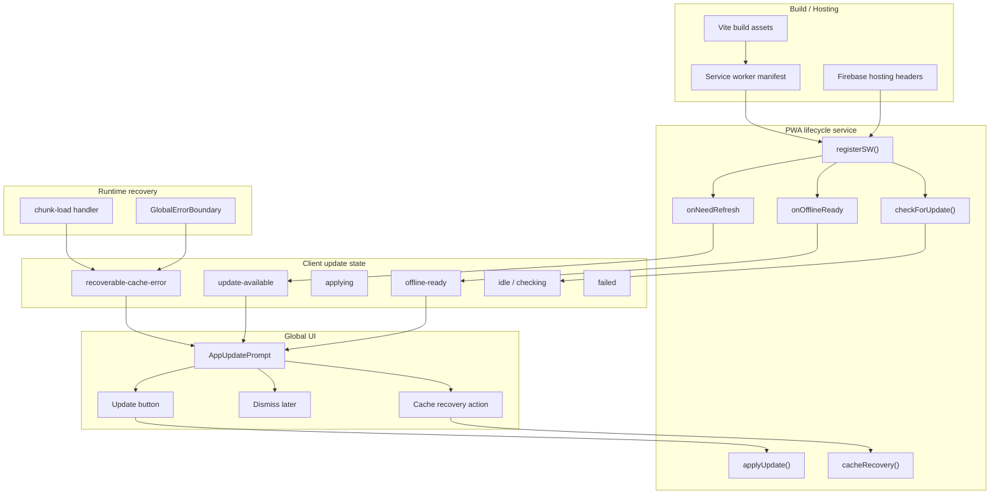

# SPEC-041: PWA 更新通知與快取恢復

狀態: Production Release Deployed / Local + Production Smoke Passed
關聯 DEV: DEV-041
節點類型: 交付點
父交付點: Production release readiness / PWA lifecycle reliability
是否計入產品交付完成: 是，限正式部署前的使用者更新可見性、快取恢復與版本切換可靠性
建立日期: 2026-07-05

## Human Decision Brief

原始需求:
- 使用者想把新版本部署到正式環境，但觀察到使用者常常不知道有更新，或快取未清造成異常。
- 使用者詢問是否可像市面 APP 一樣提供「更新通知」與「更新按鈕」。
- PM/HCS 判斷：可以，且應在正式部署前先完成；正常更新不宜強制即時刷新，需提供可見提示與手動更新入口，異常快取才走較強恢復。

已確認決策:
- 正式環境更新需有使用者可見的更新狀態，不再只靠 service worker 背景更新。
- 需要提供「更新」按鈕，讓使用者主動套用新版本。
- 正常更新以 prompt / banner / toast 等非破壞式 UI 呈現，不在使用者操作中突然重整。
- cache / chunk-load 類異常需提供恢復路徑，避免使用者卡在舊 bundle 或白畫面。

AI 補充假設:
- Phase 1 不新增後端 schema、Supabase migration、release API、push notification 或原生 app store 流程。
- Phase 1 沿用現有 Vite PWA 架構：`vite-plugin-pwa`、`registerType: 'prompt'`、`skipWaiting: false`。
- 更新 UI 採全域掛載，不綁定特定看板或頁面。
- 使用者按下更新後可 reload；未按更新前不得中斷正在編輯或拖曳中的工作。
- 嚴重 cache recovery 可比正常更新更積極，但必須有 reload loop guard。

需要人類重新授權的決策:
- 是否要在正式環境立即部署本功能與後續版本。
- 是否要做強制更新 / mandatory update policy。
- 是否要新增遠端 release notes、版本 API、analytics、通知推播或管理員發布儀表板。
- 是否允許清除使用者本地資料以外的 cache / storage 範圍。

## Current Architecture

目前 repo 已有 PWA 基礎，但缺少可見更新 UI:
- `vite.config.js` 使用 `VitePWA({ registerType: 'prompt', injectRegister: false })`。
- `vite.config.js` 已設定 `workbox.cleanupOutdatedCaches: true`、`clientsClaim: true`、`skipWaiting: false`。
- `src/main.tsx` 呼叫 `setupPwaLifecycle()` 與 `setupPwaInstallPromptListener()`。
- `src/services/pwaUpdateService.ts` 透過 `registerSW()` 接收 `onNeedRefresh`、`onOfflineReady`、`onRegisteredSW`、`onRegisterError`。
- `src/services/pwaUpdateService.ts` 目前在 `onNeedRefresh()` 中 queue `updateSW(true)`，並嘗試背景套用；尚未對 UI 發出明確「可更新」狀態。
- `src/main.tsx` 已有 dynamic import / chunk load error 的全域 reload handler。
- `src/components/GlobalErrorBoundary.tsx` 已有錯誤恢復與 reload 入口，但尚未形成 PWA update / cache recovery 的統一 UX。
- `firebase.json` 已對 `**`、`/index.html`、`/assets/**`、`/sw.js`、`/sw-kill.js` 設定 no-cache / no-store 類 headers。

現況問題:
- 使用者可能長時間留在已開啟分頁，不知道已有新版本。
- `onNeedRefresh` 沒有可見 UI，更新狀態對使用者與 QA 都不可觀測。
- chunk-load 失敗雖可能 reload，但缺少明確使用者說明與 loop guard evidence。
- cache 相關異常與一般 React ErrorBoundary 的恢復入口尚未整合成可驗收行為。
- production deploy 前沒有「版本更新提示是否可用」的 release gate evidence。

## End-State Architecture

目標架構:
- `pwaUpdateService` 成為 PWA lifecycle 的單一資料源，負責更新檢查、更新可用、套用更新、離線可用、cache recovery 與錯誤狀態。
- 全域 UI 透過 subscription、custom event 或 store 取得 update state，顯示 `AppUpdatePrompt`。
- `AppUpdatePrompt` 提供更新按鈕、稍後再說與 cache recovery 行動。
- chunk-load error 與 ErrorBoundary 不各自散落 reload 邏輯；應協調到同一套 recovery guard。
- production release gate 要能驗證「新版本可提示、可套用、異常可恢復、沒有 reload loop」。

## Phase 1 Scope

Phase 1 名稱: Visible PWA Update Prompt & Cache Recovery

包含:
- 新增或擴充 `pwaUpdateService` 的 update state model。
- `onNeedRefresh` 不只 queue `updateSW(true)`，還必須對 UI 發出 `update-available`。
- 新增全域 `AppUpdatePrompt` 或等效元件。
- 更新按鈕執行 `updateSW(true)` 或 service 封裝的 `applyUpdate()`，並進入 `applying` 狀態。
- 提供 session-level dismiss / later，避免提示頻繁打斷，但不能丟失已知更新狀態。
- chunk-load / stale asset failure 需顯示或觸發可驗收的 recovery path。
- 加入 reload loop guard，例如以 sessionStorage 記錄 recovery attempt timestamp / count。
- `GlobalErrorBoundary` 的 reload / cache clear 行為與 PWA recovery 文案及流程一致。
- 補 static verifier、browser verifier 與 QA 文件 evidence 要求。

不包含:
- 正式環境部署。
- Firebase Hosting deploy 或 production smoke。
- Supabase schema、RLS、RPC、migration。
- 強制更新政策。
- release notes 後端、遠端版本 API、admin release dashboard。
- push notification、email notification、App Store / Play Store 更新流程。
- analytics / telemetry。

## RD Handoff Contract

主要 touchpoints:
- `src/services/pwaUpdateService.ts`
- `src/main.tsx`
- `src/App.tsx` 或全域 layout 掛載點
- `src/components/AppUpdatePrompt.tsx` 或等效新元件
- `src/components/GlobalErrorBoundary.tsx`
- `vite.config.js` 僅在必要時調整，不得無故改成強制更新
- `scripts/verify-dev-041-pwa-update-notification-cache-recovery.mjs`
- `scripts/verify-dev-041-pwa-update-notification-cache-recovery-browser.pw.js`

資料與狀態契約:
- PWA service 必須暴露目前 update state。
- 最低必要 state:
  - `idle`
  - `checking`
  - `update-available`
  - `applying`
  - `offline-ready`
  - `recoverable-cache-error`
  - `failed`
- UI 不得直接散落呼叫 `registerSW()`；service 是單一入口。
- `update-available` 必須保留 update callback，直到使用者套用、dismiss 或分頁關閉。
- `dismiss` 不得把 service worker 已知更新清掉；只能隱藏本 session 或降低提示頻率。
- `applyUpdate()` 必須具備 applying state、error state 與 reload guard。

UI 契約:
- 更新提示需在 desktop 與 mobile viewport 可見，不被既有 panel、modal、toast 或 safe area 裁切。
- 文案須短而具體，例如「有新版本可用」與「更新」。
- 按鈕名稱不可使用含糊詞，例如只寫「確定」。
- 更新按鈕需有 disabled / applying state，避免連點造成多次 reload。
- cache recovery 狀態需明確區分一般更新，不得讓使用者以為資料被刪除。
- 若提供「清除快取並重新整理」，應只清除 Cache Storage / service worker registration；不得清除業務資料 storage，除非另有授權。

錯誤恢復契約:
- stale chunk / dynamic import failure 不得無限 reload。
- 若已在短時間內嘗試過 reload，第二次應顯示 recovery UI 或 ErrorBoundary，讓使用者手動執行清除快取。
- `GlobalErrorBoundary` 可以提供「重新整理」與「清除快取後重新整理」，但清除快取必須有明確作用範圍。
- SW unregister / caches.delete 只能作為 recovery action，不是正常更新的預設路徑。

相容性契約:
- 不得破壞 DEV-034 PWA install guidance。
- 不得破壞目前登入、看板、任務台與手機 pan-first 操作。
- 不得在使用者拖曳、輸入、modal 編輯中強制刷新。
- 不得把 production deploy 包進本 DEV-041 Phase 1 implementation。

## Acceptance Criteria

功能驗收:
- 當 `onNeedRefresh` 觸發時，畫面出現可見更新提示。
- 更新提示包含明確「更新」按鈕。
- 按下更新後只執行一次套用流程，並可 reload 到新版本。
- 使用者按稍後或關閉提示後，本 session 不被反覆打擾，但已知更新狀態不被錯誤遺失。
- `onOfflineReady` 可顯示低干擾訊息或被 service 狀態記錄，不與更新提示混淆。
- chunk-load / stale asset failure 有可驗收 recovery path。
- reload / recovery 具備 loop guard。
- ErrorBoundary 中的恢復入口與 PWA recovery 行為一致。

UI / RWD 驗收:
- 390x844 mobile viewport 下提示可見、按鈕可點、文字不溢出、不擋住關鍵操作超過必要範圍。
- 1440x900 desktop viewport 下提示位置合理，不遮蔽主要工作流。
- 更新提示不使用過大 hero、卡片堆疊或裝飾性元素。
- keyboard focus、ARIA label / role、button disabled state 可驗證。

回歸驗收:
- DEV-034 PWA install guidance 仍可正常運作。
- `npm.cmd exec tsc -- --noEmit` 通過。
- `npm.cmd run build:test` 通過。
- 現有 task workbench / board interaction verifier 不因全域提示掛載而失敗。

不准宣稱:
- 不准宣稱 production deploy 完成。
- 不准宣稱所有使用者快取問題永久消失。
- 不准宣稱正式站已驗證，除非另走 deployment-release-gate 並留下 evidence。

## RD Implementation Summary

2026-07-05 Phase 1 已完成前端實作:
- `src/services/pwaUpdateService.ts` 擴充為 PWA lifecycle 單一資料源，提供 update state、subscription、`projed:pwa-update-state` event、`applyPwaUpdate()`、`dismissPwaUpdatePrompt()`、`clearPwaApplicationCacheAndReload()` 與 `handleRecoverableAppLoadError()`。
- `onNeedRefresh` 會保留 queued update callback 並發出 `update-available`，不再只有背景套用。
- 新增 `src/components/AppUpdatePrompt.tsx`，全域顯示「有新版本可用」與「更新」按鈕，支援稍後、applying disabled state、recoverable load failure 與 cache recovery action。
- `src/main.tsx` 的 chunk-load / dynamic import failure 改走 PWA recovery handler，具備 session-level reload loop guard。
- `src/components/GlobalErrorBoundary.tsx` 的清除入口改為只清除應用程式快取與 service worker registration，不再清除 `localStorage` / `sessionStorage` 業務資料。
- 新增 DEV-041 static/browser verifiers，並把 script 掛進 `package.json`。

Production release note:
- 2026-07-05 已完成 local QC、production artifact smoke、Firebase Hosting deploy、post-deploy browser smoke 與 authenticated production UI smoke。
- QC report: `ai-doc/qc/QC-DEV-041-pwa-update-notification-cache-recovery.md`

## QA / QC Gate

Phase 1 RD 完成後至少需要:
- `npm.cmd run verify:dev-041-pwa-update-notification-cache-recovery`
- `npm.cmd run verify:dev-041-pwa-update-notification-cache-recovery-browser`
- `npm.cmd run verify:dev-034-pwa-install-guidance`
- `npm.cmd run verify:dev-034-pwa-install-guidance-browser`
- `npm.cmd exec tsc -- --noEmit`
- `npm.cmd run build:test`

建議 regression smoke:
- 任務台主要操作 smoke。
- Board mobile pan-first smoke。
- Login/authenticated route smoke。
- ErrorBoundary recovery smoke。

Production deploy gate:
- 本 DEV 文件與 local QC 完成後，仍不得直接宣稱可部署。
- 若使用者授權正式部署，必須改走 `deployment-release-gate`：
  - 確認 git branch / dirty worktree / release scope。
  - 建置 production artifact。
  - production-like smoke。
  - Firebase Hosting deploy evidence。
  - post-deploy smoke。
  - rollback readiness。
  - 新版本提示與 cache recovery 的 production smoke。

## Deferred Scope Audit

| 範圍 | 狀態 | 原因 / 下次入口 |
|---|---|---|
| DEV-041 Phase 1 Visible PWA Update Prompt & Cache Recovery | RD Implementation Ready / Not Authorized | 本文件已足以交給 RD；需使用者明確說「執行 RD」才開工。 |
| DEV-041 Phase 2 Production Release Gate | Blocked Human Re-entry | 需使用者明確授權部署；必須套用 deployment-release-gate。 |
| Mandatory update / forced refresh policy | RD Contract Ready / Not Authorized | 牽涉使用者工作中斷風險，需另行決策。 |
| Remote release notes / version API | Deferred / New DEV Candidate | 需要後端或 release metadata 來源，目前不是必要 MVP。 |
| Update adoption analytics | Deferred / New DEV Candidate | 需要 analytics policy 與隱私邊界。 |
| Push notification / email notification | Deferred / No Tracking Until Requested | 超出 PWA in-app update prompt 範圍。 |
| DB schema / Supabase migration / RLS | Not In Scope | Phase 1 不需要資料庫變更。 |
| Production deploy / Firebase Hosting release | Not Authorized | 需使用者另行授權並走 release gate。 |

## All-Phase Coverage Matrix

| Phase | 名稱 | 文件狀態 | 授權狀態 | Exit Evidence |
|---|---|---|---|---|
| 0 | PM/RD Contract | Complete | Authorized for documentation only | SPEC/QA/dev_task/documentation_map/backlog updated |
| 1 | Visible PWA Update Prompt & Cache Recovery | Local + Browser QC Passed | Authorized / Complete | local static/browser verifier、TypeScript、build:test、DEV-034 regression |
| 2 | Production Release Gate | Production Release Deployed / Post-Deploy Smoke Passed | Authorized / Complete | deployment-release-gate evidence、post-deploy smoke、rollback readiness |
| 3 | Optional Release Metadata / Mandatory Policy | RD Contract Ready | Not Authorized | separate human decision、SPEC addendum or new DEV |

## RD Start Checklist

RD 開工前需確認:
- 使用者明確授權 DEV-041 Phase 1 implementation。
- 不把 production deploy 混進本地 implementation。
- 若 worktree 有其他未提交變更，需先標示哪些是本 DEV 會觸碰的檔案。
- 先讀 DEV-034 PWA install guidance，避免更新提示破壞安裝提示。
- 先建立可測試的 update state injection 或 mock path，讓 browser verifier 能穩定觸發 `update-available`。
