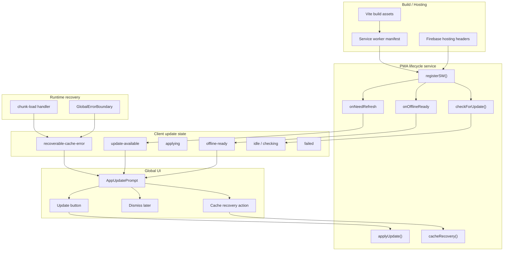

# SPEC-041: PWA 更新通知與快取恢復

狀態: DEV-041 Historical Production Release Deployed / DEV-096 Implemented Local Baseline / DEV-097 RD Implemented / Local Automated QA PASS / Independent QC PASS / Physical Device Supplemental Not Verified / Not Released
關聯 DEV: DEV-041 / DEV-096 / DEV-097
關聯 ADR: ADR-047 PWA每分頁重新載入隔離與Workbox effect ownership
節點類型: 交付點
父交付點: Production release readiness / PWA lifecycle reliability
是否計入產品交付完成: 是，限正式部署前的使用者更新可見性、快取恢復與版本切換可靠性
建立日期: 2026-07-05

## Human Decision Brief

Authority note：本節保留 DEV-041 原始決策的歷史背景；normal update 的現行產品契約以
本文後段 `DEV-097 Contract Addendum` 為準。DEV-096 保留已實作 baseline 與 local evidence，
但其「一般更新一律等待點擊」語意已由使用者 2026-08-31 的 `1A／2A／3A` 決策取代。

原始需求:
- 使用者想把新版本部署到正式環境，但觀察到使用者常常不知道有更新，或快取未清造成異常。
- 使用者詢問是否可像市面 APP 一樣提供「更新通知」與「更新按鈕」。
- PM/HCS 判斷：可以，且應在正式部署前先完成；正常更新不宜強制即時刷新，需提供可見提示與手動更新入口，異常快取才走較強恢復。

已確認決策:
- 正式環境更新需有使用者可見的更新狀態，不再只靠 service worker 背景更新。
- 需要提供「更新」按鈕，讓使用者主動套用新版本。
- 正常更新以 prompt / banner / toast 等非破壞式 UI 呈現，不在使用者操作中突然重整。
- cache / chunk-load 類異常需提供恢復路徑，避免使用者卡在舊 bundle 或白畫面。

AI 補充假設:
- Phase 1 不新增後端 schema、Supabase migration、release API、push notification 或原生 app store 流程。
- Phase 1 沿用現有 Vite PWA 架構：`vite-plugin-pwa`、`registerType: 'prompt'`、`skipWaiting: false`。
- 更新 UI 採全域掛載，不綁定特定看板或頁面。
- 使用者按下更新後可 reload；未按更新前不得中斷正在編輯或拖曳中的工作。
- 嚴重 cache recovery 可比正常更新更積極，但必須有 reload loop guard。

需要人類重新授權的決策:
- 目前 DEV-041 production release 已於 2026-07-05 授權並完成；後續版本或再次部署仍需重新授權並走 release gate。
- 是否要做強制更新 / mandatory update policy。
- 是否要新增遠端 release notes、版本 API、analytics、通知推播或管理員發布儀表板。
- 是否允許清除使用者本地資料以外的 cache / storage 範圍。

## Current Architecture

目前 repo 已有 PWA 基礎，但缺少可見更新 UI:
- `vite.config.js` 使用 `VitePWA({ registerType: 'prompt', injectRegister: false })`。
- `vite.config.js` 已設定 `workbox.cleanupOutdatedCaches: true`、`clientsClaim: true`、`skipWaiting: false`。
- `src/main.tsx` 呼叫 `setupPwaLifecycle()` 與 `setupPwaInstallPromptListener()`。
- `src/services/pwaUpdateService.ts` 透過 `registerSW()` 接收 `onNeedRefresh`、`onOfflineReady`、`onRegisteredSW`、`onRegisterError`。
- `src/services/pwaUpdateService.ts` 目前在 `onNeedRefresh()` 中 queue `updateSW(true)`，並嘗試背景套用；尚未對 UI 發出明確「可更新」狀態。
- `src/main.tsx` 已有 dynamic import / chunk load error 的全域 reload handler。
- `src/components/GlobalErrorBoundary.tsx` 已有錯誤恢復與 reload 入口，但尚未形成 PWA update / cache recovery 的統一 UX。
- `firebase.json` 已對 `**`、`/index.html`、`/assets/**`、`/sw.js`、`/sw-kill.js` 設定 no-cache / no-store 類 headers。

現況問題:
- 使用者可能長時間留在已開啟分頁，不知道已有新版本。
- `onNeedRefresh` 沒有可見 UI，更新狀態對使用者與 QA 都不可觀測。
- chunk-load 失敗雖可能 reload，但缺少明確使用者說明與 loop guard evidence。
- cache 相關異常與一般 React ErrorBoundary 的恢復入口尚未整合成可驗收行為。
- production deploy 前沒有「版本更新提示是否可用」的 release gate evidence。

## End-State Architecture


```mermaid
flowchart TD
  subgraph Build["Build / Hosting"]
    A["Vite build assets"]
    B["Service worker manifest"]
    C["Firebase hosting headers"]
  end

  subgraph PWA["PWA lifecycle service"]
    D["registerSW()"]
    E["onNeedRefresh"]
    F["onOfflineReady"]
    G["checkForUpdate()"]
    H["applyUpdate()"]
    I["cacheRecovery()"]
  end

  subgraph State["Client update state"]
    J["idle / checking"]
    K["update-available"]
    L["applying"]
    M["offline-ready"]
    N["recoverable-cache-error"]
    O["failed"]
  end

  subgraph UI["Global UI"]
    P["AppUpdatePrompt"]
    Q["Update button"]
    R["Dismiss later"]
    S["Cache recovery action"]
  end

  subgraph Errors["Runtime recovery"]
    T["chunk-load handler"]
    U["GlobalErrorBoundary"]
  end

  A --> B
  B --> D
  C --> D
  D --> E
  D --> F
  D --> G
  E --> K
  F --> M
  G --> J
  K --> P
  M --> P
  P --> Q
  P --> R
  Q --> H
  T --> N
  U --> N
  N --> P
  P --> S
  S --> I
```

目標架構:
- `pwaUpdateService` 成為 PWA lifecycle 的單一資料源，負責更新檢查、更新可用、套用更新、離線可用、cache recovery 與錯誤狀態。
- 全域 UI 透過 subscription、custom event 或 store 取得 update state，顯示 `AppUpdatePrompt`。
- `AppUpdatePrompt` 提供更新按鈕、稍後再說與 cache recovery 行動。
- chunk-load error 與 ErrorBoundary 不各自散落 reload 邏輯；應協調到同一套 recovery guard。
- production release gate 要能驗證「新版本可提示、可套用、異常可恢復、沒有 reload loop」。

## Phase 1 Scope

Phase 1 名稱: Visible PWA Update Prompt & Cache Recovery

包含:
- 新增或擴充 `pwaUpdateService` 的 update state model。
- `onNeedRefresh` 不只 queue `updateSW(true)`，還必須對 UI 發出 `update-available`。
- 新增全域 `AppUpdatePrompt` 或等效元件。
- 更新按鈕執行 `updateSW(true)` 或 service 封裝的 `applyUpdate()`，並進入 `applying` 狀態。
- 提供 session-level dismiss / later，避免提示頻繁打斷，但不能丟失已知更新狀態。
- chunk-load / stale asset failure 需顯示或觸發可驗收的 recovery path。
- 加入 reload loop guard，例如以 sessionStorage 記錄 recovery attempt timestamp / count。
- `GlobalErrorBoundary` 的 reload / cache clear 行為與 PWA recovery 文案及流程一致。
- 補 static verifier、browser verifier 與 QA 文件 evidence 要求。

不包含:
- 正式環境部署。
- Firebase Hosting deploy 或 production smoke。
- Supabase schema、RLS、RPC、migration。
- 強制更新政策。
- release notes 後端、遠端版本 API、admin release dashboard。
- push notification、email notification、App Store / Play Store 更新流程。
- analytics / telemetry。

## RD Handoff Contract

主要 touchpoints:
- `src/services/pwaUpdateService.ts`
- `src/main.tsx`
- `src/App.tsx` 或全域 layout 掛載點
- `src/components/AppUpdatePrompt.tsx` 或等效新元件
- `src/components/GlobalErrorBoundary.tsx`
- `vite.config.js` 僅在必要時調整，不得無故改成強制更新
- `scripts/verify-dev-041-pwa-update-notification-cache-recovery.mjs`
- `scripts/verify-dev-041-pwa-update-notification-cache-recovery-browser.pw.js`

資料與狀態契約:
- PWA service 必須暴露目前 update state。
- 最低必要 state:
  - `idle`
  - `checking`
  - `update-available`
  - `applying`
  - `offline-ready`
  - `recoverable-cache-error`
  - `failed`
- UI 不得直接散落呼叫 `registerSW()`；service 是單一入口。
- `update-available` 必須保留已知更新狀態；若有 service worker update callback，dismiss 不得清掉它。使用者主動套用時，可捨棄可能 stale 的 queued callback，改走最新 app shell reload path。
- `dismiss` 不得把 service worker 已知更新清掉；只能隱藏本 session 或降低提示頻率。
- `applyUpdate()` 必須具備 applying state、error state 與 reload guard。

UI 契約:
- 更新提示需在 desktop 與 mobile viewport 可見，不被既有 panel、modal、toast 或 safe area 裁切。
- 文案須短而具體，例如「有新版本可用」與「一鍵更新到最新版」。
- 按鈕名稱不可使用含糊詞，例如只寫「確定」。
- 更新按鈕需有 disabled / applying state，避免連點造成多次 reload。
- cache recovery 狀態需明確區分一般更新，不得讓使用者以為資料被刪除。
- 若提供「清除快取並重新整理」，應只清除 Cache Storage / service worker registration；不得清除業務資料 storage，除非另有授權。

錯誤恢復契約:
- stale chunk / dynamic import failure 不得無限 reload。
- 若已在短時間內嘗試過 reload，第二次應顯示 recovery UI 或 ErrorBoundary，讓使用者手動執行清除快取。
- `GlobalErrorBoundary` 可以提供「重新整理」與「清除快取後重新整理」，但清除快取必須有明確作用範圍。
- SW unregister / caches.delete 不得自動執行；但 2026-07-07 起，使用者主動按下「一鍵更新到最新版」時，可清除 Cache Storage / service worker registration 後 reload 最新 app shell，以避免 stale queued worker callback。此流程不得清除 `localStorage` / `sessionStorage` / IndexedDB 業務資料。

相容性契約:
- 不得破壞 DEV-034 PWA install guidance。
- 不得破壞目前登入、看板、任務台與手機 pan-first 操作。
- 不得在使用者拖曳、輸入、modal 編輯中強制刷新。
- 不得把 production deploy 包進本 DEV-041 Phase 1 implementation。

## Acceptance Criteria

功能驗收:
- 當 `onNeedRefresh` 觸發時，畫面出現可見更新提示。
- 更新提示包含明確「更新」按鈕。
- 按下更新後只執行一次套用流程，並可 reload 到新版本。
- 使用者按稍後或關閉提示後，本 session 不被反覆打擾，但已知更新狀態不被錯誤遺失。
- `onOfflineReady` 可顯示低干擾訊息或被 service 狀態記錄，不與更新提示混淆。
- chunk-load / stale asset failure 有可驗收 recovery path。
- reload / recovery 具備 loop guard。
- ErrorBoundary 中的恢復入口與 PWA recovery 行為一致。

UI / RWD 驗收:
- 390x844 mobile viewport 下提示可見、按鈕可點、文字不溢出、不擋住關鍵操作超過必要範圍。
- 1440x900 desktop viewport 下提示位置合理，不遮蔽主要工作流。
- 更新提示不使用過大 hero、卡片堆疊或裝飾性元素。
- keyboard focus、ARIA label / role、button disabled state 可驗證。

回歸驗收:
- DEV-034 PWA install guidance 仍可正常運作。
- `npm.cmd exec tsc -- --noEmit` 通過。
- `npm.cmd run build:test` 通過。
- 現有 task workbench / board interaction verifier 不因全域提示掛載而失敗。

不准宣稱:
- Phase 1 local gate 完成前，不准宣稱 production deploy 完成。
- 2026-07-05 production release 完成後，只能依 `ai-doc/qc/QC-DEV-041-pwa-update-notification-cache-recovery.md` 宣稱該 release 的 production smoke 通過。
- 不准宣稱所有使用者快取問題永久消失。
- 不准宣稱後續版本正式站已驗證，除非另走 deployment-release-gate 並留下 evidence。

## RD Implementation Summary

2026-07-05 Phase 1 已完成前端實作:
- `src/services/pwaUpdateService.ts` 擴充為 PWA lifecycle 單一資料源，提供 update state、subscription、`projed:pwa-update-state` event、`applyPwaUpdate()`、`dismissPwaUpdatePrompt()`、`clearPwaApplicationCacheAndReload()` 與 `handleRecoverableAppLoadError()`。
- `onNeedRefresh` 會保留 queued update callback 並發出 `update-available`，不再只有背景套用。
- 新增 `src/components/AppUpdatePrompt.tsx`，全域顯示「有新版本可用」與「一鍵更新到最新版」按鈕，支援稍後、applying disabled state、recoverable load failure 與 cache recovery action。
- `src/main.tsx` 的 chunk-load / dynamic import failure 改走 PWA recovery handler，具備 session-level reload loop guard。
- `src/components/GlobalErrorBoundary.tsx` 的清除入口改為只清除應用程式快取與 service worker registration，不再清除 `localStorage` / `sessionStorage` 業務資料。
- 新增 DEV-041 static/browser verifiers，並把 script 掛進 `package.json`。
- 2026-07-05 mobile update visibility hotfix：新增 app shell bundle hash 記錄與 no-store `index.html` 比對；若已載入新版，顯示 `updated` state 與「已更新到新版 / 目前已是最新版本」提示，避免使用者以為沒有更新。
- 2026-07-07 one-click latest hotfix：更新按鈕不再執行可能 stale 的 queued service worker callback；會重新檢查 app shell、清除 app Cache Storage / service worker registration，並以 `projed_update_latest` cache-busting query reload 最新 app shell。本 hotfix 已完成 local static/browser QC，尚未執行 production deploy。

Production release note:
- 2026-07-05 已完成 local QC、production artifact smoke、Firebase Hosting deploy、post-deploy browser smoke 與 authenticated production UI smoke。
- 2026-07-05 hotfix 後正式站載入 `assets/index-BXtRfIba.js`，手機更新可見性補強已通過 local/browser/production smoke。
- QC report: `ai-doc/qc/QC-DEV-041-pwa-update-notification-cache-recovery.md`

## QA / QC Gate

Phase 1 RD 完成後至少需要:
- `npm.cmd run verify:dev-041-pwa-update-notification-cache-recovery`
- `npm.cmd run verify:dev-041-pwa-update-notification-cache-recovery-browser`
- `npm.cmd run verify:dev-034-pwa-install-guidance`
- `npm.cmd run verify:dev-034-pwa-install-guidance-browser`
- `npm.cmd exec tsc -- --noEmit`
- `npm.cmd run build:test`

建議 regression smoke:
- 任務台主要操作 smoke。
- Board mobile pan-first smoke。
- Login/authenticated route smoke。
- ErrorBoundary recovery smoke。

Production deploy gate:
- 本 DEV 文件與 local QC 完成後，仍不得直接宣稱可部署。
- 若使用者授權正式部署，必須改走 `deployment-release-gate`：
  - 確認 git branch / dirty worktree / release scope。
  - 建置 production artifact。
  - production-like smoke。
  - Firebase Hosting deploy evidence。
  - post-deploy smoke。
  - rollback readiness。
  - 新版本提示與 cache recovery 的 production smoke。

## Deferred Scope Audit

| 範圍 | 狀態 | 原因 / 下次入口 |
|---|---|---|
| DEV-041 Phase 1 Visible PWA Update Prompt & Cache Recovery | Local + Browser QC Passed / Authorized / Complete | 2026-07-05 已完成 RD、local static/browser QC、DEV-034 regression、TypeScript 與 build gate；2026-07-07 one-click latest hotfix 已完成 local static/browser QC，production deploy 未執行。 |
| DEV-041 Phase 2 Production Release Gate | Production Release Deployed / Post-Deploy Smoke Passed / Authorized / Complete | 2026-07-05 已完成 Firebase Hosting deploy、post-deploy HTTP/browser smoke 與 authenticated production UI smoke；證據在 `ai-doc/qc/QC-DEV-041-pwa-update-notification-cache-recovery.md`。 |
| Mandatory update / forced refresh policy | RD Contract Ready / Not Authorized | 牽涉使用者工作中斷風險，需另行決策。 |
| Remote release notes / version API | Deferred / New DEV Candidate | 需要後端或 release metadata 來源，目前不是必要 MVP。 |
| Update adoption analytics | Deferred / New DEV Candidate | 需要 analytics policy 與隱私邊界。 |
| Push notification / email notification | Deferred / No Tracking Until Requested | 超出 PWA in-app update prompt 範圍。 |
| DB schema / Supabase migration / RLS | Not In Scope | Phase 1 不需要資料庫變更。 |
| Future production deploy / Firebase Hosting release | Blocked Human Re-entry | 目前 DEV-041 release 已完成；後續任一新版本部署仍需使用者另行授權並走 release gate。 |

## DEV-096 Corrective Addendum（2026-08-30）

### Authority 與更正範圍

本附錄為 DEV-096 的現行 RD 實作權威，保留 DEV-041 已發布的歷史事實，但取代下列現行產品語意：

- 一般更新 CTA 由「一鍵更新到最新版」改為「一鍵更新」。
- 一般更新提示刪除左側圖示、說明段落、版本 badge 與其所占空間；只保留標題、關閉、「一鍵更新」與「稍後」。
- 取代 2026-07-07 one-click latest hotfix 的 normal-path unregister／Cache Storage delete。正常 apply 必須走 waiting worker／`updateSW()`／controlling reload；清 SW／Cache 只保留為使用者主動的失敗恢復。
- 移除 background、hidden、`pagehide` 自動 apply。visibility 只允許執行 update check，不得在使用者未確認時接管或 reload。
- callback resolve 或 state 回到 `idle` 不再代表成功；唯一成功條件是 reload 後 `currentVersion === targetVersion`。

DEV-041 歷史 QC 與 production release note 不回填為 DEV-096 PASS。舊 QA B02 的 exact CTA、C01～C04 的 normal cache-purge 路徑為 historical baseline；DEV-096 以 `ai-doc/qa/QA-DEV-096-pwa-update-transaction-convergence.md` 為現行驗證權威。

### Version Identity Contract

- Production canonical identity 固定為 `release:<releaseId>`。`scripts/release/build-production-artifact.mjs` 已將 `PROJED_RELEASE_ID` 傳入 sealed build；`vite.config.js` 必須將其 define 為 `import.meta.env.VITE_PROJED_RELEASE_ID`，並在 `src/vite-env.d.ts` 宣告。
- Current identity 來自 bundle 內注入值；latest identity 來自 `cache: 'no-store'` 的 `/release-meta.json?projed_update_check=<nonce>`，只接受 `schemaVersion: 1` 與非空 `releaseId`。
- Local／test 沒有 release metadata 時才可用 `bundle:<entryHash>` fallback。不同 namespace 不相等；production 空值、malformed metadata 或 namespace mismatch 必須 fail closed，不得顯示假成功。
- `scripts/release/verify-production-artifact.mjs` 驗證 injected release ID、`release-meta.json.releaseId`、manifest `releaseId` 三者相同；任一不一致為 P0 artifact failure。

### Persisted Transaction Contract

新增 `src/services/pwaUpdateTransaction.ts` 作為 pure state authority：

```ts
type PwaUpdatePhase =
  | 'available'
  | 'applying'
  | 'awaiting-controller'
  | 'verifying'
  | 'recovering'
  | 'failed'

interface PwaUpdateTransactionV1 {
  schemaVersion: 1
  transactionId: string
  sourceVersion: string
  targetVersion: string
  phase: PwaUpdatePhase
  ownerTabId: string
  ownerFence: number
  normalReloadReserved: boolean
  recoveryAttemptCount: 0 | 1
  createdAt: number
  updatedAt: number
  leaseExpiresAt: number
  errorCode?: string
}
```

Storage ownership：

- localStorage：`projed.pwa-update.transaction.v1`、`projed.pwa-update.completed-version.v1`。
- sessionStorage：`projed.pwa-update.tab-id.v1`、`projed.pwa-update.dismissed-target.v1`、`projed.pwa-update.recovery.v1`。
- IndexedDB fallback：獨立 PWA DB `projed-pwa-update-v1` 的 `locks` store，只用於不支援 Web Locks 時的原子 owner lease；不得與業務 IndexedDB 共用 store 或清除業務資料。
- Broadcast channel：`projed.pwa-update.v1`；不支援 BroadcastChannel 時使用 localStorage `storage` event。
- channel 訊息只能當 change signal；接收端必須重讀 persisted transaction 並通過 strict parser。未知 schema、非法 phase、空 version、非有限 timestamp、target downgrade 或非法 transition 一律 fail closed。
- 上列以外的 localStorage／sessionStorage、IndexedDB、auth token 與業務資料不屬 PWA transaction，任何路徑不得清除或改寫。

Ownership：同一 target 只能有一個 active transaction／owner。優先以 `navigator.locks.request('projed.pwa-update.apply.v1', { mode: 'exclusive', ifAvailable: true })` 取得互斥；不支援 Web Locks 時，以獨立 PWA IndexedDB 單一 readwrite transaction 原子 acquire／renew／takeover，不得只靠 localStorage read-then-write。lease 固定 30 秒、owner 每 10 秒續租，每次 acquire／takeover 遞增正整數 `ownerFence`。所有 effect／commit 前必須 reread-and-confirm transactionId／ownerTabId／ownerFence／lease；舊 fence、非 owner 與同分頁重入不得呼叫 `updateSW`、navigation 或 recovery。

### State Machine 與 Effect Ownership

1. Detection：`onNeedRefresh` 或 foreground check 取得可信 latest。若 latest 與 current、completed target、session dismissed target 都不同，persist `available`；`onNeedRefresh` 只保存最新 queued update callback。
2. User apply：點「一鍵更新」後取得 owner lease並進 `applying`。CTA disabled；later／close 隱藏或 disabled。apply promise 在單一分頁內必須 singleton。
3. Stable-target preflight：owner 呼叫 `registration.update()`，最多等待 waiting worker 15 秒，再重讀 no-store latest。target 若改變只允許重做一次；兩輪仍變動則 `failed/TARGET_UNSTABLE`，不得 reload。
4. Standard activation：target 穩定後先 persist `awaiting-controller` 與 `normalReloadReserved=true`，再呼叫 queued `updateSW()`；並以目前 registration 的 waiting worker 直接送 `SKIP_WAITING` 作為 callback race fallback。controllerchange 先 quiesce 舊頁面 writer，再由套件 controlling handler 或 coordinator 的短延遲 fallback 完成唯一有效的 normal reload；不得讓舊 async check 在事件後回寫 transaction。
5. Startup verification：新頁面 hydrate active transaction，進 `verifying` 並解析 current identity。只有 `current === target` 才能寫 completed、移除 active transaction並廣播完成；同 target 的後續 callback／check 必須被抑制。
6. Bounded automatic recovery：normal reload 後 mismatch 且 attempt=0 時，寫 `recovering/1`，只允許一次 nonce cache-busting navigation，不 unregister／delete cache。再次 mismatch 或 15 秒內無可信 current 時進 `failed`，停止自動 reload。
7. Manual recovery：failed UI 可讓使用者重試檢查，或主動選「清除應用程式快取後重整」。只有後者可處理同 origin SW registrations／Cache Storage；必須 readback 每個 unregister／delete 結果，失敗時維持可見 error。

active transaction 超過 5 分鐘仍未完成，轉為 `failed/TRANSACTION_STALE`，不得靜默刪除再顯示同一 normal CTA。只有有效 owner 在 `applying` 的 stable-target preflight 可於同一 transaction retarget 一次；進入 `awaiting-controller` 後 target immutable。完成舊 target 後再偵測到更高版本，才建立新 transaction。

### UI Entry Contract

- Actor／entry：所有 web／PWA 使用者；`AppUpdatePrompt` 維持 `src/App.tsx` 全域且在 AuthGate 外的掛載位置。
- Trigger：可信 target 可用且非 completed／session dismissed，或 transaction 為 recovering／failed。Dismiss 只作用於當前 target／session；更高 target 可再次提示。
- Normal exact visible set：標題「有新版本可用」、close、「一鍵更新」、「稍後」。不得存在 Refresh icon、一般說明段落、版本 badge、「到最新版」或刪除元素留下的空白欄。
- Applying／awaiting：primary 為「更新中」且 disabled；close／later 隱藏或 disabled。Recovery／failed 必須保留最小原因與 action，可使用識別 icon。
- Layout：一層扁平 surface，壓縮 padding、段距與 action gap；1440×900、390×844、320×844 無 overflow、重疊、截字、safe-area 遮擋或關鍵操作不可達。
- Accessibility：role／aria-live 不重複播報，close 有 label，keyboard focus 不進 hidden／disabled control，apply 前後焦點與可見狀態一致。
- Exit：成功只由 startup version verification 結束；callback resolve、dismiss 或 cache API boolean 未確認都不得標 completed。

### Repo Impact 與 RD Work Packages

| WP | 檔案 | Required change |
|---|---|---|
| WP-096-A | `src/services/pwaUpdateTransaction.ts`（新增） | schema、strict parse、legal transitions、lease／takeover、completed suppression 與 pure tests。 |
| WP-096-B | `vite.config.js`、`src/vite-env.d.ts`、`scripts/release/verify-production-artifact.mjs` | release ID 注入、型別與 artifact parity gate。 |
| WP-096-C | `src/services/pwaUpdateService.ts` | 重構 `fetchLatestAppShellVersion`、`recordLoadedAppVersion`、`runQueuedUpdate`、`applyPwaUpdate`、`setupPwaLifecycle`；加入 transaction、stable-target preflight、standard activation、startup verify、cross-tab lock／sync、bounded recovery；刪除 `applyUpdateWhenBackgrounded` 與 normal cache purge。 |
| WP-096-D | `src/components/AppUpdatePrompt.tsx` | 重構 `AppUpdatePrompt` 的 exact visible set、compact layout、applying／recovery／failed、RWD／accessibility。 |
| WP-096-E | DEV-041 verifiers、`package.json`、新增 DEV-096 static／browser／real-SW verifiers | 更新舊 assertions；建立 pure、synthetic UI、真實 A→B→C、多分頁、post-reload 與 storage safety evidence。 |
| WP-096-F | DEV／SPEC／QA 與後續 QC | 回填實作事實；QA 執行 frozen acceptance，QC 獨立重跑，不修改產品。 |

`src/main.tsx`、`src/App.tsx`、`src/components/GlobalErrorBoundary.tsx` 與 DEV-034 install guidance 原則上只做 regression；本次僅補回 DEV-034 設定頁契約說明文字。real-SW 驗證證實 installed `vite-plugin-pwa` 在後續 update 的 controlling reload listener 可能缺席，因此現行 coordinator 保留短延遲 fallback，且以 quiesce guard 避免第二次有效 navigation／舊 writer 回寫；不得增加無界的第二套 reload 流程。

### Acceptance、Evidence 與 Stop Conditions

- 同 target 在連點、hide/show、`pagehide`、reload、多分頁與 owner crash 下，只有一筆 transaction、一個有效 owner fence、一次 `updateSW`；每個受 controller 接管影響的 client 最多一次 normal reload。
- 真實 SW A→B、B→C、B waiting 時發布 C 均收斂最新穩定 target；`current===target` 後同版本 normal prompt 不再出現。
- malformed／stale transaction、waiting timeout、target unstable、controller failure 與 post-reload mismatch 均進有界限 failure，不形成 loop。
- 正常 flow 不 unregister／delete cache、不動 business storage；manual recovery 範圍與 readback 可驗證。
- Normal UI 在三個 required viewport 符合 exact visible set、focus／ARIA、compact layout；visible error、console error、pageerror、HTTP 4xx／5xx、白畫面為 0。
- DEV-041、DEV-034 regression、TypeScript、`build:test` 通過；真實 SW lifecycle／多分頁／storage diff evidence 齊全，synthetic event 不得單獨支持 PASS。

QA authority：`ai-doc/qa/QA-DEV-096-pwa-update-transaction-convergence.md`。本次 required commands 為：

```text
npm.cmd run verify:dev-096-pwa-update-transaction-convergence
npm.cmd run verify:dev-096-pwa-update-transaction-convergence-browser
npm.cmd run verify:dev-096-pwa-update-transaction-convergence-sw
npm.cmd run verify:dev-041-pwa-update-notification-cache-recovery
npm.cmd run verify:dev-041-pwa-update-notification-cache-recovery-browser
npm.cmd run verify:dev-034-pwa-install-guidance
npm.cmd run verify:dev-034-pwa-install-guidance-browser
npm.cmd exec tsc -- --noEmit
npm.cmd run build:test
```

DEV-096 三個 verifier 已建立並執行；static 25/25、test-mode browser、real-SW A→B／B→C／B waiting→C retarget＋雙分頁 evidence 均已留下。任一 current≠target 卻 completed、同 target 雙 owner／雙 reload、未點擊自動 apply、production 空 ID 被接受、正常路徑清 cache、業務資料異動、同版本 CTA 再出現、visible error 或缺真實 SW／多分頁 evidence，皆為 P0 Stop-Ship。

### Execution／Release Boundary 與 Readiness Audit

- 本附錄已完成本地 RD implementation、test assets、文件回填與 QA／QC；不含 commit、merge、push、deploy 或 release。
- Production A→B smoke 需 RD、QA、QC 全部通過後，由使用者重新授權並走 deployment-release-gate；DEV-041 歷史部署不代表 DEV-096 已上線。
- DB／migration：無；release feasibility 依既有 DEV-083 sealed artifact pipeline，WP-096-B parity gate 已完成，不新增 backend service。
- P0／P1 readiness gap：0。文件狀態為 `Implemented / Local QA-QC PASS / Not Released`；production deploy／remote smoke 仍需另行授權與 release gate。

## DEV-097 Contract Addendum（2026-08-31）

### Authority 與 Human Confirmed Decisions

本附錄是DEV-097的`RD Implementation Ready`產品與實作權威，保留DEV-096已完成的release identity、
單一activation transaction、owner fence、post-reload verification、bounded recovery與storage safety；
ADR-047並有意取代DEV-096的virtual registration、`clientsClaim:true`、controlling reload fallback與
下列normal update語意：

- `1A`：只有可能遺失或中斷工作的 client state 阻止 reload。未儲存文字／表單、active
  drag、尚未 durable 的 import／publish、pending write 與 dirty modal 為 unsafe。
- 可由 stable ID 在 reload 後取回的 background AI／server job，以及唯讀 modal，不阻止；
  只存在 client memory 或 reload 後無法恢復者仍為 unsafe。
- `2A`：normal update 只在 app open、foreground resume 且 safe，或目前操作完成後的 route
  transition 套用；不採任意 idle timeout。
- `3A`：dirty 期間不以時間強制 reload。dirty 清除後於下一個 natural boundary 收斂；
  超出支援期限時另走 critical policy。

因此，DEV-096「未點擊不得接管或reload」、「可信target一律顯示normal prompt」與
「未點擊自動apply一律P0 failure」只保留為DEV-096歷史baseline。DEV-097允許目前document經
explicit readiness與local safety gate證明safe後，在自己的natural boundary靜默activation／reload；
仍禁止hidden、`pagehide`、任意idle timer或無safety readback的自動reload。另一document的dirty
保護由non-claiming controller與release cache isolation提供，不建立origin-wide all-safe consensus。

### Reload-Safety Terms

- `durable`：資料或 job 已有 reload 後可重新讀取的 stable identity，且不依賴目前頁面的
  client-only memory 才能完成或顯示結果。
- `dirty／unsafe`：至少一個 reload-safety owner 有未 durable 工作、active transient action、
  pending mutation、dirty modal，或 signal 無法可信讀取。
- `safe`：目前document在version／auth／active-view readiness完整後，所有manifest-required local
  owners都明確回報無資料遺失或不可恢復中斷風險；不代表其他documents也safe。
- `natural boundary`：app open、foreground resume 且 safe，或目前操作完成後的 route
  transition；不得擴張為一般 idle、hidden 或 `pagehide`。
- `critical update`：由未來獨立 policy 判定的 mandatory path；不屬本 normal contract。

### Behavior 與 Effect Ownership Contract

1. Detection／registration：`pwaUpdateService`以直接`workbox-window` registration偵測waiting target；
   不使用`virtual:pwa-register`，Workbox event不得自行reload。
2. Local signal：編輯、拖曳、匯入／發布、pending write、modal與background job owners提供目前
   document的reload-safety狀態。readiness、manifest、owner讀取或prepare未知時fail closed。
3. Activation isolation：safe document在自己的natural boundary取得DEV-096 owner／fence後，可送
   `messageSkipWaiting()`。`clientsClaim:false`與release-scoped old cache retention要求 activation
   不得觸發其他既有documents的application navigation／reload，也不得移除其所需資產；同一 scope
   的既有 controlled document 仍可能收到 `controllerchange`，不把 controller identity 永不變列為 invariant。
4. Safe path：目前document safe且進入natural boundary時，一個DEV-096 owner執行activation／reload；
   一般提示不存在，view destination reload後保留。
5. Dirty path：只在目前dirty／unsafe document顯示最小prompt。點「重新載入」先請所有local
   owners flush、commit或安全取消transient action；全部成功後才activation或local reload。
6. Cross-tab isolation：另一document dirty不阻止safe document activation，也不參與all-live gate；
   dirty document的application navigation count必須維持0、原資料與舊版本資產可 readback，直到自己的boundary。
7. Later：點「稍後」只隱藏目前document／target prompt。dirty→safe後不再次要求同意，而是在
   自己的下一個natural boundary收斂；同target不得永久pin。
8. Completion split：DEV-096 transaction只追蹤target activation與有效owner document驗證；
   `current===target`即可completed並維持五分鐘stale policy。其他documents的延後收斂是local
   obligation，不使global transaction維持`verifying`，也不重開activation transaction。
9. Recovery：prepare、activation、navigation或verification失敗保留頁面並進有界限
   recovery／failed；只有使用者主動的人工recovery可處理PWA cache範圍。

ADR-047固定registration ownership、application navigation/cache retention isolation與transaction split。RD必須維持
single activation、per-client dirty protection、explicit readiness與bounded recovery，不得以heartbeat
TTL、all-live consensus、router、backend coordination或第二套global state framework替代。

### UI Entry Contract

- Actor／entry：所有 web／PWA 使用者；更新能力位於 AuthGate 外，不依賴登入或業務角色。
- Fresh／uncontrolled：直接取得目前 app shell，無提示；這不是「已取得更新同意」。
- Controlled-safe：偵測 target 後無 normal UI；只在 natural boundary 進入 apply／reload。
- Controlled-dirty exact visible set：「新版已就緒」、「重新載入」、「稍後」。不得有 close、
  Refresh icon、一般說明、版本 badge、成功宣告或刪除元素留下的空白欄。
- Preparing：primary 顯示「準備重新載入」或等效最短狀態並 disabled；稍後不可重入。
- Prepare／cross-tab failure：保留最短原因與恢復動作；不得 navigation 或清除 business data。
- Recovery／failed：保留必要原因、重試與人工 cache recovery，不受 normal exact set 限制。
- Layout／a11y：1440×900、390×844、320×844 無 overflow、重疊、裁切、safe-area 遮擋、
  焦點遺失或重複 ARIA live announcement；normal UI 維持單一主動作與一層扁平 surface。

### Data、API、Permission 與 Compatibility

- Backend／DB／schema／RLS／RPC／業務 API：不變。若實作必須增加，視為 scope expansion，
  停止並回到 contract review。
- Client storage：沿用 DEV-096 PWA-owned transaction metadata；不得讀寫 auth token、業務
  IndexedDB 或其他 owner storage。owner 只回報 safety 或呼叫既有 save／flush 能力。
- Permission：所有角色使用相同契約，不新增 admin override 或 per-user version pinning。
- Backward compatibility：N client 在更新前只能顯示 N bundle 內建 UI；N+1 UI 的 acceptance
  必須用真實 N→N+1 fixture，不能用 fresh N+1 畫面代替。
- Migration：無backend／business data migration。新增`workbox-window`直接依賴與release-scoped
  precache namespace；normal path不自動清歷史precache，也不建立heartbeat／TTL client schema。
  DEV-096 completed suppression須加local current readback。

### Implementation Authority

#### Module／effect boundary

- `package.json`把`workbox-window`列為direct dependency；`vite-plugin-pwa`只產生manifest／worker，
  `injectRegister:false`維持。
- `vite.config.js`固定`clientsClaim:false`、`skipWaiting:false`、
  `cleanupOutdatedCaches:false`與release-scoped `cacheId`。production release ID缺失沿DEV-083
  build gate fail closed。
- `src/services/pwaUpdateService.ts`移除`virtual:pwa-register`，自行建立Workbox instance並成為唯一
  detection／activation／reload／verify effect owner；`controllerchange`／waiting／activated listener
  只更新狀態，不直接navigation。`AppUpdatePrompt.tsx`只render state與送user intent。
- `src/services/pwaReloadSafety.ts`（new）是local pure domain owner：owner registry、explicit readiness、
  prepare aggregation、boundary與session reservation；不含heartbeat、TTL或remote client gate。
- `src/services/pwaReloadOwnerManifest.ts`（new）固定typed owner ID、repo authority、適用surface與
  readiness scope；expected owner未註冊即`OWNER_MANIFEST_INCOMPLETE`。
- `src/hooks/usePwaReloadSafetyOwner.ts`（new）只做React registration；不得觸發worker、transaction、
  navigation或recovery。
- `src/components/PwaReloadSafetyBridge.tsx`（new）在AuthGate外只送app-open、hidden→visible與
  `currentView` intent。`AuthGate`／`AppContent`內部分別回報`auth-shell`／`active-view` readiness；
  animation frame只可debounce，不是readiness authority。
- `PwaUpdateTransactionV1`維持schema 1與五分鐘stale，只追蹤activation；不加入client ack array。

#### Controller／cache isolation

- waiting worker由唯一owner送`messageSkipWaiting()`；因`clientsClaim:false`，activation不得改變其他
  既有documents的controller或觸發其reload。
- 每個release使用獨立precache namespace，activation不清舊release cache。N dirty document在N+1
  activation後仍須由N controller載入N navigation與lazy assets。
- normal path不做自動舊cache reclamation。可靠client census與cache GC由ADR-047 future capsule管理；
  heartbeat、TTL、record absence或固定release數量不得作為刪除依據。
- normal release須在per-client convergence期間維持backend／API／資料格式相容；無法相容者必須
  停止normal rollout並進critical／mandatory update contract。

#### Activation transaction 與 per-client convergence

- local owner safe且進入natural boundary後，尚有waiting worker的client可取得DEV-096 owner／fence
  並activation；另一document dirty不阻止activation，也不得被迫reload。
- activation transaction在有效owner document `current===target`後completed；其他舊documents不讓
  transaction維持`verifying`，所以合法dirty延後不受五分鐘stale影響。
- `completedVersion===latestVersion`不能單獨suppress；目前document也必須
  `currentVersion===latestVersion`。舊／恢復document看到completed target後建立local pending target，
  於自己的boundary使用一次session reservation reload，不再送`messageSkipWaiting()`或建立transaction。
- reload前view boundary必須readback`projed-last-view`；不符回`VIEW_INTENT_NOT_DURABLE`。hidden、
  `pagehide`、idle timer皆無apply effect。
- session reservation先write/readback再reload；新document只在current等於reserved target時清除。
  mismatch保留reservation並進DEV-096 bounded recovery；呼叫reload後3秒未見`pagehide`則清本次
  reservation、回`RELOAD_NAVIGATION_NOT_STARTED`並留在原頁。retarget後才可換成新target。

#### Mandatory V1 owners

| Owner | Repo authority | Dirty／prepare contract |
|---|---|---|
| Record draft／meeting job | `RecordSidebar.tsx`、`useMeetingDraftRecovery.ts`、`useRecordStore.ts` | signature、saving、synthesis／project import；save draft或 meeting snapshot `saved／degraded`＋load readback |
| Task details | `TaskDetailsModal.tsx` | title／notes local draft、pending／failed writes、collection pending；save／retry後 pending=0、failed=0 |
| Calendar subscription | `CalendarSubscriptionsView.tsx` | local builder／saving；未提交 form 回 action-required，不替使用者建立訂閱 |
| Backup import | `BackupSettings.tsx` | inspection／plan／execute；draft action-required，execute 等 settled，不 cancel transaction |
| RAG query | `RagSidebar.tsx`、`useRagStore.ts` | unsent input／client-only query；現行無 stable job ID，等待完成或 timeout |
| Invite／input dialog | `BoardMembersPanel.tsx`、`GlobalDialog.tsx` | unsent semantic input action-required；pending invite 等 readback；read-only confirm 不 dirty |
| Inline editors | `Sidebar.tsx`、`TagPicker.tsx`、`MindMapNode.tsx`、`MindMapView.tsx` | commit workspace／board／tag／title／relationship label並做 store readback；invalid draft action-required |
| All task drag surfaces | `BoardView.tsx`、`WbsListView.tsx`、`SharedTaskSidebar.tsx`、`GanttTaskBar.tsx`、`MindMapView.tsx`、`useTaskDragSession.ts` | active drag unsafe；prepare走既有 cancel／clear，Gantt不 commit preview，驗 overlay／simulation全清 |

唯讀 modal、filter、popover、pan／resize 與可用 stable ID reload recovery 的 server job不註冊。
任何新增 local editor、client-only job 或 pending write 必須同 PR 註冊 owner並加 verifier。

#### Failure／UI mapping

- `SAFETY_NOT_READY／OWNER_SIGNAL_FAULT／OWNER_MANIFEST_INCOMPLETE`：
  「目前無法確認內容是否已保存。」
- `OWNER_ACTION_REQUIRED`：「請先儲存或取消目前編輯。」
- `OWNER_PREPARE_FAILED／OWNER_PREPARE_TIMEOUT／LOCAL_READBACK_DIRTY`：
  「內容尚未保存，請完成後再試。」
- `VIEW_INTENT_NOT_DURABLE／RELOAD_RESERVATION_FAILED／RELOAD_NAVIGATION_NOT_STARTED`：
  保留頁面與retry；navigation未開始時清本次reservation。
- `WORKER_ACTIVATION_FAILED`：保留頁面並進DEV-096 bounded recovery。
- `OLD_RELEASE_ISOLATION_FAILED`：P0 Stop-Ship；不宣稱normal安全更新成立。
  DEV-096 transaction failure codes仍由既有 recovery／failed UI處理。
- normal dirty UI exact set仍是「新版已就緒／重新載入／稍後」；preparing primary固定
  「準備重新載入」且兩按鈕 disabled。safe／booting不 render normal prompt。

#### Work packages／verifier artifacts

- WP-097-A：Workbox registration／controller-cache isolation；WP-097-B：local safety、typed manifest與
  explicit readiness；WP-097-C：全部owner adapters；WP-097-D：activation transaction／per-client
  convergence與prompt；WP-097-E：三層verifier／package scripts；WP-097-F：QA／QC handoff。
  逐檔exit contract以`ai-doc/dev_task.md` DEV-097為準，順序固定A→B→C→D→E→F。
- future commands固定為 `verify:dev-097-pwa-safe-reload`、
  `verify:dev-097-pwa-safe-reload-browser`、`verify:dev-097-pwa-safe-reload-sw`；再跑 DEV-096、
  DEV-041、DEV-034、DEV-069、DEV-092、DEV-045、DEV-047、RAG、DEV-028、DEV-054、DEV-095
  targeted regressions、TypeScript、全部touched owner files ESLint、`build:test`、`git diff --check`。
- artifacts固定為 `output/qa/dev-097/static-result.json`、
  `output/playwright/dev-097/ui-result.json`、
  `output/playwright/dev-097/sw-integration-result.json` 與三個 required viewport screenshots。
  RD scripts／results 已建立並完成 targeted execution；固定 artifacts 為
  `output/qa/dev-097/static-result.json`、`output/playwright/dev-097/ui-result.json`、
  `output/playwright/dev-097/sw-integration-result.json`。這些結果只代表 local targeted evidence，
  不取代完整 owner matrix／multi-tab／viewport／獨立 QA-QC。

### Acceptance、Evidence 與 Stop Conditions

- Fresh／uncontrolled 直接載入 current，沒有 normal prompt。
- controlled-safe 只在 natural boundary 靜默收斂，操作中途、idle、hidden、`pagehide` 不 reload。
- controlled-dirty 只顯示 exact visible set；flush 成功後一次 apply，flush 失敗保持原頁與資料。
- Tab A safe可由單一owner activation；Tab B dirty保持 navigation count=0、原資料與舊 release
  asset可用，直到B自己的natural boundary才reload。shared-scope `controllerchange`若發生只可作
  lifecycle state，不得觸發 application navigation；controller identity 永不變不是本設計可保證的 invariant。
- activation transaction在有效owner document `current===target`後completed；其他dirty／hidden
  documents不延長五分鐘transaction，也不能被global completed誤判為local已收斂。
- 「稍後」不重複打擾、不丟 target、不永久 pin；dirty 清除後於 natural boundary 收斂。
- 桌機／手機由 lifecycle＋safety state 決定相同行為；三個 required viewports UI 可見可操作。
- 同 target 在連點、visibility、route、reload、多分頁、owner crash 與 retarget 下不重複提示、
  transaction 或 apply；current≠target 不得 completed。
- Evidence必須包含source／artifact identity、直接Workbox owner、真實SW N→N+1 trace、N／N+1
  controller與cache namespace、dirty owner fixture、multi-tab isolation、view intent、viewport screenshot、
  visible-error sweep與runtime cleanup。

任一dirty data loss、跨分頁強制reload、normal time-force、idle／pagehide apply、safe path顯示
一般提示、dirty exact set錯誤、同target多activation／多reload、current≠target completed、仍使用
`virtual:pwa-register` internal reload、`clientsClaim:true`、activation刪除舊release資產、manifest／
readiness缺漏、登入或business storage異動、visible error／白畫面，或缺真實SW／多分頁／UI evidence
卻宣稱PASS，皆為P0 Stop-Ship。QA authority為
`ai-doc/qa/QA-DEV-097-pwa-safe-reload-orchestration.md`。

### Readiness、Governance 與 Execution Boundary

- 成熟度：`RD Implementation Ready / Human Confirmed / Tech Lead Review Remediated`；產品與工程
  P0／P1 readiness gap皆為0。
- 實作狀態：RD已完成DEV-097 WP-097-A～F，並通過local automated QA與independent QC；physical device supplemental尚未驗證。
  DEV-096 code／QA／QC只作相容回歸與歷史baseline，不可單獨宣稱DEV-097 PASS。
- ADR：`ADR-047` Accepted，固定application-owned Workbox registration、non-claiming activation、
  release-scoped cache retention、activation transaction／per-client convergence split與explicit readiness。
- Tech Lead Review Remediation：已移除hidden reload effect、all-live completion／五分鐘stale矛盾、
  heartbeat TTL safety oracle與one-frame readiness，並把全部owner adapters納入QA／lint／regression。
- Release feasibility：沿用DEV-083 sealed artifact與DEV-096 release identity，但artifact必須產生
  release-scoped cacheId，且normal rollout期間維持舊client API相容；實作、QA／QC未完成前不得進
  DEV-097 release gate。
- Execution boundary：本輪已修改DEV-097 scope內產品、verifier、build config、package lock與文件，
  未修改migration、deploy或release artifact。`Local Automated QA PASS`與`Independent QC PASS`均不代表
  production release PASS；iOS／Android實機補充仍為`Not Verified`，release另依gate執行。

## All-Phase Coverage Matrix

| Phase | 名稱 | 文件狀態 | 授權狀態 | Exit Evidence |
|---|---|---|---|---|
| 0 | PM/RD Contract | Complete | Authorized for documentation only | SPEC/QA/dev_task/documentation_map/backlog updated |
| 1 | Visible PWA Update Prompt & Cache Recovery | Local + Browser QC Passed | Authorized / Complete | local static/browser verifier、TypeScript、build:test、DEV-034 regression |
| 1A | DEV-096 Update Transaction Convergence | Implemented / Local QA-QC PASS | Authorized / Complete | static 25/25、UI、real-SW A→B／B→C／retarget／multi-tab／storage safety、QC-DEV-096 |
| 1B | DEV-097 Safe Reload Orchestration | RD Implemented / Local Automated QA PASS / Independent QC PASS / Physical Device Supplemental Not Verified | Local implementation and automated QC complete / Not Released | DEV-097 static 23/23、九-owner／dual-tab browser、A→B→C real-SW、TypeScript、changed-file lint、build:test、相鄰regressions；physical device supplemental not verified |
| 2 | Production Release Gate | Production Release Deployed / Post-Deploy Smoke Passed | Authorized / Complete | deployment-release-gate evidence、post-deploy smoke、rollback readiness |
| 3 | Mandatory Policy / Verified Old-Cache Reclamation | Future Phase Captured / Not Requested | Not Requested | human re-entry、ADR-047 future capsule、separate contract or new DEV |

## Historical RD Start Checklist

此清單為 2026-07-05 RD 開工前 gate，已由 RD/QC 與 production release evidence 覆蓋；後續再開 DEV-041 類似修改時需重新套用:
- 使用者明確授權 DEV-041 Phase 1 implementation。
- 不把 production deploy 混進本地 implementation；部署需另走 release gate。
- 若 worktree 有其他未提交變更，需先標示哪些是本 DEV 會觸碰的檔案。
- 先讀 DEV-034 PWA install guidance，避免更新提示破壞安裝提示。
- 先建立可測試的 update state injection 或 mock path，讓 browser verifier 能穩定觸發 `update-available`。
