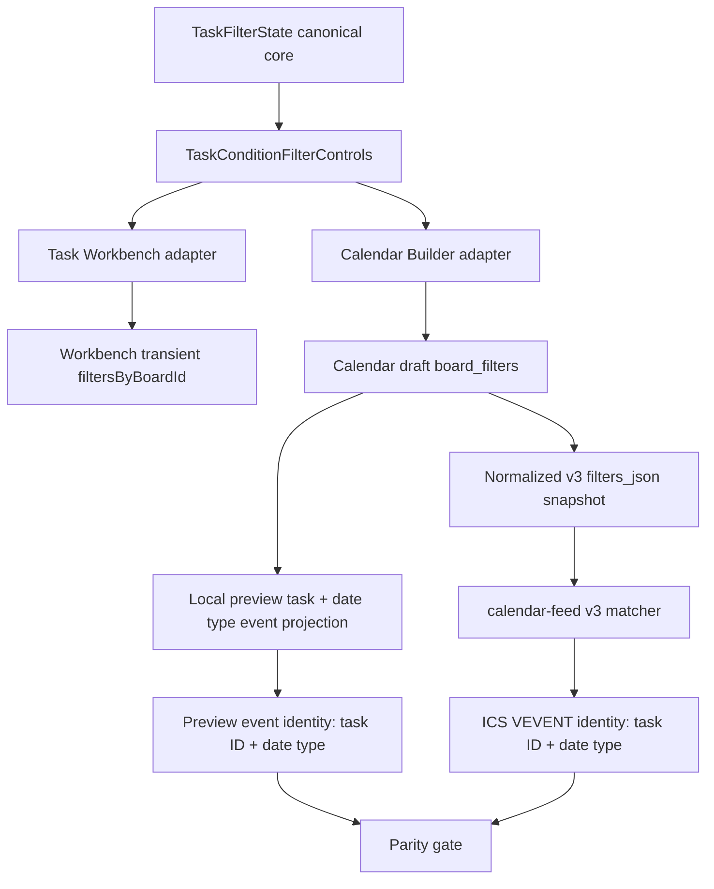

# SPEC-045: 行事曆訂閱逐看板篩選器與即時預覽

關聯 DEV：DEV-045
父交付點：DEV-037 行事曆訂閱來源範圍清晰化 / DEV-039 任務過濾器核心與全域任務平台
關聯 ADR：`ai-doc/decisions/ADR-038-calendar-subscription-per-board-filter-snapshot.md`
任務類型：Calendar subscription v3 / Per-board filter snapshot / External link safety
狀態：Phase 1-2 Local Implemented / Automated QA-QC Passed / Former v2 Remote Gate Superseded and Frozen / Phase 3-4 Release Gate Required
建立日期：2026-07-06
重大修訂：2026-07-12

## 變更摘要

2026-07-12 使用者要求行事曆訂閱器採用與全域任務工作台相同的操作心智模型：先選看板，再直接設定該看板自己的任務條件。原本的 `全域條件 -> 沿用 / 自訂 / 排除` 繼承模型增加理解與預測成本，因此在尚未部署 DEV-045 v2 migration / Edge matcher 前被正式取代。

本修訂保留 DEV-045 的交付 ID，不另開重複 DEV。既有 v2 本機實作與 QC 證據保留為歷史事實，但不得作為本修訂的驗收證據。原 Phase 3 remote migration / Edge deploy / live `.ics` gate 自本修訂起凍結；只有新的逐看板本機 RD、QA、QC 通過後，才可由新的 release 型指令重新進入 release gate。

## Problem

真正需求不是讓兩個畫面只「看起來相似」，而是讓使用者在全域任務工作台與行事曆訂閱器中，都使用同一套操作語法：

1. 開啟單一過濾器入口。
2. 選擇要設定的看板。
3. 直接調整該看板的狀態、到期範圍、關鍵字、負責人與標籤。
4. 立即看到結果。
5. 切換看板後，編輯另一組完全獨立的條件。

舊 v2 雖共用 `TaskFilterState`，但使用者還要理解全域條件、看板 override、沿用、自訂與排除。這些層級不是完成任務所必需，且會讓外部 `.ics` 連結的實際輸出較難預測。

## Human Decision Brief - 2026-07-12

決策來源：使用者要求 `$dev-pm 寫成開發文件 #引導模式`，引導題未逐題回覆後以「繼續」要求依建議值推進。依 HCS 規則採用建議 `1A / 2A / 3A`，並記錄為 AI assumptions。

### Confirmed direction

- 行事曆訂閱改為每張看板獨立設定任務條件，不再提供全域 filter inheritance。
- UI、條件語意與操作邏輯需與全域任務工作台一致，以建立使用者肌肉記憶。
- 訂閱仍是一條可保存、可預覽、可輸出的跨看板只讀連結；不是每張看板各產生一條連結。
- 每張看板直接設定自己的事件日期類型與任務條件。
- 訂閱名稱、整體預覽、輸出摘要、外部連結風險與最後儲存 / 產生動作仍是訂閱層級功能。

### Adopted HCS assumptions

- `1A`：行事曆與工作台只共用 UI component、條件語意與操作邏輯；active values / persisted state 完全獨立。工作台的暫時篩選變更不得改變既有外部連結。
- `2A`：新建訂閱納入建立當下所有可讀看板，為每張看板建立一份獨立的安全預設快照；未來新增看板不自動加入既有訂閱。
- `3A`：提供一次性的「將目前看板條件複製到其他看板」；執行前選擇目標並顯示覆寫影響，複製後各看板仍完全獨立。

### Safe defaults

- 每張看板預設 `included = true`。
- 每張看板預設只選目前使用者、排除 completed、日期範圍不限、無標籤、無關鍵字。
- 每張看板的事件日期類型預設為 `due_date`。
- 建立時只保存當下可讀取的 workspace / board snapshot。

### Rejected options

- 不即時共用工作台與行事曆的 active filter state。
- 不從工作台自動匯入目前條件；若未來需要，只能另行確認為一次性明確操作。
- 不保留可見或隱藏的 global filter template、沿用或 override 繼承。
- 不讓未來新增看板自動進入既有外部連結。
- 不把訂閱名稱、整體預覽與外部連結風險下放成每張看板的設定。

## Scope

### In scope

- 單一 `過濾器` 按鈕與 overlay；手機使用 drawer / full-height sheet。
- 看板 selector、看板納入 toggle、每張看板獨立事件日期類型與 `TaskFilterState`。
- 與工作台共用純任務條件元件與控制順序。
- selected board reset、active filter count、即時預覽與輸出摘要。
- 一次性批次複製目前看板條件到選定看板，含覆寫摘要。
- v3 `filters_json` 逐看板快照契約。
- v1 / v2 read compatibility，以及編輯時轉為 v3 draft 的明確轉換。
- Builder preview、service normalizer、DB validator、Edge feed matcher identity parity。
- 權限、partial/error、mobile、accessibility 與 visible-error gates。

### Out of scope

- 工作台與行事曆共享 active state 或持久化資料。
- 自動同步工作台 filter 到行事曆。
- global template / override / inheritance。
- 未來新增 workspace / board 自動加入既有訂閱。
- Google Calendar write API、雙向同步或即時推播。
- production migration、Edge deploy、Firebase deploy、live `.ics` smoke、merge、PR 與 rollback artifact；這些需新的 release 型指令。

## UX Contract

### Primary flow

```text
訂閱名稱

[過濾器 3] [預覽事件數] [重設目前看板]
  overlay / mobile drawer:
    看板：[工作區 / 看板 ▼]
    [納入此訂閱 toggle]
    事件日期：[開始日] [到期日]
    任務狀態
    到期日與關鍵字
    負責人
    標籤
    [複製到其他看板]

訂閱事件預覽
  2 張看板 / 33 項任務 -> 41 個行事曆事件
  開始 8 / 到期 33 / 未產生 4
  [依日期] [依看板]
  一列只代表一個實際事件：日期類型 / task title / board / localized status

輸出摘要與外部連結風險
[產生並複製訂閱連結] 或 [儲存變更]
```

### Interaction parity with Task Workbench

- 共用同一個純呈現元件，例如 `TaskConditionFilterControls`；不得維護兩份條件 JSX。
- 控制順序、label、chip selected state、number / clear behavior、search field、reset 語意、keyboard focus 與 `Escape` 關閉一致。
- 工作台專屬的 `列表 / 群組`、placement lane、未歸位、拖曳與顯示設定不得進入共用條件元件。
- Calendar-specific 的看板納入 toggle與逐看板日期類型放在共用條件元件旁；整體預覽、外部連結風險與 save action放在訂閱層級。
- Calendar draft 即時更新預覽，但只有使用者按下產生 / 儲存才持久化；工作台 filter 仍依原行為即時套用於工作台。

### Board state

- 看板 selector 只代表「正在編輯哪張看板」，不得被解讀為只預覽該看板。
- 切換看板不能遺失前一張看板尚未儲存的 draft。
- 關閉看板納入 toggle 時保留該看板 draft；重新開啟時恢復原條件。
- `重設` 只重設目前看板的任務條件與事件日期為安全預設，不影響其他看板。
- active count 只計算目前看板的任務條件，不計算 `included`或事件日期。

### Batch copy

- 使用者從來源看板選擇一或多個目標看板。
- 執行前顯示來源、目標數量、會覆寫哪些看板與「複製任務條件及事件日期、不改變是否納入」的摘要。
- 批次複製只修改前端 draft，不立即寫入 Supabase。
- 複製完成後各目標看板持有獨立值；之後修改來源看板不得連動。
- 無目標、目標只有來源本身或 draft 不完整時，批次動作 disabled 並顯示下一步。

### Event preview communication contract

- 預覽的 canonical單位是實際行事曆事件，不是原始任務卡；每列必須對應一個 `VEVENT`候選。
- 任務同時具備開始日與到期日，且該 board同時選取兩種 date types時，預覽顯示兩列並分別標示「開始」「到期」。
- 摘要同時顯示 included workspace / board數、會訂閱的 unique task數、總事件數、開始事件數與到期事件數，使用者不需自行推算一個 task會產生幾個事件。
- 預設採「依日期」分組以符合行事曆心智模型；提供「依看板」切換供範圍稽核，但不改變事件集合。
- 預覽只顯示該 board實際選取且 task確實具備的日期；不得因 task同時存在另一日期就顯示未被訂閱的日期。
- 符合任務條件但缺少所選日期時，計入「未產生事件」並可展開查看 task、board與缺少開始日或到期日的原因。
- status需使用既有繁體中文 label並降為次要資訊，不得以 raw `delayed` / `unsure`作為主要輸出。
- 預設先顯示12個事件並提供「查看全部」；展開使用頁面本身捲動，不得在預覽內建立第二個垂直捲軸。

### Mobile and viewport

- 1440 / 1024 使用 overlay 或 side panel，不與預覽產生雙重不明確垂直捲動。
- 768 / 390 / 320 使用單欄 drawer 或 full-height sheet。
- 320px 不得 horizontal overflow；看板路徑與標籤需 truncate / wrap。
- drawer 關閉後回復 focus 到過濾器按鈕。

## End-State Architecture



不可妥協規則：

- 共用的是 condition UI 與 predicate contract，不是 active state。
- 每個 board ID 在一條訂閱中只有一份 canonical filter snapshot。
- 無 global fallback；feed 不得在缺 board entry 時自行套預設。
- Preview 與 `.ics` feed 必須輸出相同 event identity集合；只比 task ID不足以證明開始／到期事件一致。
- Edge Function 每次讀取 feed 都重新確認 subscription owner 的目前 workspace / board 權限。
- snapshot 限制未來新增看板自動外流；權限被撤銷的既有看板即時停止輸出。

## Data Contract

v3 保存於既有 `calendar_subscriptions.filters_json`，不新增 subscription table：

```ts
type CalendarSubscriptionBoardFilterSnapshot = {
  included: boolean;
  date_types: Array<'start_date' | 'due_date'>;
  filters: TaskFilterState;
};

type CalendarSubscriptionV3Filters = {
  version: 3;
  v3_scope_type: 'per_board_filter_snapshot';
  workspace_ids: string[];
  project_ids: string[];
  board_filters: Record<string, CalendarSubscriptionBoardFilterSnapshot>;
};
```

Contract rules：

- `project_ids` 是建立 / 儲存當下的完整看板 snapshot，包含目前暫時 `included = false` 的看板，避免重新開啟時遺失條件。
- `board_filters` key set 必須與 normalized `project_ids` set 完全一致；缺漏、額外 key、非 UUID 或重複 mapping 一律拒絕。
- `workspace_ids` 由 `project_ids` 對應 project tenant 正規化產生，不信任前端傳入關係。
- 至少一張看板 `included = true`，否則不可產生或儲存訂閱。
- `TaskFilterState.selectedAssigneeIds` 是 v3 每張看板的 canonical assignee condition；v1 的 top-level `assignee` 不再是 v3 matching truth。
- `selectedAssigneeIds = []` 代表不限制負責人，可能包含他人與未指派，因此必須通過該看板的管理權限 gate；安全預設不可使用空陣列。
- `global_filter`、`board_overrides`、頂層 `date_types`、`v2_scope_type` 不得出現在 v3 normalized payload。
- 每個 included snapshot的 `date_types` 去重且至少一項；excluded snapshot可保留空陣列，重新納入前必須補選。

### Normalization and idempotency

- `normalizeV3Filters()` 必須解析 app legacy IDs 到 Supabase UUID、排序 / 去重 workspace 和 project IDs、正規化每張看板的 `date_types`與 `TaskFilterState`，並輸出 deterministic JSON shape。
- 同一份合法 payload 重複 normalize 結果必須相同。
- 批次複製只改 draft；最終 create / update 對單一 subscription row 做一次原子寫入。
- Token regeneration 只更新 token hash / active state，不得修改 `filters_json`。

### DB validation

- 新 migration source 以現有 DEV-037 / DEV-045 validator 為基礎，新增 v3 shape validation；不得直接修改 production。
- validator 檢查 version、scope type、project / board key set、included boolean、完整 task filter shape、date types 與至少一個 included board。
- validation function 明確 `revoke execute from PUBLIC, anon`，只授予必要的 `authenticated`；table RLS 與 owner update boundary 維持既有契約。
- 本契約仍以單列 JSONB 讀取，不新增 JSONB 查詢需求，因此不預設新增 GIN index；若實作出現依 `board_filters` 查多列的實際 query，再以 `EXPLAIN` evidence 決定。

### Edge feed query

- Edge 先從 v3 snapshot 取得 included project IDs，再與 owner 當下可讀 / 可管理 project IDs 取交集。
- Edge 不信任 client normalization；需重新 normalize board snapshot並依每筆 task的 `project_id`取得唯一 task filter與 date types。
- Query 可用所有 included boards 的 assignee union 做粗篩，但最後 identity truth 必須逐 task 套該 board filter。
- selected assignees 為空的看板不得被 union prefilter 誤刪；該看板需依權限後查詢全部 assignee 範圍。
- tag IDs 取 included board filters 的 union，只用於載入必要 tag join；最後仍逐 board matcher 判斷。
- Feed task limit 到達時不得把截斷結果宣稱完整；需沿用明確限制訊號與測試。

## Permission Contract

- 建立 / 更新者必須是 subscription owner，沿用 `calendar_subscriptions` RLS。
- 每個 snapshot board 必須在建立 / 儲存當下可讀。
- 只訂閱自己的任務可沿用一般 member 可讀邊界。
- 任一 board filter 選擇他人、未指派或不限制負責人時，該看板需 owner / admin / project_manager 等既有管理能力；不能只因使用者在另一張看板是管理者就放行。
- Feed request 雖由匿名 token 進入 Edge，資料查詢仍必須依 subscription owner 的目前 membership 重新限縮；token 本身不授予 workspace / board 權限。
- 權限撤銷、看板刪除或 membership suspended 後，下一次 feed request 必須停止輸出該看板。

## Compatibility and Migration Contract

### v1

- v1 row 仍可讀、停用、啟用、重新產生 token，feed 維持 DEV-037 行為。
- 編輯 v1 時，Builder 先依原 `scope_type / workspace_ids / project_ids` materialize board snapshot。
- v1 assignee 轉成每張看板的 `selectedAssigneeIds`；狀態預設全部開啟、dueWithinDays null、無 tag、無 keyword，以避免編輯轉換時悄悄排除原本會輸出的 completed 任務。
- 儲存前顯示 v3 預覽與轉換摘要；只有使用者按儲存才把該 row 升級成 v3。

### v2 historical local contract

- 若讀到 v2 row，依每張 `project_id` materialize effective filter：enabled false 對應 `included = false`；有 override 使用 override；否則複製當時的 global filter。
- v2 轉 v3 後不得保留 inheritance reference。
- production read-only evidence 顯示 v2 row 為 0，但實作仍保留 defensive parser，直到 deployment gate 再次確認。
- 既有 v2 本機 migration / Edge matcher / verifier 證據只作歷史回歸來源，不代表 v3 通過。

### No background rewrite

- 本 DEV 不做背景批次改寫既有訂閱。
- v1 / v2 只在使用者編輯並儲存時升級；避免未經預覽改變外部連結內容。

## Failure and Recovery Contract

- 任一 snapshot board source load 失敗時，顯示 partial/error、列出失敗看板並 disabled 產生 / 儲存；不得假裝預覽完整。
- 看板已刪除或無權時，編輯畫面保留 unresolved ID 與明確下一步，使用者可移除該看板；不得靜默改寫其他看板。
- create / update 失敗時保留前端 draft，提供重試，不清空使用者設定。
- batch copy 可在儲存前用取消 / 重設恢復；不得立即遠端寫入。
- feed 遇到單一已無權看板時排除該板；遇到 subscription payload invalid 時回傳受控錯誤，不輸出超出驗證範圍的資料。

## Phase Roadmap

### Phase 0 - Documentation replacement

- 更新 SPEC、QA、dev_task、documentation_map 與歷史 QC superseded boundary。
- 凍結舊 v2 remote gate。
- 狀態：本輪文件範圍。

### Phase 1 - Shared condition UI and per-board Builder

- 抽出 `TaskConditionFilterControls`。
- Workbench 與 Calendar adapter 共用控制元件，但 state / storage 完全分離。
- Calendar 改成 filter button + board selector + included toggle + per-board draft + batch copy + live preview。
- 移除 v3 create/edit path 中重複的 v1 source form 與 global/override controls。
- 狀態：RD Implementation Ready / Not Requested This Turn。

### Phase 2 - v3 service / validator / Edge source

- 擴充 TypeScript type、client normalizer、v1/v2 materializer、DB validation migration source與 Edge v3 matcher。
- 建立 preview/feed identity shared fixtures、static verifier、local DB transaction + rollback smoke。
- 不套 remote migration、不部署 Edge。
- 狀態：RD Implementation Ready / Not Requested This Turn。

### Phase 3 - Level 3 remote gate

- 僅在 Phase 1/2 QA/QC 通過且收到新的 release 型指令後進入。
- 需可用 `ProJED-TEST` 或符合 ADR-037 的受控替代環境；舊 branch permission blocker 不得被忽略。
- 狀態：Release Gate Required / Blocked Human Re-entry。

### Phase 4 - Production release

- 僅在 Phase 3 preview/feed parity、permission matrix、partial/error 與 compatibility evidence 通過後進入。
- 狀態：Release Gate Required / Not Requested This Turn。

## RD Handoff Contract

### Phase 1

- Scope：共用條件元件、Calendar v3 draft UI、batch copy、local preview、responsive / a11y。
- Out of scope：service / SQL / Edge / remote environment。
- Dependencies：DEV-039 task filter core、DEV-038 settings IA、DEV-042 mobile drawer boundary。
- Entry condition：本 SPEC 為 authoritative source；保護工作樹既有 DEV-046 等未提交修改。
- Acceptance：兩邊控制順序與互動一致；Calendar 無 global / override；board draft 不互相連動；preview 即時；320-1440 可操作。
- QA/QC：static source contract、desktop/mobile browser、keyboard/focus、batch overwrite、empty/partial fixtures、DEV-039 regression。
- Stop conditions：需要改 TaskFilterState 語意、共享 active state、引入 remote write、或無法保留 v1 edit compatibility。
- Evidence：專用 static/browser verifier、viewport screenshots、TypeScript、build:test、visible-error sweep。

### Phase 2

- Scope：v3 type / normalizer / conversion / SQL source / Edge matcher / local DB smoke。
- Out of scope：remote apply、Edge deploy、production data rewrite。
- Dependencies：Phase 1 payload stable；DEV-037 RLS/source scope；現行 v2 source 作 compatibility baseline。
- Acceptance：normalizer deterministic；board key set validated；permission per board；v1/v2 conversion preserves behavior；preview/feed fixture identity parity。
- QA/QC：validator allow/deny matrix、authenticated/anon grants、transaction rollback、Edge bundle/type check、v1/v2/v3 feed fixtures、task limit and tag union cases。
- Stop conditions：需要 background data rewrite、table schema change、new external service、無法以現行 owner/RLS boundary安全實作，或 production v2 rows 不再是 0。
- Evidence：static verifier、local DB smoke、Edge build/type evidence、DEV-037/039 regression、TypeScript、build:test。

### Phase 3-4

- Scope：只保留 release gate placeholder、entry condition、acceptance 與 evidence requirement。
- Entry condition：新的 release 型指令、Phase 1/2 QC 通過、Level 3 可用、artifact provenance 明確。
- Acceptance：remote validator / Edge / preview / feed / permission / compatibility evidence 完整，無 runtime-visible error。
- Stop conditions：Level 3 不可用、權限不足、migration provenance 不明、preview/feed identity 不一致、無可接受的恢復證據。
- Evidence：由 deployment-release-gate 與 Supabase gate 另行產生；本文件不預寫可執行 deploy / rollback 步驟。

## Acceptance Criteria

1. 使用者在工作台與行事曆看到相同的過濾器入口、控制順序與選取回饋。
2. 行事曆選擇看板後直接編輯該看板條件，不出現全域、沿用、自訂或 override。
3. 修改 Board A 不影響 Board B；切換後 draft 保留。
4. 工作台 filter 變更不影響任何既有訂閱，反之亦然。
5. 批次複製明確顯示來源、目標與覆寫影響；複製後不建立連動。
6. 預覽摘要可回答 workspace、board、included board、task 與 date type 數量。
7. Preview 與 `.ics` feed matched task IDs 一致。
8. v1 / v2 編輯轉換不靜默縮小或擴大原輸出。
9. 無權、已刪、partial load、invalid payload 與空 included scope 都有安全阻擋與下一步。
10. 320 / 390 / 768 / 1024 / 1440 viewport 無重疊、裁切、不可操作或 horizontal overflow。

## QA / QC Gate

- Shared UI source contract：Calendar 與 Workbench 使用同一純條件元件。
- State isolation：兩邊 storage key、draft 與 persistence 不互相寫入。
- Browser：desktop / mobile、board switch、included toggle、reset selected board、batch copy、preview、save draft recovery。
- Compatibility：v1、defensive v2、v3 create/edit/feed。
- Permission：member / project_manager / admin / owner、他人、未指派、空 assignee filter、membership revoke。
- DB：validator shape/key-set/grants、transaction rollback、invalid payload negative cases。
- Edge：per-board filter、tag union、assignee union、unrestricted assignee board、task limit、permission recheck。
- Regression：DEV-037、DEV-039、settings project context、TypeScript、build:test。
- UI QC：actual rendered route、visible-error sweep、focus restore、320-1440 screenshots。

## Stop Conditions

- RD 準備部署舊 `global_filter / board_overrides` v2 migration 或 Edge matcher。
- 共用元件需要工作台與行事曆共享 active values。
- v3 payload 缺 board entry 時以 global default 自動補值。
- partial/error preview 仍可產生或儲存連結。
- 權限檢查只在前端或只在建立時執行，feed request 未重新驗證。
- 需要 background rewrite、正式資料修復、remote migration、Edge deploy、production deploy 或 release artifact。

## Architecture Memory Capsule

- Authoritative product direction：逐看板獨立 filter snapshot；舊 v2 inheritance 被 intentional replacement。
- Muscle memory 來源：相同入口、相同條件控制、相同 reset / selected feedback；不是共享 state。
- External-link safety：Calendar draft 需 preview + explicit save；工作台仍是 transient immediate view filter。
- Snapshot safety：建立當下所有可讀看板進入 snapshot；未來看板不自動加入；被撤權看板不再輸出。
- Compatibility：v1 保持 feed；v1/v2 edit materialize v3；不背景改寫。
- Production：v2 migration / Edge 未部署，production v2 rows read-only evidence 為 0；舊 remote gate 已凍結。
- Re-entry：共享 active state、動態未來看板、background migration、Google write API、remote/release 都需重新回人類或 release gate。

## Deferred Scope Audit

| Deferred scope | Classification | Tracking / reason | Resume condition |
|---|---|---|---|
| Phase 1 local UI implementation | Same Spec Phase | Phase 1 RD Handoff Contract | 使用者提出實作 / RD 指令 |
| Phase 2 local service / SQL / Edge source | Same Spec Phase | Phase 2 RD Handoff Contract | Phase 1 payload stable |
| Remote migration / Edge / live `.ics` | Blocked Human Re-entry / Release Gate Required | Phase 3 placeholder | 新 release 型指令 + Level 3 ready |
| Production release / smoke / rollback | Blocked Human Re-entry / Release Gate Required | Phase 4 placeholder | Phase 3 QC passed + release confirmation |
| Future boards auto-join | No Tracking | 已拒絕；違反 snapshot 外流邊界 | 使用者改變產品方向 |
| Shared Workbench/Calendar active state | No Tracking | 已拒絕；會讓 transient UI 改變外部連結 | 使用者改變產品方向 |
| Global template / inheritance | No Tracking | 已拒絕；與逐看板心智模型衝突 | 使用者改變產品方向 |
| Google Calendar write / two-way sync | No Tracking | 不屬只讀 ICS 訂閱 | 另提新產品需求 |
| Background v1/v2 row rewrite | Blocked Human Re-entry | 會改正式資料且未經逐筆 preview | 明確資料遷移 / 修復指令 |

## All-Phase Coverage Matrix

| Phase / DEV | Execution boundary | Document status | Scope | Out of scope | Entry condition | Acceptance | Evidence |
|---|---|---|---|---|---|---|---|
| DEV-045 Phase 0 | 本輪文件 | Complete | SPEC / QA / dev_task / documentation_map / QC superseded note | Product code / release | 使用者要求寫成開發文件並回覆繼續 | 新方向完整、舊 remote gate 凍結 | file diff / consistency audit |
| DEV-045 Phase 1 | Authorized / Complete | Local Implemented / Automated Browser QC Passed | Shared controls、per-board Builder、batch copy、local preview | SQL / Edge / remote | Phase 0 complete | UX parity、state isolation、responsive gates | static 18/18、browser 1440/1024/390/320、TypeScript、build:test |
| DEV-045 Phase 2 | Authorized / Complete | Local Implemented / DB-Edge QC Passed | v3 normalizer、compatibility、validator/Edge source、local DB smoke | Remote apply/deploy | Phase 1 payload stable | Preview/feed fixtures parity、permission + DB gates | model 10/10、feed 13/13、DB 20 behaviors rollback、Deno、DB lint、DEV-037/039 |
| DEV-045 Phase 3 | 高風險重返 | Release Gate Required / Blocked Human Re-entry | Level 3 remote migration / Edge / live feed evidence | Production release | 新 release 指令 + Phase 1/2 QC + Level 3 ready | Remote parity and recovery evidence | future release-gate evidence |
| DEV-045 Phase 4 | 高風險重返 | Release Gate Required / Not Requested This Turn | Production release boundary | 未確認的新功能 / background rewrite | Phase 3 pass + production release confirmation | Production runtime and data safety gates | future release evidence |

## RD Readiness Review

- UI/state contract：完整，無 P0/P1 缺口。
- Type/service contract：完整，v3 canonical shape、normalization、idempotency與 compatibility 已定義。
- DB/migration contract：完整到 local source / local DB gate；remote apply 受 release gate 阻擋。
- Permission contract：完整，create/update 與 feed-time recheck 均有定義。
- Failure recovery：完整，draft preservation、partial/error blocking、unresolved board 與 invalid feed 已定義。
- QA/QC：完整，Phase 1/2 可直接實作與驗證。
- Release：未授權且刻意延後，不影響 Phase 1/2 `RD Implementation Ready`。

結論：Phase 1、Phase 2 為 `RD Implementation Ready / Not Requested This Turn`；Phase 3、Phase 4 維持 `Release Gate Required`。
