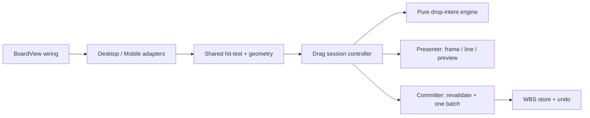

# SPEC-052：看板拖拉子系統重構與行為穩定化

狀態：Deferred / Not Executable / DEV-051 Baseline Withdrawn
對應 DEV：DEV-052
節點類型：開發點
父交付點：DEV-051、DEV-046、DEV-029
文件成熟度：RD Implementation Ready
風險等級：Medium（主要看板操作、桌機／手機手勢、階層與排序一致性）
是否計入產品交付完成：否
建立日期：2026-07-16
最近更新：2026-07-16

使用思考習慣：#批判、#效用理論、#系統描繪

> 2026-07-16 回復註記：DEV-052 以 DEV-051 行為為 characterization 基準；該基準已撤回，
> 因此本 SPEC 不再是 RD Implementation Ready。只有重新確認產品行為，或另立以 `main`
> 為基準的新 DEV 後，才能重新評估 Slice A～F。

## 1. 決策摘要

本 DEV 採「只重構看板拖拉子系統」；不重寫整個 `BoardView`、不改變已確認的拖拉 UX，也不擴張到清單、心智圖、甘特或全域任務工作台的模式專屬拖拉。

選擇此方案的理由：

- 現有錯誤集中在拖拉 session、目標判定、幾何、預覽、計時與提交彼此交錯，而非整個看板資料模型失效。
- 繼續局部補判斷會增加狀態組合與回歸成本；整頁重寫則會把既有篩選、權限、紀錄、工作台與會議模式一起暴露在不必要風險中。
- 目標式重構可保留 DEV-051 已驗證行為，並用 characterization tests 逐片替換，預期效用最高。

ADR 判定：不另建 ADR。本次是內部、可逆、無資料模型與外部 API 影響的模組邊界整理；替代方案、選擇與後果由本 SPEC 保存即可。

## 2. 問題與證據

### 2.1 Current Architecture Facts

- `src/components/BoardView.tsx` 目前約 1,824 行；同一 component 同時擁有拖曳來源、桌機 pointer、手機 touch action、lock／unlock timer、auto-scroll、hit-test、preview geometry、drop revalidation 與 store commit。
- lock state 同時存在 React state、ref、pending target ref 與多個 timer ref；取消路徑分散於 drag cancel、Escape、blur、pagehide、visibility、pointercancel、touchcancel 與 unmount。
- 桌機同時參考 dnd-kit collision、`elementsFromPoint` 與最後一次 `over`；手機另以 `elementFromPoint`、20px tolerance 與 action rail 判定，目標優先序存在分流。
- 插入線由 feedback component 渲染，但桌機 placement preview 再用 DOM query 找線的位置；hit-test 又需要暫時隱藏 preview，形成幾何與渲染互相依賴。
- release 時再混合 transient state、event collision 與 pointer target 選擇最終 target，容易發生預覽位置與實際提交位置不同。
- `kanbanDropIntent.ts` 已有 pure state／target resolver，但同時包含 move update builder；runtime orchestration、DOM adapter 與 commit boundary 尚未真正分層。

### 2.2 真正問題

拖拉目前缺少單一權威 session：同一時間可能有多個目標來源、多套幾何與多條提交路徑。每次修正單一視覺問題，都可能改變碰撞判定、手機手勢或 release 結果。

重構後必須建立三個不變量：

1. 每一幀只接受一個 normalized target observation。
2. 插入線、鎖定框與預覽卡使用同一份 target／geometry。
3. 每個 drag session 最多提交一次；cancel 或 invalid 永遠零寫入。

## 3. Spec Governance

分類：`Compatible exception`

- `SPEC-051` 繼續是看板拖拉產品行為的 authoritative source。
- 本 SPEC 只取代 `SPEC-051` 第 5、11、13 節所描述的內部實作架構與分片方式；不取代 Human Decision、timing、落點、視覺、資料、undo、permission 與 cancellation 契約。
- `SPEC-046` 的 whole-task drag surface 保持有效。
- `SPEC-029` 的 mobile pan-first、quick tap、long-press、action rail、edge auto-scroll 與 cancel safety 保持有效。
- `SPEC-039` filtered canonical ordering、`SPEC-044` undo、`SPEC-048` structural update guard 必須維持回歸通過。
- DEV-051 可將 physical phone 列為 supplemental；DEV-052 因使用者明確要求真實操作驗證，將 physical iOS／Android 提升為「本開發點完成」必要證據。這只收緊 DEV-052 QA gate，不回溯改寫 DEV-051 的既有完成事實。

## 4. UX Intent 與不可變行為

- 使用者：在看板上快速整理 L1～L5 任務的桌機與手機使用者。
- 主要任務：在不誤改階層的前提下，把任務移到可預期的同層順序或其他父層。
- 心智模型：同父層直接排序；換父層需停留鎖定；線表示會插入的位置，框表示鎖定的父層。
- 成功狀態：放開後的父層與順序等於放開前最後可見落點，且可一次 undo。
- 最可能誤解點：來源與 preview 同時出現、非目標也出現插入線、preview 與線不同步、離開目標後仍保留舊 target。
- 安全預設：未鎖定、invalid、target 消失、權限改變或 session 已結束時一律 no-op。

下列行為不得因重構改變：

1. 同 `parentId` 立即 before／after，不等待 750ms。
2. 跨 `parentId` 需停留 750ms；`<700ms` 不得提交，`>800ms` 尚未鎖定為失敗。
3. 鎖定框表示整個父層群組；只顯示插入線與鎖定框，不顯示鎖定文字、breadcrumb、Level、倒數、progress bar 或 floating status。
4. 同一時間最多一條有效插入線；非目標 lane 不顯示線，也不因候選位置新增空白或改變卡片間距。
5. 插入線使用與鎖定框相同的 primary blue token。
6. 拖曳來源在原位置直接移除，不保留淡色、輪廓、空位、placeholder 或來源任務名稱。
7. 無有效插入位置時，顯示跟著游標／手指的 preview；中心與 pointer／touch point 對齊。
8. desktop 有有效插入位置時，pointer preview 隱藏，改顯示與插入線同步的 placement preview；moving task title 不得同時出現兩份。
9. mobile 有有效插入位置時，pointer preview 隱藏；以插入線／鎖定框表示落點，不得留下第二份任務名稱。
10. 除來源任務從原群組移除造成的自然收合外，目標群組及其他非目標任務的座標與間距在 drop 前保持穩定。
11. empty／collapsed／filtered-empty parent 使用 text-free child lane，完成 lock 後 append 為直接 child。
12. filtered visible task 只作 anchor；hidden siblings 保持相對順序。
13. cycle、self、descendant、無權限、target 消失均不得提交。
14. 一次有效 move 只建立一次 batch／undo；undo／redo 完整還原或重現。
15. action rail target 優先於 task-position drop，不得 double-submit。

## 5. Scope

### 5.1 Current Scope

- 重構看板拖拉 state、timer、pointer／touch target observation、preview presentation、commit 與 cleanup。
- 桌機 dnd-kit adapter 與手機 long-press adapter 共用 target priority、session 與 commit contract。
- 建立 characterization、pure、browser geometry、real-operation 與 regression gates。
- 從 `BoardView` 移除拖拉細節，只保留 DndContext／context provider／store dependency wiring。
- 重構完成後刪除被新 controller 取代的 timer、preview、hit-test 與 release fallback 邏輯。

### 5.2 Out of Scope

- 不改使用者已確認的落點語意、750ms／200ms／20px 常數與 text-free feedback。
- 不新增新拖拉模式、動畫、文字提示、偏好設定或 feature toggle。
- 不重寫 `BoardView` 的篩選、日期、dependency、meeting、record、workbench、permission 或新增任務功能。
- 不改 list、mind map、Gantt、calendar 的模式專屬拖拉。
- 不改 `TaskNode`、DB schema、migration、RLS、RPC、API 或同步協定。
- 不執行 commit、push、PR、deploy、production smoke 或 remote mutation。

## 6. 目標架構



### 6.1 Ownership Matrix

| Layer | 建議檔案 | 唯一責任 | 禁止事項 |
|---|---|---|---|
| Pure engine | `src/components/Wbs/kanbanDrag/kanbanDragEngine.ts` | phase、timing、target validity、canonical order inputs | 不可讀 DOM、React、window、store；不可寫資料 |
| Target adapter | `src/components/Wbs/kanbanDrag/kanbanDragTargetAdapter.ts` | 將 dnd／pointer／touch／action rail 轉成單一 observation，產生 indicator geometry | 不可擁有 timer、commit 或 undo |
| Session controller | `src/components/Wbs/kanbanDrag/useKanbanDragSession.ts` | session id、clock、arming／unlock、at-most-once、cancel cleanup、auto-scroll coordination | 不可自行重算另一套 target；不可直接渲染 |
| Committer | `src/components/Wbs/kanbanDrag/kanbanDragCommit.ts` | 以最新 store snapshot 重驗 target，建立 updates 與單一 command | hover／arming 不可呼叫；不可渲染 |
| Presenter | `src/components/Wbs/kanbanDrag/KanbanDragPresenter.tsx` | frame、唯一 insertion line、pointer／placement preview | 不可 hit-test、啟 timer、讀寫 store |
| Wiring | `src/components/BoardView.tsx` | 提供 permission、store callbacks、DndContext handlers 與 contexts | 不可直接持有 lock timer、`elementsFromPoint`、preview state 或 drop precedence |

現有 `KanbanCard`、`KanbanChecklist`、`KanbanColumn` 只提供 stable target metadata 與 source-hidden 狀態；不得各自實作 drop 規則。

### 6.2 Normalized Observation Contract

```ts
type KanbanDragInputMode = 'mouse' | 'touch';

interface KanbanTargetGeometry {
  targetRect: DOMRectReadOnly | null;
  indicatorRect: { left: number; top: number; width: number } | null;
  pointer: { x: number; y: number };
}

interface KanbanTargetObservation {
  sessionId: string;
  inputMode: KanbanDragInputMode;
  action: MobileTaskAction | null;
  target: KanbanResolvedDropTarget | null;
  geometry: KanbanTargetGeometry;
  observedAt: number;
}
```

- 每個 pointer／touch frame 只建立一次 observation。
- target priority 固定為：mobile action rail → 同父層 task anchor → child empty lane →其他 task anchor → parent group → none。
- dnd collision 只能在 pointer point 不可取得，或 collision anchor 確實位於 pointer 下時作 fallback；不可覆蓋較新的 point observation。
- preview、indicator 與 drop 使用同一 observation，不得在 presenter 或 release handler 重新選另一個 target。
- auto-scroll 後可建立新的 observation；舊 observation 以 `sessionId` 與 sequence／timestamp 被淘汰。

### 6.3 Session Contract

每個 session 至少保存：

- `sessionId`、`sourceNodeId`、`inputMode`、`terminalState`。
- 最新 pointer、observation、intent state 與 presentation state。
- 一個 parent-lock timeout、一個 unlock-grace timeout、至多一個 auto-scroll animation frame。
- `committed`／`cancelled` terminal guard；terminal 後的 move／end／timer callback 必須被忽略。

因可見 progress 已退役，不得再以 50ms interval 驅動 React progress state。診斷用 progress 由 `startedAt` 與 clock 即時計算，或只保留 0／1 data attribute。

### 6.4 Presentation Contract

Presenter 只接受已導出的 presentation model：

```ts
type KanbanPreviewMode = 'none' | 'pointer' | 'placement';

interface KanbanDragPresentation {
  previewMode: KanbanPreviewMode;
  pointer: { x: number; y: number } | null;
  indicatorRect: { left: number; top: number; width: number } | null;
  lockedParentKey: string | null;
  title: string;
}
```

- `pointer` 與 `placement` 互斥。
- desktop placement preview 與 indicator 使用同一 `indicatorRect`；`left`／`width` 差異不得超過 2px。預設位於 line 下方 4px（容許 ±2px rounding）；若 viewport 空間不足，需明確 flip 到 line 上方 4px，不可用任意 clamp 造成 preview 與 line 重疊或失去關係。
- pointer preview 幾何中心與 pointer point：desktop 誤差 ≤8px，mobile 誤差 ≤12px。
- preview layer 必須 `pointer-events: none`；hit-test 不應再靠反覆切換 preview `display` 形成正確結果。
- visible moving-task title count 必須 ≤1；source-hidden 與 preview mode 必須由同一 session state 導出。

### 6.5 Commit Contract

- release 前使用最新 nodes／permission 重新驗證 source、parent、anchor、cycle 與 board identity。
- 只有 `same-parent` 或同一 `lockedParentId` 的 target 可產生 command。
- committer 回傳 `committed | no-op` 與 reason；只由 BoardView 注入的單一 `batchUpdateNodes` callback 寫入。
- 每個 `sessionId` 最多呼叫一次 batch；touchend、pointerup、dnd end、timer 或 stale event 重入不得 double commit。
- source／destination sibling normalize、ancestor rollup 與 undo 必須保持單一 command。
- hover、arming、preview、scroll、cancel、invalid 不得寫 store、DB 或 undo。

## 7. Stable DOM 與 Diagnostic Contract

既有 DEV-051 attributes 需保留；可新增 session／geometry 診斷，但不可只靠 class 驗證：

- `data-kanban-parent-lock-state`
- `data-kanban-drop-parent-id`
- `data-kanban-drop-indicator`
- `data-kanban-drop-position`
- `data-kanban-child-empty-lane`
- `data-kanban-drag-source-hidden`
- `data-kanban-pointer-drag-preview`／`data-mobile-drag-preview`
- `data-kanban-placement-preview`
- 新增 `data-kanban-drag-session-id`
- 新增 `data-kanban-preview-mode="none|pointer|placement"`

`invalidReason` 可留在 internal state／data attribute 作診斷，但不得重新成為可見鎖定文字。

## 8. RD File Contract

### 8.1 新增／搬移

- 建立 `src/components/Wbs/kanbanDrag/`，放置 engine、target adapter、session hook、committer 與 presenter。
- 將 `kanbanDropIntent.ts` 的 pure state／resolver 搬入 engine；將 `buildKanbanMoveUpdates` 搬入 committer。
- 原路徑若仍有相鄰 verifier／import，僅在 migration slice 保留 re-export；所有 call site 完成後移除 compatibility file。
- 新增 `scripts/verify-dev-052-kanban-drag-subsystem-refactor.mjs`。
- 新增 `scripts/verify-dev-052-kanban-drag-subsystem-refactor-browser.pw.js`。
- `package.json` 登錄兩個 DEV-052 commands。

### 8.2 修改

- `BoardView.tsx`：改用 `useKanbanDragSession` 回傳的 handlers／presentation／context；移除直接 timer、DOM hit-test、preview state 與 drop fallback。
- `KanbanDropFeedback.tsx`：改為 presenter 的純視覺子元件，geometry／state 由 props/context 提供。
- `KanbanCard.tsx`、`KanbanChecklist.tsx`、`KanbanColumn.tsx`：只保留 metadata、source hidden、pointer/touch begin delegation。
- `mobileTaskActionContext.ts`：若需要，只調整 callback contract，不改 action set 或 long-press 語意。
- `useWbsStore.ts`：除非 characterization test 證明既有 batch／undo contract 不足，否則不修改。

### 8.3 BoardView Exit Gate

重構完成後，`BoardView.tsx` 不得直接出現：

- `kanbanLockTimerRef`、`kanbanUnlockTimerRef`、`kanbanProgressTimerRef`。
- `document.elementsFromPoint`／`document.elementFromPoint` 的看板 target 判定。
- `desktopPlacementPreview`／`desktopPointerPreview` state。
- 看板 `buildKanbanMoveUpdates` 與 at-most-once commit 判斷。
- desktop／mobile 各自獨立的 target priority。

不以單純行數作為通過條件；以責任與依賴方向作 gate。

## 9. Implementation Slices 與 Phase Gates

| Slice | Execution boundary | 輸出 | Gate | Stop condition |
|---|---|---|---|---|
| A Characterization | 先執行 | 凍結 DEV-051 行為、重現已知 preview／line／source／spacing cases | DEV-051 33/33、browser、before snapshots | baseline 無法穩定重現或存在未記錄 P0 |
| B Engine + session | A 通過後 | pure engine、clock／scheduler、session id、single cleanup | pure timing／race／at-most-once tests | 任一既有 UX 或 commit 結果改變 |
| C Shared target adapter | B 通過後 | desktop／mobile 單一 observation 與 geometry | target priority、stale collision、scroll re-hit tests | desktop／mobile 產生不同 target |
| D Presenter | C 通過後 | 唯一 line、frame、pointer／placement preview | geometry、single-title、spacing、viewport browser evidence | preview 與 line 不同步或出現第二條線 |
| E Commit + legacy removal | D 通過後 | fresh revalidation、single batch、BoardView exit gate | undo／redo、cancel、permission、static ownership | double commit、資料遺失、legacy path 仍可執行 |
| F QA/QC handoff | E 通過後 | automated + 真實操作證據 | `QA-DEV-052` 全部 stop-ship gate | 缺 desktop 真實滑鼠或 physical touch evidence |

每個 slice 必須在同一 slice 內移除被取代的執行路徑；不得長期保留新舊兩套 target／commit 邏輯。

## 10. Acceptance Criteria

### 10.1 Architecture

1. BoardView Exit Gate 全部成立。
2. desktop／mobile 共用 target priority、intent engine、session terminal guard 與 committer。
3. 一個 frame 只有一個 observation；一個 session 最多一次 commit。
4. engine／committer 可在無 DOM、無 React、無 store singleton 下測試。
5. presenter 不做 hit-test、timer 或 store write；adapter 不做 commit。
6. 所有 cancel／unmount／stale timer 走單一 cleanup contract。
7. 無 50ms arming progress interval；僅保留必要 timeout／RAF。
8. legacy target／preview／commit path 移除，無雙軌 runtime。

### 10.2 Product Behavior

1. SPEC-051 的 15 項 acceptance 全數維持。
2. L1～L5 同父層、跨父層、empty、collapsed、filtered、root append 結果一致。
3. 非目標不顯示 insertion line；全畫面有效 insertion line count ≤1。
4. insertion line 與 lock frame 使用相同 primary blue token。
5. source 原位置完全移除；moving-task title 可見數量 ≤1。
6. 無 target 時 preview 精準跟隨 pointer／finger；有 target 時 preview mode 正確切換。
7. desktop placement preview 與 line 幾何符合第 6.4 節；非目標 task spacing 不變。
8. 快速切換 parent、離開 board、auto-scroll、filter 變動後不保留 stale target。
9. Escape、blur、pagehide、visibility、pointercancel、touchcancel、unmount 後可立即開始新 session。
10. permission／cycle／missing target 為 no-op；action rail 不與 move double-submit。
11. commit／undo／redo 無 duplicate、missing、order drift 或 ancestor drift。
12. 1440x900、1024x768、390x844、320x844 無重疊、裁切、非預期 overflow 或 visible runtime error。

## 11. QA、QC 與 Evidence

- QA authoritative plan：`ai-doc/qa/QA-DEV-052-kanban-drag-subsystem-refactor.md`。
- DEV-051 既有 static／browser tests 是 regression baseline，不可因新增 DEV-052 verifier 而刪除。
- 真實操作是完成 gate：desktop 實際滑鼠、實體 iOS Safari 與 Android Chrome 均需留下錄影／截圖、viewport、操作步驟與資料 snapshot；缺任一類只能標示 `未充分驗證`。
- QC 只驗證，不修改產品程式；失敗回送 RD 修正後重跑最小相關 slice 與完整 stop-ship regressions。

## 12. Stop Conditions

下列任一項發生即停止該 slice，不得以其他測試通過抵銷：

- target、indicator、preview 或 commit 不是來自同一 observation。
- 新舊 runtime 同時可處理同一 drag event。
- `<700ms` 跨父層提交、double commit、cancel 後寫入、cycle 成立或 undo 不完整。
- source／preview 任務名稱重複、有效線超過一條、非目標 spacing 跳動、preview 與 line 不同步。
- mobile short pan／quick tap／action rail／touchcancel 回歸。
- current dirty worktree 中無法分辨 DEV-052 與既有使用者變更的邊界；需先保存可回復的 baseline diff 與通過證據，再開始 extraction。

## 13. Deferred Scope Audit

- Production release：`Release Gate Required`；收到 release 型指令後才建立 release artifacts。
- 其他模式共用 drag engine：`Future Phase Captured / Not Requested`。只有看板重構完成、DEV-052 QA/QC 通過，且其他模式確有相同 target／session contract 時才重新評估；不得在本 DEV 順手泛化。
- 觸覺回饋、動畫與使用者自訂 dwell time：一般 future idea，不影響本 DEV，不建立新 DEV。

## 14. Related Documents

- `ai-doc/specs/SPEC-051-kanban-cross-parent-drag-lock.md`
- `ai-doc/qa/QA-DEV-051-kanban-cross-parent-drag-lock.md`
- `ai-doc/qa/QA-DEV-052-kanban-drag-subsystem-refactor.md`
- `ai-doc/specs/SPEC-046-universal-task-surface-drag.md`
- `ai-doc/specs/SPEC-029-mobile-pan-first-touch-interactions.md`
- `ai-doc/specs/SPEC-039-task-filter-core-and-workbench-profiles.md`
- `ai-doc/specs/SPEC-044-undo-recovery-scope-expansion.md`
