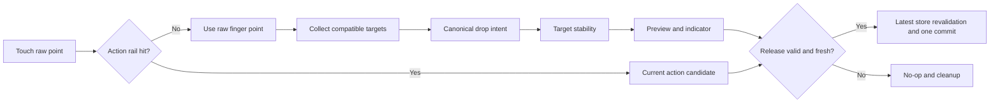

# SPEC-054：手機任務拖拉定位精準度優化

狀態：RD Rework 4 Implemented / Automated Browser + User Revalidation Passed / Physical Device Gate Pending

優先級：P1

風險：Medium（多檔 UI interaction、共用拖拉契約與真機驗證；不涉及 DB / API / production）

文件成熟度：Implemented Contract / Physical Gate Pending

是否計入產品交付完成：是

來源 ID：`USER-20260717-mobile-task-drag-precision`

父任務：DEV-053、DEV-029、DEV-046

## 1. 問題與結論

使用者實際在手機拖拉任務時，觀察到落點定位不如電腦版穩定與精準。程式盤查確認這不是單一觸控雜訊，而是下列因素疊加：

- 桌機透過 dnd-kit collision 與既有來源／目標順序推導落點；手機使用 `elementFromPoint()` 單點命中，再用目標 DOM 上下半區決定 `before / after`。
- 手機 target、drop position 與 indicator 每次 move / auto-scroll frame 都立即改寫，沒有目標保留區、交接遲滯或穩定鎖。
- 手機 preview 以手指中心為中心，遮住目標內容與隱形上下半區。
- auto-scroll 每幀最多移動 18px，與 checklist 最小列高 18px 相同；手指靜止時，畫面仍可能一幀跨過一列。
- 手機拖拉 session 的全域 `touchend` 監聽在非拖拉狀態也可能 `preventDefault()`，會抑制瀏覽器產生 native click，導致手機模式頂部欄按鈕不可按。
- Mobile action rail 視覺上是 button，但缺少直接 tap 的 `onClick` command path；長按放手後進入 action rail 時，使用者第二次點 action 無法形成穩定操作記憶。
- DEV-053 browser / QA gate 證明功能、cleanup、viewport 與指定座標流程正確，但沒有量測真實手指下的重複定位成功率。
- 2026-07-17 使用者以電腦模擬手機重新驗證後判定定位比舊版更差且 indicator 亂跳；此反證推翻先前 targeted browser pass 對「定位品質已改善」的解讀，DEV-054 退回 RD。
- 2026-07-17 使用者再提供實際畫面，顯示 preview 與 insertion line 分處不同 checklist row，主觀上等同「定位到完全不相干的位置」；幾何盤查確認固定 40px preview clearance 會再疊加半列高度，形成約 50px 的視覺斷裂。
- 重現確認固定 `rawY - 28px` 會讓手指壓在 18px checklist row 中心時命中上方 parent card，而非手指所在 row。
- `useMobilePanBroker` 在 long press drag 已成立後仍依起手座標改寫 `scrollTop`，與 task drag session 同時處理同一事件；一次向上拖曳中可觀察 `scrollTop` 連續變化而 task auto-scroll 回報 `didScroll:false`，造成 DOM 在手指下方位移。
- 原 handover 規則允許 retain region 內的邊界候選累積 80ms 後換列；Chrome 模擬同時產生 touch / pointer 事件時，同一物理 move 也可能被重複計算，放大跳動。
- Mobile source placeholder 與 live target indicator 共用相同 `KanbanInsertionMarker`，來源原位會留下第二條藍線，使用者無法判斷哪一條才是實際落點。
- 2026-07-17 使用者第三次以電腦模擬手機驗證仍失敗；新截圖顯示 preview 已跟隨手指移到下方，但舊 indicator 仍停在上方約 120px。Browser 邊緣快速跨列重現證明：離開 retain 後的 80ms dwell 會在 pending candidate 連續換列時反覆重置，讓遠距舊 indicator 留在畫面；切換 target 後，展開 checklist 的 tall-card rect 又會使 canonical before/after line 位於整卡頂／底，與 finger preview 再次分離。
- 2026-07-17 使用者第四次驗證指出「越改越糟」；截圖與新增 R10 證明 Rework 3 的 preview-to-indicator docking 是錯誤補償：它把 target geometry 的錯誤轉嫁給 preview，使拖曳物離開手指。更深層根因是 `elementsFromPoint()` 在 innermost checklist source 無效後繼續採用 ancestor card，且 expanded card 的整體 rect 包含所有 checklist descendants，造成 parent card 頂／底線被誤當落點。
- Rework 4 改採三個不可混合的責任：preview 永遠只跟手指；target 只由 raw point 下的 innermost task surface 決定；indicator 只畫 canonical target boundary。Invalid innermost surface 具有 ancestor-blocking 權，且 card target geometry 限制在 primary surface，不含展開 checklist。

DEV-054 的核心方向是：**保留使用者已滿意的桌機 UI 與行為，讓手機只作為不同輸入介面，落點語意、有效目標與 commit intent 改用桌機同源契約。**

## 2. Human Decision Brief

### 2.1 已確認決策

- 依使用者 2026-07-17 回饋，採用「手機向桌機落點契約收斂」方向，不重新設計桌機拖拉。
- 桌機拖拉 UI、起手、overlay、collision、click / right-click 分流與 commit 結果是 frozen baseline。
- Workbench `placed row` 仍不能拖，不得產生 drag source，也不得在手機長按進入 action rail。
- 手機不再以任務 DOM 上下半區作為隱形 `before / after` 控制。
- 手機正常觸控 topbar、drawer、workbench 等非拖拉 UI 時，drag session 不得攔截 native click。
- Mobile action rail 保留既有 action set，但必須同時支援「拖放到 action」與「長按放手進入 armed rail 後點擊 action」兩種一致操作。
- 本 DEV 必須完成真實 iOS 與 Android 實機操作驗證；未執行只能判定 `未充分驗證`。

### 2.2 與 DEV-053 的關係

- DEV-053 的架構重構、功能 gate 與 T01-T14 歷史結果維持有效，不回寫成失敗。
- DEV-054 是 post-completion product finding 的獨立交付點，補足 DEV-053 未量測的真機定位精準度。
- DEV-053 的 physical phone supplemental 決策只適用於 DEV-053 歷史完成門檻；DEV-054 因問題本身是實機手感，physical iOS / Android 改為 required completion gate。
- Spec Impact：`Compatible exception`。本 DEV 不恢復 DEV-051 parent-lock，不執行 archived DEV-052，也不改 placed-row no-drag 決策。

## 3. 使用者價值與成功定義

- 手機只需拖到與桌機相同的目標，不需精瞄不可見的上下半區。
- 手指在目標附近自然抖動時，indicator 與實際 commit 不會在相鄰任務間來回跳動。
- 自動捲動時，畫面不會在手指未動的情況下一幀跨過完整 checklist row。
- 放手前看見的穩定 indicator 必須等於最終 commit 結果。
- 錯誤落到相鄰任務、錯誤父層或 action rail 的次數為 0；不確定時寧可 no-op，不可提交舊 target。

## 4. Scope

### 4.1 In Scope

- 抽出桌機與手機共用的 canonical task drop intent resolver。
- 手機 task target 與 action rail 都以 raw touch point 命中；preview 無論是否存在有效 target，都只以 raw point + 12px clearance 跟隨，不得被 indicator 拉離手指。
- 建立 mobile target descriptor、compatible target filtering、innermost-surface ownership、ancestor fall-through blocking 與 nested target priority；不使用 nearest-target 磁吸。
- 建立 target retain、handover hysteresis、pending candidate 與 release-time freshness contract。
- 調整手機 preview、indicator z-order、viewport clamp 與 finger clearance。
- 降低並平滑 horizontal / vertical edge auto-scroll，捲動後以穩定器重新解析 target。
- 修正手機全域 touch lifecycle 不得壓制一般頂部欄／面板按鈕 native click。
- 修正 mobile action rail button 的直接 tap command path，並保留 at-most-once terminal guard。
- 新增 pure/static/browser verifier 與 iOS / Android 真機量化驗證。
- 保留 DEV-029 / DEV-039 / DEV-046 / DEV-053 所有仍有效回歸。

### 4.2 Out of Scope

- 不改桌機 drag overlay、drag start threshold、collision UI、drop indicator 或 interaction path。
- 不新增跨父層 750ms lock、breadcrumb、Level、進度條或教學文案。
- 不改 mobile action rail 的完成、新增同階、新增下階、刪除 action set。
- 不開放 Workbench placed row 拖拉；placed row 的 target 身分若目前存在，本 DEV 不自行擴張或移除其產品語意。
- 不調整 500ms long press 與 8px pre-activation pan tolerance，除非新增證據證明啟動辨識本身造成失敗。
- 不改 DB schema、migration、RLS、RPC、TaskNode data model、production data 或 deployment。
- 不處理 MindMap / Gantt 等其他拖拉引擎。

## 5. UX 與互動契約

### 5.1 Raw Point、Intent Point 與 Preview

初始工程常數如下；RD 可在 QA 證據支持下微調，但不得取消相同防護目的：

| 常數 | 初始值 | 契約 |
|---|---:|---|
| `MOBILE_PREVIEW_FINGER_CLEARANCE_PX` | 12 | 只控制 preview 與手指的 compact 視覺距離，不參與 target hit-test；有無 target 都維持相同跟手模型 |
| `MOBILE_TARGET_RETAIN_PX` | 12 | 已鎖定 target 的 rect 向外擴張 12px 作為保留區 |
| `MOBILE_TARGET_CORE_MAX_INSET_PX` | 12 | 新 target 核心區最大內縮；進入核心可立即交接 |
| `MOBILE_TARGET_CORE_HEIGHT_RATIO` | 0.34 | 矮列按高度比例建立核心區，邊界抖動不視為 deliberate handover |
| `MOBILE_RELEASE_FRESHNESS_MS` | 120 | release 只接受 120ms 內且仍位於 retain region 的 locked observation |
| `EDGE_SCROLL_THRESHOLD_PX` | 56 | 保留現有 edge 啟動區 |
| `EDGE_SCROLL_MAX_STEP_PX` | 3 | 每 animation frame 最多移動 3px，降低固定手指下的 target 位移速度 |

手機 preview 必須：

- `pointer-events: none`。
- 無論有無有效 task target，都以 raw point 為唯一跟隨來源；一般 board 區域內 bottom edge 位於 raw finger 上方 `12px +/- 1px`。
- Preview 不得以 target、locked rect、drop indicator 或 canonical boundary 為 anchor；target 變更只能移動 indicator，不能讓拖曳物跳離手指。
- X / Y 軸均 clamp 在 viewport 與 safe area 內。
- z-order 固定為 action rail > drop indicator > preview > board content。
- 手機來源 placeholder 只保留來源高度，不得渲染 `KanbanInsertionMarker`；畫面任一時刻只能有一條 live target insertion marker。桌機 `isDragging` placeholder 維持既有 marker，不在本 DEV 改動。
- 展開 checklist 的 tall card 不得把整張 outer rect 當成 card position target；card target geometry 僅限 `data-mobile-task-card-primary`，避免 indicator 跑到 descendants 以外的整卡頂／底。
- 不新增常駐教學文字、倒數或桌機 UI 元件。

### 5.2 Canonical Drop Intent

新增共用 pure resolver，桌機與手機只負責提供 normalized source / target descriptor：

```ts
type TaskDropSurfaceKind =
  | 'column-header'
  | 'kanban-card'
  | 'checklist-row'
  | 'column-drop'
  | 'checklist-drop'
  | 'workbench-unplaced-row'
  | 'workbench-placed-lane';

interface TaskDropTargetDescriptor {
  nodeId: string | null;
  surfaceKind: TaskDropSurfaceKind;
  boardId: string | null;
  workspaceId: string | null;
}

interface TaskDropIntent {
  parentId: string | null;
  order: number;
  nodeType: TaskNode['nodeType'];
  displayPosition: 'before' | 'after' | 'append';
}
```

`resolveTaskDropIntent(source, target, nodes)` 是 preview 與 commit 的唯一權威：

- 同父層向下移動：落在 target 後方。
- 同父層向上移動：落在 target 前方。
- 跨父層命中 row：沿用目前桌機契約，落在 target 前方。
- 命中明確 column / checklist append target：沿用桌機 append 契約。
- invalid descendant、self、archived、permission denied 回傳 `null`。
- 手機不得再用 `point.y > rect.top + rect.height / 2` 決定 `before / after`。
- Committer 必須在 release 前以最新 store snapshot 重新呼叫同一 resolver。

### 5.3 Mobile Candidate Resolution

Task surface 增加明確 `data-task-drop-surface-kind`，不得只靠 generic `.closest('[data-mobile-drop-target]')` 推論階層。

每次 observation 的解析順序：

1. 以 raw point 命中 mobile action rail；有效 action 立即優先。
2. 以 raw point 呼叫 `elementFromPoint()`，只讀取該點下 innermost task surface；不得套用固定 Y 偏移。
3. 依 source kind、desktop-compatible surface matrix、permission、self / descendant validity 過濾。
4. Innermost surface 若為 source、descendant-invalid 或 geometry 不包含 raw point，該 observation 為 `none`；不得繼續 fallback 到 ancestor card。
5. Card position target 只使用 primary surface rect；expanded checklist、toggle 與 descendant rows 不屬於 card position geometry。
6. 不使用 nearest-target fallback；無 task target 時，再判斷 Workbench placed lane，最後為 `none`。

Nested target 規則：

- checklist row 是明確 row target；card primary body / header 才是 card target。
- Raw point 命中 child row 時由 child row 獨占；即使該 row 是 source 或 invalid，也不得退化命中 parent card。
- Checklist source 命中另一張 card primary surface 時，target surface 轉譯為 desktop-compatible `checklist-drop`，不得把 child 誤升階為 card sibling。
- Mobile candidate matrix 必須與 `BoardView` 目前 desktop collision / commit matrix 建立 characterization test 對照。

### 5.4 Target Stability State Machine

Session 增加：

```ts
interface TaskDragTargetLock {
  lockedTarget: TaskDropTargetDescriptor | null;
  lockedIntent: TaskDropIntent | null;
  lockedRect: DOMRectReadOnly | null;
  pendingTarget: TaskDropTargetDescriptor | null;
  pendingSince: number | null;
  lastStableAt: number | null;
}
```

狀態轉換：

- 尚未鎖定時，第一個有效 target 在下一個 observation 立即鎖定，不增加首次取得延遲。
- Candidate 與 locked target 相同時更新 rect / intent / timestamp。
- Intent point 仍在 locked rect 外擴 12px 範圍內時維持 target，不因數像素抖動切換。
- 進入新 target 依高度比例計算的核心區時立即切換；18px row 的邊界數像素不屬於核心區。
- Intent point 仍在 locked target retain region 時，pending candidate 不得靠時間強制換列；只有進入新 target core 才立即交接。
- Intent point 一旦離開 locked target retain region，當前 raw point 直接命中的有效 candidate 必須在同一 observation 接管，不得以 dwell 保留遠距舊 indicator；candidate 為 none 時立即清除 indicator。
- Action rail 不沿用 task target lock；進入 action 後顯示 action hover，離開後回到 task candidate resolution。

### 5.5 Release Contract

- Release 必須先用 touchend / pointerup 的 current point 與當下 DOM geometry 重算 observation；事件沒有可用座標時不得提交舊 observation。
- Action commit：release 當下 raw point 必須仍命中該 action；不得使用舊 hover action fallback。
- Task commit：重算後 locked target 仍 valid、intent point 位於 retain region、observation age <= 120ms，且 canonical resolver revalidation 成功。
- 最新 point 為 none、target 已移除、permission 改變、session stale 或 lock 過期時一律 no-op。
- 不再使用「release 最新 observation 為 none 就提交上一個 state observation」的通用 fallback。
- 每個 session 維持 at-most-once terminal guard；action 與 task move 不得同時提交。

### 5.6 Auto-scroll Contract

- Raw point 決定 edge zone；task intent point 只負責目標解析。
- Delta 使用平滑比例曲線，最大每 frame 3px；不得一步跨完整 checklist row。
- Scroll write 與 target measurement 分成前後 frame：先捲動，再於 layout 更新後重算 candidate，最後經 stability state machine 交接。
- Auto-scroll 不得直接改 locked intent 或提交，只產生新 observation。
- Action rail safe-area 不得觸發向上捲動搶占 action 操作。
- 停止捲動、cancel、terminal 或離開 edge 後 RAF 必須清除。

### 5.7 Mobile Topbar and Action Rail Touch Contract

- `touchmove` / `touchend` / pointer cancel 只有在 session phase 為 `dragging` 時可攔截與 `preventDefault()`；`armed` 或無 active drag 時不得壓制一般 UI 的 native click。
- Long press drag 成立後，task drag 是 touch / pointer move 的唯一 owner；`useMobilePanBroker` 必須立即 reset 並停止寫入 `scrollTop` / `scrollLeft`。Quick tap 與 long press 前的 short pan 維持 DEV-029 pan-first 契約。
- 手機頂部欄、hamburger、workbench、filter、modal、drawer 與其他非拖拉 button 的 quick tap 必須維持原生點擊語意。
- Stationary long press release 不提交 move，也不顯示 finger-following preview；它只進入 `armed` action rail，供使用者用第二次 tap 選 action。
- Action rail button 必須有直接 `onClick` command path；點擊完成、新增同階、新增下階、刪除時，同一 session 只允許一次 terminal commit。
- Drag-to-action release 與 armed-tap action 共用同一 action executor，不得各自寫 store 或繞過 terminal guard。
- 點擊 action rail 外部、Escape、blur、visibility hidden、touchcancel / pointercancel 需要清除 armed / dragging transient UI，且不得寫入資料。

## 6. Architecture Impact

### 6.1 實作模組

| 檔案 | 責任 |
|---|---|
| `src/components/Wbs/taskDrag/taskDropIntent.ts` | 共用 compatibility、canonical intent 與 display position pure resolver |
| `src/components/Wbs/taskDrag/taskDragTargetAdapter.ts` | raw / intent point、innermost exact hit-test、ancestor blocking、bounded target rect、viewport clamp |
| `src/components/Wbs/taskDrag/taskDragStability.ts` | retain region、pending candidate、handover hysteresis、release freshness pure transition |

### 6.2 必要修改檔案

| 檔案 | 修改契約 |
|---|---|
| `taskDragTypes.ts` | 新增 descriptor、canonical intent、target lock state |
| `taskGesturePolicy.ts` | 集中初始 constants；保留 500ms / 8px |
| `taskDragTargetAdapter.ts` | 移除上下半區判定，改輸出 descriptor / canonical intent |
| `useTaskDragSession.ts` | 套用 stability、release freshness、兩階段 auto-scroll |
| `taskDragCommit.ts` | 桌機／手機共用 resolver；保留最新 store revalidation |
| `TaskDragPresenter.tsx` | always finger-coupled preview、z-order、viewport / action-rail clamp；不得讀 target geometry 改寫 preview |
| `BoardView.tsx` | 僅抽取既有 desktop intent adapter；不得改 DndContext UI / collision baseline |
| `KanbanCard.tsx`、`KanbanChecklist.tsx`、`KanbanColumn.tsx` | 加入明確 target surface kind；card 額外標記 bounded primary geometry |
| `TaskWorkbenchPanel.tsx` | 加入明確 target kind；不得讓 placed row 變成 source |

### 6.3 Data / API / Permission

- 不新增或修改 DB、API、migration、RLS、RPC、TaskNode schema 或 local persistence format。
- 使用既有 permission 與 invalid descendant check；pure resolver 不得繞過檢查。
- Store write 仍只在 committer，維持 DEV-044 undo grouping 與 at-most-once commit。

## 7. Runtime Flow



## 8. RD Execution Slices

| Slice | Execution boundary | 主要輸出 | Gate | Stop condition |
|---|---|---|---|---|
| A Precision characterization | 先執行 | 保存 desktop baseline；建立 midpoint jitter、nested target、edge-scroll failing cases | 現況可重現；desktop baseline 可追溯 | 無法重現或 fixture 無法辨識 intent |
| B Canonical intent extraction | A 後 | `taskDropIntent.ts`，桌機／手機共用 resolver | desktop matrix 與既有回歸全通過 | 任一桌機 UI / order 改變 |
| C Geometry + stability | B 後 | exact innermost descriptor、ancestor blocking、bounded card primary rect、core / retain / hysteresis / freshness | jitter 不翻轉；handover <= 100ms；invalid child 不命中 parent card | target 過黏、錯 target、ancestor fall-through 或 stale commit |
| D Presenter + auto-scroll | C 後 | always finger-coupled preview、indicator z-order、3px max scroll、pan broker ownership | 320/390/430/636、tall-card、edge-scroll 與 scroll ownership通過 | preview 離開手指、scroll 跳列、pan broker 搶事件 |
| E Integration hardening | D 後 | release、placed-row、cancel、at-most-once、scripts | DEV-054 + regressions、TS、build 通過 | double-submit、placed source、desktop drift |
| F QA True Device Gate | E 後 | iOS / Android 各 50 次、錄影、trial sheet、QC | `QA-DEV-054` 全通過 | 缺裝置、wrong commit > 0、成功率不足 |

Current execution boundary：使用者第四次模擬手機／截圖驗證失敗後，Slice C-E 已完成 RD rework 4；R01-R10 automated browser revalidation 與使用者原失敗路徑重驗均已通過。仍需 QA/QC 依本文件與 `QA-DEV-054` 執行完整 matrix 與 iOS / Android 實機 gate。未要求 production release。

## 9. Acceptance Criteria

### 9.1 Product Behavior

- 桌機 drag UI、overlay geometry、collision、click / right-click、same / cross-column、checklist、column 結果與 DEV-053 baseline 等價。
- 手機命中同一 target 時，drop intent 與桌機相同，不再依 target DOM 上下半區翻轉。
- 在舊 midpoint 上下各 10px 的至少 20 點 jitter sequence 中，locked target 與 display position 不翻轉。
- 手指在相鄰 18px row 邊界往返至少 8 點時，retain 內不得切換；移入新 target 核心區後，indicator 在 100ms 內完成一次交接。
- 有無有效 target 時，preview bottom 與 raw finger point 距離皆為 `12px +/- 1px`；indicator 變更不得移動 preview；target hit-test 不使用任何 preview 視覺座標。
- Innermost checklist source / invalid descendant 必須阻斷 ancestor fall-through；expanded card 的 checklist 區不可被 card position geometry 吸收。
- Mobile source placeholder 不顯示 insertion marker；同一畫面只允許一條 live target indicator，且其 target / position 必須等於 release commit。
- Long press drag 成立後，pan broker 不得改變 scrollTop / scrollLeft；edge auto-scroll 每 frame delta <= 3px。
- Release 當下的 stable indicator 等於最終 parent / order；stale target 不可 commit。
- 手機非拖拉 quick tap 不得被 drag session 壓制；頂部欄與 workbench 按鈕必須可用 native touch click 操作。
- Action rail 各 action 只提交一次；drag-to-action release 與 armed-tap action 都必須可用且不得 double-submit。
- Placed row 仍不能拖、不能進 rail 或產生 preview。

### 9.2 Quantitative Physical Device Gate

- 至少一台實體 iPhone / iOS Safari 與一台實體 Android / Chrome，各完成 50 次指定拖拉。
- 每台 first-release correct >= 48/50（96%）。
- 每台 no-op <= 2/50，且 no-op 後下一次可立即操作。
- Wrong target、wrong parent、wrong action、duplicate commit 均為 0。
- 兩台裝置分別達標，不得用合併平均掩蓋單一平台失敗。
- 缺實機、錄影、trial sheet、前後 parent / order 或 visible-error sweep，判定 `未充分驗證`。

### 9.3 Architecture

- Canonical drop intent 只有一份 pure resolver；adapter / presenter 不自行計算 order。
- `taskDragTargetAdapter.ts` 不再含 target midpoint before / after 判定。
- Target stability 是 pure transition，可 deterministic test。
- Presenter 不做 hit-test、不寫 store；auto-scroll 不直接 commit。
- BoardView 保持 DEV-053 Exit Gate。

## 10. Required Verification

新增並登錄：

```powershell
npm.cmd run verify:dev-054-mobile-task-drag-precision
npm.cmd run verify:dev-054-mobile-task-drag-precision-browser
```

必跑回歸：

```powershell
npm.cmd run verify:dev-053-task-drag-muscle-memory-consistency
npm.cmd run verify:dev-053-task-drag-muscle-memory-consistency-browser
npm.cmd run verify:dev-029-mobile-pan-first-interactions
npm.cmd run verify:dev-029-mobile-pan-first-interactions-browser
npm.cmd run verify:dev-046-universal-task-surface-drag
npm.cmd run verify:dev-046-universal-task-surface-drag-browser
npm.cmd run verify:dev-039-task-workbench-placement-lanes
npm.cmd run verify:dev-039-task-workbench-placement-lanes-browser
npm.cmd run verify:dev-044-undo-coverage
npm.cmd exec tsc -- --noEmit
npm.cmd run build:test
```

### 10.1 Local Execution Evidence - 2026-07-17

已執行且通過的本機證據：

- 使用者以電腦模擬手機驗證：`未通過`；四次驗證依序發現亂跳、preview/indicator 分列、遠距舊 indicator、preview 被 indicator 拉離手指且 checklist source 誤命中 parent card，均不得被自動化 pass 覆寫。
- `npm.cmd run verify:dev-054-mobile-task-drag-precision`：34/34 passed。
- `npm.cmd run verify:dev-054-mobile-task-drag-precision-browser`：QA-054-R01~R10 passed；R06 驗證 outside-retain direct handover + bounded card primary indicator，R10 以 `636x764` 驗證 checklist source ancestor blocking、always finger-coupled preview 與 zero-write release。
- 修正前失敗證據：`output/playwright/dev-054-mobile-drag-1784278461661-QA-054-R10-FAIL.png`；修正後最終重跑截圖：`output/playwright/dev-054-mobile-drag-1784279585457-B10-no-parent-fallthrough.png`、`output/playwright/dev-054-mobile-drag-1784279585457-B06-no-distant-stale-indicator.png`。
- 使用者原失敗路徑重驗：2026-07-17 `通過`；使用者確認效果非常好，且手機跨階層移動比桌機更清楚。
- `npm.cmd run verify:dev-053-task-drag-muscle-memory-consistency`：30/30 passed。
- `npm.cmd run verify:dev-053-task-drag-muscle-memory-consistency-browser`：10/10 passed。
- `npm.cmd run verify:dev-029-mobile-pan-first-interactions`：37/37 passed。
- `npm.cmd run verify:dev-029-mobile-pan-first-interactions-browser`：passed。
- `npm.cmd run verify:dev-046-universal-task-surface-drag`：29/29 passed。
- `npm.cmd run verify:dev-046-universal-task-surface-drag-browser`：passed。
- `npm.cmd run verify:dev-039-task-workbench-placement-lanes`：31/31 passed。
- `npm.cmd run verify:dev-039-task-workbench-placement-lanes-browser`：passed。
- `npm.cmd run verify:dev-044-undo-coverage`：26/26 passed。
- `npm.cmd exec tsc -- --noEmit`：passed。
- `npm.cmd run build:test`：passed。

尚未完成：QA-054-B01~B12 全矩陣逐項人工／完整 trace、QA-054-P01~P10 iOS / Android 實機 trial sheet、錄影與正式 QC report。DEV-054 目前結論仍為 `未充分驗證`，不得標記完成。

## 11. Stop Conditions

- 任何桌機拖拉 UI、overlay、操作路徑或結果偏離 approved baseline。
- 手機仍以 target 上下半區作為主要 before / after 判定。
- 明確移入新 target 後超過 100ms 仍不切換。
- Release 可提交已離開、過期或無效的舊 target。
- Auto-scroll 單 frame 超過 3px、pan broker 在 active task drag 寫入 scroll、跳過完整 row，或 action rail 被搶占。
- Action 與 move 同時提交、同 session batch count > 1，或 cancel 後殘留資源。
- Workbench placed row 可拖、進 action rail 或產生 draggable source。
- 任一 required automated regression 失敗。
- iOS / Android 任一缺少、first-release correct < 96%、wrong commit > 0，或證據不完整。

## 12. Evidence Required

- Slice A 前後 desktop baseline 截圖與 drag trace。
- Mobile jitter、handover、nested target、auto-scroll browser trace。
- 每個 viewport 的 preview / indicator / action rail geometry 截圖。
- Static、browser、regression、TypeScript、build command 結果。
- iOS / Android device、OS、browser、viewport、50-trial sheet、操作錄影與前後資料。
- QC 必須區分 `通過`、`未通過`、`未充分驗證`；不得以 synthetic touch 取代 physical gate。

## 13. Related Documents

- `ai-doc/specs/SPEC-053-task-drag-muscle-memory-consistency.md`
- `ai-doc/qa/QA-DEV-054-mobile-task-drag-precision.md`
- `ai-doc/qa/QA-DEV-053-task-drag-muscle-memory-consistency.md`
- `ai-doc/qc/QC-DEV-053-task-drag-muscle-memory-consistency.md`
