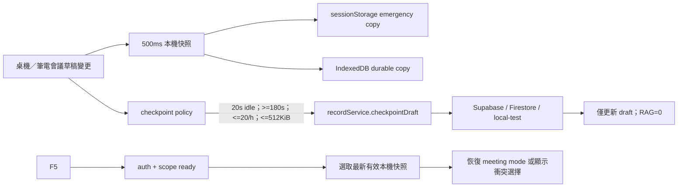

# SPEC-069：會議草稿 F5 復原與低成本雲端備份

- 關聯 DEV：DEV-069
- 成熟度：RD Implemented / Local QA-QC PASS / Provider Smoke Pending / 未 Release
- 風險：Medium
- 來源：`USER-20260817-MEETING-DRAFT-RECOVERY-COST-CONTROL`
- 承接：SPEC-003、SPEC-010、DEV-002、DEV-005、DEV-010、DEV-020
- 決策日期：2026-08-17

## 1. 問題、目標與成功定義

現行會議草稿只在 `useRecordStore` 記憶體內；應用程式內的 dirty guard 能攔截部分導覽，卻無法覆蓋 F5。另一方面，現有 `recordService.upsert()` 是完整保存流程：Supabase 會重建 `record_task_links`、執行 RAG 同步判斷並重讀完整紀錄，Firestore 會先讀後寫完整 document。這條路徑不可被高頻自動保存重用。

本 DEV 的成功定義如下：

- 桌機／筆電會議紀錄在輸入後誤按 F5，可恢復同一帳號、workspace、board 的最新未完成內容與必要會議 buffer。
- 使用者能分辨「本機已保護」與「雲端已確認」，任何狀態都不得提前宣稱成功。
- 自動雲端 checkpoint 不隨按鍵數量線性成長，具備明確間隔、次數、payload 與重試上限。
- 草稿 checkpoint 不觸發 AI、RAG document/version/chunk/embedding，不建立版本歷史，也不寫入 undo stack。
- 手機版不開放會議紀錄；390x844 僅做「功能不存在」的負向回歸，不建立手機編輯、復原或保存狀態 UI。

## 2. Authoritative Scope

### In Scope

- `type === 'meeting'` 且 `isMeetingMode === true` 的桌機／筆電草稿。
- 標題、內容、與會者、時間、visibility、metadata、task links、meeting activity buffer、已附加 activity IDs、游標位置與 meeting mode 恢復。
- 本機快照、F5 恢復、過期／登出／明確放棄清理。
- provider-neutral 雲端 checkpoint 與 Supabase、Firestore、local-test adapter。
- 桌機／筆電保存狀態、錯誤降級與衝突選擇。
- 既有手動「存草稿／發布」的回歸保護。

### Out of Scope

- 手機會議紀錄入口、列表、編輯器、復原、保存狀態與會議流程。
- 個人工作紀錄的自動復原；本次不得順手擴張到 `work_log`。
- 多人即時共編、跨裝置 merge、revision history、event sourcing。
- 伺服器端全帳號／跨裝置硬限流；本版上限是同一瀏覽器 profile 內的帳號級協調上限。
- 新增 Supabase table、column、RPC、Edge Function、migration 或 service-role 操作。
- production deploy、release 或正式環境資料修復。

若實作必須突破以上任一邊界，RD 停止該部分並回到 PM / Human Decision，不得自行擴 scope。

## 3. 現況證據與設計結論

| 現況 | 證據 | 設計結論 |
|---|---|---|
| 草稿為 plain Zustand memory state | `src/store/useRecordStore.ts` | 新增獨立 persistence hook/service，不把整個 store 無差別 persist |
| 新草稿已由 `createId()` 產生 UUID | `createDefaultDraft()` | 沿用 `draft.id` 作為本機與雲端冪等 ID，不另造 server ID |
| 完整保存包含 undo、task links 與 RAG lifecycle | `saveDraft()`、Supabase `upsert()` | 新增 `checkpointDraft()`；不得從 checkpoint 呼叫 `saveDraft()` / `upsert()` |
| Supabase 已有 `knowledge_records.metadata jsonb`、RLS 與 authenticated grants | migration `20260604100000_meeting_work_records.sql` | recovery metadata 可存既有 JSONB；不需 migration、不改 RLS |
| 手機判定已有 `isMobileBoardOnly = coarse pointer OR <=640px` | `MainLayout.tsx` | 抽成共用 availability hook，所有會議入口／restore 使用同一判定 |

本變更屬 feature-level、可回復的本機 persistence 與 adapter 擴充，沒有跨產品不可逆架構或 schema 決策，因此不新增 ADR。

## 4. 整體資料流



每次 keystroke 只更新 store 並重排本機 debounce；不得直接產生網路請求。`visibilitychange`、`pagehide`、`online` 只能要求 scheduler 重新評估，不能繞過成本 policy。

## 5. 型別與資料契約

型別集中放在 `src/types/index.ts`，避免 service、store、UI 各自定義不同狀態。現有 `MeetingTaskActivityInput` / `MeetingTaskActivity` 由 `useRecordStore.ts` 移至 `src/types/index.ts` 並由 store import，避免 recovery type 反向依賴 store。

```ts
export const MEETING_DRAFT_RECOVERY_SCHEMA = 'meeting-draft-recovery-v1' as const;

export interface MeetingDraftRecoverySnapshot {
  schema: typeof MEETING_DRAFT_RECOVERY_SCHEMA;
  ownerUserId: string;
  workspaceId: string;
  boardId: string;
  draftId: string;
  draft: KnowledgeRecordInput & { id: string; status: 'draft' };
  meetingActivities: MeetingTaskActivity[];
  appendedMeetingActivityIds: string[];
  contentCursorOffset: number | null;
  draftBaselineSignature: string | null;
  localSignature: string;
  lastRemoteSignature: string | null;
  lastRemoteConfirmedAt: number | null;
  isMeetingMode: true;
  savedAt: number;
  expiresAt: number;
}

export interface MeetingDraftCloudRecoveryMetadata {
  schema: typeof MEETING_DRAFT_RECOVERY_SCHEMA;
  draftSignature: string;
  taskLinks: KnowledgeRecordInput['taskLinks'];
  meetingActivities: MeetingTaskActivity[];
  appendedMeetingActivityIds: string[];
  contentCursorOffset: number | null;
  clientSavedAt: number;
}

export interface RecordDraftCheckpointInput {
  record: KnowledgeRecordInput & { id: string; status: 'draft' };
  draftSignature: string;
  remoteRecordKnown: boolean;
  recovery: MeetingDraftCloudRecoveryMetadata;
}

export interface RecordDraftCheckpointResult {
  recordId: string;
  draftSignature: string;
  confirmedAt: number;
}

export type LocalDraftPersistenceStatus =
  | 'idle' | 'saving' | 'saved' | 'degraded' | 'error';

export type CloudDraftCheckpointStatus =
  | 'idle' | 'queued' | 'saving' | 'saved' | 'offline'
  | 'rate_limited' | 'oversize' | 'error' | 'conflict';
```

約束：

- `draft.id` 必須存在；現行 `createDefaultDraft()` 已符合。restore-as-new 必須產生新 UUID。
- snapshot 只保存可序列化資料，不保存 access token、refresh token、API key、Supabase session 或 DOM/editor instance。
- `meetingSynthesisStatus === 'synthesizing'` 不持久化；恢復後一律回到 `idle`，既有 draft 文字保留。
- `metadata.projedDraftRecovery` 是 checkpoint recovery envelope；手動「存草稿／發布」前移除該欄，再由完整保存流程決定正式 metadata。
- `getRecordDraftSignature()` 必須涵蓋所有可編輯 draft 欄位與 task links；另將 activity buffer／appended IDs 納入 `localSignature`，避免只改 buffer 時不落盤。

## 6. 本機復原契約

### 6.1 儲存媒介與 key

- IndexedDB database：`projed-draft-recovery`，object store：`meeting-drafts`，version `1`。
- sessionStorage emergency key：`projed:meeting-draft-recovery:v1:{ownerUserId}:{workspaceId}:{boardId}:{draftId}`。
- IndexedDB primary key 使用相同 scope key。
- 每個 scope 只保留最新 active meeting snapshot；寫入新 snapshot 取代舊值，不建立歷史版本。
- snapshot TTL 固定 7 天；啟動與 scope 變更時 lazy purge expired / wrong-schema records。

### 6.2 寫入時機

- store 變更後 500ms debounce，先序列化同一份 payload，再寫 sessionStorage 與 IndexedDB。
- `visibilitychange` 進入 hidden、`pagehide`、`beforeunload` 時，同步覆寫 sessionStorage emergency copy；不可等待 IndexedDB promise。
- `beforeunload` 不因一般 dirty draft顯示阻擋提示；只有 sessionStorage 與 IndexedDB 均已失敗且仍有 dirty content 時，才註冊原生離頁警告。
- persistence service 必須做 latest-write-wins token；舊的 async IndexedDB completion 不得覆蓋新 snapshot 或誤更新 UI。

### 6.3 狀態真實性

- `saved`：最新 signature 的 IndexedDB write 已確認；顯示「已保存在此裝置」。
- `degraded`：sessionStorage 成功但 IndexedDB 失敗；顯示「已暫存在此分頁，建議存草稿」。
- `error`：兩者都失敗；顯示「內容尚未安全保存，請立即存草稿」。
- 任一媒介仍停留舊 signature 時，不得顯示最新內容已保存。

### 6.4 清理時機

下列 terminal action 成功後清除該 snapshot：

- 發布成功。
- 使用者選擇「直接離開／不儲存，繼續」。
- 開啟另一筆紀錄或建立新紀錄並確認放棄目前變更。
- 封存目前紀錄。
- 登出：在 `authService.signOut()` 前先清除該 user 的 recovery records；遠端 sign-out 失敗時仍不得把前一帳號 snapshot 留給下一帳號。

手動「存草稿」不清除 active meeting snapshot；它更新 baseline 與 remote-confirmed signature，確保仍在會議中的使用者 F5 後可回到 meeting mode。

## 7. F5 Restore 與衝突契約

`useMeetingDraftRecovery` 掛在 authenticated `AppContent`，等待 user、workspace、board 已知，且該 scope 的 `loadRecords()` 已 settle；離線載入失敗不能阻止本機恢復。

1. 手機／coarse-pointer 判定為 unavailable 時，禁止 restore，且不 render meeting editor/status。
2. 同時讀 sessionStorage 與 IndexedDB，丟棄 schema 不符、過期、owner 或 scope 不符、無 meeting draft 的資料。
3. 選擇 `savedAt` 最新者；若 payload parse/validation 失敗，刪除壞資料並只顯示產品化訊息，不外露 raw JSON/API error。
4. 若離線、remote record 不存在，或 remote 與 `lastRemoteSignature` 相同，直接恢復 panel、meeting mode、draft、buffer、游標與 baseline，toast「已恢復未完成的會議內容」。不得自動發布或自動呼叫 AI。
5. 若已載入 remote record 為 `published`，或 remote `updatedAt` 晚於 `lastRemoteConfirmedAt` 且 signature 不同，禁止自動覆寫並顯示 action dialog：
   - `以本機內容建立新草稿`：新 UUID、status draft、移除 server linkage，保留 local content。
   - `使用雲端版本`：清除 local snapshot，開啟 remote record。
   - `稍後決定`：保留 snapshot、panel 關閉、不發 checkpoint。
6. archived record 因既有 RLS / list filter 不可見；若 provider 回傳 status conflict / permission no-row，轉入同一 conflict UI，不得自動改 ID 重送。

本版不做 field-level merge；同一 draft 的多裝置同時編輯屬 Out of Scope。

## 8. 雲端 Checkpoint Policy 與成本上限

### 8.1 Eligibility

必須同時符合才可嘗試：

- desktop/laptop meeting mode、authenticated、active workspace/board、`navigator.onLine !== false`。
- local signature 與 remote-confirmed signature 不同。
- 相對 baseline 有實質變更；只有系統產生的預設標題／空內容不得建立 server row。
- 最新 payload JSON UTF-8 bytes `<= 512 KiB`。超過時設 `oversize`，維持本機保存並要求手動存草稿；同一 signature 不重試。
- 沒有其他 checkpoint in flight；排程只保留最新 signature。

### 8.2 Timing / Budget

- 首次實質變更：最後一次變更後 idle 20 秒才可送；若持續輸入，dirty 滿 5 分鐘可送最新版。
- 任兩次自動 attempt（成功或失敗）至少相隔 180 秒。
- 失敗 backoff：第 1 次 3 分鐘、第 2 次 5 分鐘、第 3 次 15 分鐘、第 4 次起 30 分鐘；成功後歸零。
- rolling 60 分鐘最多 20 次 attempt。attempt 在發出 request 前寫入 account-scoped localStorage ledger，F5 後不可重置配額。
- 使用 `navigator.locks` 以 user + draft key 協調同瀏覽器多 tab；不支援時以 localStorage lease（30 秒 TTL）降級。取得不到 lease 的 tab 僅做本機保存。
- `online` / `visibilitychange` 只重評 policy；不得跳過 idle、180 秒、20/h、payload 或 single-flight 限制。
- 手動「存草稿／發布」不受自動 checkpoint budget 限制，但仍只因使用者明確操作觸發。

### 8.3 可驗收成本預算

| Provider | 每次 checkpoint 上限 | 每 active browser account / hour |
|---|---:|---:|
| Supabase | 1 次 knowledge record write request；既有 UUID scope 不新增 lookup；0 task-link write；0 RAG | <=20 write requests |
| Firestore | 最多 1 document read + 1 document write（transaction 保護 published/archived） | <=20 reads + <=20 writes |
| local-test | 1 次 local state replace | 0 server request |

所有 provider 均不得新增 polling read。跨裝置的帳號級全域硬上限需要 server quota / rate-limit 資料模型，屬未來 re-entry；本版不得宣稱已提供跨裝置 20/h 硬保證。

Supabase production scope 若已是 UUID，checkpoint 不需 scope lookup；legacy workspace / board 第一次可各有 1 次 resolver read，結果必須 cache 至登出，後續 checkpoint 不得重複讀取。

容量規劃公式固定為 `active browser-hours × <=20 checkpoint attempts`。例如單一帳號／裝置每月活躍 8 小時 × 22 天，雲端 checkpoint 上限為 3,520 次；Supabase 至多 3,520 次 knowledge-record mutation，Firestore 至多 3,520 reads + 3,520 writes。實際帳單仍依 provider 方案與活躍裝置數計算，文件不得把此 client-side 上限誤稱為全帳號／跨裝置硬 quota。

## 9. Provider Adapter 合約

在 `src/services/dataBackend.ts` 的 `recordService` 增加：

```ts
checkpointDraft(
  workspaceId: string,
  boardId: string,
  input: RecordDraftCheckpointInput,
): Promise<RecordDraftCheckpointResult>
```

### Supabase

- 實作於 `supabaseRecordService.checkpointDraft()`，沿用既有 `knowledge_records`、authenticated client、RLS 與 grants。
- 新 record 使用 stable UUID `insert(...).select('id').single()`；已知 remote draft 使用 `update(...).eq('id', id).eq('status', 'draft').select('id').maybeSingle()`。兩者都是單一 HTTP request；no-row / duplicate / permission 轉成 typed conflict。
- payload 固定 `status:'draft'`、`rag_enabled:false`；不得寫 `source_document_id`。
- task links 與 activity recovery payload 放在 `metadata.projedDraftRecovery`；自動 checkpoint 不 delete/insert `record_task_links`。
- 不呼叫 `syncRecordRagDocument()`、`disableRecordRagMirrorAfterFailure()`、完整 `recordSelect` reload、undo 或 event log。
- 不為每次 checkpoint 呼叫網路型 `supabase.auth.getUser()`；使用應用程式已驗證的 current user ID，RLS 仍是最終授權。不得使用 `user_metadata` 做 authorization，不得暴露 service-role。
- 若 workspace / board 是 legacy ID，resolver 結果需 memory-cache 至登出，避免每次 checkpoint 重複 lookup。

### Firestore

- 實作 `recordService.checkpointDraft()`，使用 transaction 讀取同一 document 的 `status`；`published` / `archived` 回 typed conflict，否則只寫目前 draft 與 recovery metadata。
- 不呼叫完整 `upsert()`，不建立額外 version collection，不觸發 RAG path。
- transaction 成本納入上表；不得額外 list/read。

### local-test

- 以 stable `draft.id` replace 同一筆 record，保存 recovery metadata；不得新增 duplicate。
- 提供 deterministic clock / network seam，供 QA 驗證 timing、budget、offline、backoff 與 conflict。

### 完整保存相容性

- `saveDraft()` 維持既有完整 adapter、task-link normalization、undo 與發布 RAG lifecycle。
- 手動保存前 strip `metadata.projedDraftRecovery`；成功後更新 `records`、baseline、lastSaveFeedback、remote signature 與 active local snapshot。
- 發布時 `ragEnabled` 規則不變；draft checkpoint 不可讓發布按鈕誤顯示已發布或已手動存草稿。

## 10. Store 狀態機與 UI

`useRecordStore` 增加 local/cloud status、signature、confirmed time 與 restore action；manual `saving` 保持獨立，避免把 checkpoint 當成使用者操作。

```text
local: idle -> saving -> saved
                  \-> degraded
                  \-> error

cloud: idle -> queued -> saving -> saved
          \-> offline / rate_limited / oversize / error / conflict
```

RecordSidebar 只設一個 quiet、`aria-live="polite"` 的保存狀態位置，取代目前模糊的 `未儲存／已同步`：

| 條件 | 可見文案 |
|---|---|
| local saving | 正在保護內容… |
| local saved、cloud pending | 已保存在此裝置 |
| local degraded | 已暫存在此分頁，建議存草稿 |
| cloud confirmed latest | 已備份至雲端 HH:mm |
| offline / cloud error、local saved | 雲端備份失敗，本機內容仍安全 |
| rate limited、local saved | 已保存在此裝置，稍後再備份至雲端 |
| oversize、local saved | 內容較大，已保存在此裝置；請手動存草稿 |
| local error | 內容尚未安全保存，請立即存草稿 |
| conflict | 雲端已有不同版本，請選擇要保留的內容 |

- 顏色不可是唯一狀態線索；文案與 icon 必須同時區分。
- 不顯示 stack、HTTP code、PostgREST/Firebase raw message、英文例外或 undefined/null。
- checkpoint 不改 `draftBaselineSignature`；使用者仍可理解「自動備份」不等於完成手動存草稿／發布。
- 1440x900 與 1024x768 不得造成側欄 overflow、按鈕位移或狀態文字遮擋；長訊息可換行，不以縮小到不可讀處理。

## 11. 手機不可用邊界

新增 `useMeetingRecordAvailability()`，authoritative 判定沿用現況：`unavailable = coarse pointer || viewport <= 640px`。MainLayout、Sidebar、RecordsView、RecordSidebar、TaskRecordTimeline、`open-knowledge-record` event 與 restore hook 必須共用該結果。

手機／unavailable 狀態：

- 不 render「新增會議記錄／補一筆會後紀錄」入口。
- RecordsView 與 TaskRecordTimeline 不 render meeting record row；`open-knowledge-record` 指向 meeting 時 no-op，不影響非 meeting work log。
- 不允許 `startMeetingRecord()`、`openNewRecord('meeting')`、meeting `openExistingRecord()` 或 restore 開啟編輯器。
- 不 render meeting RecordSidebar、local/cloud 保存狀態或 restore/conflict UI。
- 不執行 meeting local snapshot 或 cloud checkpoint。
- 非 meeting 的既有功能不可因本 DEV 被無意關閉；若產品要連紀錄庫閱讀也全面封鎖，另立決策，不在本 DEV 擴張。

390x844 只驗證以上負向契約，不驗收手機會議保存成功流程。

## 12. Repo / File Impact

### 新增

- `src/services/meetingDraftRecoveryService.ts`：IndexedDB/sessionStorage、validation、TTL、clear。
- `src/utils/recordDraftCheckpointPolicy.ts`：純函式 timing、budget、payload、backoff、lease key。
- `src/hooks/useMeetingDraftRecovery.ts`：store subscription、lifecycle flush、restore、scheduler。
- `src/hooks/useMeetingRecordAvailability.ts`：共用 desktop/mobile capability。
- `scripts/verify-dev-069-meeting-draft-recovery.mjs`
- `scripts/verify-dev-069-meeting-draft-recovery-browser.pw.js`

### 修改

- `src/types/index.ts`
- `src/App.tsx`
- `src/store/useRecordStore.ts`
- `src/store/useAuthStore.ts`
- `src/services/dataBackend.ts`
- `src/services/supabase/projedService.ts`
- `src/services/firestoreService.ts`
- `src/services/localTestService.ts`
- `src/components/MainLayout.tsx`
- `src/components/Sidebar.tsx`
- `src/components/Records/RecordsView.tsx`
- `src/components/Records/RecordSidebar.tsx`
- `src/components/Records/TaskRecordTimeline.tsx`
- `src/hooks/useRecordDraftGuard.ts`
- `src/hooks/useMeetingModeExitGuard.ts`
- `src/utils/meetingRecordWorkflow.ts`
- `package.json`

不新增 runtime dependency；優先使用 browser native IndexedDB、sessionStorage、Web Locks / localStorage lease。

## 13. RD 實作順序與完成條件

1. **WP1 純函式與本機 persistence**：types、signature、validator、IndexedDB/sessionStorage、TTL、policy；先以 deterministic unit/contract verifier 證明。
2. **WP2 Store / lifecycle / restore**：subscription、pagehide、auth/scope gate、restore/conflict、guard cleanup；不得先接 server。
3. **WP3 Provider checkpoint**：local-test → Supabase → Firestore；每個 adapter 先證明 request/write count 與 RAG=0。
4. **WP4 UI / mobile boundary**：單一狀態位置、產品化錯誤、共用 availability、手機負向 gate。
5. **WP5 Regression / QC evidence**：targeted verifier、TypeScript/build、既有 DEV-007/008/009/010/020 回歸、1440/1024/390 rendered QC。

RD 實作完成條件已達成：WP1～WP5 的產品程式、local-test／browser 驗證與本機 QC 證據已落地；Supabase／Firestore 真實 provider smoke 仍是下一個 gate。文件狀態可標示為 Local QA-QC PASS / Provider Smoke Pending，不得標 Release Ready 或已部署。

## 14. Failure Recovery / Stop Conditions

- IndexedDB 不可用：降級 sessionStorage 並顯示 degraded；兩者皆失敗才啟用原生離頁警告。
- server offline/5xx/timeout：保留 latest snapshot，依 backoff；不重播中間版本。
- 401/403/no-row/status mismatch：停止自動 retry，設 conflict 或 error，等待使用者選擇／重新登入。
- payload oversize：同一 signature 不送 server；本機繼續保存，提示手動存草稿。
- migration、RLS、RPC、Edge Function、跨裝置硬配額、多端 merge 任一變成必要條件時停止並 re-entry。

## 15. Acceptance Gate

- Local-test／browser 已執行的 required cases PASS；provider-specific QA-069-014～020、QA-069-023 仍待真實 provider smoke，不以 local-test 冒充全部 PASS。
- `npx.cmd tsc --noEmit`、`npm.cmd run build`、DEV-069 targeted static/browser verifier 通過。
- 既有 meeting action、activity、knowledge link、quick note、desktop workflow 回歸通過。
- Supabase 實測或可稽核 mock 證明每次 checkpoint 只有一個 knowledge-record request、無 task-link/RAG/full reload/getUser request（Provider Smoke Pending）。
- Firestore 實測或 emulator/mocked transaction 證明每次最多 1 read + 1 write（Provider Smoke Pending）。
- 1440x900、1024x768 rendered UI 與 390x844 negative boundary 無 visible error、overflow、遮擋或 raw error。

## 16. Implementation Evidence（2026-08-17）

- `npm.cmd run verify:dev-069-meeting-draft-recovery` PASS：policy、cost guard、mobile boundary static contract。
- `npm.cmd run verify:dev-069-meeting-draft-recovery-browser` PASS：真實 page reload、local-test recovery、1440/1024 desktop、390 negative boundary、visible-error sweep。
- DEV-007/008/009/010/020 regression、`npx.cmd tsc --noEmit`、`npm.cmd run build` PASS。
- 詳細事實與 provider pending 邊界見 `ai-doc/qc/QC-DEV-069-meeting-draft-recovery-cost-control.md`。

## 17. Supabase 版本與官方依據（2026-08-17 核對）

- 專案使用 `@supabase/supabase-js ^2.105.4`。
- Supabase JavaScript upsert 文件確認：mutation 預設不回傳 row；需要資料時才 chain `.select()`。本 SPEC 僅回傳 `id` 以辨識 no-row / conflict，禁止完整 row reload。<https://supabase.com/docs/reference/javascript/upsert>
- RLS 文件確認 UPDATE 需要對應 SELECT policy；現有 migration 已具 authenticated SELECT/INSERT/UPDATE policy 與 ownership/project predicate。<https://supabase.com/docs/guides/database/postgres/row-level-security>
- 2026 Data API auto-exposure breaking change只影響新表；本 DEV 沿用已存在且已 grant 的 `knowledge_records` / `record_task_links`，故不新增 migration。<https://supabase.com/changelog/45329-breaking-change-tables-not-exposed-to-data-and-graphql-api-automatically>
- supabase-js 2.102+ 的自動 retry 只涵蓋 GET/HEAD，不會自動 retry POST/PATCH/PUT/DELETE；checkpoint mutation 的 retry 仍完全由本 SPEC policy 控制。<https://supabase.com/changelog/45071-automatic-postgrest-retries-for-transient-errors>
