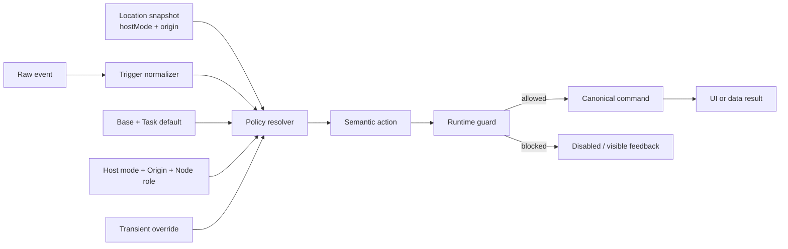

# SPEC-070：跨模式互動策略核心與相容性遷移契約

- 狀態：Implemented / QC Functional PASS / Release Gate Blocked
- 日期：2026-08-17
- 關聯：DEV-070、DEV-027B、DEV-028、DEV-029、ADR-043、QA-DEV-070
- 節點類型：開發點（不計入產品交付完成）
- 風險：Medium（跨模式互動入口與共用選單；不改資料模型、API 或權限來源）
- Spec Impact：`No contract drift / behavior-preserving architecture refactor`

## 1. 目標

建立一個 typed Interaction Policy Kernel，讓清單、心智圖、看板、甘特及共用任務表面只宣告與預設不同的互動差異，並讓右鍵選單、快捷鍵、工具列與手勢共用同一份 Semantic Action、權限、Guard 與 Command。

Phase 1 的成功標準不是產生新操作，而是把目前操作完整搬入可繼承、可解析、可比較的架構；重構前後使用者可觀察到的點擊、鍵盤、右鍵、詳情、post-create、拖曳與手機手勢結果必須相同。任何產品行為調整都屬後續獨立 re-entry。

## 2. Human Decision 與不可變邊界

- 不同模式未來可以有不同互動語法。
- 模式不得複製整份 handler；只以 sparse override 宣告與預設不同的項目。
- 後續需求明示「所有模式／全域」才改 Base；明示特定模式或未明示全域時，採最小影響原則改 Host Mode Profile；只影響 Workbench／Shared Sidebar 等子表面時改 Origin Profile。
- 關聯建立、拖曳、紀錄擷取、mobile action mode 等暫時狀態使用 Transient Override。
- 權限、安全、確認、Undo 與資料一致性只放在 Guard／Command，不得被 Profile 規避。
- Phase 1 不改清單、心智圖、看板、甘特、Calendar、Task Workbench、Shared Task Sidebar 或手機 Board 的既有可觀察行為。

## 3. Authoritative Baseline 與既存規格漂移

### 3.1 基線優先序

Phase 1 的 compatibility golden master 依下列順序判定：

1. 目前 repository 實際執行結果與重構前錄製的 browser evidence。
2. 已通過的 DEV-027B／028／029 static 與 browser verifier。
3. 較新的 `SPEC-028` 與手機手勢 authority `SPEC-029`。
4. `SPEC-027B` 未被後續決策取代的心智圖鍵盤與選取契約。

若文件敘述與現行程式不一致，Phase 1 不得藉重構偷偷選擇其中一種產品行為；先保持 runtime golden master，再把差異登錄為 pre-existing spec drift，交由獨立產品決策處理。

### 3.2 已知漂移：心智圖新增後行為

- `SPEC-027B` 的舊文字曾要求「新增後只選取，不立即進入編輯」。
- 目前 `MindMapView.createTask()` 會呼叫 `prepareNewTaskNaming()`；該 helper 會選取新任務、設定 pending title edit 並開啟 `TaskDetailsModal`。
- 較新的 `SPEC-028` 已將任務名稱入口收斂到詳情頁，並禁止外層 inline rename。
- DEV-070 Phase 1 的決議：保持重構前實際 runtime 與 verifier 結果；不恢復外層 rename，也不把架構重構當成修訂心智圖 post-create 行為的授權。

### 3.3 現行程式入口盤點

| 責任 | 現行入口 | Phase 1 要求 |
|---|---|---|
| 選取／開詳情／新增後命名 | `src/utils/taskInteractions.ts` | 保留 primitive 結果，由 Command facade 統一調用；不得雙重 dispatch |
| selection／current view／context target | `src/store/useBoardStore.ts` | menu target 改存事件當下的 `hostMode + origin` snapshot |
| 全域 task menu／Enter／TaskDetailsModal host | `src/components/GlobalContextMenu.tsx` | presentation 改吃 resolved actions；項目、順序、enabled 與結果不變 |
| List | `WbsListView.tsx`、`WbsNodeItem.tsx` | 以 mode-primary adapter 接入 |
| Mindmap | `MindMapView.tsx`、`mindMapKeyboard.ts` | primary、keyboard、relationship／drag override 分離 |
| Board | `BoardView.tsx`、`KanbanColumn.tsx`、`KanbanCard.tsx`、`KanbanChecklist.tsx` | L1／L2／L3+ 共用 action，dependency／record／drag／mobile override 保留 |
| Gantt | `GanttView.tsx`、`GanttTaskBar.tsx`、`SharedTaskSidebar.tsx` | bar 與 sidebar 共用 host mode，origin 分別記錄 |
| Auxiliary | `CalendarView.tsx`、`TaskWorkbenchPanel.tsx` | 不把子表面誤當主模式；保留 host mode 的既有效果 |
| Mobile arbitration | `useTouchTapGuard.ts`、DEV-029 mobile action context | 只接 transient adapter，不重寫 broker／state machine |

## 4. 核心架構契約

### 4.1 處理管線

`Raw Input → Trigger Normalizer → Profile Resolver → Semantic Action → Runtime Guard → Command → UI/Data Result`

- 元件只回報標準化 Trigger、事件當下的 host mode／origin、Task、Node Role 與 session context。
- Resolver 必須是 pure、deterministic、無資料寫入；相同 context 必須得到相同 resolved result。
- Guard 在執行當下檢查 focus、pointer／drag 狀態、權限與資料條件。
- Command 是唯一可執行 task mutation、確認、Undo 與可見錯誤回饋的入口。
- 同一個實體動作不得由 resolver 與 legacy handler 同時 dispatch。



### 4.2 Profile 合併順序

由低至高依序為：

1. `SystemBaseProfile`：跨 task surface 的輸入安全與關閉語意。
2. `TaskDefaultProfile`：任務實體的共用預設，例如 primary pointer 開詳情、post-create 進詳情命名。
3. `HostModeProfile`：清單、心智圖、看板、甘特、Calendar 等主要工作模式的 sparse 差異。
4. `OriginProfile`：mode-primary、Task Workbench、Shared Task Sidebar、Calendar segment 等巢狀子表面差異。
5. `NodeRoleProfile`：L1／L2／L3+、task／group、bar／row／card 等角色差異。
6. `TransientOverride`：relationship、dependency selection、record capture、drag、mobile action mode。
7. `RuntimeGuard`：權限、安全、focus、資料狀態與 dangerous-action confirmation。

Resolver 採 key-level merge；`undefined` 表示繼承，明確 `disabled` 表示停用。禁止以複製整份 Base 後修改一項的方式建立 Mode／Origin Profile。若同一 origin 可出現在多個 host mode，先繼承 host mode，再疊 origin；只有特定組合不同時才使用 `(hostMode, origin)` composite override。

#### 4.2.1 欄位級合併運算子

不同契約不可共用任意 deep merge；每種欄位固定使用下列運算子：

| 契約欄位 | 合併運算子 | 規則 |
|---|---|---|
| Trigger binding | `replace` | 較窄層以同一 trigger key 覆寫 action；`undefined` 繼承，`disabled` 明確停用 |
| Menu action presence | `patch-by-action-id` | 只以 stable Action ID include／exclude；禁止整份 array replacement |
| Menu ordering | `catalog-order + anchored move` | 預設使用 Catalog section/order；只有產品需求明示排序差異時才能以 `before`／`after` anchor 移動 |
| Label／icon／danger metadata | `catalog-only` | Phase 1 Profile 不得覆寫，避免同一 Action 在不同入口名稱或風險提示漂移 |
| Capability／permission | `deny-wins` | Profile 只能決定是否呈現候選 Action；Runtime Guard 的拒絕不可被任何較窄 Profile 改成允許 |
| Command binding | `non-mergeable` | 每個 mutation Action 只能在 Catalog 綁定一個 canonical Command |
| Diagnostic metadata | `append` | 只加入 dev／test trace；不得出現在產品 UI 或包含真實 task title／個資 |

Menu 的 enabled／disabled 必須由 capability＋Runtime Guard 計算，Profile 不得硬寫 `enabled: true`。anchor 不存在、重複 Action ID、Command 缺失或非法 override 都屬 configuration error；在 shadow 階段使 gate 失敗，在 authoritative runtime fail closed，禁止猜測 fallback。

#### 4.2.2 Transient owner 仲裁

- `relationship`、`dependency-selection`、`record-capture`、`mobile-action-mode` 屬 exclusive transient owner；同一 interaction 最多只能有一個。
- `drag-established`／`resize-established` 屬 blocking modifier：成立時 suppress 隨後 primary activation，不改成另一個 Action。
- focus／permission／danger confirmation 屬 Runtime Guard，不得假裝成 transient profile。
- 若收到兩個以上 exclusive owner，Resolver 回傳 `actionId: null`、`suppressedReason: 'transient-owner-conflict'`，command count 必須為 0，並留下 dev/test diagnostic；不得自行選優先者。
- session controller 應在狀態入口避免 owner 衝突；Resolver 的 fail-closed 是最後防線，不是正常流程分支。

### 4.3 Typed contract

RD 實作時必須提供等效於下列概念的型別；名稱可依 repository 慣例微調，語意不可省略：

```ts
type TaskHostMode = 'list' | 'mindmap' | 'board' | 'gantt' | 'calendar';
type TaskInteractionOrigin =
  | 'mode-primary'
  | 'task-workbench'
  | 'shared-task-sidebar'
  | 'calendar-segment';

type TaskInteractionLocation = {
  hostMode: TaskHostMode;
  origin: TaskInteractionOrigin;
};

type TaskInteractionSurfaceId =
  | 'list.row'
  | 'mindmap.node'
  | 'board.column-header'
  | 'board.card'
  | 'board.checklist-row'
  | 'gantt.task-bar'
  | 'shared-task-sidebar.row'
  | 'calendar.segment'
  | 'task-workbench.placed-row'
  | 'task-workbench.unplaced-row';

type InteractionTrigger =
  | 'pointer.primary'
  | 'pointer.secondary'
  | 'keyboard.enter'
  | 'keyboard.tab'
  | 'keyboard.arrow-up'
  | 'keyboard.arrow-down'
  | 'keyboard.arrow-left'
  | 'keyboard.arrow-right'
  | 'keyboard.escape'
  | 'keyboard.shift-f10'
  | 'gesture.tap'
  | 'gesture.long-press'
  | 'task.post-create';

type InteractionContext = {
  interactionId: string;
  location: TaskInteractionLocation;
  surfaceId: TaskInteractionSurfaceId;
  taskId: string;
  nodeRole?: 'group' | 'milestone' | 'task' | 'unplaced';
  modality: 'fine-pointer' | 'coarse-pointer' | 'keyboard';
  transientOwners: readonly ('relationship' | 'dependency-selection' | 'record-capture' | 'mobile-action-mode')[];
  blockers: readonly ('drag-established' | 'resize-established')[];
  targetKind?: string;
};

type ResolvedInteraction = {
  actionId: TaskActionId | null;
  sourceLayer: 'base' | 'task-default' | 'host-mode' | 'origin' | 'node-role' | 'transient';
  suppressedReason?: string;
};

type TaskCommandOutcome = {
  interactionId: string;
  actionId: TaskActionId;
  status: 'executed' | 'noop' | 'denied' | 'cancelled' | 'failed';
  reason?: string;
};
```

`ContextMenuState.kind === 'task'` 必須攜帶事件當下的 `interactionLocation: { hostMode, origin }`、`surfaceId` 與 `interactionId`。`hostMode` 由 App 層 `TaskInteractionScope` 提供，各 Surface 只宣告 origin／node role；`GlobalContextMenu` render／execute 階段不得重新讀 `currentView` 猜測語境。Calendar、Task Workbench 與 Shared Task Sidebar 必須提供明確 origin。Board store 另保留最近一次 task selection 的 location，供 selection-based keyboard action 使用；兩者都是前端 ephemeral context，不得持久化到 backend 或 localStorage。

`interactionId` 由 normalizer 對一次 logical interaction 產生，legacy／shadow／kernel trace 必須沿用同一值。mutation Command 於同一頁面 interaction lifecycle 內只接受一次；這是防止 event bubbling／touchend／pointerup 重複 dispatch 的 in-memory dedupe，不新增 backend idempotency key 或 persisted ledger。Guard 拒絕後不得 fallback 執行另一個 Action。

### 4.4 Semantic Action Catalog

第一版至少需能表達目前存在的動作：

| Action ID | 類型 | Canonical result／限制 |
|---|---|---|
| `task.open-details` | navigation | 選取指定 task 並開同一個 `TaskDetailsModal` |
| `task.open-details-for-naming` | navigation | 選取、設定 pending title edit、開詳情；禁止外層 rename |
| `task.switch-to-list` | navigation | 明確要求時將目前 task flow 切換到 List；不作為 Calendar 任務點擊的預設行為 |
| `task.open-menu` | presentation | 以 location snapshot 解析 menu，不直接 mutation |
| `task.clear-selection` | selection | 清除共用 task selection；各模式私有 selection 由 adapter 同步清理 |
| `task.create-sibling` | mutation | 共用 create permission、parent/order 與 post-create command |
| `task.create-child` | mutation | 共用 create permission、completed-parent reopen 與 post-create command |
| `task.duplicate` | mutation | 沿用 subtree／dependency 複製結果與 visible feedback |
| `task.assign` | mutation | 沿用 member options 與 assign permission |
| `task.dependency-start` | transient | 只在 resolved capability 支援時進 dependency mode |
| `task.dependency-end` | transient | 只在 resolved capability 支援時進 dependency mode |
| `task.promote` | mutation | 沿用 move permission、階層與 no-op 規則 |
| `task.demote` | mutation | 沿用 move permission、階層與 no-op 規則 |
| `task.toggle-complete` | mutation | 供目前 mobile compact rail 共用；維持 idempotent |
| `task.delete-request` | dangerous | 只發出刪除請求，確認後才執行 delete command |
| `mindmap.select-parent` | selection | 只改 selection，不開詳情 |
| `mindmap.select-first-child` | selection | 只改 selection，不開詳情 |
| `mindmap.select-previous` | selection | 只改 selection，不開詳情 |
| `mindmap.select-next` | selection | 只改 selection，不開詳情 |

每個 Action 定義必須集中提供 stable ID、label／icon metadata、capability／permission、danger level、Command 入口與可驗證 selector。右鍵選單、快捷鍵、工具列與 mobile compact action rail可以選擇不同呈現集合與排序，但不得各自重做 permission 或 mutation。

Command outcome 必須能區分：成功寫入 `executed`、合法無變更 `noop`、權限／狀態拒絕 `denied`、使用者取消 `cancelled`、非預期失敗 `failed`。只有既有產品契約本來會顯示 toast／error 的情境才維持可見回饋；Phase 1 不因 outcome typed 化新增產品文案。

### 4.5 Trigger dictionary

| Trigger | Normalization rule | 不得混入 |
|---|---|---|
| `pointer.primary` | fine pointer 的 task body primary activation | interactive controls、drag-established mouseup |
| `pointer.secondary` | desktop context-menu request | mobile long press、relationship line context |
| `keyboard.enter` | 非輸入焦點且 mode 有 selection 時 | IME composition、modal/editor Enter |
| `keyboard.tab` | 只在模式明確擁有 Tab 語意時解析 | browser focus navigation 的無條件攔截 |
| `keyboard.arrow-*` | 只在 Mindmap canvas focus／selection 語境解析 | input caret、一般頁面捲動與其他 mode |
| `keyboard.escape` | 依 transient／modal／selection lifecycle 由窄到廣關閉 | mutation |
| `keyboard.shift-f10` | keyboard context-menu request；若現況無 binding，Phase 1 不新增 | 一般 Enter／F2 rename |
| `gesture.tap` | coarse pointer 無位移、未 long-press 的 completed session | short pan click-through |
| `gesture.long-press` | 經 mobile broker 判定後的 action-mode request | desktop context menu |
| `task.post-create` | 已成功建立 task 後的 naming/navigation handoff | create mutation 本身 |

`Shift+F10` 目前只作 Base capability 設計保留；WP0 若證明產品沒有現行 binding，Phase 1 resolved result 必須維持 disabled，不得因架構支援而新增可觀察行為。

## 5. Phase 1 Compatibility Profile

### 5.1 共用 TaskDefault

- fine pointer 對非 interactive control 的一般 task surface primary action：選取任務並開啟同一個 `TaskDetailsModal`。
- post-create：沿用目前各入口的實際結果；目前呼叫 `prepareNewTaskNaming()` 的入口維持選取、pending title edit 與開詳情。
- task menu 不提供任務外層重新命名；改名維持詳情頁 title edit。
- `Escape` 關閉暫時 UI／清除選取的既有生命週期維持不變。
- input、textarea、select、contenteditable、task control、relationship control 與 drag handle 不觸發一般 primary action。

### 5.2 模式相容性矩陣

| Surface | Primary pointer / tap | Keyboard | Task menu | 暫時模式與例外 |
|---|---|---|---|---|
| List | 任務列選取＋開詳情 | `Enter` 對已選任務開詳情 | 共用 task menu；保留目前依賴開始／結束項目 | 互動控制、drag、輸入焦點優先 |
| Mindmap | 節點選取＋開詳情 | `Enter` 新增同階、`Tab` 新增子階、方向鍵導航 | 共用 task menu；目前不顯示依賴開始／結束項目；無 rename | relationship draft／line edit、drag 優先，不誤開詳情 |
| Board | L1／L2／L3+ 任務選取＋開詳情 | `Enter` 對已選任務開詳情 | 共用 task menu；保留目前依賴開始／結束項目 | dependency selection、record capture、desktop drag、mobile gesture broker 優先 |
| Gantt | 任務條／Shared Sidebar 任務選取＋開詳情 | `Enter` 對已選任務開詳情 | 共用 task menu；目前不顯示依賴開始／結束項目 | move／resize 有實際位移時 suppress click-through |
| Calendar | task segment／Shared Sidebar click 選取任務＋開詳情 | 不新增快捷鍵 | 維持目前 task menu 集合 | 不切換到 List；與其他 task surface 共用 details lifecycle |
| Task Workbench | 任務列選取＋開詳情 | 不新增快捷鍵 | 維持目前 desktop menu；mobile 依 compact rail | placed／unplaced drag 與 mobile action mode 優先 |

矩陣描述的是重構前應被錄製與搬移的結果。若錄製 evidence 發現與表格不一致，先停止該 Surface 遷移並更新 baseline drift 記錄，不得直接修改產品行為使其符合文件。

#### 5.2.1 Source-derived provisional task menu

以下順序來自目前 `GlobalContextMenu.tsx`，只作 WP0 錄製清單，不取代 runtime golden master：

| Section | 預設 Action 順序 | Compatibility rule |
|---|---|---|
| `create` | `task.create-sibling` → `task.create-child` → `task.duplicate` | 沿用 create permission 與 post-create behavior |
| `assignment` | `task.assign` | submenu 成員與目前主責／協作摘要由資料與 permission 決定 |
| `dependency` | `task.dependency-start` → `task.dependency-end` | 目前只在 host mode 為 List／Board 時存在；nested origin 繼承事件當下 host mode |
| `hierarchy` | `task.promote` → `task.demote` | 沿用 move permission 與既有 no-op／階層限制 |
| `danger` | `task.delete-request` | 位於最後並保留確認；未確認不得 mutation |

目前 task menu 不含外層 rename，也沒有因建立 Kernel 而新增「開啟詳情」。divider 位置由 section boundary 產生，但 WP0 仍需記錄實際 DOM 順序與可見性。Phase 1 所有 Profile 只重建上述現況，不使用 anchored move。

### 5.3 Mobile Board authority

`SPEC-029` 優先治理 coarse pointer：

- 無位移 quick tap 開詳情。
- 8–10px movement threshold 前後及 450–550ms long-press lifecycle 保持現況。
- short pan 不開詳情、不開 action rail、不啟動 desktop menu。
- long press 仍進單一 mobile drag-action state machine，compact rail 恰為完成切換、新增同階、新增子階、刪除四項。
- 刪除只開確認；mobile action mode cancel、edge auto-scroll、drop resolution 與 raw-finger 規則不得被 desktop Profile 覆蓋。

## 6. Guard 與 Command 契約

| 條件 | 必要結果 |
|---|---|
| focus 位於可輸入元件、modal 或專用 editor | 不攔截 Surface 快捷鍵，不觸發 primary task action |
| 使用者沒有 create/edit/move/delete/assign/dependency 權限 | Action disabled 或不呈現；Command 仍需二次拒絕直接呼叫 |
| relationship／dependency／record capture mode active | Transient Override 優先，task click 不執行一般詳情行為 |
| drag／resize 已成立 | suppress 隨後 click；只執行一個 canonical commit |
| delete 或其他 dangerous action | 先走既有確認；不得由 Profile 直接 mutation |
| Command 失敗 | 原資料與順序維持；顯示既有或等效可見錯誤，不得 silent failure |

Profile 不得持有可變 business state；permission 來源仍為 `useBoardPermissions` 或其共用 facade。Phase 1 不新增 role、RLS、RPC 或資料欄位。

## 7. Repo／Module Impact

### 7.1 必須新增；檔名與責任已固定

| 檔案 | 唯一責任 | 禁止依賴 |
|---|---|---|
| `src/interactions/task/types.ts` | Host／Origin／Surface／Trigger／Profile／Resolved／Guard／Command outcome 型別 | React、Zustand、DOM、service |
| `src/interactions/task/TaskInteractionScope.tsx` | App 層提供 host mode；nested surface 只覆寫 origin | business mutation |
| `src/interactions/task/profiles.ts` | readonly Base／TaskDefault／Host／Origin／NodeRole／Transient sparse profiles 與 location registry | store、DOM、Command |
| `src/interactions/task/resolveTaskInteraction.ts` | pure deterministic trigger/menu merge、configuration validation、affected-location diff | React、store、Date、random、I/O |
| `src/interactions/task/taskActionCatalog.ts` | stable Action ID、label、icon key、section/order、permission key、danger、command ID | React component、runtime permission result |
| `src/interactions/task/taskActionGuards.ts` | 以 permission／focus／target／task snapshot 回傳 allow／deny／reason | mutation、toast、confirmation |
| `src/interactions/task/taskCommandExecutor.ts` | canonical command registry、danger confirmation、typed outcome、mutation dedupe | Profile merge、View switch |
| `src/interactions/task/useTaskInteractionBinding.ts` | normalizer＋scope consumer；輸出 primary／menu／post-create adapter | 複製 action business logic |
| `src/interactions/task/TaskActionMenu.tsx` | 依 resolved menu render task branch；icon component map 與 assignment UI | 自行判斷 `currentView`、直接資料 mutation |
| `src/interactions/task/migrationManifest.ts` | DEV-070 分片狀態與合法 transition；只供 source/test，WP5 全綠後刪除 | persisted state、產品設定、backend |
| `scripts/verify-dev-070-interaction-kernel.ts` | pure resolver／catalog／guard／manifest／single-executor contract | browser snapshot 代替真實操作 |
| `scripts/verify-dev-070-interaction-kernel-browser.pw.js` | `dev-070-v1` 自包含 local-test fixture、baseline／after matrix、三 viewport rendered evidence | production／真實帳號／遠端 provider |
| `scripts/run-dev-070-interaction-kernel-browser.ps1` | 呼叫既有 Playwright runner、保存 `DEV070_ARTIFACT` marker 與 screenshots、依 phase 寫入 artifact 目錄 | 啟停 4173、終止未知 process、更新 expected snapshot |

上述檔名是 RD handoff boundary；需要改名或合併時，RD 必須先更新本節、import graph 與 QA static assertions，不得在實作中自行漂移。

### 7.2 必須調整；逐檔 patch intent 已固定

| 檔案 | Patch intent |
|---|---|
| `src/App.tsx` | 對 List／Mindmap／Board／Gantt／Calendar 的 rendered content 套 `TaskInteractionScope hostMode={currentView}`；非 task mode 不套 fallback |
| `src/types/index.ts` | task `BoardContextMenuState` 加 `interactionLocation`、`surfaceId`、`interactionId`；Board state 加最近 selection location，不改 persisted `TaskNode` |
| `src/store/useBoardStore.ts` | selection／menu setter 同步 ephemeral location；view／board／workspace／close lifecycle 清除 location；不寫 localStorage |
| `src/utils/taskInteractions.ts` | 保留 DOM modal event、selection、clear 等低階 primitive；WP5 後禁止 Surface 直接組合 mutation，legacy export 只作 compatibility wrapper |
| `src/components/MainLayout.tsx` | 全域 Escape／mode-transition clear 交給 `task.clear-selection` compatibility adapter；保留 blocking overlay 與 left-panel precedence |
| `src/components/GlobalContextMenu.tsx` | task branch 委派 `TaskActionMenu`；Enter 依 selected location resolver；menu render／execute 使用 open-time snapshot；workspace／board menu 不納入 DEV-070 |
| `src/components/Wbs/WbsNodeItem.tsx` | `list.row` primary／secondary binding；保留 interactive target、drag、touch tap guard |
| `src/components/MindMap/MindMapView.tsx` | `mindmap.node` primary／secondary／keyboard／clear adapter；保留 local node selection 與 relationship owner |
| `src/components/Wbs/KanbanColumn.tsx` | `board.column-header` primary／secondary adapter；保留 dependency／gesture／DnD 判斷 |
| `src/components/Wbs/KanbanCard.tsx` | `board.card` primary／secondary adapter；record capture 仍是 exclusive owner |
| `src/components/Wbs/KanbanChecklist.tsx` | `board.checklist-row` primary／secondary adapter；保留 nested propagation 與 gesture broker |
| `src/components/GanttView.tsx` | `gantt.task-bar` click adapter；不再直接呼叫 `selectAndOpenTaskDetails` |
| `src/components/Gantt/GanttTaskBar.tsx` | menu binding 與 no-drag mouseup handoff；resize／move established 仍 suppress click |
| `src/components/SharedTaskSidebar.tsx` | `shared-task-sidebar.row` 使用共用 task binding，Gantt／Calendar／List 的 task primary 都開 details；parent 不再複製 click policy；保留 create／drag |
| `src/components/CalendarView.tsx` | `calendar.segment` primary 開共用 `TaskDetailsModal`，secondary 快照 calendar origin；移除以 callback 間接猜 mode |
| `src/components/TaskWorkbenchPanel.tsx` | placed／unplaced surface binding；保留 cross-board source、record／drag／mobile owner |
| `src/components/BoardView.tsx` | Board post-create 交給 binding；`TaskDragPresenter` 依既有 mobile session 接 command executor，不改 drag state machine |
| `src/components/Wbs/WbsListView.tsx` | List post-create 改走 `task.post-create` binding |
| `src/components/Wbs/taskDrag/taskDragCommit.ts` | mobile rail action 對應 canonical Action ID／Command；保留既有 result reason、Undo 與 confirmation 文案 |
| `src/components/Wbs/taskDrag/TaskDragPresenter.tsx` | compact rail label 讀 Action Catalog；四項集合／順序／視覺維持不變 |
| `package.json` | 新增 `verify:dev-070-interaction-kernel` 與 `verify:dev-070-interaction-kernel-browser`，不改既有 script 名稱 |
| `scripts/verify-dev-027b-xmind-interaction-polish.mjs`、`scripts/verify-dev-028-cross-mode-task-interactions.mjs`、`scripts/verify-dev-029-mobile-pan-first-interactions.mjs` | 只更新已被 Kernel 取代的 source assertion；產品 expected 不更新 |

### 7.3 明確不影響

- TaskNode、workspace、board、dependency、assignment 的 persisted schema。
- Supabase／Firebase／local-test provider API、migration、RLS 與 production data。
- `TaskDetailsModal` 內容與視覺重設。
- DEV-053～068 canonical drag resolver、commit／Undo、drop indicator 與 mobile raw-finger 子系統的產品語意。

## 8. RD Work Packages 與遷移 Gate

### WP0：Golden master inventory

- 在改 wiring 前錄製四主模式、Calendar、Task Workbench、Shared Sidebar 的 resolved interaction matrix。
- 錄製 menu item ID／順序／enabled state、selected task、modal task ID、post-create、keyboard 與 transient mode 結果。
- 執行既有 DEV-027B／028／029 gates，保存 pass counts 與必要 screenshots／traces。
- golden master 必須記錄 `hostMode + origin`，不可把 Task Workbench、Shared Sidebar 只壓成單一 mode。

Gate：沒有可重跑 baseline evidence 不得進 WP1。

### WP1：Pure kernel

- 只新增 types、sparse profile merge、resolver、affected-location diff 與 unit/static tests。
- 尚不替換任何產品 handler，不產生 UI 或資料 mutation。

Gate：同一 input deterministic；unknown location／trigger 必須 fail closed 並有 diagnostic，不得默默套錯模式。

WP1 先進入 `shadow-resolve`：legacy handler 繼續唯一執行，resolver 只計算預期 Action 並與 baseline 比較，不可觸發 Command。只有 shadow parity 通過的 location 才能進 `kernel-authoritative`。

### WP2：Action Catalog 與 context origin

- 將共用 task action metadata、permission 與 Command facade 建立為單一來源。
- `ContextMenuState` 補 `interactionLocation`，所有 task menu 入口顯式提供事件當下的 host mode 與 origin。
- `GlobalContextMenu` 改以 resolved action list 呈現，但項目、順序、enabled state、confirmation 與結果完全相容。

Gate：不允許 legacy handler 與 Command 雙重執行；任一 menu snapshot 漂移立即停止。

### WP3：四主模式 adapter

- 依 List → Mindmap → Board → Gantt 分片遷移，每次只改一個 Surface。
- 每片通過自身 parity、其餘 Surface no-diff 與既有 regression 後才能進下一片。
- Host Mode／Origin Profile 只放差異，不複製 TaskDefault。

Gate：未遷移 location 必須繼續走 legacy adapter；已遷移 location 不得同時走 legacy dispatch。

### WP4：輔助表面與 Transient Override

- 遷移 Calendar、Task Workbench、Shared Sidebar 的 task bindings 與來源標記。
- 接入 relationship、dependency、record capture、drag／resize、mobile Board action mode。
- 不重寫上述 subsystem，只建立 guard／adapter 邊界。

Gate：DEV-029、受影響 drag regression、Calendar／Workbench parity 全數通過。

### WP5：Legacy cleanup

- 只有所有 Surface 已有 parity evidence 後，才移除重複 view switch、menu mutation 與直接 helper wiring。
- 保留 `openTaskDetails`／selection 等底層 primitive 亦可，但必須只由 Command facade 或明確 compatibility adapter 呼叫。

Gate：dead-path 靜態檢查、完整 regression、TypeScript 與 build 通過；不得為清理而改行為。

### 8.1 Surface migration state

每個 Surface 僅允許以下單向狀態；狀態只存在於 source／test manifest，不得成為終端使用者設定或 persisted data：

`legacy-only → shadow-resolve → kernel-authoritative → legacy-removed`

| 狀態 | 誰執行 | 必要證據 | 可逆方式 |
|---|---|---|---|
| `legacy-only` | legacy handler | WP0 baseline | 無變更 |
| `shadow-resolve` | legacy 唯一執行；kernel 只比較 | resolved action／source layer parity、zero command count | 移除 shadow binding |
| `kernel-authoritative` | kernel 唯一執行 | Surface browser parity、other-surface negative diff | 回到該 Surface legacy adapter |
| `legacy-removed` | kernel 唯一執行 | 全矩陣、dead-path、regression 完整通過 | 以版本控制回復；無資料 migration |

不得使用「legacy 與 kernel 都執行，再比較資料結果」的 dual-run；有 mutation 的 Action 只能有一個 executor。

### 8.2 後續變更分類與申請格式

未來收到互動修改要求時，依序判定：

1. 是否為所有模式都成立的輸入／安全不變量？是則改 `SystemBase`。
2. 是否為所有 task 實體共同語意？是則改 `TaskDefault`。
3. 是否只指定一個主要工作模式？是則改 `HostModeProfile`。
4. 是否只指定 Workbench／Shared Sidebar 等巢狀來源？是則改 `OriginProfile`；若只在特定模式成立，使用 composite override。
5. 是否只在 L1／L2／L3+、bar／row／card 等角色成立？是則改 `NodeRoleProfile`。
6. 是否只在可進入／退出的 session 成立？是則改 `TransientOverride`。
7. 是否為權限、安全、確認、Undo 或資料一致性？放 `Guard／Command`，不得放 Profile。
8. 是否只改視覺而不改 action／result？留在 Component／Design Token。

變更申請至少記錄：

```text
Change ID:
使用者原句:
Target hostMode / origin / nodeRole:
Trigger:
Before resolved action:
After resolved action:
修改層級與理由:
新增 Action 或重用既有 Action:
預期受影響模式:
必須維持不變的模式:
Guard / permission / dangerous-action impact:
Spec Impact classification:
Required matrix diff / browser evidence:
```

若「預期受影響模式」無法列出，不得修改 Base。若新增 Action 只是既有 Command 的別名，應重用 Action；不得以名稱差異製造重複 mutation。

### 8.3 分類範例

| 未來需求語句 | 預設修改層 | 理由／影響範圍 |
|---|---|---|
| 「所有模式按 Escape 都先關閉暫時操作」 | System Base | 明示全域輸入不變量 |
| 「所有任務建立後都進詳情命名」 | Task Default | task 實體共同行為；需列出全部 affected locations |
| 「看板模式下所有任務表面單擊只選取」 | Host Mode `board` | 看板內 mode-primary 與可繼承的 nested origin 都受影響 |
| 「只有看板主卡單擊只選取，Workbench 不變」 | Composite `(board, mode-primary)` | 需求已限定 origin，不應擴張到 Workbench |
| 「所有模式的 Task Workbench 右鍵多一項」 | Origin `task-workbench` | 跨 host mode 的同一子表面差異 |
| 「只有 L3 checklist 點擊不開詳情」 | Node Role | 差異由 hierarchy／render role 決定 |
| 「建立依賴時點任務改成選依賴端點」 | Transient Override | 只有 session active 期間改變 |
| 「沒有刪除權限的人任何模式都不能刪」 | Guard／Command | 權限與安全不允許由 Profile 例外化 |
| 「只調整選取框顏色」 | Component／Design Token | Semantic Action 與資料結果不變 |

需求只說「看板點任務」而未說是否包含 Workbench 時，先以 `board + mode-primary` 的最小影響解讀；只有使用者明示「看板模式所有任務表面」才提升到整個 Host Mode。

### 8.4 RD public API 與 dependency rule

RD 必須以等效介面實作；允許補充欄位，不得刪除 location、surface、interaction ID、transient owner、guard snapshot 或 typed outcome：

```ts
type TaskActionId =
  | 'task.open-details'
  | 'task.open-details-for-naming'
  | 'task.switch-to-list'
  | 'task.open-menu'
  | 'task.clear-selection'
  | 'task.create-sibling'
  | 'task.create-child'
  | 'task.duplicate'
  | 'task.assign'
  | 'task.dependency-start'
  | 'task.dependency-end'
  | 'task.promote'
  | 'task.demote'
  | 'task.toggle-complete'
  | 'task.delete-request'
  | 'mindmap.select-parent'
  | 'mindmap.select-first-child'
  | 'mindmap.select-previous'
  | 'mindmap.select-next';

type TaskInteractionRequest = InteractionContext & {
  trigger: InteractionTrigger;
  payload?: Readonly<Record<string, unknown>>;
};

type TaskPermissionSnapshot = Readonly<{
  canCreateTask: boolean;
  canEditTask: boolean;
  canMoveTask: boolean;
  canDeleteTask: boolean;
  canAssignTask: boolean;
  canCreateDependency: boolean;
}>;

type TaskInteractionDispatchOutcome = {
  resolved: ResolvedInteraction;
  commandOutcome: TaskCommandOutcome | null;
};

type TaskInteractionBinding = {
  dispatch: (request: Omit<TaskInteractionRequest, 'location' | 'surfaceId'>) => Promise<TaskInteractionDispatchOutcome>;
  openMenu: (input: { taskId: string; title: string; x: number; y: number; interactionId?: string }) => Promise<TaskInteractionDispatchOutcome>;
  afterCreate: (input: { taskId: string; interactionId?: string; transientOwner?: 'mobile-action-mode' }) => Promise<TaskInteractionDispatchOutcome>;
};
```

- `TaskInteractionScope` 只在 `src/App.tsx` 依當下 rendered task view 建立 host mode；unknown／非 task view 不建立預設值，hook 缺 scope 時 fail closed。
- `useTaskInteractionBinding({ surfaceId, origin, nodeRole })` 是 Surface 唯一 event adapter。host mode 由 scope 取得，Surface 不讀 `currentView`，也不複製完整 profile。
- `resolveTaskInteraction(request, profiles)` 與 `resolveTaskMenu(context, profiles, catalog)` 必須是 pure exports；測試可直接 import，不需 render React。
- `taskActionCatalog` 使用 icon key，不直接存 React component；`TaskActionMenu` 才把 icon key 映射到 Lucide component。
- `taskCommandExecutor` 以明確 `TaskCommandDependencies` 注入 WBS／Board store actions、modal event、dialog 與 toast；pure resolver 不得 import store。Command 失敗後禁止 fallback 到 legacy。
- 既有 `GlobalContextMenu.tsx` 的 `// @ts-nocheck` 不得傳染到任何新檔；本 DEV 不要求重寫 workspace／board menu，但所有新 Kernel 模組必須通過 strict TypeScript。

### 8.5 Phase 1 frozen compatibility seed

下表是 WP1 profile 的初始 seed；WP0 只可補充 source drift，不可由 RD 自行改 expected：

| Layer／location | Trigger／menu seed | Resolved result |
|---|---|---|
| TaskDefault | `pointer.primary`、`gesture.tap` | `task.open-details` |
| TaskDefault | `pointer.secondary` | `task.open-menu` |
| TaskDefault | `task.post-create` | `task.open-details-for-naming` |
| List | `keyboard.enter` | `task.open-details`；menu 含 dependency section |
| Mindmap | `keyboard.enter`／`keyboard.tab`／方向鍵 | create sibling／create child／四個 mindmap selection action；menu 排除 dependency |
| Board | `keyboard.enter` | `task.open-details`；menu 含 dependency section |
| Gantt | `keyboard.enter` | `task.open-details`；menu 排除 dependency |
| Calendar＋其 Shared Sidebar | `pointer.primary`／`gesture.tap` | `task.open-details`；維持 Calendar host mode；menu 排除 dependency |
| Board Task Workbench | primary／secondary | 繼承 `task.open-details`／`task.open-menu` |
| `mobile-action-mode` | `task.post-create` | `task.open-details`，不設定 pending title edit；rail action 對應既有四個 Action ID |
| relationship／dependency-selection／record-capture | 一般 primary | Resolver 回 `actionId:null`＋owner diagnostic，由既有 owner adapter 處理；不 fallback |
| drag-established／resize-established | mouseup／compatibility click | `actionId:null`＋suppressed reason；不開 details |

`keyboard.shift-f10`、Calendar keyboard 及任何 unknown location 在 Phase 1 均 disabled／fail closed。`pointer.double-click` 不是 Phase 1 trigger，不得因重構新增。

### 8.6 可派工 patch slices、owner 與 rollback point

每片只允許表中檔案；若需跨到下一片，先完成當片 gate 再更新 manifest。`migrationManifest.ts` 的 key 是 binding ID，不是 persisted setting。

| Slice | RD owner | Binding IDs／檔案 | 完成定義 | Rollback point |
|---|---|---|---|---|
| S0 / WP0 | RD＋QA review | 新增 DEV-070 browser verifier／runner、`package.json` script；不改 `src/**` wiring | `dev-070-v1` baseline、HEAD、dirty boundary、三 viewport、DEV-027B／028／029 結果已保存 | 刪除 verifier 產物；產品碼零變更 |
| S1 / WP1 | RD | `types.ts`、`profiles.ts`、`resolveTaskInteraction.ts`、`migrationManifest.ts`、pure verifier | QA-070-001～019；所有 binding=`legacy-only`，resolver import 不觸發 DOM/store | 回復新增 Kernel 檔；legacy 仍唯一執行 |
| S2 / WP2A | RD | `taskActionCatalog.ts`、`taskActionGuards.ts`、`taskCommandExecutor.ts`；尚不接 UI | catalog／permission／dedupe／outcome tests 全綠，command 只以 injected fake 執行 | 回復 S2 檔；無 Surface wiring |
| S3 / WP2B | RD | `TaskInteractionScope.tsx`、`useTaskInteractionBinding.ts`、`App.tsx`、types／Board store、`MainLayout.tsx`、`GlobalContextMenu.tsx`、`TaskActionMenu.tsx` | 所有 task menu／global selection-clear binding 先 shadow；menu location snapshot、item/order/enabled/confirmation parity；shadow command=0 | 將 task branch／clear lifecycle 切回 legacy，manifest 回 `legacy-only` |
| S4 / WP3A | RD | `WbsNodeItem.tsx`、`WbsListView.tsx` | `list.row.primary/menu/post-create` authoritative；List 全矩陣 PASS，其他 location diff=0 | 三個 binding 回 legacy adapter |
| S5 / WP3B | RD | `MindMapView.tsx` | `mindmap.node.primary/menu/keyboard/post-create/clear` authoritative；relationship／drag owner PASS | Mindmap bindings 回 legacy；不改 keyboard expected |
| S6 / WP3C | RD | `KanbanColumn.tsx`、`KanbanCard.tsx`、`KanbanChecklist.tsx`、`BoardView.tsx` | Board L1/L2/L3+ primary/menu/post-create authoritative；dependency／record／drag untouched | Board bindings回 legacy；保留既有 gesture/drag files |
| S7 / WP3D | RD | `GanttView.tsx`、`GanttTaskBar.tsx` | task bar primary/menu、Enter authoritative；move／resize suppression PASS | Gantt task-bar bindings回 legacy |
| S8 / WP4A | RD | `SharedTaskSidebar.tsx`、`CalendarView.tsx` | Gantt／Calendar sidebar／segment 都 open details；各 menu location 正確 | auxiliary bindings回 legacy callback／handler |
| S9 / WP4B | RD | `TaskWorkbenchPanel.tsx` | placed／unplaced primary/menu/post-create parity；cross-board source 不漂移 | Workbench bindings回 legacy helper |
| S10 / WP4C | RD | `taskDragCommit.ts`、`TaskDragPresenter.tsx` | rail 四 action 共用 catalog／command；DEV-029／054／067／068 targeted PASS | mobile mapping回原 `commitTaskDragAction` branch |
| S11 / WP5 | RD | `taskInteractions.ts`、既有 source verifiers、dead-path cleanup；刪除 `migrationManifest.ts` | 所有 binding=`legacy-removed` 後才清理；全 regression、tsc、build、rendered QC readiness 完整 | 回到 S10 tag/commit；不得在 cleanup 修產品行為 |

固定 binding IDs：`global.selection-clear`、`global.task-menu`、`list.row.primary`、`list.row.menu`、`list.post-create`、`mindmap.node.primary`、`mindmap.node.menu`、`mindmap.keyboard`、`mindmap.post-create`、`board.column-header.primary/menu`、`board.card.primary/menu`、`board.checklist-row.primary/menu`、`board.post-create`、`gantt.task-bar.primary/menu`、`gantt.keyboard`、`shared-task-sidebar.primary/menu/post-create`、`calendar.segment.primary/menu`、`task-workbench.placed.primary/menu`、`task-workbench.unplaced.primary/menu/post-create`、`mobile-action-rail.command`。Manifest 不接受自由字串；新增 key 需同步 location registry 與 QA matrix。

### 8.7 `dev-070-v1` fixture 與 evidence 路徑

Browser verifier 自包含 deterministic local-test seed，固定使用：

- account：owner `local-test-user`；denied matrix 使用既有 `local-test-viewer`，不得使用真實帳號。
- workspace／board：`dev070-workspace`／`dev070-board`；第二 board `dev070-board-b` 只供 Workbench cross-board source。
- nodes：`dev070-root-a`（L1 group）、`dev070-card-a`（L2 todo）、`dev070-card-completed`（L2 completed）、`dev070-child-a`（L3）、`dev070-deep-a`（L4）、`dev070-milestone-a`、`dev070-other-board-task`；日期、order、createdAt 全固定。
- unplaced：`task_workbench_unplaced_dev070` 寫入 account-scoped `projed-task-workbench-unplaced-tasks:v1` key；不呼叫遠端 provider。
- dependencies：一筆固定 internal dependency；assignment 包含 owner＋viewer，供 menu summary／permission snapshot。
- storage：seed 前只清理 verifier 自己建立的 browser profile；不得清理使用者正在使用的 4173 profile。`projed-local-test.seeded.v1=true`、`seeded.size=12` 防止預設 seed 覆蓋 fixture。

Artifact 固定輸出：

```text
output/playwright/dev-070/baseline/interaction-matrix.json
output/playwright/dev-070/baseline/screenshots/{1440x900,1024x768,390x844}/
output/playwright/dev-070/after/interaction-matrix.json
output/playwright/dev-070/after/screenshots/{1440x900,1024x768,390x844}/
output/playwright/dev-070/diff/interaction-diff.json
output/playwright/dev-070/diff/visible-error-sweep.json
```

`run-dev-070-interaction-kernel-browser.ps1` 接受 `-Phase baseline|after`、`-BaseUrl`、`-OutputDirectory`；呼叫既有 `run-playwright-code.ps1`，從單行 `DEV070_ARTIFACT=<json>` marker 萃取 artifact。預設 `BaseUrl=http://127.0.0.1:4000/`；不得啟停 4173。baseline artifact 一經 S0 review 不可由 after run 覆寫；差異只能寫 `diff/`。

### 8.8 Command single-executor 與失敗恢復細節

- mutation dedupe key 固定為 `${interactionId}:${actionId}`；command 開始前寫入 bounded in-memory ledger，30 秒 TTL、最多 512 筆，注入 clock 供測試。重複命中回 `noop / duplicate-interaction`，不再次 confirm／toast／mutation；不寫 localStorage 或 backend。
- `TaskCommandDependencies` 至少包含 Board selection/menu setters、WBS get/add/update/remove/duplicate、modal primitive、dependency mode、dialog、toast 與 permission snapshot。`task.assign` payload 為 readonly `primaryIds`／`collaboratorIds`；Menu UI 不直接 `updateNode`。
- `task.delete-request` 在 ledger 內只進一次 confirmation；cancel 回 `cancelled`、confirm 後才 remove。`task.create-*`、promote／demote、toggle-complete 先做 Guard，再以 latest task snapshot 執行。
- shadow mismatch、unknown location、非法 anchor、duplicate Action ID、command missing、transient owner conflict 都只能寫 dev/test diagnostic；diagnostic 不含 task title、member name、email或產品文案，產品 UI 不顯示。
- authoritative command 一旦開始，失敗只回 typed outcome 與既有可見錯誤，不准 fallback legacy。該 slice 停止，manifest 回到前一個已通過狀態；若 fixture 已 mutation，重新 seed verifier profile，不修改 expected。
- 此 DEV 無 schema/data migration，rollback 只回 source slice＋重建 local-test fixture。不得以 `git reset --hard`、全域 process kill、清空未知 port 或清除使用者 localStorage 作恢復。

### 8.9 開工 preflight、角色與 readiness gate

- RD 開工前記錄 `git rev-parse HEAD`、`git status --short` 與本節所有受影響檔案的 owner；目前 worktree 已有其他功能變更，RD 必須只 patch DEV-070 片段，不覆寫 `src/types/index.ts`、`package.json` 等既有未提交內容。
- RD 負責 S0～S11 實作與自測；QA review S0 fixture／matrix／expected 並維護本計畫；QC 在 RD 完成後獨立執行 rendered／true-operation gate。QA 不可因 RD 自測全綠直接標 PASS，QC 不修改產品碼。
- Readiness gate：產品決策、型別、檔名、patch intent、binding manifest、fixture、命令、rollback、QA traceability、owner、runtime boundary 的 P0／P1 缺口均為 0。RD 可直接從 S0 開始；S0 是第一個可執行 work package，不是待補規格。
- 本狀態代表 local implementation 與 functional QC 已通過；尚未 Merge Ready／Release Ready，亦未授權 deploy／release。F-01～F-04 的 release overlay 仍須依 `QA-DEV-070` Gate A～C 完成。

## 9. 驗收標準

- [ ] `AC-070-001` Resolver 依明確欄位運算子完成 deterministic merge；禁止任意 deep merge、非法 anchor 與 unknown fallback。
- [ ] `AC-070-002` Host Mode／Origin Profile 是 sparse override；新增無差異模式或子表面不需複製完整 click／menu／shortcut handler。
- [ ] `AC-070-003` `ContextMenuState.kind === 'task'` 快照事件當下 `interactionLocation`；render／execute 不重新以全域 `currentView` 推測語境。
- [ ] `AC-070-004` 同一 Action 的 metadata、permission、Guard、danger confirmation 與 Command 只有一份 canonical 實作；permission 採 deny-wins。
- [ ] `AC-070-005` 重構前後四主模式、Calendar、Task Workbench、Shared Sidebar 的 golden interaction matrix 未核准差異為 0。
- [ ] `AC-070-006` List／Board／Gantt `Enter` 開詳情；Mindmap `Enter`／`Tab`／方向鍵維持既有模式語意。
- [ ] `AC-070-007` 四主模式 primary pointer 仍依目前 runtime 選取並開同一個 `TaskDetailsModal`；interactive control 不誤開。
- [ ] `AC-070-008` task menu 的 stable Action ID、section、順序、enabled、permission、刪除確認與結果無差異；依賴項目只出現在目前支援的 host mode。
- [ ] `AC-070-009` 目前 post-create、detail-only title edit 與禁止外層 rename 維持不變。
- [ ] `AC-070-010` exclusive transient owner 不衝突；relationship、dependency、record capture、drag／resize 不被一般 primary action 攔截。
- [ ] `AC-070-011` mobile Board pan-first、quick tap、long press、compact rail、cancel、drop 與 delete confirmation 無差異。
- [ ] `AC-070-012` Base 變更可列出 affected locations；Mode／Origin override 不改其他 location。
- [ ] `AC-070-013` 每個 location 依 migration state 遷移；shadow command=0，authoritative Action executor 恆為 1。
- [ ] `AC-070-014` 同一 `interactionId` 的 mutation 最多執行一次；Command outcome 可區分 executed／noop／denied／cancelled／failed。
- [ ] `AC-070-015` 1440／1024／390 的可見 UI、focus、selected、disabled、menu、modal 與 visible-error 結果無漂移，且不顯示 Kernel 診斷資訊。
- [ ] `AC-070-016` 不新增 schema、migration、provider API、RLS、persisted interaction state、production write、deployment 或 release。

## 10. 驗證與必要證據

RD 完成後至少需執行：

- `npm.cmd run verify:dev-070-interaction-kernel`
- `npm.cmd run verify:dev-070-interaction-kernel-browser`
- `npm.cmd run verify:dev-027b-xmind-interaction-polish`
- `npm.cmd run verify:dev-027b-xmind-interaction-polish-browser`
- `npm.cmd run verify:dev-028-cross-mode-task-interactions`
- `npm.cmd run verify:dev-028-cross-mode-task-interactions-browser`
- `npm.cmd run verify:dev-029-mobile-pan-first-interactions`
- `npm.cmd run verify:dev-029-mobile-pan-first-interactions-browser`
- 受影響的 DEV-053～068 drag targeted regression
- `npm.cmd exec tsc -- --noEmit`
- `npm.cmd run build:test`

DEV-070 verifier 必須至少輸出：

- 每個 `hostMode + origin + nodeRole + trigger` 的 resolved action、source layer 與 suppressed reason snapshot。
- Base change 的 affected-location diff，以及 Mode／Origin-only change 的 negative diff。
- task menu action IDs、順序、enabled state 與 `interactionLocation` snapshot。
- primary click、keyboard、post-create、context menu、modal identity、selection lifecycle。
- 1440x900、1024x768 與 390x844 的 rendered evidence；390 只驗證目前開放的 mobile Board／Workbench 邊界。
- visible console/page error sweep 與 single-command execution count。

完整 QA case、baseline artifact schema、FMEA、viewport 與逐 WP exit gate 見 `QA-DEV-070-cross-mode-interaction-policy-kernel.md`。

### 10.1 Readiness register

- RD Contract 所需的人類產品決策缺口：0；Phase 1 的產品語意已固定為重構前 runtime 零差異。
- P0／P1 architecture contract 缺口：0；location model、precedence、single executor、migration gate 與 failure recovery 已固定。
- RD Implementation Ready 缺口：0。8.4～8.9 已固定 public API、相容 seed、逐檔 patch、binding manifest、`dev-070-v1` fixture、artifact 路徑、single-executor、rollback、owner 與 runtime boundary。
- WP0 baseline 已於 `output/playwright/dev-070/baseline` 重建，after／diff 亦已保存；baseline 與 after 使用同一 `dev-070-v1` fixture，3 viewport diff 全部相等。
- QA／QC 執行結果：57/57 functional cases、rendered evidence、required regression、TypeScript 與 `build:test` 通過；僅可標 local Functional PASS，不可推定 Merge／Release Ready。

## 11. Stop Conditions 與失敗恢復

遇到下列任一項立即停止該 work package，不得以調整產品行為讓測試轉綠：

- 任一 click、double-click、keyboard、context menu、toolbar、post-create、modal、selection、mobile gesture 或 drag 結果與 golden master 不同。
- Action 被執行兩次、建立重複任務、錯誤 task ID、錯誤順序、Undo 漂移或 silent failure。
- unknown location／trigger、非法 menu anchor 或 transient owner conflict 被錯誤 fallback 到另一模式／Action。
- Profile 繞過權限、確認或資料 Guard。
- 需要改 TaskNode／provider／schema／migration／RLS、重寫 drag/mobile broker，或啟動部署／release。
- 無法重現重構前 baseline，或 existing spec drift 會導致 RD 必須替產品做選擇。

恢復方式：保留未遷移 location 的 legacy adapter；回到最近一個通過 parity gate 的 slice，只修正 resolver／adapter wiring。若需要產品行為決策，另立 Human Re-entry，標明 Base、Host Mode、Origin 或 composite 差異與受影響矩陣。

## 12. Out of Scope 與 Future Re-entry

- 本階段不實現「看板單擊只選取」或「心智圖單擊不開詳情」等新互動。
- 不設計新的心智圖／看板右鍵項目、排序或快捷鍵。
- 不重新開放 mobile list／mindmap／gantt／calendar。
- 不導入可由終端使用者自行配置的 plugin engine、JSON rule editor 或遠端 profile。
- 不部署、不 release、不改 production。

未來變更使用 8.2 的申請格式。只有使用者明示全域或跨模式不變量才改 Base；其餘預設建立指定 Host Mode／Origin override。

### 12.1 Deferred Scope Audit

| Deferred item | 分類 | Re-entry trigger |
|---|---|---|
| 心智圖／看板採不同 click、menu、keyboard 行為 | Future Phase Capsule | 使用者提出具體模式、trigger、before／after；依 8.2 重新判定 Spec Impact |
| 修正 `SPEC-027B` 心智圖 post-create 舊文字與 runtime 漂移 | Blocked Human Re-entry | 使用者明確選擇要維持 runtime 或恢復 selection-only 產品語意 |
| mobile list／mindmap／gantt／calendar | `SPEC-029` Future Phase | 產品重新開放非 Board mobile mode |
| 終端使用者可配置 rule／plugin engine | Not Requested | 使用者提出實際配置者、儲存、權限、衝突與安全需求後另立 DEV |
| schema／provider／production／release | Out of Scope / Release Gate Required | 實作意外需要資料層時停止；部署需求另交 release gate |

## 13. ADR Decision

需要 ADR。Interaction Kernel、sparse cascading profiles、Semantic Action／Command 邊界與 interaction location 是長期跨模組架構決策，存在 scattered handlers、giant view switch、event bus／plugin engine 等有意義替代方案；採用理由與後果記錄於 `ADR-043`。

## 14. DEV-071 Product Re-entry：心智圖選取與明細入口差異（2026-08-18）

本節是使用者明確提出的產品行為 re-entry，分類為 `Intentional replacement`，不回溯改寫 DEV-070 Phase 1 的歷史零差異結果。受影響範圍只限 `hostMode=mindmap`、`origin=mode-primary`、`surfaceId=mindmap.node`；其他模式沿用原有 Compatibility Profile。

### 14.1 行為契約

| Trigger／入口 | 心智圖預期結果 | 其他模式預期結果 |
|---|---|---|
| `pointer.primary`（單擊） | `task.select`；節點保持 selected，不開 `TaskDetailsModal` | 維持既有預設，例如看板／清單／甘特開明細 |
| `pointer.double`（雙擊） | `task.open-details`；開啟雙擊節點的 `TaskDetailsModal` | 不新增或改寫其他模式雙擊契約 |
| `pointer.secondary`（右鍵） | task menu 額外包含 `task.open-details`，顯示「開啟明細」 | 既有 task menu action set 維持不變 |
| `keyboard.enter`（選取節點後） | 建立同階任務、選取新任務，不自動開啟 `TaskDetailsModal` | 維持各模式既有快捷鍵契約 |
| `keyboard.tab`（選取節點後） | 建立子任務、選取新任務，不自動開啟 `TaskDetailsModal` | 維持各模式既有快捷鍵契約 |

### 14.2 架構與安全邊界

- 差異只宣告在 `HOST_MODE_PROFILES.mindmap` 與心智圖鍵盤新增的 post-create effect boundary：`pointer.primary`、`pointer.double`、menu include，以及 Enter／Tab 建立後不開明細；不修改 Task Default 或 Base Profile。
- `task.select`、`task.open-details` 共用既有 Action／Guard／Command facade；TaskActionMenu 只支援 profile 明確 include 的 navigation action，不複製 mutation／permission 邏輯。
- 心智圖 relationship、drag、方向鍵、mobile pan-first、title edit 與 context target snapshot 不因本增補改變；Enter／Tab 只保留建立與選取，不再將新任務導向明細。
- 不改 TaskNode、workspace、board、dependency、assignment、schema、migration、provider API、URL 或 persisted interaction state。

### 14.3 Acceptance 與證據

- `pointer.primary` resolver source layer 為 `host-mode` 且 action=`task.select`；`pointer.double` action=`task.open-details`。
- Mindmap menu 包含 `task.open-details`，清單／看板預設 menu 不因本變更出現該項目。
- 1440x900 rendered browser evidence：心智圖單擊選取-only、Enter／Tab 新增後 modal 維持關閉、雙擊開明細、右鍵「開啟明細」開正確任務；看板單擊仍開明細；console/page error=0。
- Required regression：DEV-028 static 45/45、TypeScript；DEV-071 static/browser verifier 均 PASS。
- 不含 deploy、merge、release；release overlay 仍依 DEV-070 Gate A～D 獨立判定。

## 15. DEV-073 Product Re-entry：心智圖 XMind 式快速命名（2026-08-18）

本節記錄最新使用者決策：只有心智圖 post-create 與 fine-pointer primary 進入 XMind 式 quick-title；其他模式維持原本的詳情 title edit。DEV-071 的 `pointer.primary → task.select` resolver 保留，但 selection-only side effect 被本節的 mindmap host adapter 有意覆寫；不回溯改寫 DEV-070 Phase 1 的歷史零差異結果。

### 15.1 行為契約

| Trigger／入口 | 非心智圖預期 | 心智圖額外差異 |
|---|---|---|
| `task.post-create` | 建立後執行 `task.open-details-for-naming`，focus `TaskDetailsModal` 任務名稱欄位 | toolbar／Enter／Tab 建立後掛載 quick-title input，focus 新節點且不開 `TaskDetailsModal`；直接輸入後 Enter 提交並離開、不新增，Tab 建子任務並延續 quick-title |
| `pointer.primary`（滑鼠單擊） | 維持各 host profile 原有行為 | fine pointer：`task.select` 後以可取消的雙擊判定 timer 進入 quick-title，不開 `TaskDetailsModal`；coarse pointer／唯讀／relationship／drag 不進入 quick-title |
| `pointer.double`（雙擊） | 不新增其他模式行為 | `task.open-details`，開啟同一節點 `TaskDetailsModal` |
| `pointer.secondary`（右鍵） | 維持各模式 menu | 「開啟明細」維持既有 action snapshot |

### 15.2 架構與安全邊界

- 非心智圖 shared post-create default 留在 `TASK_DEFAULT_PROFILE` 與既有 `prepareNewTaskNaming`；不得在每個模式新增命名 command。
- 心智圖差異集中於 `MindMapView` post-create／pointer-primary／continuation adapter 與 `MindMapNode` quick-title editor；共用 title commit／permission／data command，不把 quick-title 擴散到其他模式。
- quick-title 的 rendered surface 必須貼合節點文字、不滿版、不顯示反白，且輸入層不攔截 pointer，保留節點 draggable 能力。
- selected-node focus effect 在 quick-title 時不得再次 focus 外層節點，避免 blur 立即提交新任務預設名稱；Enter 提交並離開、Tab 建立子任務，兩者與 blur 都需有一次性 action guard，IME composition 期間不得建立任務。
- pointer-primary quick-title request 使用單一可取消 timer（目前 240ms）保留雙擊 target；selection、雙擊、右鍵、畫布點擊、relationship selection 與 unmount 取消舊 request，避免 stale node 編輯。
- relationship mode、coarse pointer、唯讀與 drag 邊界沿用 DEV-071／DEV-029，不得誤進 quick-title 或誤開明細。
- 不改 TaskNode、workspace、board、dependency、assignment、schema、migration、provider API、URL 或 persisted interaction state。

### 15.3 Acceptance 與證據

- `TASK_DEFAULT_PROFILE['task.post-create']` 對非心智圖仍為 `task.open-details-for-naming`；非心智圖新增入口保留 shared naming adapter。
- 1440x900 browser evidence：心智圖 fine-pointer 單擊選取並進入 quick-title、Escape 取消草稿且 modal=0；toolbar 新增可直接輸入，Enter 一次保存並離開且不建任務、Tab 一次保存並建子任務；快速雙擊／右鍵開正確明細；console error=0。
- Required regression：DEV-028 static 45/45、TypeScript、`build:test` 與 DEV-073 static/browser verifier 均 PASS。
- 不含 deploy、merge、release；正式交付仍依 release overlay 獨立判定。
