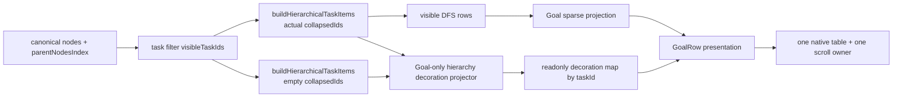

# SPEC-121：OKR 父子任務樹狀對照與群組範圍

- 文件版本：R13，2026-09-15；完成最大化 X 軸壓縮、移除端點、樹線柔和化、即時定位自有 incoming relation 高亮、active 對比強化、rowSpan owner 邊界修正與內容反向定位。
- 成熟度：`RD Implementation Complete / Targeted QA PASS / QC Ready / NOT RELEASED`。
- 對應：DEV-121（交付點）；父任務 DEV-116；相容 DEV-119、DEV-120。
- 需求來源：`USER-20260914-GOAL-HIERARCHY-COMPARISON`、
  `USER-20260914-KEEP-GOAL-CONTENT-ROWSPAN`、`USER-20260914-MINIMIZE-GOAL-X-INDENT`、
  `USER-20260915-GOAL-CONTENT-REVERSE-LOCATION`。
- 驗收權威：[QA-DEV-121](../qa/QA-DEV-121-goal-hierarchy-comparison-grid.md)；
  狀態入口：[dev_task](../dev_task.md#dev-121okr-父子任務樹狀對照與群組範圍)。
- 風險：Medium。風險集中於 native `rowSpan`、sticky first column、列級 reading guide、
  DnD hitbox 與深層樹線幾何的交互作用；不涉及資料模型、權限或 persistence。

## Tech Lead R2 Review

- 結論：`PASS`；P0／P1 blockers = 0，可直接交 RD 依 WP-121-A → E 實作。
- 真正失效機制：canonical hierarchy 已正確，但固定任務欄沒有持續的 lineage signal；共享 `rowSpan`
  又讓 content 範圍與 task-row 範圍不同，泛用 row hover 會放大錯列。
- 最小修正：保留一個 Goal-only pure projector；R8 由它輸出 parent、visible child、ancestor path、
  owned continuation、last visible sibling 與 eligible descendant count，讓每條線能追溯 relation owner。
- 已刪除：projector 中重複的 `taskId`、`level`、root-group start/end；root boundary 直接由既有
  `data-goal-level="0"` 與 rendered index 推導，planning cell 直接重用 `data-goal-planning-control`。
- 技術債：0。`:has()` 只提供跨 cell reading guide；R8 的 `activeHierarchyScopeId` 是 Goal-local ephemeral
  hover／focus state，不進 store、selection、persistence 或第二套 hierarchy truth。

## 1. 成功結果與差距

OKR 表格保留既有高密度與欄位比較能力，同時讓使用者能在固定於資料表格左側的任務名稱欄中，
直接辨識父子路徑、同層兄弟及一個根任務群組的終點。滑鼠或鍵盤進入任務／planning 欄位時，
同一列以低對比導引連接，降低跨欄錯列。

目前的根本差距是同一畫面存在兩種閱讀尺度，但只有單列格線：

1. 任務名稱、負責人、狀態、日期、工期屬於「一列一任務」。
2. 任務目的、會議紀錄的 native `rowSpan` 屬於「一個 owner 涵蓋連續子樹空白列」。

看板模式已用父層錨點、鄰接、縮排與 inset rail 表達群組。DEV-121 只轉譯這套關係語法，
不把 OKR 變成卡片，也不把共享內容誤表達為每個子任務的內容。

## 2. Human Decisions 與不可變條件

1. 任務名稱固定在**同一資料表格的左側第一欄**。它不是 app sidebar、viewport-fixed panel 或第二張表。
2. 其他欄位留在同一 native table，由同一個 X-scroll owner 移動。
3. description／meeting 保留 native `td[rowSpan]`、owner、covered-cell 無 DOM、展開／收合與欄內 Y-scroll。
4. 已拒絕取消跨任務合併儲存格；不得把父任務內容複製、繼承或延伸成子任務自有內容。
5. 移植看板的階層語法，不移植卡片容器、欄位堆疊或看板拖曳模型。
6. 收合後代數量只在該任務已收合且合格後代不可見時出現；展開時不常駐顯示。
7. hierarchy、filter、mutation、permission、content session 與 persistence 的既有 owner 不變。

以上任一項需要改變時，停止實作並回到 PM／規劃模型；不得由 RD 當作局部 CSS 選擇處理。

## 3. Spec Impact Preflight

| 既有權威 | DEV-121 分類 | 保留契約 |
|---|---|---|
| SPEC-116 | Compatible visual amendment | active-board primary DFS、shared 6px depth default（Goal R8 局部 8px）、native table／rowSpan、DnD、task menu、mobile negative、a11y。 |
| SPEC-119 | Compatible visual amendment | content owner／covered ownership、cell session、F2／雙擊、展開／收合、Y-scroll、PWA owner。 |
| SPEC-120 | Compatible visual amendment | 252px frozen task column、單一 X-scroll owner、planning tracks、mounted quiet controls、28～30px 一般列密度。 |

本案沒有 schema、API、store、permission、route、state machine 或外部介面決策，且可由 Goal-local
presentation 回復，因此不新增 ADR。SPEC-121 是新增的視覺與互動 target，不回寫歷史 candidate evidence。

## 4. 現況程式與責任邊界

| Surface | 現況事實 | 定案 |
|---|---|---|
| `src/components/GoalView.tsx` | `buildHierarchicalTaskItems` 產生可見 DFS rows；`collapsedIds` 是 Goal-local；同一 native table 的第一欄 sticky left；外層 `data-goal-view` 是唯一 X/Y scroll owner。 | 它仍是 composition owner，接收 Goal-only decoration map 並渲染 data hooks、樹線、群組面與 reading guide。 |
| `src/utils/taskHierarchy.ts` | Calendar、Gantt、Goal 共用 hierarchy builder。 | 不修改；它仍是順序、層級、可見性與 collapse 的 canonical presentation truth。 |
| `src/components/Wbs/TaskHierarchyIndentedRow.tsx` | 共用 disclosure 與 6px depth indentation。 | 不修改 API、DOM 或 shared default；DEV-121 樹線由 Goal 外層疊加。 |
| `src/features/goalMode/projection.ts` | pure sparse projection 決定 owner／covered／`rowSpan`，沒有 inheritance。 | 不修改；階層裝飾不得參與 content ownership。 |
| `OwnedCell`（GoalView） | 只對 owner 渲染 `td[rowSpan]`；內容 scroll／edit／expand 都在該格。 | 保留事件、key、rowSpan、headers、session；description／meeting owner cell 的 hover／focus 反向回報 `ownerTaskId`，不新增 store 或第二事件流。 |
| `src/components/Wbs/KanbanCard.tsx`、`TaskChecklistTree.tsx` | 看板以父層錨點、inset rail 與鄰接表達階層。 | 只作視覺語法參考；不抽共用 card component，也不依賴 Board DOM。 |

### 4.1 方案取捨

| 方案 | 結論 | 原因 |
|---|---|---|
| 擴充 shared hierarchy builder 回傳 Goal guides／counts | 不採用 | Calendar、Gantt 也會承受 Goal-only metadata、計算與回歸面；沒有共享使用情境。 |
| Goal 直接遍歷 raw nodes／parent index | 不採用 | 會複製 active-board、archive、filter、order 與 cycle 規則，形成第二套 hierarchy truth。 |
| 同一 builder 產生 rendered＋fully-expanded rows，再做 Goal-only owned decoration | 採用 | 重用 canonical eligibility；新增責任只限 Goal presentation；可獨立測試與回復。 |
| 把父任務改成卡片或拆成左右同步表 | 不採用 | 違反使用者決策，增加容器與 scroll synchronization，降低表格比較效率。 |

第二次 canonical projection 是本案唯一新增計算成本。它由 memoization 隔離 collapse state，且 projector
採 `O(n + r)`；若 500-row observation 顯示相對 DEV-120 有明顯退化，先證明 bottleneck 再回規劃，
不得預先加入 cache store、worker 或 virtualization。

## 5. 定案架構

### 5.1 單向資料流



- 第一次 builder 輸出是真正 rendered rows；第二次以 empty `collapsedIds` 輸出同一 filter 下的
  fully-expanded eligible rows，只供計算收合後代數量。
- 第二次輸出以 `useMemo` 綁定 `boardId`、`nodes`、`parentNodesIndex`、`visibleTaskIds`，不因收合動作重算。
- decoration projector 是 pure、read-only、fail-closed。它不能新增、刪除、排序、重新定 parent、決定
  content owner，亦不能呼叫 mutation。
- 這個雙投影重用同一 canonical builder，避免複製 archive／board／filter／cycle 規則。

### 5.2 Goal-only presentation model

新增 `src/features/goalMode/hierarchyPresentation.ts`，公開最小契約：

```ts
export type GoalHierarchyContinuation = Readonly<{
  guideLevel: number;
  ownerTaskId: string;
}>;

export type GoalHierarchyDecoration = Readonly<{
  parentId: string | null;
  isLastVisibleSibling: boolean;
  hasVisibleChildren: boolean;
  ancestorTaskIds: readonly string[];
  ancestorContinuations: readonly GoalHierarchyContinuation[];
  eligibleDescendantCount: number;
}>;

export function buildGoalHierarchyDecorations(args: Readonly<{
  renderedItems: readonly HierarchicalTaskViewItem[];
  fullyExpandedItems: readonly HierarchicalTaskViewItem[];
}>): ReadonlyMap<string, GoalHierarchyDecoration>;
```

演算法契約：

- `renderedItems` 是可見 row、level、parent 與順序的唯一真相。
- `fullyExpandedItems` 只計算同一 filter 下的 eligible descendant count；以 DFS level stack
  一次掃描求 subtree end，禁止每列向後全表掃描。
- sibling 尾端與 visible parent set 由 rendered DFS 一次掃描建立；每列只輸出實際需要渲染的 ancestor continuations。
- continuation 以 `{ guideLevel, ownerTaskId }` 表達；level-0 root 不成為跨群組 ancestor rail，
  incoming relation 由當列 `parentId` 明確渲染，禁止只以 level 猜父任務。
- root identity 與 boundary 不進 projector：`item.level === 0` 是 root；`level === 0 && renderedIndex > 0`
  才顯示 group separator。最後一個 group 由 table bottom 收束，不另畫第二條 end line。
- 時間複雜度為 `O(n + r)`，`r` 是實際輸出的 rail 數；不得加入每列重跑 tree builder、DOM query
  或 render-time store lookup。
- 重複 id、負 level、DFS level 跳級、rendered 不是 fully-expanded 子序列或結構不一致時，projector
  對整批 fail closed 為空 map，並由 static verifier 使 candidate 失敗；產品仍顯示既有 hierarchy，不能崩潰。

### 5.3 DOM layering 與 test hooks

`GoalRow` 接收對應 decoration，保留原 `<tr>`、`<th scope="row">` 與既有 cells。先重用現有
`data-goal-task-row`、`data-goal-level`、`data-goal-planning-control`、`data-goal-cell-kind` 與
`data-goal-span`；只新增無既有等價物的 hook：

- frozen task `th[data-goal-task-cell]`
- owner `td[data-goal-group-span="true"]`，只在 `rowSpan > 1` 時存在
- 樹線容器 `data-goal-hierarchy-guides`，每段標記 level／kind／owner／active；整層 `aria-hidden="true"`、
  `pointer-events:none`。kind 限 `continuation`、`incoming-vertical`、`incoming-branch`、`child-stem`、
  `root-branch`；R8 不渲染 endpoint。
- guide 容器的 `data-goal-hierarchy-last-sibling` 只供 geometry／QA 判讀，不重複 task id／level。
- 收合數量 `data-goal-descendant-count`。

這些 attribute 是 DEV-121 browser contract；不得用脆弱的 Tailwind class 字串作唯一 selector。

### 5.4 固定任務欄的樹狀語法

- 保留 shared `--task-hierarchy-indent: 6px` default；Goal surface 局部覆寫 8px。252px task track、
  32px 一般列與現有 title truncation 維持。
- 樹線位於 frozen task cell 內，跟著該欄 sticky，不建立獨立 overlay table。
- task `th` 是 relative owner；guide layer 以 absolute、full-inset presentation node 放在既有
  `TaskHierarchyIndentedRow` 內，保持 task cell 只有一個 shared row wrapper。disclosure 固定於樹線左側
  20px 操作槽，與最左樹線相接但不重疊，右側不保留額外操作槽。
- level `L > 0` 的 incoming lane X = `20px + (L - 1) × 8px`，branch 長 12px，直接接到
  `24px + L × 8px` 的文字起點；vertical width 1px，無 endpoint。跨列線 top／bottom 各重疊 1px。
- 有可見子任務的節點從當列中心向下畫 child stem；非最後 sibling 的 incoming vertical 延伸到列底，
  最後 sibling 在當列 branch 中止。ancestor continuation 只在 ancestor 有後續可見 sibling 時存在，且帶父任務 owner。
- root 不接收 incoming line；root group 之間沒有 outer rail 或跨群組 continuation。L0 以 semibold task title、
  4px root branch 與低對比不透明底成為群組錨點；除第一個 rendered root 外，
  其他 `data-goal-level="0"` row 以 2px 上邊界開始新群組。
- root group 間不插入 spacer row，避免改變 rowSpan 與 32px 密度。第一個 root 不畫多餘頂線。
- 正常線使用中性低對比；hover／focus 父項時只將該父項擁有的關係線與可見子樹切成 indigo，
  其他 owner 的 continuation 保持中性。
- 樹線不可蓋住 disclosure、文字、拖曳、右鍵或 focus ring；在 forced-colors／移除顏色時仍靠線段與位置表意。

### 5.5 `rowSpan` 群組範圍面

- `rowSpan > 1` 的 description／meeting owner cell 使用低對比中性 group surface 與 2px inset scope rail；
  `rowSpan = 1` 不增加群組面。
- group surface 由實際 owner `td` 承擔，不新增 wrapper cell、clone 或 covered placeholder。
- `rowSpan` 數值、owner task id、headers、tabIndex、內容高度公式、Y-scroll、expanded state、editor session
  及 content menu event owner 全部保留。
- root-group separator 可落在該 root row 實際存在的 cells 上；不得切開一個正在跨列的 owner cell。
- connector reading guide 不進 shared group cell。shared `rowSpan` owner cell 仍作為父層群組脈絡顯示；
  只有 active scope 的實際 owner task 自己取得 active tint，active scope 落在 covered descendant 時不染
  ancestor owner，避免把父層任務目的誤認為目前任務內容。使用者停在 shared content 時，仍只操作該
  content cell 自己的 current／editing／expanded 狀態。
- 反向定位：pointer hover 或 keyboard focus 進入 description／meeting 的實際 owner `td` 時，
  以該 cell 的 `ownerTaskId` 設為 Goal-local active scope，樹狀線、任務列與欄位 tint 回到同一個 owner task。
  covered descendant 沒有自己的 content `td`，因此不會被誤判為內容所有者；離開 cell 且未保留 focus 時清除 scope。

### 5.6 橫向 reading guide

- 正常任務列不顯示橫向 row divider，不做斑馬紋；只保留 root group 的 2px 上邊界作為群組分界。
- pointer hover 或 keyboard focus 位於 task cell／任一既有 `[data-goal-planning-control]` cell 時，同一
  `<tr>` 的 task cell 與 planning cells 使用 active background shift；只有目前任務本身是 description／meeting
  owner 時，該 owner cell 才套用相同 active tint。若目前任務落在 ancestor 的 `rowSpan` covered 範圍，
  owner cell 維持 group surface，connector guide 仍不進入該 cell。
- pointer hover 或 keyboard focus 位於 description／meeting 的 owner cell 時，反向設定該 cell 的 `ownerTaskId`
  為 active scope，讓使用者從內容欄回看固定任務名稱欄的所屬任務；此行為沿用同一套 scope、connector 與 tint，
  不新增 selection、store、persistence 或額外 DOM。
- pointer hover 或 keyboard focus 位於任務名稱、負責人、狀態、開始日期、結束日期或工期等一列一任務欄位時，
  以 rendered row 的 `node.id` 作為 owner，沿同一套 scope、connector 與 tint 定位該任務；所有欄位不各自建立定位 state。
- CSS scope 固定在 `[data-goal-view]`，以直接子 cell data hooks 搭配 `:has()` 連動；不可用泛用
  `tr:hover > *`，因 rowSpan hit-testing 會把 shared content 誤算到 owner row。
- 不支援 `:has()` 的環境保留 individual target hover／focus，核心操作仍可用；正式 browser matrix 的
  Chromium／Edge 必須通過整列導引。
- reading guide 不新增 React selection state，不寫 store，不取代 selected cell outline、validation、due、
  dependency、locked 或 focus ring；這些必要狀態的對比優先。

### 5.7 收合後代數量

- 只在 `collapsedIds.has(taskId) && eligibleDescendantCount > 0` 時，於任務標題尾端顯示 `+N`。
- `N` 是目前 active board 與 filter 下、fully-expanded canonical hierarchy 中的全部後代數，不只直接子任務。
- `+N` 使用弱化文字，不用 pill／badge／圖示；具 `aria-label="已收合 N 個下層任務"`。
- 展開、無合格後代、資料不一致或 viewer 模式時都遵循同一顯示規則；這是 presentation，無權限差異。

### 5.8 Interaction、DnD 與 accessibility

- disclosure、task details、GlobalContextMenu／`Shift+F10`、primary-placement DnD 及 planning controls
  繼續使用既有 handler／guard；不得把 listener 移到樹線。
- guide layer 不進 tab order、不接 pointer event、不新增 tooltip 或常駐 helper。
- 保留 native table semantics、`scope="row"`、column headers、`rowSpan` 與 DOM focus order；不改成
  `role="treegrid"`，不加入不適用於 native table 的 `aria-level`／`aria-selected`。
- `+N` 提供獨立 accessible name；既有 disclosure `aria-expanded` 與 task name label 不變。
- 200% zoom、窄 viewport 與水平捲動下，樹線、文字與 focus ring 不重疊；唯一 X-scroll owner 不變。

## 6. Scope 與禁止區

### 6.1 必改 surface

| File | 唯一責任 |
|---|---|
| `src/features/goalMode/hierarchyPresentation.ts` | pure decoration projection；無 React、DOM、store 或 mutation。 |
| `src/components/GoalView.tsx` | 產生兩份 canonical hierarchy、接線最小 decoration、重用既有 hooks 並渲染 guides／count／group surface。 |
| `src/index.css` | 僅 `[data-goal-view]` scoped tree geometry、group surface、root boundary、reading guide。 |
| `scripts/verify-dev-121-goal-hierarchy-comparison.ts` | source／pure projector／boundary static verifier。 |
| `scripts/verify-dev-121-goal-hierarchy-comparison-browser.pw.js` | 正常入口、geometry、interaction、a11y、visual/error evidence。 |
| `package.json` | 登錄 DEV-121 static／browser scripts。 |
| DEV-121 SPEC／QA／dev_task／documentation map | contract、evidence 與狀態同步。 |

既有 DEV-116／119／120 verifier 只在 additive DOM hooks 造成 oracle drift 時做最小相容更新，
不得刪除或放寬 rowSpan、sticky、single-scroll、editor、planning 或 hierarchy assertions。

### 6.2 禁止修改

- `src/utils/taskHierarchy.ts`、`src/features/goalMode/projection.ts`、
  `src/components/Wbs/TaskHierarchyIndentedRow.tsx` 的行為與 shared default。
- TaskNode／placement／filter schema、API、RLS、permission、store、persistence、undo、meeting capture。
- DEV-119 `GoalCellSessionProvider`、PWA owner、editor／expand lifecycle。
- Calendar、Gantt、List、Board 的視覺或階層輸出。
- 手機 Goal、task-name resize、split table、virtualization、卡片化、第二個 scroll owner。

## 7. Work Packages 與交付順序

| WP | 工作 | 完成條件 |
|---|---|---|
| WP-121-A | 凍結 candidate hashes、建立 fail-first static cases 與 hierarchy fixtures。 | baseline、fixture、預期失敗皆可追溯。 |
| WP-121-B | 實作 pure Goal hierarchy decoration projector。 | S01～S06 通過；順序／可見性／owner 零影響。 |
| WP-121-C | 在 GoalView／Goal-scoped CSS 接入 guides、root boundary、group surface、reading guide、`+N`。 | S07～S12 通過；無 shared component 變更。 |
| WP-121-D | browser geometry、interaction、actor、zoom、rowSpan、X/Y scroll 與 visual comparison。 | B／V／A／G 全案例有 artifact。 |
| WP-121-E | 跑 DEV-116／119／120 回歸、type／lint／build／diff，凍結 RD candidate。 | 同一 source hash 全綠；文件更新為 RD self-test 結果，交 QA／QC。 |

順序固定 A → B → C → D → E。任何 WP 首次碰到禁止區、canonical builder 需變更、
rowSpan 必須模擬或第二個 X-scroll 才能完成時，停止並回送規劃模型。

## 8. Acceptance Contract

- AC-121-01：任務名稱是同一 native table 的 sticky-left first column；X-scroll owner 數量仍為 1。
- AC-121-02：L1～L4+ fixture 中，每個非 root 可由 rail／elbow 與位置追溯至父路徑；最後 sibling 正確終止。
- AC-121-03：第二個及後續 root 以單一上邊界開始新 group，最後 group 由 table bottom 收束；
  沒有雙重 start/end line、spacer row、卡片框、斑馬紋或層級 badge。
- AC-121-04：description／meeting owner 數、`rowSpan`、covered DOM absence、內容與 owner task id
  在接入前後完全相同。
- AC-121-05：group surface 只出現在 `rowSpan > 1` owner；子任務 reading guide 不進 group cell。
- AC-121-06：task／planning hover 或 focus 只導引該任務 row；停在 shared content 不誤亮 owner row。
- AC-121-07：collapsed `+N` 等於 current filter 下全部 eligible descendants；展開時不存在。
- AC-121-08：collapse／expand 後 row order、rowSpan projection 與 guides 同步，沒有一幀殘留或錯線。
- AC-121-09：task details、context menu、DnD、planning、content edit／expand／scroll 的 hitbox 與結果無退化。
- AC-121-10：viewer 無非法 mutation；視覺 hierarchy、`+N` 與 readable planning 仍存在。
- AC-121-11：1440×900、1298×698、814×698、2x CSS zoom proxy 無重疊、裁切或第二條 X-scroll。
- AC-121-12：native table／headers／rowSpan／focus order／accessible names 完整；樹線完全 presentation-only。

## 9. Required Verification

```text
npm run verify:dev-121-goal-hierarchy-comparison
npm run verify:dev-121-goal-hierarchy-comparison-browser
npm run verify:dev-116-goal-mode
npm run verify:dev-116-goal-mode-browser
npm run verify:dev-119-goal-cell-actions
npm run verify:dev-119-goal-cell-actions-browser
npm run verify:dev-120-goal-planning-minimal-density
npm run verify:dev-120-goal-planning-minimal-density-browser
npx tsc --noEmit
npx eslint <DEV-121 changed TS/TSX files>
npm run build:test
git diff --check -- <DEV-121 owned files>
```

browser evidence 必須由正常 `視角 → OKR模式` 入口建立，記錄 branch、HEAD、dirty state、source hashes、
actor、fixture、viewport、browser、base URL 與 runtime owner。static、build 或 jsdom 不能單獨宣稱 visual PASS。

## 10. Stop、Fail 與 Release Boundary

- Stop：需要改 canonical hierarchy／projection、模擬 rowSpan、改 content session、改 shared default、
  新增第二 scroll owner，或 native table 無法同時達成 sticky／guide／a11y。
- Fail：任一 task order／level／rowSpan／owner drift；錯誤 ancestor rail／count；reading guide 進入 group cell；
  hitbox 被遮擋；locked／validation／focus 訊號被蓋掉；其他模式 visual drift；visible error／console error；
  task-owned runtime 或 UI surface 未清理。
- Not verified：缺 source hash、fixture provenance、computed geometry、截圖、keyboard、viewer 或 scroll evidence。
- 本案完成 RD self-test 仍不等於 release。commit、push、PR、deploy、production smoke、原生 browser UI zoom
  與正式資料環境驗證均走獨立 release gate。

## 11. Architecture Closure R2

- 2026-09-14 baseline：branch `持續優化3`；HEAD
  `e335eaa07c14313afb5a27607a2c009ace3bcbc3`；working tree 已有 DEV-119／120 與使用者變更，
  實作時禁止 reset／checkout／整檔覆寫。

| Baseline file | SHA-256 |
|---|---|
| `src/components/GoalView.tsx` | `9545F59F158E64658E4B0872EF6B122E4517C756854F69225722FCDC3B0BE7EF` |
| `src/components/Wbs/TaskHierarchyIndentedRow.tsx` | `781CF5087213DEA82265F2FF38408775B2D434EF59246B6336BF2A5DB2931E8D` |
| `src/utils/taskHierarchy.ts` | `4E10573CED0DA846F79958CACF3BDA552C12F32668814C054E4FC47A35875832` |
| `src/features/goalMode/projection.ts` | `FB1DFE0FB1B7AF9E5B616C7CAEE465B06E69557AD572F4F82803B3FCEA4536A4` |
| `src/index.css` | `1D41BFCC12610FCDF5143034545B918E34759EDC18986B36D91D43DF00BF34F9` |
| DEV-116 static／browser | `F1113067...DB6BF`／`286DF27E...8CD0` |
| DEV-119 static／browser | `2778F586...606A4`／`4469854B...C670` |
| DEV-120 static／browser | `7FD43F3B...2F159`／`6EDF39BE...09E0` |

- R2 初始定案為「canonical hierarchy 兩次 pure 投影 + Goal-only decoration map + 同一 native table
  的 presentation layering」；R7／R8 只加入 owned relation facts與 Goal-local 幾何。root boundary／planning selectors 重用既有 row facts與 hooks；沒有第二棵樹、
  重複 root metadata、新 store 或新的 selection/session owner。
- 已決策 P0／P1：0；待 RD 自行決定僅限局部 symbol／class 名稱、等價色 token 與 verifier 實作細節，
  不得改變本 SPEC 的幾何、語意、scope、gate 或禁止區。
- R2 規劃狀態已由下方 Implementation Closure R3 取代；保留本節作為架構決策與 baseline 紀錄。

### Implementation Closure R3（2026-09-14）

- branch `持續優化3`；HEAD `e335eaa07c14313afb5a27607a2c009ace3bcbc3`；working tree 保留既有使用者變更，未做 reset／checkout。
- WP-121-A～E 已完成：Goal-only pure decoration projector、同一 native table 的 tree／group／reading presentation、
  collapsed descendant count、browser evidence、相容回歸與 build gate 均完成。
- 實作責任落在 `src/features/goalMode/hierarchyPresentation.ts`、`src/components/GoalView.tsx`、
  `src/index.css`、DEV-121 static／browser verifier 與 package script；shared hierarchy／projection／row component、
  content session、store、schema、API、permission、persistence 均未變更。
- 驗證結果：DEV-121 static 12/12；DEV-121 browser 14/14；DEV-116 static 30/30＋browser PASS；
  DEV-119 static 18/18＋browser PASS；DEV-120 static 13/13＋browser PASS；`tsc --noEmit`、targeted ESLint、
  `npm run build:test` 與 `git diff --check` PASS。
- Candidate source hashes：`GoalView.tsx`=`DC33D62B3BB6A703EB98C061898377FB12A1A9F357DC4E924EA91B35FD1EFDE7`、
  `hierarchyPresentation.ts`=`DCAC2D7D65403F7E4697F5CA34BADCE2D962066BF9B9D3F3C89B7E34E1081961`、
  `index.css`=`EFBF7A1854D6FF584447466AEE0398AA72F38B3C725928C1136EF4D8032208A9`、
  DEV-121 static=`7B0F22468DCCBC9EE8BF940462FB572F6F7955573EB9F214AFA8455320A1870B`、
  browser=`A494A81779D85A41B7CF222960823B2D03FDD4A9AFC32DE8F75CB7BBBD17135E`。
- 可追溯證據：`output/playwright/dev-121-goal-hierarchy-comparison/static-result.json`、`result.json` 及 V01／V02／V03／V05 screenshots；
  DEV-116／119／120 artifacts 同樣保留於各自 output 目錄。
- Release boundary：尚未 commit／push／PR／deploy／production smoke；原生 browser UI zoom、正式資料環境與獨立 release gate 仍 pending。

### Visual Correction Closure R4（2026-09-14）

- 針對使用者回饋「補齊線條斷點、收闔箭頭不得與父子連線重疊」完成最小修正：guide 由 frozen task `th` 控制
  full-row geometry；連續 rails 跨列重疊 1px；disclosure 移至獨立 gutter；同 level 重複垂直段隱藏，保留必要 branch。
- DEV-121 browser 新增 `V09-connector-continuity-and-disclosure-gutter`：root A 群組最大 rail gap `0px`、
  disclosure-to-rail gap `8px`；總案例 15/15 PASS。DEV-116／119／120 browser regressions 仍 PASS。
- Final hashes：`GoalView.tsx`=`00FC3AD61B2CA3859844C1DD2AED81760C62D998A6D44CA8096A35F47F18056B`、
  `index.css`=`8FEF3E1EA3553CB1513CD865D5291FC48169141766271CDC0B49BBBA51BC28BE`、
  DEV-121 static=`0DBE8839E91E5E76AD99842AA85923DDA973EF6FEA43CE00654C0CC1ED7B483C`、
  browser=`512BA0AC53400FA3DA2DC1B8255C4B277960FBD3563E7F8498EA827E57C75D0E`。
- R4 仍屬 local candidate；未 commit／push／deploy／release，正式資料、原生 browser UI zoom 與獨立 release gate 保留。

### Visual Correction Closure R5（2026-09-14）

- 依使用者回饋移除 OKR 任務列之間的常駐橫向格線；保留欄位垂直邊界與 root group 2px 上邊界，
  不改階層連線、rowSpan、content session 或 single X-scroll owner。
- 新增 `V10-no-inter-task-gridlines`；browser 16/16，`bottomBorders=[]`、`rootBoundary=2px`；static 13/13。
- Final source hashes：`GoalView.tsx`=`E5DDAD392625EFF0F9D7B217600C331041F78B4B7DD600FA76A8466168E2A75E`、`index.css`=`7B2BFBD4BC811CADD0230C37502DABD302C71131BCFC2E6A8C5814AA95AA6DE7`、
  DEV-121 static=`FBFDD9A8C3C62A342D35A4B27F22DB4959DA012C6FCF4CF3738E3A90E0C1270E`、browser=`613280C9D0494F1C77350429EE951006682880EEAFA674C1BFEF66BB843E2A64`。

### Visual Correction Closure R6（2026-09-14）

- 依使用者回饋移除任務名稱欄最外側 level-0 continuation rail；level-0 elbow 保留短 branch，
  使階層仍可由縮排、箭頭、分支與更深層 rail 辨識。
- 新增 `V11-outermost-continuation-rail-removed`；browser 17/17，確認 continuation `visibility=hidden`、
  elbow vertical background transparent、branch background 保留；static 14/14。
- Final source hashes：`GoalView.tsx`=`E5DDAD392625EFF0F9D7B217600C331041F78B4B7DD600FA76A8466168E2A75E`、`index.css`=`7CD097E3617D07EA28FB25EBC578716C675000F57F722D9AA58F24F8F6CB8127`、
  DEV-121 static=`D6D045FC708EE97F5D6307EB42CE2C2E76B61B244CF65DED23095B60878F9329`、browser=`499C562100754370C5BFB967D4501F9A7E1ADB168EA29A169D38948C3FAE6A29`。

### R7 User-confirmed Wired-tree Contract（2026-09-14）

本節彙整 §5.2、§5.3、§5.4 的 R7 現行契約，並取代 R6 中關於 continuation levels、左側 disclosure gutter、
6px Goal 深度與隱藏 level-0 rail 的視覺契約。資料、權限、native table／`rowSpan`、sticky first column、
single X-scroll、projection 與 mutation 契約全部維持。

- Goal-only presentation model 改輸出 `parentId`、`isLastVisibleSibling`、`hasVisibleChildren`、
  `ancestorTaskIds`、帶 `{ guideLevel, ownerTaskId }` 的 `ancestorContinuations`，以及
  `eligibleDescendantCount`。每段線都有 relation owner，禁止只用裸 level 推測歸屬。
- Goal view 局部覆寫 `--task-hierarchy-indent: 20px`；共享元件的 6px default 不改。252px 任務欄及一般列密度維持。
- level `L > 0` 的 incoming lane X = `18px + (L - 1) × 20px`；同列 branch 長 24px，終點中心
  X = `22px + L × 20px`。線寬 1px，跨列 top／bottom 重疊 1px，終點為 4px 圓點。
- 父任務若有可見子任務，從父列中心向下畫 child stem；非最後 sibling 的 incoming vertical 延伸至列底，
  最後 sibling 在該列中心終止。ancestor continuation 只在該 ancestor 尚有後續可見 sibling 時存在。
- root 不接收 incoming line；root 之間不存在 outer rail 或跨群組 continuation。每條 continuation 的
  `ownerTaskId` 必須是產生該 sibling chain 的父任務，group boundary 仍由第二個及後續 root 的 2px top border 表達。
- disclosure 固定在任務欄右側獨立 24px 操作槽，與最右 tree connector canvas 至少 12px；箭頭不可與線、
  端點、標題、drag／menu hitbox 或 focus ring 重疊。
- 正常線為中性低對比；hover／focus 有子任務的父項時，僅將該父項擁有的 child stem、後代 incoming／
  continuation 與可見子樹面切成 indigo。root 或其他父項擁有的 continuation 保持中性，避免把線誤讀成目前父項。
- `activeHierarchyScopeId` 僅允許是 `GoalView` 的 ephemeral React state，供 hover／focus 表現；離開該 task cell
  即清除，不寫 store、selection、persistence，也不影響 collapse／filter／rowSpan truth。
- 參考設計稿：[UX-DEV-121 owned connector task hierarchy](../design/UX-DEV-121-owned-connector-task-hierarchy.md)。
- R7 完成門檻：static verifier 更新為 S01～S15；browser 新增 owned connector、row endpoint／last sibling termination、
  disclosure gap 與 active subtree ownership；舊 R6 17/17 僅是歷史 evidence，不代表 R7 PASS。

### R7 Implementation Closure（2026-09-14）

- 已完成帶 owner 的 pure presentation projection、六種明確 segment、20px Goal-local depth、右側 disclosure slot、
  hover／keyboard focus 子樹 scope；未修改 shared hierarchy builder、`TaskHierarchyIndentedRow` default、content projection、
  `rowSpan`、store、permission、mutation 或 persistence。
- DEV-121 static 15/15；browser 20/20。幾何量測：owner-lane 最大 gap `0px`、disclosure-to-guide gap `145.5px`、
  vertical width `1px`、branch width `24px`、endpoint `4×4px`、endpoint 對列中心最大偏差 `0.5px`；browser／HTTP／visible errors 皆 0。
- 相容回歸：DEV-116 static 30/30＋browser 42/42；DEV-119 static 18/18＋browser 17/17；
  DEV-120 static 13/13＋browser 19/19。DEV-116 V20 已依 intentional replacement 驗證 Goal 20px／32px，
  同時守住 List shared default 6px／20px。
- Quality gates：`npx tsc --noEmit`、targeted ESLint、`npm run build:test`、targeted `git diff --check` PASS。
- Candidate hashes：`GoalView.tsx`=`85BF48971D8BA1B4CC62DB9EE7BAE936E3CE7195C7EC0DFE2EABD43A84779E70`、
  `hierarchyPresentation.ts`=`6E20C92FC83DEF0F7063A9825BCA123364C3CA283DD3C88BE2804F650FAC6F4C`、
  `index.css`=`BC76F3B4B99DEA436E0FEF2522D937DDAAB67E8DFC3EFCD80D3B5E9EC37A6561`、
  DEV-121 static=`4B9B68AF39AB74B87DBBED0DE41445F289B9EEEBDF809D4875FC46FCE70E0DB5`、
  browser=`2A31AD9E7ED180CEFBFB78C501E2CCD3EF6A871713A83E0999EF119BEB74FC6C`。
- Evidence：`output/playwright/dev-121-goal-hierarchy-comparison/` 的 `static-result.json`、`result.json`、normal／hover／
  frozen-column／viewer screenshots。重用既有 `localhost:4000`，只清理 runner 自有 browser process；未停止使用者 runtime。
- Release boundary：未 commit／push／PR／deploy／release；目前可交 QC 或由使用者直接檢視 local candidate。

### R8 Compact X-axis Contract（2026-09-14）

- R8 保留 R7 的 owned connector、最後 sibling 終止、root group 隔離、樹線左側 disclosure、hover／focus 子樹與
  native `rowSpan`；只收斂 frozen task cell 的水平幾何。
- Goal-local depth step 由 20px 壓縮為 8px；lane start 為 20px，task title base inset 收斂為 24px，讓左側 disclosure slot 與樹線分離。
- incoming branch 由 24px 壓縮為 12px並直接接到文字容器起點；root branch 為 4px；所有 4px endpoint 移除。
- branch 右端與 `.task-title-text` 左端的絕對距離必須 ≤0.5px；標題不保留左側 padding，避免線端與文字之間出現假空隙。
- disclosure button 固定於樹線左側的 20px 操作槽，與最左樹線不得重疊；右側不保留 disclosure 專用空白。
- 線段 kind 限 `continuation`、`incoming-vertical`、`incoming-branch`、`child-stem`、`root-branch`；
  不得以 endpoint、badge、icon 或額外 gutter 補回水平空間。
- Shared hierarchy default 維持 6px，252px sticky task track、32px row、single X-scroll owner 不變；disclosure 改位於樹線左側的 20px 操作槽。

### R8 Implementation Closure（2026-09-14）

- 已完成 8px depth、20px lane start、12px incoming branch、4px root branch及 endpoint removal；disclosure 已移至樹線左側操作槽。
- DEV-121 static 15/15、browser 20/20；DEV-116 30/30＋42/42、DEV-119 18/18＋17/17、
  DEV-120 13/13＋19/19；TypeScript、targeted ESLint、test build、diff check PASS。
- 實測 depth `8px`、lane start `20px`、incoming branch `12px`、endpoint count=0、owner-lane gap `0px`、
  disclosure-to-guide left gap `0px`、branch-to-title distance `0px`、branch 對列中心最大偏差 `1px`，且 0 browser／HTTP／visible errors。
- Candidate hashes 與 evidence 由 QA-DEV-121 R8 Execution Record 管理。
- 本機 candidate 為 QC Ready；未 commit／push／PR／deploy／release。

### R9 Soft Connector Tone Addendum（2026-09-14）

- 保留 R8 的線段種類、owner、位置、終止與左側 disclosure geometry；只降低線條視覺權重。
- normal connector 使用 `rgb(148 163 184 / 42%)`，active connector 使用 `rgb(99 102 241 / 76%)`；所有線段使用 `border-radius: 999px`，形成柔和端角。
- 不增加 endpoint、陰影、額外 gutter 或 DOM；不改 hierarchy、rowSpan、scroll owner、hover／focus scope、資料與互動行為。
- DEV-121 static 16/16、browser 21/21；V13 實測 normal background `rgba(148, 163, 184, 0.42)`、radius `999px`；browser／HTTP／visible errors 皆 0。
- 本機 candidate 維持 QC Ready；未 commit／push／PR／deploy／release。

### R10 Active Task Lineage Highlight Addendum（2026-09-14）

- 即時定位（hover／focus）範圍包含目前任務自己的 `incoming-vertical`／`incoming-branch`，並與該任務擁有的 child stem、後代 incoming／continuation 同步 active。
- root task 沒有 parent relation，因此不新增或虛構 incoming 線；不相干 root continuation 與 sibling group 維持 inactive。
- active scope 仍是 Goal-local ephemeral state；不改 projector、row order、native `rowSpan`、single X-scroll owner、資料、store 或 persistence。
- DEV-121 static 16/16、browser 22/22（包含 V14 active self incoming regression）；browser／HTTP／visible errors 皆 0。
- 本機 candidate 維持 QC Ready；未 commit／push／PR／deploy／release。

### R11 Active Contrast Addendum（2026-09-14；歷史基線，R12 已修正 rowSpan owner 邊界）

- active connector stroke 提高為 `2px`，並以半像素 offset 維持在線軌中心；incoming branch／root branch 高度提高為 `2px`，不改 lane、branch 長度或端點規則。
- active scope 的目前任務與 planning cells 使用 `rgb(199 210 254 / 94%)`；後代使用 `rgb(224 231 255 / 90%)`；
  R11 曾讓被 active scope 覆蓋的 `rowSpan` owner cell 同步使用目前任務 tint，現行規則由 R12 收斂為只有實際 owner task 染色。
- 不增加 DOM、scroll owner、store、persistence 或資料欄位；R10 的 active self lineage 與 root isolation 全部保留。
- DEV-121 static 16/16、browser 23/23（V14 stroke、V15 scope tint）；browser／HTTP／visible errors 皆 0。
- 本機 candidate 維持 QC Ready；未 commit／push／PR／deploy／release。

### R12 RowSpan Ownership Contrast Correction（2026-09-15）

- 保留 native `rowSpan` 與父層內容脈絡；active scope 落在 covered descendant 時，不再將 ancestor owner cell
  染成目前任務色，避免「任務 4 顯示不屬於自己的任務目的」的誤讀。
- active scope 正好位於 description／meeting 的實際 owner task 時，owner cell 仍使用目前任務 active tint；
  因此內容會真的染色，但只在資料真正所屬的任務上染色。
- DEV-121 static 16/16、browser 24/24（V15 covered owner boundary、V16 owner tint）；browser／HTTP／visible errors 皆 0。
- 本機 candidate 維持 QC Ready；未 commit／push／PR／deploy／release。

### R13 Reverse Content Location Addendum（2026-09-15）

- description／meeting 的實際 owner cell 增加 pointer hover 與 keyboard focus 反向定位；事件只回報既有
  `ownerTaskId`，由 Goal-local `activeHierarchyScopeId` 驅動同一套 task／planning／connector scope。
- 任務名稱與所有一列一任務 planning 欄位同樣回報該 rendered row 的 task id；因此從任一欄位移入都能回看固定
  任務欄，且不產生欄位專用 state 或第二事件流。
- covered descendant 仍沒有自己的 content `td`；游標停在 shared `rowSpan` 內容時，固定任務名稱欄、incoming relation
  與 active tint 會定位到真正 owner task，不複製內容也不改變 rowSpan 所有權。
- 離開 owner cell 且沒有焦點留在 cell 內時清除 scope；F2、雙擊、展開／收合、編輯 session、single X-scroll、
  native table 與既有 planning mutation 全部維持。
- DEV-121 static 16/16、browser 27/27（B11 reverse content location、B12 all-column owner resolution、V17 owner identity）；browser／HTTP／visible errors 皆 0。
- 本機 candidate 維持 QC Ready；未 commit／push／PR／deploy／release。

使用思考習慣：#設計思考、#差距分析、#問對問題、#簡潔優先、#系統描繪、#限制條件、#可驗證性
