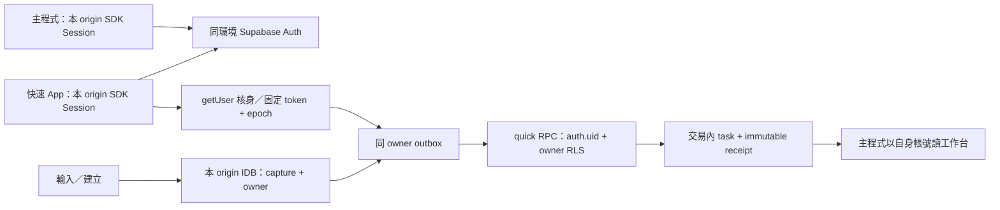

# SPEC-133：快速建任務共用帳號、各自登入與自動同步

修訂：**2026-10-01 Rev 3；Human Confirmed（產品方向）；RD Implementation Ready；架構定案：已定案**。本版完成 source、設定責任面、hosted schema 與既有測試的 Architecture Closure Review，取代 Rev 2 的 readiness 待核對項。**架構契約已鎖定；本機第一輪實作已完成，真實 TEST／工作台整合尚未驗證，未達 Release Ready。**

權威：[DEV-133](../dev_task.md#dev-133-快速建任務同帳號與自動同步---2026-09-30)、[ADR-053 Rev 3](../decisions/ADR-053-quick-task-cross-origin-account-link.md)、[QA-DEV-133](../qa/QA-DEV-133-quick-task-shared-identity-sync.md)。沿用原 DEV ID／文件路徑；[SPEC-122](SPEC-122-mobile-zero-data-quick-task.md) 的輸入、本機保存、RPC、工作台、manifest／SW 契約繼續適用，登入與認領交界以本版為準。

## 1. 目標、決策及執行邊界

目標是立即記下任務，可靠地同步到本人 ProJED「全域任務工作台」。使用者 2026-10-01 採用「共用帳號、各自登入、各自保存 Session、離線任務依帳號同步」，覆蓋早先 `3B` 的跨 App 自動登入；`1A／2A` 的本機先存、未綁定資料明確認領及清理保護保留。取消 ProJED OAuth Server／public client／consent 作必要依賴，保留普通 Google OAuth 登入。

本輪文件以已完成的本機第一輪實作為基準，補齊責任面、驗證順序與交接條件；Git／TEST／正式操作仍須依原授權及各自 gate 執行，不因文件定案直接宣稱通過。保留其他 dirty changes。使用者已取消實體 Android 驗收，瀏覽器手機模擬不得冒稱 Android PWA 實機 PASS。

範圍外：跨 origin token／IDB 複製、自製認證服務、強制帳號對齊、App 關閉後背景同步保證、修改已安裝 PWA identity、放寬 RLS／IAM／Secret 權限、管理金鑰進前端、業務資料改寫、清除未同步任務。快速 App 為第一方入口，普通 Session 沿用本人既有權限；不再承諾憑證本身只能新增任務，程式仍只呼叫 quick RPC，不載入業務清單。

## 2. Architecture Closure Review：實際基準與缺口定位

基準 repo `C:/VIBE CODING/ProJED/ProJED`，branch `持續優化3`；source implementation baseline `e868611`（`feat(quick-task): adopt independent Supabase auth sessions`），documentation evidence commits from `a1d12a9` onward，2026-10-01 working tree。相關安裝／DEV-132 修改已存在且須保留；其餘 dirty changes 不屬本 DEV，不能納入本版證據。

| 查證面 | 已觀察事實 | 本版固定處置 |
|---|---|---|
| Auth／SDK | 舊基準同時走 SDK 及自製 OAuth，且 quick callback detection 曾被條件關閉；主程式登出未固定 scope。現行 HEAD 已移除自製 OAuth／consent 路徑。 | 單一 SDK Session 路徑，開啟 SDK callback detection；一般登出明示 local。保留主程式 Firebase／local-test 分支。 |
| 本機／並行 | 舊 captures schema v1 沒有持久化已核實帳號或 receipt；epoch 只在記憶體。現行 HEAD 已升 DB v2。 | `auth_context` 與 capture 寫入共用交易，owner／context revision 使用 CAS，保存有效 receipt。詳見 §4。 |
| 認領／晚到回應 | 舊 `finishClaimFromUrl` 核身後即 bind，回應路徑未完整隔離新帳號 UI。現行 HEAD 已改為明確認領。 | 認領前明確確認目的帳號；晚到回應只完成原記錄，不能更新新帳號 UI。 |
| TEST `fhisnnufoeulxqrchldf` | DEV-122 alias `20260930154758`、v2 `20260930155041` 已套用；RPC 為 definer，空 search_path，execute 僅 postgres／authenticated／service_role。task／receipt 有 owner RLS 與 OAuth restrictive policies。 | 一支新 forward-only correction 恢復 canonical DEV-122 invoker；保留舊 migration、政策及未使用 allowlist。 |
| 正式 `knodlkxqpcqyrtgwpdst` | DEV-122 `20260914120000` 已套用，v2 未套用；RPC 為 invoker，空 search_path；相同 execute ACL，task／receipt 有 owner RLS。 | 正式不用啟用 OAuth Server／註冊 client。release 階段選取新 correction，不單獨補套已退役 v2。 |
| RPC 文字正規化 | TEST body 額外 trim `chr(8203)`；正式與 local DEV-122 不移除 U+200B。 | canonical body 以 local DEV-122 為準，前後端外圍空白規則一致；不改既有 task／receipt hash。 |
| 首次使用依賴 | 兩環境的 auth.users 都沒有非內建 trigger；profiles／tenant_members／tenants 既有 RLS。主程式登入負責既有 profile 設定。 | quick 不另建 profile／membership／workspace；缺可用工作台時保留任務並導往主程式完成設定，再人工重試。 |
| 測試／build | 舊基準含 consent entry、三個 QUICK_TASK_OAUTH keys 及舊 mock runners；現行 HEAD 已移除產品舊路徑並新增 independent-auth contract check。 | typecheck／targeted lint／test build／contract check 已通過；既有 browser runner 尚缺 Playwright，真實 N01～N10 仍不得以靜態結果替代。 |

以上為 scoped metadata 唯讀查證，不是權限矩陣或產品 PASS。RPC definition MD5：TEST `139a666b466ba55b9ee00aad52ce7b10`、正式 `ffc0eb5fdd4d284a113817d46eb53cfa`；僅作本次觀察綁定，實作前重讀，不能拿 hash 取代行為驗證。Auth provider／redirect allowlist 的最新遠端值本輪未讀回，列為 TEST 真實登入進入條件，不留成架構選項。

## 3. 最小資料流與登入契約

正式主程式 origin 保持 `https://projed-cc78d.web.app`，獨立 quick 保持 `https://projed-cc78d.firebaseapp.com/quick-task/`；同 origin `/quick-task/` 相容入口重用該 origin Session。不同 origin 各自登入及保存，不複製 token、cookie 或 IDB。兩邊以 Supabase user ID 判同一人，不以 email 合併帳號。

- `persistSession:true / autoRefreshToken:true / detectSessionInUrl:true`；沿用現有 SDK provider flow，不另換 PKCE／自行交換 Google code。quick 使用 `signInWithOAuth({provider:'google', options:{redirectTo, queryParams:{prompt:'select_account'}}})`。
- 新登入 redirectTo 固定為發起 origin 的 `/quick-task/`，不接收任意 return URL，不帶 token／owner／title。主程式保留既有 redirect。claim 不再依賴登入回跳自動認領；舊 `capture / claim` URL 只可帶到本機確認畫面。
- TEST 只允許本輪核對的隔離測試 origin；正式 callback 必須允許上述 quick 的精確路徑及既有同 origin 相容路徑，保留既有合法設定，不新增任意 host wildcard。SDK 初始化／callback 完成後才處理 claim、移除 SDK 已處理的敏感 URL 內容；錯誤、取消、缺本機資料均不能 claim。
- `getSession()` 是本機候選身分；送出前必須 `getUser(accessToken)` 確認 user ID，再讀最新 Session，確認 owner／token／epoch 未變。token 刷新或 owner 變更使舊核身 snapshot 失效；Auth listener 只更新 snapshot／排程，不在 SDK callback 中 await 另一 Auth 呼叫。[官方 getUser](https://supabase.com/docs/reference/javascript/auth-getuser)、[Auth events](https://supabase.com/docs/reference/javascript/auth-onauthstatechange)
- 每批最多一個核身與 flush；同 owner TOKEN_REFRESHED 取消尚未 dispatch 的舊批，核身新 token 後續送。在途 A 已被 server commit 的有效回應可完成 A 的記錄，不綁新 token 或顯示 B 成功。
- 網路／Auth 服務不可達：狀態為離線或「登入待確認」，保持最後核實的本機 owner，RPC=0，不自動跳登入。明確 token 失效／SIGNED_OUT：停止送出，提示重新登入；既有 A 記錄保持 A，SDK 身分消失後新記錄不得猜 A。
- 一般登出先取消本頁調度、bump epoch，提交 §4 的持久化登出 barrier，再 `signOut({scope:'local'})`；同 origin 共用 Session 的 tabs 一起停送。barrier IDB 提交失敗時先停本頁調度，提示「無法保存登出狀態，請重試」，不回報已登出或承諾跨 reload 停送；barrier 已提交但 SDK 登出失敗時顯示「已停止同步，登出尚未完成」及重試，不宣稱 server 已撤銷。已提交 barrier 跨 reload 保留，殘存 SDK Session 不得自動啟動。使用者主動重新登入且 SDK callback／核身成功才解除。已有明示全域撤銷保留平台語意，不承諾立即撤銷未到期 access token。[官方 signOut](https://supabase.com/docs/reference/javascript/auth-signout)

本機型別契約：`QuickAuthSnapshot` 固定 `readonly {accountId, accessToken, authEpoch, contextRevision}`，移除 clientId；`VerifiedQuickAuthSnapshot` 加 `email:string|null`。核身結果使用 `verified / unauthenticated / unreachable / cancelled` 判別式：分別為符合 snapshot 的真 user、缺 Session／明確失效、網路／429／5xx／逾時、epoch/token/revision 已變；不可再用同一個 null 混淆離線與登出。每次核身 deadline 15 秒，晚到結果只丟棄、不寫 context／觸發 flush；重試依 §7。context revision 與 binding barrier 必須在 lease transaction 及每次 dispatch 前檢查，同 origin 的另一 tab 即使未收到 SDK 事件也不能繼續派送。

兩邊均顯示本 App 帳號；quick 的 `#quick-task-auth-status` 在同一表單容器上方提供未登入 CTA，已核實時提供帳號與「登出」操作，待確認時標明離線／重新登入。主程式重用既有登入頁及 Sidebar 帳號入口；不另造帳號管理模組。切 B 立即收起 A 的成功卡片／title／待處理內容；A 的未同步記錄保留，不提供改綁 B 操作。

## 4. 本機模型、原子寫入及更新相容性

固定延用 DB `projed-quick-task-v1`／store `captures`／key `captureId`。**DB version 升至 2，capture schemaVersion 仍為 1**；在 `model.ts` 分開 DB version 與 record version，避免將資料庫升版當作重建。只加 `auth_context` store（keyPath `key`）及 capture 可選 `receipt`，不改原 owner／captureId／title／時間。

| 資料 | 固定欄位與用途 |
|---|---|
| Auth context 唯一 key `current` | `projectRef, accountId:string|null, displayLabel:string|null, verifiedAt:number|null, bindingAllowed:boolean, revision:number`。只存本機歸屬提示，無 token／refresh token／provider secret；遠端授權仍只靠有效 SDK token。 |
| Capture 原欄位 | `schemaVersion:1,captureId,accountId,title,workspaceHint,clientCreatedAt,updatedAt,state,attemptCount,nextAttemptAt,lastErrorCode,leaseId,leaseExpiresAt,claimIntent`。owner 一旦非 null 不可變。 |
| 新增可選 receipt | `{status:'committed',captureId,ownerId,titleHash,created,committedAt}`，完全符合 §6 才保存並轉 synced。 |
| claimIntent 保留 | `{captureId,nonceHash,expiresAt}`，15 分鐘、一次性 CAS；raw nonce 不寫 log、report 或跨 origin。 |

Auth context 只在核身成功後啟用 binding；owner 改變或明確登出／SIGNED_OUT 時 revision 增加並停用舊 binding。context.projectRef 與 build 不同時是環境 drift：整個 origin 暫停同步及 binding，不覆寫 context 來重綁舊任務；須恢復原環境，UI 顯示同步設定異常／資料仍保留。登出 context 清除 accountId／displayLabel／verifiedAt 並保留 bindingAllowed=false barrier及新 revision；舊 A 的 owner 仍在 captures。普通網路錯誤不清已核實 owner；離線重開只能用同環境、未被登出 barrier 撤銷的 context 作本機歸屬，顯示「離線待確認」。context 缺失／損壞時安全降為 unbound；唯讀不到 context 不能推定已登出，該次本機寫入仍須確認 DB transaction 可用，若 storage／交易失敗保留輸入，不回報保存。不能把 SDK cache、URL owner 或舊自製 token 當已核實身分。新 SDK 候選為 B 而 context 是 A，先停用 A binding，核實 B 後才啟用 B。

建立使用同一 `readwrite` transaction 跨 captures + auth_context：以送入的 expected context revision 做 CAS，確認本機 owner 未變，再 `add` capture；交易完成後 same-key readback 核對 captureId／owner／title。與登出／切帳的 context transaction 序列化，CAS 不符保留輸入並請使用者在新狀態重新建立，不悄悄把這次輸入轉綁 B。首次啟動 Auth 尚未初始化不阻塞輸入，建立可保存 unbound。

captureId 必須是 `task_workbench_unplaced_<UUID>`；無 randomUUID 時用 getRandomValues 生成合法 UUID，不用目前的 Date／Math.random 字串。名稱只 trim JavaScript 空白、保留內部空白及 U+200B，1～500 Unicode code points；HTML maxlength 不得以 UTF-16 截斷合法輸入，沿用 IME／語音控制。IDB readback 失敗重試原 captureId；若原 key 已提交，先讀回比對，不能換 ID 宣稱第二筆已記下。

Lease 取得、claim、人工 retry、finish、cleanup 均在各自 readwrite transaction 內重讀及 CAS。禁止先 readonly 判斷 owner／lease 再無條件 put。finish 須匹配 captureId、原 owner、leaseId，且已 synced 不倒退；原記錄不可被跨帳 retry／晚到 callback 改綁。

升級只在 onupgradeneeded 加 store／必要 index；versionchange 關閉舊 connection，blocked／abort 顯示可重試保存錯誤，不能 deleteDatabase、清 store 或強制 reload 未存草稿。舊 synced 缺 receipt 者不自動刪：同 owner 核身後在 CAS 交易將缺回執的 legacy synced 轉 pending，以原 ID／title 重放取得回執，再依 §6／§7 清理；失敗保留，不在 list 階段用七日 filter 隱藏此類記錄。舊版曾 trim U+200B 的 TEST receipt 發生 conflict 時保留資料並報錯，不改 server hash。DB v2 後不能回退到只會 open(version=1) 的 client；回復候選必須會讀 v2，這是 release 相容條件。

## 5. 認領與前往工作台

- 無已知帳號可線上／離線保存 unbound；登入事件本身不認領。登入 CTA 只處理登入，回來後從「待處理」逐筆選擇記錄。
- 核實 A 後顯示「同步到〈目前帳號〉」和該筆名稱，提供「確認同步」／「稍後處理」。建立並凍結 captureId、目的 accountId、authEpoch/context revision、15 分鐘 nonce；確認時再檢查最新身分及 IDB CAS；confirmation 畫面 reload／重開後必須重新顯示目的帳號及生成 nonce，不沿用記憶體已遺失的確認。B 取代 A、nonce 過期或 login callback 舊 claim 皆回確認畫面，必須重新確認 B。
- CAS 只可將 accountId=null 且 nonce／expiry 符合的記錄轉 A-bound pending，並清 claimIntent；兩 tabs 確認只能一個成功。取消／錯 nonce／過期／衝突不刪記錄，稍後處理只收起提醒、不移除或改綁。
- A-bound pending／failed 只有再次核實 A 才可處理；B UI 不顯示 A title，也不把 A 記錄加入可認領清單。裝置另有資料只提供不含內容的提醒及重新登入原帳號入口。
- 「前往工作台」沿用 `origins.ts/getWorkbenchUrl` 到主程式，由主程式自己的登入／帳號讀資料；main 未登入自行登入，main B 不自動切成 quick A、不以 query 傳 user/token。沒有 active membership 或既有 profile 初始化未完成時提示「先到主程式完成帳號與工作台設定」，任務留本機，回來同帳號人工重試。quick 不呼叫 profile upsert／membership 建立 API。

## 6. RPC、回執與權限不變條件

保留 `POST /rest/v1/rpc/create_quick_unplaced_task_v1`，參數只有 `p_capture_id:text,p_title:text,p_workspace_hint:text|null`。使用 public anon key + 固定的本次 user Bearer，`credentials:'omit',cache:'no-store',redirect:'error'`，15 秒 timeout。clientId 欄位、OAuth RPC gate 及專屬 credential 刪除。

owner 永遠由 `auth.uid()` 決定。workspace hint 只作提示；先找本人 active membership 中符合 hint 的 workspace，無效 hint 回落本人最新 active membership（updated_at desc／tenant_id tie-break）；完全無可用 membership 才 `QT_NO_AVAILABLE_WORKSPACE`。新 quick 記錄 workspaceHint 固定 null，避免沿用未帶 owner 的 `projed-last-ws`；舊記錄 hint 保留但由 server 驗證，不能藉 B 傳 A hint 選中 A workspace。

Server 固定 canonical DEV-122 行為：空 search_path、SECURITY INVOKER、既有 owner RLS；同 owner unplaced root advisory lock 兼容 placement writers；同一 transaction 寫 task + receipt；task 主鍵 `(owner_id,id)`、receipt 主鍵 `(owner_id,capture_id)`、SHA-256 title_hash 32 bytes、owner FK 至 profiles（既有 ON DELETE CASCADE）、authenticated receipt 不可更新／刪除。相同 owner／ID／title replay 回 created=false；title 不同為 conflict。後來移動／刪除 task 仍可由 receipt 回 replay 成功，不能因 task 已移動／刪除而重建。

Client receipt 必須 status=committed、captureId／ownerId 與 leased request 相符、created 為 boolean、titleHash 為 64 hex 且等於本次 normalized title 的 UTF-8 SHA-256、committedAt 為有限且安全的正整數毫秒。HTTP 成功、toast、空 JSON 都不能代替 receipt；不符為 `QT_INVALID_RECEIPT`，保留資料、停止該筆自動重試，不顯示 synced。有效 receipt 與 state=synced 在同一交易提交；即使 UI owner/epoch 已變，最多完成原 A 的 record，不向 B progress。

現行 ACL 保持：RPC execute 不含 PUBLIC／anon，既有 authenticated／service_role 不擴張；client 不使用 service_role。receipt 僅既有 SELECT／INSERT 及 owner policy，無 UPDATE／DELETE；private schema 不新增 Data API exposure。task、profiles、tenant_members、tenants 的既有政策與 grants 不變。普通使用者合法工作台存取必須回歸，不能拿「quick 程式不查清單」宣稱其 JWT 無其他權限。

## 7. 同步狀態、重試及清理

| 事件 | 狀態轉移／操作 |
|---|---|
| 本機提交 | 有允許 binding 的 context → pending；否則 awaiting_auth；只顯示「已記下／待同步」。 |
| 明確認領 | awaiting_auth → pending，同交易凍結 owner；accountId 此後不可改。 |
| 同 owner 核身且可調度 | pending／到期 failed_retryable／過期 syncing lease → syncing；lease 30 秒，每次實際 RPC dispatch 計 attempt。 |
| 有效 receipt | syncing → synced，原 lease CAS 同時保存 receipt；UI 另檢查 current owner/epoch。 |
| HTTP 401／明確 Auth 失效／QT_AUTH_REQUIRED | failed_auth，停止該 owner 批次並提示重登；重新核實同 A 後只把 A 的 failed_auth 轉 pending，保留 ID／內容，不影響 permanent。 |
| 網路／15 秒 timeout／HTTP 408、429、5xx | failed_retryable，同 ID 退避；5 秒 × 2^(attempt-1)，上限 15 分鐘，尊重但 cap Retry-After 為 15 分鐘。 |
| QT_INVALID_CAPTURE_ID／QT_INVALID_TITLE／QT_IDEMPOTENCY_CONFLICT／QT_EXISTING_ROW_INVALID／QT_ORDER_EXHAUSTED／QT_NO_AVAILABLE_WORKSPACE／42501／23503／QT_INVALID_RECEIPT／其餘非重試型 HTTP 4xx | failed_permanent；清楚提示，原記錄保留，不盲目重登或改 title/owner/ID。只有 workspace/profile 依賴恢復或 AUTO_RETRY_EXHAUSTED 允許同帳號人工重試；衝突／無效回執須查證。 |
| 自動 RPC 達 8 次仍失敗 | failed_permanent + AUTO_RETRY_EXHAUSTED；人工重試原 ID 後可重設該輪 attempts，不能再自動啟動無限循環。 |
| 登出／切帳／取消／pagehide | 取消新 dispatch／timer；已發出 RPC 不保證 server rollback。中止 request 保留原 ID，lease 自然過期後同 A replay；不把主動 cancel 當永久錯誤。 |

Auth 核身尚未成功前不加 capture attempt、不取 RPC lease；網路核身重試同樣以 5 秒起退避、15 分鐘 cap、每次啟動／online／回前景事件週期最多 8 次，耗盡等下一次事件或人工處理，沒有自動登入跳轉。重登恢復 failed_auth 只重新開一輪同 owner 記錄，不能自動重設耗盡／永久失敗記錄。

啟動、online、pageshow／可見前景、到期 timer 觸發核身及同 owner flush；navigator.onLine 只是提示，不是可用性判定。events 合併為 single-flight，空 outbox 不輪詢業務資料；Auth 失敗不阻塞輸入。pagehide 停調度，bfcache pageshow 需重新啟用恰好一份訂閱／timer，不能沿用目前一次 pagehide 便永久解除重試的生命週期。

清理啟動、回前景及開啟期間每日執行，直接 raw-store readwrite cursor 重查 record；只刪有效 receipt 且 synced、updatedAt 滿 7 日、非未來／損壞時間的本機副本。未同步、legacy 缺回執、租約未完成、交易 abort 一律保留；server task／receipt 不刪。關閉期間不保證準點，下次開啟補清。

## 8. 實作責任面與順序

依賴方向固定：main.ts 負責 UI／觸發；auth.ts 管 SDK／核身／epoch；outbox.ts 管 IDB transaction；sync.ts 管核身結果的同 owner 調度／lease；quickTaskCaptureService.ts 只管固定 Bearer RPC／嚴格回執解析。Auth context 寫入重用 outbox，不新增第二套 token store、通用 queue 或帳號 broker。

| 順序 | 實際檔案責任面 | 固定輸出與驗證 |
|---|---|---|
| 1 本機契約 | `src/features/quickTaskCapture/model.ts,outbox.ts` | DB v2／auth_context／receipt，原子 owner CAS、claim／retry／finish 保護、合法 UUID／code points、升級與 raw cleanup；N03／N06／N09／N10。 |
| 2 單一路徑 Auth | `src/features/quickTaskCapture/auth.ts`、`src/services/supabase/client.ts`、`src/services/authService.ts`（僅 Supabase signOut） | 普通 SDK callback／核身、分類網路與失效、本 origin 登入／local signOut／barrier；N01／N05／N07。 |
| 3 同步／UI | `src/features/quickTaskCapture/sync.ts`、`src/services/supabase/quickTaskCaptureService.ts`、`src/quickTask/main.ts,quick-task.css`、`quick-task/index.html` | 同 owner single-flight、固定 Bearer、receipt hash／CAS、post-login 確認／恢復操作／帳號可見；N02～N08／N10。main 的既有 `src/store/useAuthStore.ts / src/components/Sidebar.tsx / src/components/AuthGate.tsx` 僅核對入口，若現有入口足夠不修改。 |
| 4 退役清單 | `src/features/quickTaskCapture/oauthClient.ts`、`oauth-consent.html`、`src/quickTask/oauthConsent.ts,oauth-consent.css`、`vite.config.js`、`src/vite-env.d.ts`、`scripts/release/production-contract.mjs,env-boundary.mjs` | 移除自製 OAuth／consent entry／三個 QUICK_TASK_OAUTH keys及專用 redirect helper；舊 env 鍵拒絕作輸入，掃描 source 與 build 不再有可啟用分支。普通 Google、主程式 env 邊界、DEV-123 等旗標保留。 |
| 5 向前 schema 修正 | `supabase/migrations/20261001090000_dev_133_quick_rpc_security_invoker.sql`（本機 CLI 不可用，已保留可由 CLI review/apply 的明確 migration；不改歷史） | function body 收斂 local DEV-122、invoker／empty search_path，ACL／RLS／資料不變。TEST 讀回及真 ordinary Session 矩陣；N08／N10。 |
| 6 驗證接手 | `scripts/run-dev-133-local-browser-check.cjs,verify-dev-133-quick-task-local-browser.pw.js`；新增 `scripts/verify-dev-133-independent-auth-contract.ts` | 擴充 existing runner 為新契約的 IDB／Auth 故障案例；新增 meaningful model／receipt／分類／退役契約測試。移除 `run-dev-133-oauth-mock-check.cjs,verify-dev-133-oauth-client-browser.pw.js` 的現行測試入口，歷史 artifacts 保留。 |

舊 `projed.quick-task.oauth-session.v1 / oauth-transaction.v1` 不能讀取、搬移或轉成普通 Session，新版不依賴其存在。其資料可留為不執行的歷史殘留，本期不做 credential 清理；IDB 原 A 記錄須普通登入 A 才續送。已套用 TEST v2 的 policies／allowlist／trigger 保留，不為清理刪表或解除限制。

禁止改 origin／manifest identity、已套用 migration、主程式業務工作台／帳號開通／membership 管理、無關 DEV-132 安裝 UI。可自行決定局部函式名稱、樣式及測試寫法；不得變更上述狀態來源、API／資料／權限／認領語意。發現未記錄的架構 drift、需新增 API／schema owner／放寬權限或既定驗收不可實作，停止該面並回送技術審查；既定工程修正不重新詢問人類。

## 9. 驗證命令、驗收與停止條件

風險 lane：High（帳號／RLS、任務歸屬及清理），以 QA 失效案例與 targeted QC 控制；本機第一輪已完成 typecheck／targeted lint／test build／contract check，仍不能宣稱獨立 QC 或真實功能 PASS。Playwright package 不在目前環境，browser runner 本輪未產生新 artifact；TEST migration 受 B0 gate 阻擋。RD 實作後按下列順序驗證；新增 verifier 是本期實作交付。

| 層 | 命令／入口 | 證據邊界 |
|---|---|---|
| 型別／lint／build | `npx tsc --noEmit`；對 §8 修改的 TS/JS 執行 targeted ESLint；`npm run build:test` | 配置、移除 consent entry／OAuth env 與一般登入 bundle 不破壞；不是功能驗收。 |
| 契約／本機 | `npx tsx scripts/verify-dev-133-independent-auth-contract.ts`（RD 新增）；`node scripts/run-dev-133-local-browser-check.cjs`（RD 擴充） | DB v1→v2、context/logout CAS、nonce、receipt hash、401 status 分類、late response、cleanup／bfcache；注入另標 SIMULATION。 |
| 原功能回歸 | `npm run verify:dev-122-mobile-zero-data-quick-task`、`npm run verify:dev-122-mobile-zero-data-quick-task-sw` | 保留 zero-business-read、輸入／語音／SW／identity；只修與新契約衝突的預期，不抹掉其他 dirty 改動。 |
| 本機 DB | `npm run verify:dev-122-mobile-zero-data-quick-task-db-isolated`、`npm run verify:dev-122-mobile-zero-data-quick-task-db-concurrent`；`npm run verify:supabase:migration-aliases` | isolated DB runner 需加 v2→新 correction 升級路徑，再跑既有冪等／RLS／mixed writer 矩陣；fresh baseline 與 upgraded baseline 都驗。SQL claims 模擬不是真 JWT。 |
| 真實 TEST | [QA N01～N10](../qa/QA-DEV-133-quick-task-shared-identity-sync.md) 的正常 Google 登入／quick UI／主程式工作台路徑 | 核對 TEST provider／固定 callback allowlist、受控 A/B profile+membership 與 build backend。真 ordinary Session、非空 fixture、相同 ID 唯一讀回、一般登出隔離。不能用舊 OAuth mock／SQL claims 替代。 |

驗證 runner 若啟動 temporary Vite／DB／browser，先記 owner、用途、port、PID tree、cleanup 條件；本機 runner 使用既有 4173，不搶佔 user-owned 4000。TEST 雙 origin 選受控不同 port／origin並核對 allowlist，只改 TEST 暫時 URI；完後還原本輪設定，關閉 task-owned UI／process tree、確認 port 釋放。

QA 每例記錄 sourceRevision／dirty boundary、環境及兩個 origin、build artifact、actor alias、fixture、request owner／captureId／receipt 摘要、正常 UI 操作及結果。320×844、390×844、726×668、鍵盤：登入、帳號、認領／稍後、錯誤恢復可操作，不遮擋名稱／語音／建立，不新增重複容器；可見錯誤不能以 API PASS 抵消。詳情統一在 QA 文件，本 spec 不複製整套矩陣。

停止條件：A→B 錯綁／錯送、B 看見 A title、未有效 receipt 卻 synced、IDB 未 commit 卻保存成功、未同步資料消失、callback 回錯 origin、ordinary Session 合法權限退化、需要管理金鑰／新 grants／放寬 RLS。測試失败不得把預期改成寬鬆通過；測試輸出不得包含 token／code／個資原文。

## 10. 向前修正與 Release Impact Note

新增 migration 固定重建 canonical DEV-122 function body並顯式 SECURITY INVOKER／empty search_path，保留既有 execute ACL，不重建 receipt／task 表、不改 owner／workspace／既有 hash。TEST 已套用版本繼續保留，migration alias 按既有 remote/local 映射核對，不用重套 DEV-122 製造另一份歷史。

正式 v2 未套用，release migration selection 必須排除單獨補套已退役 v2，不使用未審視的全量 db push；新 correction 在兩環境都是目標 invoker。若 executor 必須補齊 retired history，需有能讓相關變更整體原子提交、最終必為 invoker 的經審查方案，否則停止 schema release，不留下可被呼叫的中間 definer 狀態。本期不新增 PostgREST hook／OAuth client／Auth Server 設定。

Release impact 為 SDK callback bundle／env keys 退役、DB v2 相容、TEST forward correction 與 ordinary Session 權限回歸。進入 release 前需新版 TEST 真實驗收及相容證據；Auth 最新設定／migration metadata 重新讀回綁定當次 package。舊 OAuth Gates 被新版驗收取代，沒有補登 PASS。實體 Android 已取消，保留平台使用風險而不阻擋本期既定驗收。本文件不產生 deploy、merge、正式 rollback 或 production smoke 操作表。

## 11. 定案結論與交接條件

2026-10-01 Architecture Closure Review：登入來源／origin／callback、context／capture 交易、owner／claim、RPC／receipt／RLS、retry／cleanup／upgrade、退役責任面及測試路徑均已鎖定，**沒有待選的 P0/P1 架構決策**；文件達 RD Implementation Ready，架構已定案。本機第一輪已完成 source implementation、typecheck／targeted lint／test build／contract check；真實 TEST ordinary-session 核身、RPC fail-closed、跨 origin local sign-out 隔離、離線 owner 綁定、direct workbench row 唯一讀回、workbench UI、同帳號 quick UI→workbench E2E，以及同 ID replay／title conflict no-duplicate probes 已部分通過，第二帳號／切帳／完整 N01～N10 仍待補，TEST correction apply 因 B0 gate 被拒絕而未執行。Convergence 為 **Implementation needs TEST integration**；下一步依 §8 在 B0 完整通過後執行 correction，再比對 spec／QA 與實際 source／TEST。

新版 N01～N10 尚未執行；正式 DEV-133 尚未配置／部署／驗收。Auth allowlist 最新值與真 TEST actors 屬驗證前置，不將未知填成 PASS；不需重新取得已給定的 ProJED 授權。未来跨 App 自動登入、強制同帳號、即時全域登出或 create-only credential 只有重新要求時才回 ADR 審查，不預先建 broker。

歷史證據保留於 [QA 歷史區](../qa/QA-DEV-133-quick-task-shared-identity-sync.md#dev-133-legacy-oauth-evidence)及 [2026-09-30 執行補充](../qa/DEV-133-execution-boundary-addendum-20260930.md)；舊本機／桌面／synthetic 結果只支持當時的實際案例。
